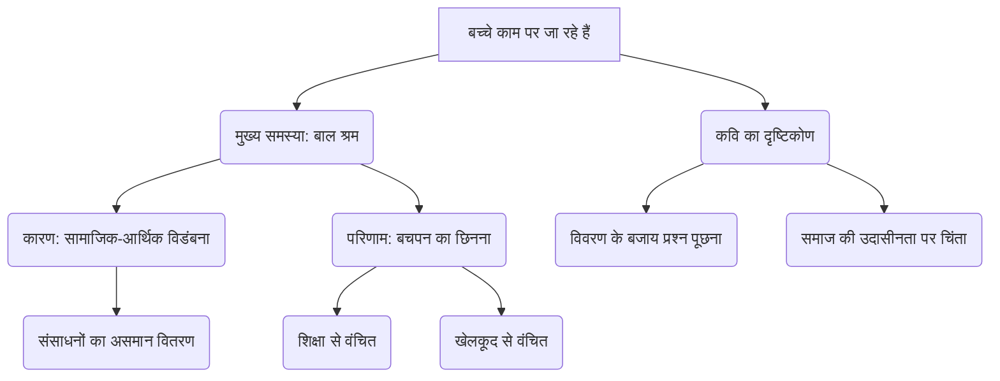

# Class 9 Hindi - Shitij Chapter 113
**Language:** हिंदी

```markdown
# [कक्षा 9] क्षितिज - पाठ 17: बच्चे काम पर जा रहे हैं

## 🌟 मुख्य अवधारणाएँ (Core Concepts)

इस कविता के माध्यम से कवि राजेश जोशी बाल श्रम की गंभीर समस्या और बच्चों से उनका बचपन छिन जाने की पीड़ा पर ध्यान केंद्रित करते हैं।

*   **बाल श्रम (Child Labour):**
    *   बच्चों का छोटी उम्र में काम करने को मजबूर होना।
    *   शिक्षा, खेलकूद और सामान्य बचपन से वंचित होना।
*   **सामाजिक-आर्थिक विडंबना (Socio-economic Irony):**
    *   समाज में व्याप्त असमानता जहाँ कुछ बच्चे सुविधाओं से वंचित हैं।
    *   व्यवस्था की असंवेदनशीलता और आम लोगों की उदासीनता।
*   **बचपन का छिनना (Loss of Childhood):**
    *   खेलने-कूदने और पढ़ने की उम्र में काम का बोझ।
    *   बच्चों की मासूमियत और सपनों का खत्म होना।
*   **कवि की चिंता और प्रश्न (Poet's Concern and Questions):**
    *   बच्चों के काम पर जाने को एक सामान्य घटना मानने पर आपत्ति।
    *   इसे एक गंभीर प्रश्न के रूप में उठाने का आग्रह ("काम पर क्यों जा रहे हैं बच्चे?")।
    *   दुनिया के संसाधनों (खिलौने, किताबें, स्कूल, मैदान) के होते हुए भी बच्चों की दुर्दशा पर सवाल।

📊 **अवधारणा पदानुक्रम:**



## 📘 मुख्य सीख (Key Learnings)

1.  **बाल श्रम एक भयावह सच्चाई:** कवि सुबह-सुबह कोहरे में ठिठुरते हुए बच्चों को काम पर जाते देखकर इसे समाज की सबसे भयानक पंक्ति मानते हैं। यह केवल एक सूचना नहीं, बल्कि एक गंभीर समस्या है जिस पर प्रश्न उठाया जाना चाहिए।
2.  **प्रश्न पूछने का महत्व:** कवि जोर देते हैं कि इस स्थिति को केवल एक विवरण की तरह लिखने के बजाय, एक सवाल की तरह पूछा जाना चाहिए – "बच्चे काम पर क्यों जा रहे हैं?"। यह सवाल समाज को झकझोरता है और उसे जवाबदेही के लिए प्रेरित करता है।
3.  **बच्चों के अधिकार:** कविता उन सभी चीजों (गेंदें, रंगीन किताबें, खिलौने, मदरसे/स्कूल, मैदान, बगीचे, घर के आँगन) का ज़िक्र करती है जो बच्चों के विकास और खुशी के लिए ज़रूरी हैं। कवि प्रश्न करते हैं कि क्या ये सब खत्म हो गए हैं, जो बच्चों को काम पर जाना पड़ रहा है।
4.  **संसाधनों का अस्तित्व और विडंबना:** कवि इस बात पर अधिक दुख व्यक्त करते हैं कि दुनिया में बच्चों के लिए ज़रूरी सारी चीज़ें (हस्बमामूल - यथावत) मौजूद हैं, फिर भी हज़ारों बच्चे काम पर जाने को मजबूर हैं। यह स्थिति सामान्य नहीं, बल्कि बेहद भयानक है।
5.  **सामाजिक उदासीनता:** कविता समाज की उस उदासीनता पर भी चोट करती है, जहाँ लोग रोज़ बच्चों को काम पर जाते देखते हैं, पर इसे एक सामान्य घटना मानकर अनदेखा कर देते हैं।

📈 **बच्चों का जीवन: अपेक्षा बनाम वास्तविकता**

| अपेक्षा (बच्चों का अधिकार)        | वास्तविकता (कविता में चित्रित) |
| :------------------------------- | :----------------------------- |
| ⚽ खेलना (गेंदें, खिलौने)        | 🏭 काम पर जाना                 |
| 📚 पढ़ना (रंगीन किताबें, मदरसे) | 🌫️ कोहरे में सड़क पर चलना      |
| 🌳 मैदान, बगीचे, आँगन में घूमना | ❓ जीवन की उमंग से वंचित       |
| 😊 सुरक्षित और खुशहाल बचपन      | 💪 छोटी उम्र में जिम्मेदारी का बोझ |

## 🧩 सक्रिय अधिगम (Active Learning)

*   **गतिविधि: शोध-आधारित केस स्टडी विश्लेषण 🔍**
    *   अपने आस-पास या समाचारों में बाल श्रम के किसी मामले का अध्ययन करें।
    *   पता लगाएँ कि बच्चे को किन परिस्थितियों में काम करना पड़ रहा है।
    *   उसके शिक्षा, स्वास्थ्य और भविष्य पर क्या प्रभाव पड़ रहा है?
    *   सरकारी और गैर-सरकारी संगठन इस स्थिति को सुधारने के लिए क्या कर रहे हैं? अपने निष्कर्षों की एक संक्षिप्त रिपोर्ट तैयार करें।
*   **चर्चा: वास्तविक दुनिया के प्रभावों का आलोचनात्मक विश्लेषण 🌍**
    *   कक्षा में चर्चा करें: लोग अक्सर बच्चों को काम पर जाते देखकर भी उदासीन क्यों रहते हैं? इस उदासीनता के क्या कारण हो सकते हैं?
    *   बाल श्रम को पूरी तरह खत्म करने के लिए समाज, सरकार और व्यक्तिगत स्तर पर क्या कदम उठाए जा सकते हैं?
    *   "वर्तमान युग में सभी बच्चों के लिए खेलकूद और शिक्षा के समान अवसर प्राप्त हैं" – इस कथन पर वाद-विवाद आयोजित करें।

## 📝 मूल्यांकन तैयारी (Assessment Prep)

*   **केस स्टडी:** एक काल्पनिक स्थिति दी जा सकती है जहाँ एक बच्चा स्कूल जाने की बजाय चाय की दुकान पर काम कर रहा है। विद्यार्थियों को विश्लेषण करने के लिए कहा जा सकता है:
    *   कवि राजेश जोशी की कविता के संदर्भ में इस स्थिति की भयावहता क्या है?
    *   कवि इसे 'विवरण' की तरह न लिखकर 'सवाल' की तरह उठाने को क्यों कहते हैं?
    *   इस बच्चे के कौन-कौन से मौलिक अधिकार प्रभावित हो रहे हैं?
*   **आरेख:** बाल श्रम के कारणों और परिणामों को दर्शाने वाला एक माइंड मैप या फ्लोचार्ट बनाने का अभ्यास करें।

📝 **उदाहरण प्रश्न:**

1.  कवि के अनुसार बच्चों के काम पर जाने की बात को 'विवरण की तरह' न लिखकर 'सवाल की तरह' क्यों पूछा जाना चाहिए?
2.  कविता में उल्लिखित कौन-सी चीजें बच्चों के जीवन का स्वाभाविक हिस्सा होनी चाहिए? उनके अभाव में बच्चों का जीवन कैसा हो जाता है?
3.  'हस्बमामूल' शब्द का प्रयोग कवि ने किस विशेष संदर्भ में और क्यों किया है? इससे समस्या की भयावहता कैसे बढ़ जाती है?
4.  बाल श्रम की समस्या केवल आर्थिक नहीं, बल्कि सामाजिक भी है। कविता के आधार पर इस कथन की पुष्टि करें।

## 🌏 भारतीय संदर्भ (Bharatiya Context)

*   **संवैधानिक प्रावधान:** भारतीय संविधान का **अनुच्छेद 24** स्पष्ट रूप से बाल श्रम का निषेध करता है। इसके अनुसार, "चौदह वर्ष से कम आयु के किसी बालक को किसी कारखाने या खान में काम करने के लिए नियोजित नहीं किया जाएगा या किसी अन्य परिसंकटमय नियोजन में नहीं लगाया जाएगा।" यह कविता इस संवैधानिक अधिकार के उल्लंघन की ओर इशारा करती है।
*   **राष्ट्रीय आर्थिक/सामाजिक डेटा 📊:** भारत में आज भी लाखों बच्चे स्कूल जाने की उम्र में काम करने को मजबूर हैं। राष्ट्रीय अपराध रिकॉर्ड ब्यूरो (NCRB), राष्ट्रीय बाल अधिकार संरक्षण आयोग (NCPCR) और विभिन्न गैर-सरकारी संगठनों के आंकड़े इस समस्या की गंभीरता को दर्शाते हैं। विद्यार्थी इन स्रोतों से नवीनतम डेटा एकत्र कर सकते हैं (जैसे, विभिन्न क्षेत्रों - कृषि, घरेलू काम, छोटे उद्योग - में बाल श्रमिकों की अनुमानित संख्या)।
*   **वास्तविक जीवन के उदाहरण:** भारत में चाय की दुकानों, ढाबों, निर्माण स्थलों, पटाखा कारखानों, कालीन उद्योग, और घरों में सहायक के रूप में काम करते हुए बच्चे अक्सर दिख जाते हैं। यह कविता इन दृश्यों के प्रति हमें संवेदनशील बनाने और प्रश्न पूछने के लिए प्रेरित करती है।
*   **सरकारी योजनाएँ:** भारत सरकार ने बाल श्रम को रोकने और बच्चों के पुनर्वास के लिए कई योजनाएँ चलाई हैं, जैसे 'सर्व शिक्षा अभियान', 'मध्याह्न भोजन योजना', और 'बाल श्रम (निषेध और विनियमन) अधिनियम, 1986' (संशोधित)। इन योजनाओं की प्रभावशीलता पर विचार करना भी महत्वपूर्ण है।

यह कविता हमें याद दिलाती है कि बच्चों का काम पर जाना एक सामान्य बात नहीं, बल्कि एक गंभीर सामाजिक समस्या है जिसके प्रति जागरूक और सक्रिय होने की आवश्यकता है।
```