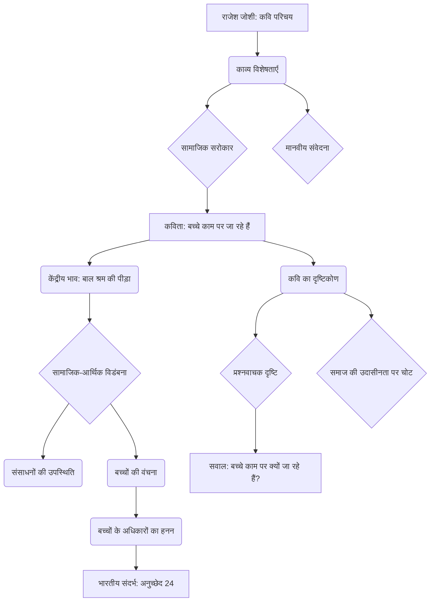

# Class 9 Hindi - Shitij Chapter 113
**Language:** हिंदी

```markdown
# [कक्षा 9] क्षितिज - अध्याय 17: बच्चे काम पर जा रहे हैं

## 🌟 Core Concepts

*   **कवि परिचय:** राजेश जोशी (जन्म 1946) - जीवन, साहित्यिक योगदान (कविता, कहानी, नाटक, अनुवाद), पुरस्कार (साहित्य अकादमी आदि), काव्य की विशेषताएँ (सामाजिक सरोकार, आस्था, स्थानीयता, मानवीय चिंता)।
*   **कविता का केंद्रीय भाव:** बाल श्रम की समस्या और बच्चों से उनका बचपन छिन जाने की पीड़ा का मार्मिक चित्रण।
*   **सामाजिक-आर्थिक विडंबना:** समाज में बच्चों के खेलने-पढ़ने के सभी साधन (गेंदें, किताबें, खिलौने, स्कूल, मैदान) मौजूद होने के बावजूद गरीब बच्चों की उन तक पहुँच न होना।
*   **कवि का प्रश्न:** बाल श्रम को एक सामान्य घटना मानने के बजाय, इसे एक गंभीर सवाल ("बच्चे काम पर क्यों जा रहे हैं?") के रूप में उठाने की आवश्यकता पर बल।
*   **समाज की उदासीनता:** बाल श्रम के प्रति समाज की संवेदनहीनता और अनदेखी पर व्यंग्य।
*   **बच्चों के अधिकार:** हर बच्चे को खेलने, शिक्षा पाने और जीवन का आनंद लेने का मौलिक अधिकार है, जिसका हनन बाल श्रम से होता है।
*   **संवैधानिक प्रावधान:** भारतीय संविधान का अनुच्छेद 24, जो 14 वर्ष से कम आयु के बच्चों को खतरनाक कार्यों में लगाने से रोकता है।

📊 **अवधारणा पदानुक्रम:**


## 📘 Key Learnings

*   **कवि राजेश जोशी:** मध्य प्रदेश में जन्मे राजेश जोशी समकालीन हिंदी कविता के महत्वपूर्ण हस्ताक्षर हैं। उनकी कविताएँ आम आदमी के सरोकारों, जीवन के संघर्षों और सामाजिक विसंगतियों को गहराई से व्यक्त करती हैं। वे अपनी कविताओं में स्थानीय भाषा, परिवेश और मानवीय संवेदनाओं को बखूबी पिरोते हैं। उन्हें 'दो पंक्तियों के बीच' काव्य संग्रह के लिए साहित्य अकादमी पुरस्कार मिला।
    *   _[वैचारिक चित्र: राजेश जोशी की कविताएँ = सामाजिक यथार्थ + मानवीय करुणा + जीवन की खोज + स्थानीय रंग]_

*   **कविता का सार:** यह कविता अत्यंत मार्मिक ढंग से सुबह-सुबह घने कोहरे में ठिठुरते हुए काम पर जाते छोटे बच्चों का चित्र प्रस्तुत करती है। कवि के लिए यह दृश्य हमारे समय की सबसे भयानक सच्चाई है। वह जोर देकर कहते हैं कि इस दर्दनाक सच्चाई को केवल एक सूचना या विवरण की तरह बता देना काफी नहीं है। इसे एक चुभते हुए सवाल की तरह पूछा जाना चाहिए – आखिर ऐसी क्या मजबूरी है कि इन बच्चों को खेलने-कूदने और पढ़ने-लिखने की उम्र में काम पर जाना पड़ रहा है?
    *   📈 _[प्रवाह चित्र: कविता की प्रगति]_
        1.  दृश्य: बच्चे सुबह काम पर जा रहे हैं।
        2.  कवि की प्रतिक्रिया: यह भयानक है!
        3.  आग्रह: इसे विवरण नहीं, सवाल बनाओ।
        4.  प्रश्न: बच्चे काम पर क्यों जा रहे हैं?
        5.  काल्पनिक सवाल: क्या सब खिलौने, किताबें, स्कूल नष्ट हो गए?
        6.  वास्तविकता: नहीं, सब कुछ मौजूद है (हस्बमामूल)।
        7.  निष्कर्ष: यह और भी भयानक है कि सब कुछ होते हुए भी बच्चे काम पर जा रहे हैं।

*   **सामाजिक विडंबना:** कवि पूछते हैं कि क्या बच्चों के खेलने की सारी गेंदें अंतरिक्ष में खो गई हैं? क्या उनकी रंग-बिरंगी किताबों को दीमकों ने खा लिया है? क्या सारे खिलौने किसी काले पहाड़ के नीचे दब गए हैं? क्या सारे स्कूल भूकंप में ढह गए हैं? क्या मैदान, बगीचे और घर के आँगन अचानक खत्म हो गए हैं? कवि कहते हैं कि अगर ऐसा होता, तो यह बहुत भयानक होता। लेकिन इससे भी अधिक भयानक सच्चाई यह है कि दुनिया में बच्चों के लिए ज़रूरी सारी चीज़ें – गेंदें, किताबें, खिलौने, स्कूल, मैदान – सब कुछ पहले की तरह ही मौजूद हैं ('हस्बमामूल' हैं), फिर भी हज़ारों-लाखों बच्चे इन सब से वंचित होकर बाल श्रम करने को विवश हैं। यह हमारे समाज की गहरी संवेदनहीनता और विरोधाभास को उजागर करता है।

*   **कवि का उद्देश्य:** कवि इस कविता के माध्यम से बाल श्रम की गंभीर समस्या पर समाज का ध्यान खींचना चाहते हैं। वे पाठकों और समाज को झकझोर कर यह सोचने पर मजबूर करते हैं कि इस समस्या के लिए कौन जिम्मेदार है और इसका समाधान कैसे हो सकता है। वे बच्चों के बचपन को बचाने और उनके अधिकारों को सुनिश्चित करने की पुरजोर वकालत करते हैं।

## 🧩 Active Learning

*   **Activity: शोध-आधारित केस स्टडी विश्लेषण 🔍 (Evaluating/Creating)**
    *   अपने आस-पास (जैसे पड़ोस, बाज़ार, निर्माण स्थल) किसी एक बाल श्रमिक की पहचान करें। यदि संभव हो तो, उसके माता-पिता/अभिभावक की सहमति से उससे बातचीत करें (या उसके बारे में जानकारी जुटाएँ)।
    *   **जानकारी बिंदु:** उसकी उम्र, काम का प्रकार, काम के घंटे, आय (यदि कोई हो), स्कूल न जा पाने के कारण, पारिवारिक पृष्ठभूमि, भविष्य की इच्छाएँ।
    *   **विश्लेषण:** प्राप्त जानकारी के आधार पर एक संक्षिप्त रिपोर्ट लिखें। विश्लेषण करें कि कौन से सामाजिक और आर्थिक कारक उसे काम करने के लिए मजबूर कर रहे हैं। कविता में व्यक्त कवि की पीड़ा से इस बच्चे की स्थिति की तुलना करें।

*   **Discussion: वास्तविक दुनिया के प्रभावों का आलोचनात्मक विश्लेषण 🌍 (Evaluating)**
    *   **चर्चा के बिंदु:**
        1.  बाल श्रम का बच्चों के शारीरिक, मानसिक, भावनात्मक और सामाजिक विकास पर क्या दुष्प्रभाव पड़ता है?
        2.  यह समस्या भारत के समग्र विकास (शिक्षा, स्वास्थ्य, अर्थव्यवस्था) को कैसे प्रभावित करती है?
        3.  संविधान (अनुच्छेद 24) और विभिन्न कानूनों (जैसे बाल श्रम अधिनियम) के बावजूद बाल श्रम भारत में क्यों व्यापक है? इसके पीछे क्या कारण हैं (गरीबी, जागरूकता की कमी, कानूनों का ढीला कार्यान्वयन, सामाजिक स्वीकृति)?
        4.  इस समस्या के समाधान के लिए व्यक्तिगत, सामाजिक और सरकारी स्तर पर क्या प्रभावी कदम उठाए जा सकते हैं?

## 📝 Assessment Prep

*   **केस स्टडी विश्लेषण 📝 (Evaluating):**
    *   कल्पना कीजिए कि आप एक 11 वर्षीय बच्चे 'राजू' से मिलते हैं जो स्कूल जाने की बजाय एक ढाबे पर बर्तन साफ़ करने का काम करता है। वह सुबह 8 बजे से रात 8 बजे तक काम करता है और उसे महीने के अंत में कुछ रुपये मिलते हैं जिससे उसके परिवार का गुज़ारा चलता है।
    *   'बच्चे काम पर जा रहे हैं' कविता के आधार पर राजू की स्थिति का विश्लेषण करें। कवि ने जिन प्रश्नों को उठाया है, वे राजू की स्थिति पर कैसे लागू होते हैं? इस समस्या के प्रति समाज की क्या ज़िम्मेदारी होनी चाहिए? अपने विचार लिखें।

*   **डायग्राम निर्माण 📈 (Creating):**
    *   कविता में कवि द्वारा उठाए गए काल्पनिक प्रश्नों (क्या गेंदें खो गईं? क्या किताबें नष्ट हो गईं? आदि) और वास्तविक स्थिति ("सारी चीज़ें हस्बमामूल") के बीच के गहरे विरोधाभास को दर्शाने वाला एक वेन डायग्राम या तुलनात्मक तालिका बनाएँ।

*   **उच्च स्तरीय चिंतन प्रश्न (Evaluating):**
    *   कवि क्यों चाहता है कि बच्चों के काम पर जाने की बात को "विवरण की तरह" न लिखकर "सवाल की तरह" लिखा जाना चाहिए? इससे समस्या को देखने के दृष्टिकोण में क्या अंतर आता है? विस्तार से समझाएँ।
    *   "भयानक है लेकिन इससे भी ज़्यादा यह कि हैं सारी चीज़ें हस्बमामूल" - इस पंक्ति का आशय स्पष्ट करते हुए बताइए कि कवि किस चीज़ को अधिक भयानक मानता है और क्यों?

## 🌏 Bharatiya Context

*   **राष्ट्रीय आर्थिक/सामाजिक डेटा और तथ्य 📊:**
    *   भारत में बाल श्रम एक गंभीर सामाजिक-आर्थिक समस्या है। हालाँकि सरकारी प्रयासों और जागरूकता से इसमें कमी आई है, फिर भी लाखों बच्चे आज भी शिक्षा और खेलकूद से वंचित होकर काम करने को मजबूर हैं। (सटीक आंकड़े समय-समय पर बदलते रहते हैं, नवीनतम सरकारी रिपोर्टों का संदर्भ लिया जा सकता है)।
    *   **उदाहरण 1 (शहरी क्षेत्र):** भारत के अनेक शहरों में ट्रैफिक सिग्नल पर सामान बेचते, चाय की दुकानों पर काम करते, कूड़ा बीनते या छोटे-मोटे कारखानों में काम करते बच्चे आसानी से दिख जाते हैं।
    *   **उदाहरण 2 (ग्रामीण और असंगठित क्षेत्र):** कृषि, बीड़ी बनाना, कालीन बुनना, चूड़ी बनाना, पटाखा उद्योग, ईंट भट्टों जैसे क्षेत्रों में बाल श्रम अधिक पाया जाता है, जहाँ काम की परिस्थितियाँ अक्सर खतरनाक होती हैं।
    *   **उदाहरण 3 (संवैधानिक और कानूनी प्रावधान):**
        *   **भारतीय संविधान का अनुच्छेद 24:** स्पष्ट रूप से 14 वर्ष से कम आयु के बच्चों को किसी भी कारखाने, खान या अन्य खतरनाक नियोजन में लगाने पर प्रतिबंध लगाता है।
        *   **बाल श्रम (निषेध और विनियमन) संशोधन अधिनियम, 2016:** 14 वर्ष से कम आयु के बच्चों के सभी प्रकार के नियोजन को प्रतिबंधित करता है (पारिवारिक व्यवसायों में स्कूल के बाद मदद को छोड़कर) और 14-18 वर्ष के किशोरों को खतरनाक व्यवसायों में लगाने से रोकता है।
        *   **शिक्षा का अधिकार अधिनियम (RTE), 2009:** 6 से 14 वर्ष के सभी बच्चों के लिए मुफ्त और अनिवार्य शिक्षा का प्रावधान करता है, जो बाल श्रम को रोकने में एक महत्वपूर्ण कदम है।
    *   **सरकारी पहलें:** सर्व शिक्षा अभियान, मिड-डे मील योजना, राष्ट्रीय बाल श्रम परियोजना (NCLP) जैसी योजनाएँ बच्चों को स्कूलों से जोड़ने और उन्हें श्रम से बाहर निकालने में मदद करती हैं।

*   **चुनौतियाँ:** गरीबी, शिक्षा के प्रति जागरूकता की कमी, सामाजिक कुरीतियाँ, कानूनों का अप्रभावी कार्यान्वयन और सस्ते श्रम की मांग बाल श्रम के बने रहने के प्रमुख कारण हैं।
```