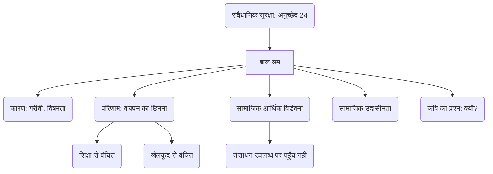

# Class 9 Hindi - Shitij Chapter 113
**Language:** हिंदी

```markdown
# [कक्षा 9] क्षितिज - पाठ 13: बच्चे काम पर जा रहे हैं (राजेश जोशी)

## 🌟 मुख्य अवधारणाएँ (Core Concepts)

यह कविता बाल श्रम की गंभीर समस्या और बच्चों से उनका बचपन छिन जाने की पीड़ा पर केंद्रित है। मुख्य अवधारणाएँ इस प्रकार हैं:

1.  **बाल श्रम (Child Labour):**
    *   परिभाषा: बच्चों द्वारा अपनी उम्र के अनुरूप न होने वाले कामों में लगना, जिससे उनका शारीरिक, मानसिक और सामाजिक विकास बाधित हो।
    *   कारण: गरीबी, सामाजिक-आर्थिक विषमता, शिक्षा का अभाव, जागरूकता की कमी।
2.  **बचपन का अधिकार (Right to Childhood):**
    *   खेलकूद, शिक्षा और विकास के अवसरों का अधिकार।
    *   कविता दर्शाती है कि कैसे काम पर जाने वाले बच्चों से यह अधिकार छीना जा रहा है।
3.  **सामाजिक-आर्थिक विडंबना (Socio-economic Irony):**
    *   कवि इस विरोधाभास को उजागर करते हैं कि दुनिया में बच्चों के खेलने-पढ़ने के सभी साधन (गेंदें, किताबें, खिलौने, स्कूल, मैदान) मौजूद हैं ("हस्बमामूल"), फिर भी लाखों बच्चे इनसे वंचित होकर काम करने को मजबूर हैं।
4.  **सामाजिक उदासीनता (Social Indifference):**
    *   समाज का इस समस्या को सामान्य मान लेना और इसके प्रति संवेदनशील न होना। कवि इसे एक विवरण की तरह नहीं, बल्कि एक चुभते हुए प्रश्न की तरह उठाने पर जोर देते हैं।
5.  **कवि की चिंता और प्रश्न (Poet's Concern and Questioning):**
    *   कवि बच्चों की स्थिति पर गहरा दुख और आक्रोश व्यक्त करते हैं।
    *   "बच्चे काम पर क्यों जा रहे हैं?" - यह महज़ एक सूचना नहीं, बल्कि व्यवस्था और समाज पर एक गंभीर सवाल है।
6.  **संवैधानिक प्रावधान (Constitutional Provision):**
    *   भारतीय संविधान का अनुच्छेद 24 (Article 24), जो 14 वर्ष से कम आयु के बच्चों को खतरनाक कामों में लगाने पर रोक लगाता है।

📊 **अवधारणा पदानुक्रम (Concept Hierarchy):**



## 📘 मुख्य सीख (Key Learnings)

1.  **कविता का केंद्रीय भाव:** कवि राजेश जोशी सुबह-सुबह कोहरे में ढँकी सड़क पर काम पर जाते बच्चों को देखकर अत्यंत दुखी हैं। वे इसे हमारे समय की सबसे भयानक पंक्ति मानते हैं।
2.  **विवरण नहीं, सवाल:** कवि का मानना है कि इस भयानक सच्चाई को केवल एक सूचना या विवरण की तरह बता देना काफी नहीं है। इसे एक प्रश्न के रूप में पूछा जाना चाहिए – "बच्चे काम पर क्यों जा रहे हैं?" ताकि समाज और व्यवस्था इस पर सोचने को मजबूर हो।
3.  **खोए बचपन की कल्पना:** कवि पूछते हैं कि क्या बच्चों के खेलने की सारी गेंदें, रंगीन किताबें, खिलौने, स्कूल, मैदान, बगीचे और घर के आँगन अचानक नष्ट हो गए हैं? यह प्रश्न उन चीजों को रेखांकित करते हैं जो बचपन का अभिन्न हिस्सा हैं।
4.  **"हस्बमामूल" का अर्थ:** कवि कहते हैं कि अगर ये सब चीजें सचमुच खत्म हो गई होतीं, तो यह भयानक होता। लेकिन इससे भी ज़्यादा भयानक यह है कि ये सारी चीजें दुनिया में मौजूद हैं (हस्बमामूल - यथावत, जैसी होनी चाहिए वैसी), फिर भी करोड़ों बच्चे इनसे वंचित हैं और काम पर जा रहे हैं। यह स्थिति समस्या की भयावहता को और बढ़ा देती है।
5.  **समस्या की व्यापकता:** यह समस्या केवल स्थानीय नहीं, बल्कि वैश्विक है ("दुनिया की हज़ारों सड़कों से गुज़रते हुए बच्चे")।

📈 **चित्रण (Diagram): बचपन का विरोधाभास**

```mermaid
graph TD
    subgraph अपेक्षित बचपन (Ideal Childhood)
        K[स्कूल/मदरसा]
        L[खेल के मैदान/बगीचे]
        M[खिलौने/किताबें]
        N[घर का आँगन]
    end
    subgraph वंचित बचपन (Deprived Childhood)
        P[काम पर जाना]
        Q[शिक्षा का अभाव]
        R[खेलकूद से दूरी]
        S[खोया हुआ बचपन]
    end
    T{सामाजिक-आर्थिक विडंबना} --> P;
    T --> Q;
    T --> R;
    T --> S;
    U(संसाधन 'हस्बमामूल' हैं) -- फिर भी --> T;
```
*यह चित्र दर्शाता है कि कैसे सामाजिक-आर्थिक विडंबना के कारण, संसाधनों के होते हुए भी, बच्चे अपेक्षित बचपन से वंचित होकर बाल श्रम करने को मजबूर हैं।*

## 🧩 सक्रिय अधिगम (Active Learning)

*   **गतिविधि (Activity): शोध-आधारित केस स्टडी विश्लेषण 🔍**
    *   **विषय:** भारत में बाल श्रम की स्थिति।
    *   **कार्य:** इंटरनेट, समाचार पत्रों या सरकारी रिपोर्टों (जैसे राष्ट्रीय बाल अधिकार संरक्षण आयोग - NCPCR) से भारत में बाल श्रम के नवीनतम आँकड़े एकत्र करें। पता लगाएँ कि बच्चे किन क्षेत्रों में (जैसे कृषि, घरेलू काम, छोटे उद्योग, ढाबे) अधिक कार्यरत हैं। बाल श्रम के मुख्य कारणों (गरीबी, शिक्षा तक पहुँच की कमी, सामाजिक प्रथाएँ) का विश्लेषण करें। सरकार द्वारा चलाए जा रहे कार्यक्रमों (जैसे सर्व शिक्षा अभियान, राष्ट्रीय बाल श्रम परियोजना) की प्रभावशीलता पर एक संक्षिप्त रिपोर्ट तैयार करें।
    *   **उद्देश्य:** समस्या की गंभीरता, कारणों और समाधान के प्रयासों का मूल्यांकन करना (Bloom's: Evaluating)।

*   **चर्चा (Discussion): वास्तविक दुनिया के प्रभावों का आलोचनात्मक विश्लेषण 🌍**
    *   **प्रश्न:** कानून (जैसे अनुच्छेद 24, बाल श्रम (निषेध और विनियमन) अधिनियम) होने के बावजूद भारत में बाल श्रम क्यों जारी है? समाज की उदासीनता के क्या कारण हो सकते हैं? बच्चों को काम पर भेजने के दीर्घकालिक प्रभाव क्या हैं (व्यक्तिगत, पारिवारिक और राष्ट्रीय स्तर पर)?
    *   **प्रारूप:** कक्षा में समूह चर्चा आयोजित करें। विभिन्न दृष्टिकोणों पर विचार करें (जैसे, परिवार की मजबूरी, नियोक्ता का लालच, कानून का कमजोर कार्यान्वयन, सामाजिक जागरूकता की कमी)।
    *   **उद्देश्य:** समस्या की जटिलता को समझना और संभावित समाधानों पर रचनात्मक ढंग से सोचना (Bloom's: Evaluating/Creating)।

## 📝 मूल्यांकन तैयारी (Assessment Prep)

*   **केस स्टडीज़ (Case Studies):** परीक्षा में किसी काल्पनिक या वास्तविक स्थिति (जैसे, ढाबे पर काम करने वाला बच्चा, ईंट भट्ठे पर काम करने वाला परिवार) का वर्णन दिया जा सकता है और उस पर आधारित प्रश्न पूछे जा सकते हैं:
    *   बच्चे के काम करने के क्या कारण हो सकते हैं?
    *   उसके कौन-से अधिकार प्रभावित हो रहे हैं?
    *   समाज और सरकार की क्या भूमिका होनी चाहिए?
*   **कविता-आधारित प्रश्न:**
    *   कवि बच्चों के काम पर जाने को 'भयानक' क्यों कहते हैं?
    *   'विवरण की तरह' और 'सवाल की तरह' लिखे जाने में क्या अंतर है?
    *   'हस्बमामूल' शब्द का प्रयोग कवि ने किस विशेष अर्थ में किया है?
    *   कविता में पूछे गए प्रश्न क्या दर्शाते हैं?
    *   बच्चों के काम पर जाने को धरती के एक बड़े हादसे के समान क्यों कहा गया है?
*   **आरेख (Diagrams):** ऊपर दिए गए जैसे आरेख या माइंड मैप बनाकर कविता के मुख्य विचारों, कारणों और प्रभावों को संक्षेप में प्रस्तुत करने का अभ्यास करें। 📝

## 🌏 भारतीय संदर्भ (Bharatiya Context)

1.  **संवैधानिक प्रावधान:** भारत का संविधान **अनुच्छेद 24** के तहत 14 वर्ष से कम आयु के बच्चों को कारखानों, खानों या किसी अन्य खतरनाक रोजगार में लगाने का निषेध करता है। यह बच्चों के शोषण के विरुद्ध अधिकार सुनिश्चित करता है।
2.  **वास्तविक स्थिति:** संवैधानिक और कानूनी प्रावधानों के बावजूद, भारत में लाखों बच्चे आज भी काम करते देखे जाते हैं।
    *   **उदाहरण 1:** शहरों में चाय की दुकानों (ढाबों), होटलों, गैरेजों में छोटे बच्चे काम करते दिख जाते हैं।
    *   **उदाहरण 2:** ग्रामीण क्षेत्रों में बच्चे कृषि कार्यों, पशु चराने या बीड़ी बनाने जैसे कामों में लगे होते हैं।
    *   **उदाहरण 3:** निर्माण स्थलों (Construction sites) पर भी अक्सर बच्चे अपने माता-पिता के साथ काम करते या वहीं रहते पाए जाते हैं, जो उनके विकास के लिए असुरक्षित माहौल है।
3.  **सरकारी पहल:** भारत सरकार ने बाल श्रम को रोकने और बच्चों को शिक्षा से जोड़ने के लिए कई कदम उठाए हैं:
    *   **सर्व शिक्षा अभियान (SSA):** 6-14 वर्ष आयु वर्ग के सभी बच्चों को मुफ्त और अनिवार्य शिक्षा प्रदान करना।
    *   **मध्याह्न भोजन योजना (Mid-Day Meal Scheme):** स्कूलों में बच्चों की उपस्थिति बढ़ाने और पोषण स्तर सुधारने के लिए।
    *   **राष्ट्रीय बाल श्रम परियोजना (NCLP):** बाल श्रमिकों को शिक्षा प्रणाली से जोड़ने के लिए विशेष स्कूल।
4.  **सामाजिक जागरूकता:** कविता भारतीय समाज को इस समस्या के प्रति अधिक संवेदनशील और जागरूक होने का आह्वान करती है। यह केवल कानून का मामला नहीं, बल्कि एक सामाजिक जिम्मेदारी भी है।

📊 **राष्ट्रीय आर्थिक/सामाजिक डेटा (National Economic/Social Data):** यद्यपि सटीक आँकड़े बदलते रहते हैं, यह एक ज्ञात तथ्य है कि भारत में बाल श्रमिकों की एक बड़ी संख्या मौजूद है, खासकर असंगठित क्षेत्र में। गरीबी और शिक्षा तक असमान पहुँच इसके प्रमुख कारण हैं, जो देश के समग्र सामाजिक और आर्थिक विकास को प्रभावित करते हैं।
```