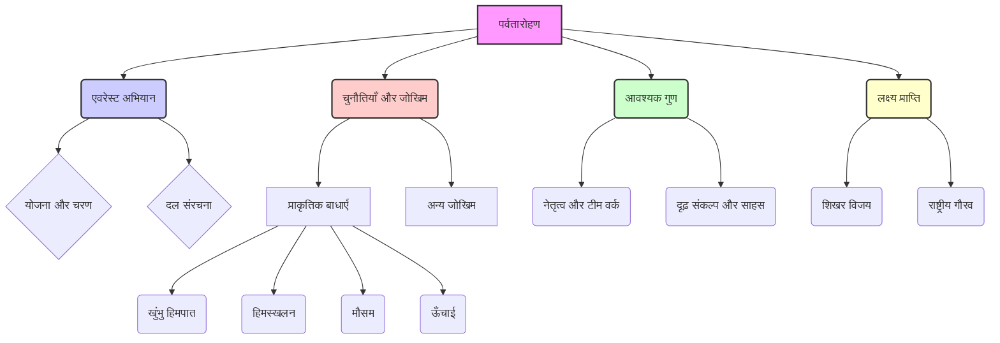

# Class 9 Hindi - Sparsh Chapter 102
**Language:** हिंदी

```markdown
# [कक्षा 9] स्पर्श - पाठ 102: एवरेस्ट: मेरी शिखर यात्रा

## 🌟 मुख्य अवधारणाएँ (Core Concepts)

इस पाठ में पर्वतारोहण, विशेषकर एवरेस्ट अभियान से जुड़ी मुख्य अवधारणाओं को समझाया गया है।

1.  **पर्वतारोहण (Mountaineering)**
    *   परिचय: पहाड़ों पर चढ़ने की कला और विज्ञान।
    *   आवश्यक गुण: शारीरिक क्षमता, मानसिक दृढ़ता, साहस, टीम भावना।
2.  **एवरेस्ट अभियान (Everest Expedition)**
    *   योजना: दल का गठन, अग्रिम दल, बेस कैंप की स्थापना।
    *   चरण: विभिन्न कैंपों की स्थापना (कैंप-1, 2, 3, 4/साउथ कोल), शिखर तक चढ़ाई।
    *   दल: नेता (कर्नल खुल्लर), उपनेता (प्रेमचंद), सदस्य (बचेंद्री पाल, अन्य), शेरपा कुली।
3.  **चुनौतियाँ और जोखिम (Challenges & Risks)**
    *   प्राकृतिक बाधाएँ:
        *   **खुंभु हिमपात (Khumbu Icefall):** ग्लेशियर का बहना, बर्फ़ का अव्यवस्थित रूप से गिरना, दरारें (हिम-विदर)।
        *   **हिमस्खलन (Avalanche):** बर्फ़ की चट्टानों का टूटना और नीचे गिरना (जैसे कैंप-3 पर हुआ हादसा)।
        *   **मौसम (Weather):** तेज हवाएँ (150 किमी/घंटा तक), अत्यधिक ठंड, दृश्यता कम होना।
        *   **ऊँचाई (Altitude):** ऑक्सीजन की कमी, शारीरिक कठिनाइयाँ।
    *   अन्य जोखिम: दुर्घटनाएँ, मृत्यु का खतरा।
4.  **नेतृत्व और टीम वर्क (Leadership & Teamwork)**
    *   नेतृत्व: कर्नल खुल्लर का मार्गदर्शन और प्रोत्साहन ("मृत्यु को सहज स्वीकार करना")।
    *   टीम वर्क: एक-दूसरे की मदद करना (बचेंद्री का नीचे जाकर साथियों को चाय/जूस देना), बचाव कार्य (लोपसांग द्वारा बचेंद्री को बचाना)।
5.  **दृढ़ संकल्प और साहस (Determination & Courage)**
    *   बचेंद्री पाल का अटूट निश्चय: बचपन का सपना, आर्थिक कठिनाइयों के बावजूद शिक्षा, दुर्घटना के बाद भी अभियान जारी रखने का फैसला।
    *   जोखिम का सामना: खतरों के बावजूद आगे बढ़ने की इच्छा।
6.  **लक्ष्य प्राप्ति (Goal Achievement)**
    *   शिखर विजय: 23 मई 1984 को एवरेस्ट शिखर पर पहुँचना।
    *   गौरव: पहली भारतीय महिला एवरेस्ट विजेता बनने का सम्मान।

📊 **अवधारणा पदानुक्रम (Concept Hierarchy):**



## 📘 मुख्य सीख (Key Learnings)

इस पाठ से हमें बचेंद्री पाल की एवरेस्ट यात्रा के माध्यम से कई महत्वपूर्ण बातें सीखने को मिलती हैं:

1.  **बचेंद्री पाल का संघर्ष और प्रेरणा:**
    *   उत्तराखंड के एक छोटे से गाँव में जन्म, आर्थिक तंगी के बावजूद संस्कृत में एम.ए. और बी.एड. तक शिक्षा।
    *   बचपन से पहाड़ों पर चढ़ने का शौक और भाई द्वारा रोके जाने पर भी दृढ़ इच्छाशक्ति।
    *   यह दर्शाता है कि दृढ़ संकल्प और समर्पण से किसी भी लक्ष्य को प्राप्त किया जा सकता है।

2.  **एवरेस्ट अभियान की जटिलता:**
    *   यह सिर्फ शारीरिक चढ़ाई नहीं, बल्कि एक सुनियोजित प्रक्रिया है जिसमें अग्रिम दल द्वारा रास्ता साफ़ करना, कैंप स्थापित करना, रसद पहुँचाना शामिल है।
    *   **यात्रा क्रम:** दिल्ली -> काठमांडू -> नामचे बाज़ार (पहली बार एवरेस्ट/सागरमाथा देखा) -> पैरिज -> बेस कैंप -> कैंप-1 (6000 मी) -> कैंप-2 -> कैंप-3 (ल्होत्से ढलान पर) -> कैंप-4 (साउथ कोल, 7900 मी) -> शिखर कैंप -> एवरेस्ट शिखर (8848 मी)।

3.  **पर्वतारोहण की भयावह चुनौतियाँ:**
    *   **खुंभु हिमपात:** इसे 'बर्फ़ के खंडों का अव्यवस्थित ढंग से गिरना' बताया गया है। ग्लेशियर के बहने से बर्फ़ में हलचल होती है, बड़ी चट्टानें गिरती हैं, और गहरी दरारें (हिम-विदर) बन जाती हैं, जिनका ख्याल ही डरावना था। यहाँ प्रतिदिन दर्जनों आरोहियों और कुलियों का सामना इन खतरों से होता था।
    *   **कैंप-3 पर हिमस्खलन:** 15-16 मई की रात को ल्होत्से ग्लेशियर से एक विशाल बर्फ़ का पिंड टूटकर कैंप पर गिरा, जिससे बचेंद्री बर्फ़ में दब गईं। यह घटना अभियान के सबसे खतरनाक क्षणों में से एक थी।
    *   **मौसम:** शिखर के पास 150 किमी/घंटा या उससे अधिक की बर्फीली हवाएँ, जो दृश्यता शून्य कर देती थीं।

4.  **तकनीकी कौशल और उपकरणों का महत्व:**
    *   रास्ता बनाने के लिए बर्फ़ काटने हेतु फावड़े का उपयोग।
    *   अस्थायी पुल बनाने के लिए एल्युमीनियम की सीढ़ियों का प्रयोग।
    *   सुरक्षा और संतुलन के लिए रस्सियों (लठ्ठों) का उपयोग।
    *   ऊँचाई पर साँस लेने के लिए ऑक्सीजन सिलेंडर और रेगुलेटर का महत्व।

5.  **मानवीय भावनाएँ और मूल्य:**
    *   **टीम भावना:** बचेंद्री का साउथ कोल पहुँचने पर थके हुए साथियों (की, जय, मीनू) की मदद के लिए नीचे जाना और उन्हें गर्म चाय व जूस देना।
    *   **नेतृत्व:** कर्नल खुल्लर का दल के सदस्यों का मनोबल बढ़ाना, खासकर दुर्घटनाओं के बाद।
    *   **साहस:** बचेंद्री का हिमस्खलन में दबने और चोट लगने के बावजूद अभियान जारी रखने का निर्णय।
    *   **कृतज्ञता और सम्मान:** शिखर पर पहुँचकर बचेंद्री का घुटनों के बल बैठकर 'सागरमाथा के ताज' को चूमना, पूजा करना और अपने रज्जु-नेता अंग दोरजी के प्रति आदर व्यक्त करना।

📈 **अभियान प्रगति रेखाचित्र (Simplified Expedition Timeline):**

```mermaid
graph LR
    A(दिल्ली से प्रस्थान) --> B(काठमांडू);
    B --> C(नामचे बाज़ार);
    C -- हिमस्खलन की खबर --> D(पैरिज);
    D --> E(बेस कैंप);
    E -- खुंभु हिमपात --> F(कैंप-1);
    F --> G(कैंप-2);
    G --> H(कैंप-3);
    H -- हिमस्खलन हादसा --> I(वापस कैंप-2);
    I --> J(कैंप-4 / साउथ कोल);
    J -- अंतिम चढ़ाई --> K(शिखर कैंप);
    K --> L(एवरेस्ट शिखर);

    style H fill:#ffaaaa
    style L fill:#aaffaa
```



## 🧩 सक्रिय अधिगम (Active Learning)

*   **गतिविधि: शोध-आधारित केस स्टडी विश्लेषण 🔍**
    *   **विषय:** बचेंद्री पाल के एवरेस्ट अभियान (1984) और हाल के किसी अन्य सफल भारतीय एवरेस्ट अभियान (जैसे, अरुणिमा सिन्हा या किसी अन्य) की तुलना करें।
    *   **विश्लेषण बिंदु:** तैयारी, उपयोग की गई तकनीक, सामना की गई चुनौतियाँ (क्या खुंभु हिमपात या मौसम की स्थिति बदली है?), टीम का सहयोग, सफलता के कारक।
    *   **प्रस्तुति:** एक संक्षिप्त रिपोर्ट या प्रेजेंटेशन तैयार करें।

*   **चर्चा: वास्तविक दुनिया के प्रभावों का आलोचनात्मक विश्लेषण 🌍**
    *   **मुद्दा 1:** कर्नल खुल्लर ने कहा, "एवरेस्ट जैसे महान अभियान में खतरों को और कभी-कभी तो मृत्यु भी आदमी को सहज भाव से स्वीकार करनी चाहिए।" इस कथन पर कक्षा में चर्चा करें। क्या यह दृष्टिकोण उचित है? इसके पक्ष और विपक्ष में तर्क दें।
    *   **मुद्दा 2:** बचेंद्री पाल ने साउथ कोल पर अपने साथियों की मदद के लिए नीचे जाने का जोखिम उठाया, जबकि उन्हें अगले दिन शिखर पर चढ़ना था। उनके इस निर्णय का विश्लेषण करें। यह टीम भावना और व्यक्तिगत लक्ष्य के बीच संतुलन के बारे में क्या सिखाता है?
    *   **मुद्दा 3:** एवरेस्ट पर बढ़ते पर्वतारोहण के पर्यावरणीय और शेरपा समुदाय पर पड़ने वाले प्रभावों पर चर्चा करें।

## 📝 मूल्यांकन तैयारी (Assessment Prep)

*   **केस स्टडी:**
    *   **कैंप-3 पर हिमस्खलन:** इस घटना का विवरण दें। बचेंद्री कैसे फँसीं? उन्हें किसने और कैसे बचाया? इस घटना के बाद कर्नल खुल्लर की क्या प्रतिक्रिया थी और बचेंद्री ने क्या निर्णय लिया? यह घटना अभियान के जोखिम और बचाव कार्य के महत्व को कैसे दर्शाती है?
    *   **अंतिम शिखर चढ़ाई:** बचेंद्री ने अंग दोरजी के साथ चढ़ाई क्यों शुरू की? बिना ऑक्सीजन चढ़ने के क्या जोखिम थे? रास्ते में किन कठिनाइयों का सामना करना पड़ा (सख्त बर्फ़, तेज हवा)? ल्हाटू की क्या भूमिका थी? ऑक्सीजन रेगुलेटर एडजस्ट करने से क्या फर्क पड़ा?

*   **रेखाचित्र/फ्लोचार्ट:**
    *   एवरेस्ट अभियान के विभिन्न चरणों (बेस कैंप से शिखर तक) को दर्शाने वाला एक फ्लोचार्ट बनाएँ, जिसमें प्रत्येक कैंप की अनुमानित ऊँचाई और मुख्य घटनाओं (जैसे हिमस्खलन, साउथ कोल पहुँचना) का उल्लेख हो।
    *   खुंभु हिमपात की चुनौतियों (ग्लेशियर का बहना, हिम-विदर, बर्फ़ गिरना) को दर्शाने वाला एक सरल चित्र बनाएँ।

*   **महत्वपूर्ण शब्दावली:** हिमपात, हिमस्खलन, हिम-विदर, ग्लेशियर, बेस कैंप, साउथ कोल, सागरमाथा, नौसिखिया, रज्जु-नेता, फावड़ा, रेगुलेटर।

*   **विश्लेषणात्मक प्रश्न:**
    *   बचेंद्री पाल के चरित्र की मुख्य विशेषताएँ क्या हैं जो उनकी सफलता में सहायक हुईं? (दृढ़ संकल्प, साहस, टीम भावना, शारीरिक/मानसिक क्षमता)
    *   अभियान में शेरपाओं की भूमिका का महत्व बताएँ। (अंग दोरजी, लोपसांग, ल्हाटू के उदाहरण दें)
    *   तेनजिंग नोर्गे की मुलाक़ात और उनके शब्दों ("तुम एक पक्की पर्वतीय लड़की लगती हो...") का बचेंद्री पर क्या प्रभाव पड़ा होगा?

## 🌏 भारतीय संदर्भ (Bharatiya Context)

1.  **बचेंद्री पाल - एक राष्ट्रीय प्रतीक:** वे एवरेस्ट शिखर पर पहुँचने वाली **पहली भारतीय महिला** हैं। उनकी यह उपलब्धि भारत में महिलाओं के लिए प्रेरणा का स्रोत बनी और पर्वतारोहण के क्षेत्र में भारत का मान बढ़ाया।
2.  **राष्ट्रीय गौरव:** कर्नल खुल्लर के शब्द, "देश को तुम पर गर्व है," इस उपलब्धि के राष्ट्रीय महत्व को दर्शाते हैं। यह केवल एक व्यक्तिगत जीत नहीं, बल्कि पूरे देश के लिए गौरव का क्षण था।
3.  **सांस्कृतिक और आध्यात्मिक पहलू:** शिखर पर पहुँचकर बचेंद्री द्वारा **दुर्गा माँ का चित्र और हनुमान चालीसा** को लाल कपड़े में लपेटकर बर्फ़ में दबाना, भारतीय संस्कृति और आस्था का प्रतीक है। यह दर्शाता है कि कठिनतम क्षणों में भी भारतीय अपनी जड़ों और विश्वासों से जुड़े रहते हैं।
4.  **तेनजिंग नोर्गे का संदर्भ:** तेनजिंग नोर्गे (जो एडमंड हिलेरी के साथ सबसे पहले एवरेस्ट पहुँचे थे) का अभियान दल से मिलना और बचेंद्री को प्रोत्साहित करना, भारतीय पर्वतारोहण के इतिहास और परंपरा को जोड़ता है।
5.  **भारतीय पर्वतारोहण संस्थान (Indian Mountaineering Foundation):** पाठ में उल्लेख है कि इसी संस्थान ने एवरेस्ट अभियान के लिए महिलाओं की खोज शुरू की थी, जो भारत में पर्वतारोहण को बढ़ावा देने वाली प्रमुख संस्था है।
6.  **सामाजिक संदर्भ:** बचेंद्री का बचपन और शिक्षा का संघर्ष (लड़कियों को नाजुक समझना, पढ़ाई का खर्च जुटाना) उस समय के भारतीय समाज की पृष्ठभूमि को दर्शाता है, जहाँ लड़कियों के लिए आगे बढ़ना चुनौतीपूर्ण था। उनकी सफलता इन बाधाओं पर विजय का प्रतीक है।

📊 **राष्ट्रीय उपलब्धि डेटा (उदाहरण):** बचेंद्री पाल की 1984 की सफलता ने भारत को उन चुनिंदा देशों में शामिल कर दिया जिनकी महिला नागरिक ने एवरेस्ट फतह की थी। यह भारत के खेल और साहसिक गतिविधियों के इतिहास में एक महत्वपूर्ण मील का पत्थर है।
```