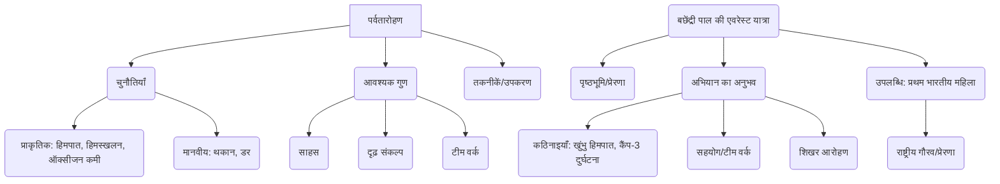

# Class 9 Hindi - Sparsh Chapter 102
**Language:** हिंदी

```markdown
# [कक्षा 9] स्पर्श - पाठ 102: एवरेस्ट: मेरी शिखर यात्रा

## 🌟 Core Concepts

यह पाठ बछेंद्री पाल की एवरेस्ट पर चढ़ाई की रोमांचक यात्रा का वर्णन करता है। मुख्य अवधारणाएँ इस प्रकार हैं:

1.  **पर्वतारोहण (Mountaineering):**
    *   **परिचय:** ऊँचे पहाड़ों पर चढ़ने की कला और विज्ञान।
    *   **चुनौतियाँ:**
        *   प्राकृतिक: अत्यधिक ठंड, बर्फीले तूफान (हिमपात), हिमस्खलन (Avalanche), गहरी दरारें (हिम-विदर/Crevasses), ऑक्सीजन की कमी, ऊँचाई का प्रभाव।
        *   मानवीय: शारीरिक और मानसिक थकान, डर, दुर्घटना का खतरा।
    *   **आवश्यक गुण:** साहस, दृढ़ संकल्प, सहनशक्ति, टीम वर्क (सहयोग), नेतृत्व क्षमता, त्वरित निर्णय लेने की क्षमता।
    *   **तकनीकें और उपकरण:** रस्सी का उपयोग, बर्फ काटने के लिए फावड़ा, विशेष जूते और कपड़े, ऑक्सीजन सिलेंडर, वॉकी-टॉकी, अस्थायी पुल बनाना।

2.  **बछेंद्री पाल की यात्रा:**
    *   **प्रेरणा और पृष्ठभूमि:** बचपन से पहाड़ों पर चढ़ने का शौक, आर्थिक कठिनाइयों के बावजूद शिक्षा और पर्वतारोहण का प्रशिक्षण, लैंगिक भेदभाव का सामना।
    *   **एवरेस्ट अभियान:** भारतीय पर्वतारोहण फाउंडेशन (IMF) द्वारा आयोजित अभियान दल में चयन।
    *   **संघर्ष और विजय:** अभियान के दौरान आई बाधाओं (दुर्घटना, साथियों की मृत्यु) का सामना करते हुए एवरेस्ट शिखर पर पहुँचने वाली पहली भारतीय महिला बनना।

3.  **टीम वर्क और नेतृत्व:**
    *   अभियान की सफलता में दल के नेता (कर्नल खुल्लर), उपनेता (प्रेमचंद), शेरपाओं (अंग दोरजी, ल्हाटू, लोपसांग) और अन्य सदस्यों के आपसी सहयोग का महत्व।
    *   कठिन परिस्थितियों में एक-दूसरे की मदद करना (जैसे लोपसांग द्वारा बछेंद्री को बचाना, बछेंद्री द्वारा साथियों की मदद करना)।

4.  **मानवीय भावनाएँ:**
    *   रोमांच, डर, खुशी, दुख (अवसाद), गर्व, कृतज्ञता, आध्यात्मिकता (शिखर पर पूजा करना)।

📊 **अवधारणा पदानुक्रम (Concept Hierarchy):**



## 📘 Key Learnings

1.  **बछेंद्री पाल का परिचय:** उत्तरांचल (अब उत्तराखंड) के एक साधारण परिवार में जन्मी बछेंद्री ने आर्थिक तंगी और सामाजिक अपेक्षाओं के बावजूद अपनी शिक्षा (संस्कृत में एम.ए., बी.एड.) पूरी की और पर्वतारोहण में करियर बनाया। उनका दृढ़ संकल्प उन्हें एवरेस्ट तक ले गया।

2.  **एवरेस्ट अभियान की तैयारी और शुरुआत:**
    *   दिल्ली से काठमांडू और फिर नामचे बाज़ार तक का सफर।
    *   नामचे बाज़ार से पहली बार एवरेस्ट (नेपालियों में 'सागरमाथा') को देखना।
    *   शिखर पर 150 किमी/घंटा या अधिक रफ़्तार से हवा चलने के कारण बनने वाला बर्फ का विशाल ध्वज (प्लूम) देखना।

3.  **खुंभु हिमपात की चुनौतियाँ:**
    *   यह ग्लेशियर के बहने से बर्फ के टुकड़ों का अव्यवस्थित रूप से गिरना है।
    *   यहाँ बर्फ में बड़ी-बड़ी दरारें (हिम-विदर) बन जाती हैं, जो बेहद खतरनाक होती हैं।
    *   रास्ता बनाने के लिए एल्युमिनियम की सीढ़ियों से अस्थायी पुल बनाना, रस्सियाँ बाँधना पड़ता है।
    *   यह रास्ता लगातार बदलता रहता है, जिससे बनाया गया रास्ता व्यर्थ हो सकता है।
    *   अभियान दल को यहाँ एक शेरपा कुली की मृत्यु और एक रसोई सहायक की मृत्यु का दुखद समाचार मिला।

    📈 **खुंभु हिमपात का सरलीकृत चित्र:**
    ```
    <------------------ ग्लेशियर का बहाव ------------------>
    हिम-विदर (Crevasse)   हिम-विदर (Crevasse)    बर्फ के ब्लॉक
       |                     |                     |
    [अस्थायी पुल] <-----> [रस्सी] <--------> [सावधानी से पार]
    (एल्युमिनियम सीढ़ी)
    ```

4.  **कैंप-3 की दुर्घटना (15-16 मई की रात):**
    *   ल्होत्से ग्लेशियर से एक विशाल बर्फ का पिंड (हिमपुंज) टूटकर कैंप पर गिरा।
    *   बछेंद्री अपने तंबू में दब गईं, उन्हें साँस लेने में कठिनाई हुई।
    *   लोपसांग ने स्विस छुरी से तंबू काटकर और बर्फ हटाकर उन्हें बचाया।
    *   इस घटना से कई सदस्य घायल हुए, जिन्हें बेस कैंप वापस भेजना पड़ा।
    *   कर्नल खुल्लर द्वारा बछेंद्री से पूछने पर उन्होंने वापस जाने से इनकार कर दिया, जो उनके साहस को दर्शाता है।

5.  **अंतिम शिखर चढ़ाई (साउथ कोल से):**
    *   बछेंद्री ने साउथ कोल (कैंप-4) पहुँचकर अगले दिन की चढ़ाई की तैयारी की (खाना, गैस, ऑक्सीजन सिलेंडर)।
    *   उन्होंने नीचे जाकर अपने साथियों (की, जय, मीनू) की मदद की, जो भारी बोझ और बिना ऑक्सीजन के धीरे-धीरे आ रहे थे।
    *   अगली सुबह (23 मई) अंग दोरजी (जो बिना ऑक्सीजन के चढ़ रहे थे) के साथ सुबह जल्दी चढ़ाई शुरू की।
    *   जमी हुई सख्त और भुरभुरी बर्फ पर फावड़े से रास्ता बनाते हुए आगे बढ़े।
    *   ल्हाटू भी उनके साथ शामिल हुआ और रस्सी से संतुलन बनाने में मदद की।
    *   बछेंद्री ने ऑक्सीजन की आपूर्ति बढ़ाई जिससे चढ़ाई आसान लगी।

6.  **शिखर पर:**
    *   23 मई 1984 को दोपहर 1:07 बजे एवरेस्ट शिखर पर पहुँचीं।
    *   वे एवरेस्ट पर पहुँचने वाली पहली भारतीय महिला बनीं।
    *   शिखर पर जगह बहुत कम थी। फावड़े से बर्फ खोदकर सुरक्षित स्थान बनाया।
    *   घुटनों के बल बैठकर 'सागरमाथा' के ताज का चुंबन लिया।
    *   थैले से दुर्गा माँ का चित्र और हनुमान चालीसा निकालकर लाल कपड़े में लपेटकर पूजा की और बर्फ में दबा दिया।
    *   अपने माता-पिता को याद किया और अंग दोरजी के प्रति आभार व्यक्त किया।
    *   कर्नल खुल्लर ने वॉकी-टॉकी पर बधाई दी और कहा कि देश को उन पर गर्व है।

## 🧩 Active Learning

*   **Activity: शोध-आधारित केस स्टडी विश्लेषण 🔍**
    *   बछेंद्री पाल के अलावा, अन्य भारतीय महिला पर्वतारोहियों (जैसे अरुणिमा सिन्हा, प्रेमलता अग्रवाल, संतोष यादव) के बारे में जानकारी एकत्र करें। उनकी पृष्ठभूमि, चुनौतियों और उपलब्धियों की तुलना करें। एक संक्षिप्त रिपोर्ट तैयार करें।
    *   **मूल्यांकन बिंदु:** क्या उनकी चुनौतियाँ बछेंद्री पाल जैसी थीं या भिन्न? उनकी सफलताओं ने समाज को कैसे प्रेरित किया?

*   **Discussion: वास्तविक दुनिया के प्रभावों का आलोचनात्मक विश्लेषण 🌍**
    *   **प्रश्न 1 (मूल्यांकन):** एवरेस्ट जैसे अभियानों में व्यक्तिगत उपलब्धि और टीम की सुरक्षा के बीच संतुलन बनाना क्यों महत्वपूर्ण है? पाठ से उदाहरण देकर समझाएँ।
    *   **प्रश्न 2 (विश्लेषण):** बछेंद्री पाल की सफलता ने भारत में, विशेषकर महिलाओं के लिए, खेल और साहसिक गतिविधियों में भागीदारी को किस प्रकार प्रभावित किया होगा? चर्चा करें।
    *   **प्रश्न 3 (निर्माण):** यदि आपको किसी चुनौतीपूर्ण अभियान का नेतृत्व करने का अवसर मिले, तो आप अपनी टीम की सुरक्षा और सफलता सुनिश्चित करने के लिए कौन-सी तीन प्रमुख रणनीतियाँ अपनाएँगे?

## 📝 Assessment Prep

*   **केस स्टडी:**
    *   **कैंप-3 दुर्घटना:** इस घटना का विस्तार से वर्णन करें। इसके क्या कारण थे? बछेंद्री और अन्य सदस्यों पर इसका क्या प्रभाव पड़ा? लोपसांग की भूमिका का मूल्यांकन करें। इस घटना से टीम भावना और साहस के बारे में क्या पता चलता है? 📝
    *   **अंतिम शिखर आरोहण:** साउथ कोल से शिखर तक की यात्रा में बछेंद्री और अंग दोरजी को किन चुनौतियों का सामना करना पड़ा? उन्होंने इन चुनौतियों का सामना कैसे किया?

*   **रेखाचित्र/चार्ट:**
    *   एवरेस्ट अभियान के मार्ग में आने वाले प्रमुख पड़ावों (जैसे नामचे बाज़ार, बेस कैंप, कैंप-1, कैंप-2, कैंप-3, साउथ कोल/कैंप-4, शिखर) को दर्शाने वाला एक सरल प्रवाह चार्ट (Flowchart) या रेखाचित्र बनाएँ। 📈

*   **महत्वपूर्ण प्रश्न:**
    *   खुंभु हिमपात की विशेषताओं और खतरों का वर्णन करें।
    *   तेनजिंग नोर्गे ने बछेंद्री पाल का उत्साहवर्धन कैसे किया?
    *   बछेंद्री पाल ने शिखर पर पहुँचकर क्या किया? यह उनके किन मूल्यों को दर्शाता है?
    *   कर्नल खुल्लर ने अभियान के दौरान नेतृत्व की भूमिका कैसे निभाई? ('मृत्यु को सहज स्वीकार करना' वाले कथन का आशय स्पष्ट करें)।

## 🌏 Bharatiya Context

*   **ऐतिहासिक उपलब्धि:** बछेंद्री पाल का 1984 में एवरेस्ट शिखर पर पहुँचना भारत के लिए एक ऐतिहासिक क्षण था। वे यह उपलब्धि हासिल करने वाली **पहली भारतीय महिला** बनीं, जिसने विश्व पटल पर भारत का मान बढ़ाया। 🇮🇳
*   **सामाजिक प्रभाव:** उनकी सफलता ने भारत में लैंगिक रूढ़ियों को चुनौती दी। यह दर्शाया कि भारतीय महिलाएँ शारीरिक और मानसिक रूप से मजबूत हैं और किसी भी क्षेत्र में पुरुषों के बराबर या उनसे आगे निकल सकती हैं। इसने अनगिनत भारतीय लड़कियों और महिलाओं को साहसिक खेलों और अन्य गैर-पारंपरिक क्षेत्रों में आगे बढ़ने के लिए प्रेरित किया।
*   **सांस्कृतिक अभिव्यक्ति:** शिखर पर पहुँचकर बछेंद्री पाल द्वारा दुर्गा माँ का चित्र और हनुमान चालीसा रखना उनकी गहरी **भारतीय सांस्कृतिक और आध्यात्मिक जड़ों** को दर्शाता है। यह उपलब्धि के क्षण में अपनी आस्था और जड़ों से जुड़े रहने का प्रतीक है। 🙏
*   **राष्ट्रीय पर्वतारोहण संस्था:** यह अभियान **भारतीय पर्वतारोहण फाउंडेशन (Indian Mountaineering Foundation - IMF)** द्वारा प्रायोजित था, जो भारत में पर्वतारोहण और साहसिक गतिविधियों को बढ़ावा देने वाली प्रमुख संस्था है। यह भारत सरकार के समर्थन से संचालित होती है।
*   **प्रेरणा का स्रोत:** बछेंद्री पाल की कहानी आज भी स्कूलों में पढ़ाई जाती है और यह दृढ़ संकल्प, साहस और चुनौतियों पर विजय पाने का एक शक्तिशाली **भारतीय उदाहरण** है। 📊 (डेटा बिंदु: उनकी उपलब्धि के बाद, एवरेस्ट फतह करने वाले भारतीय पर्वतारोहियों, विशेषकर महिलाओं की संख्या में वृद्धि हुई है, जो देश में इस खेल के प्रति बढ़ते रुझान को दिखाता है।)
```