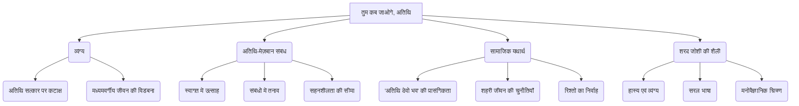

# Class 9 Hindi - Sparsh Chapter 103
**Language:** हिंदी

```markdown
# [कक्षा 9] स्पर्श - अध्याय 103: तुम कब जाओगे, अतिथि

## 🌟 मुख्य अवधारणाएँ (Core Concepts)

यह पाठ **शरद जोशी** द्वारा लिखित एक **व्यंग्य रचना** है, जो भारतीय समाज में अतिथि सत्कार की परंपरा और उससे जुड़ी विडंबनाओं पर केंद्रित है।

1.  **व्यंग्य (Satire)**
    *   अतिथि सत्कार की परंपरा पर कटाक्ष।
    *   बिन बुलाए और लंबे समय तक टिकने वाले मेहमानों से उत्पन्न होने वाली समस्याओं का चित्रण।
    *   मध्यमवर्गीय मेज़बान की आर्थिक और मानसिक स्थिति का हास्यपूर्ण वर्णन।
2.  **अतिथि-मेज़बान संबंध (Guest-Host Relationship)**
    *   प्रारंभिक उत्साह और औपचारिकता।
    *   समय बीतने के साथ संबंध में आता तनाव और बोरियत।
    *   संवादहीनता की स्थिति।
    *   मेज़बान की सहनशीलता की सीमा।
3.  **सामाजिक यथार्थ (Social Reality)**
    *   'अतिथि देवो भव' की अवधारणा का व्यावहारिक परीक्षण।
    *   शहरी जीवन और सीमित संसाधनों में अतिथि सत्कार की चुनौतियाँ।
    *   रिश्तों को निभाने की सामाजिक मजबूरी और व्यक्तिगत परेशानी के बीच द्वंद्व।
4.  **लेखक की शैली (Author's Style)**
    *   सरल, सहज और प्रवाहमयी भाषा।
    *   हास्य और व्यंग्य का कुशल प्रयोग।
    *   मुहावरों और आम बोलचाल के शब्दों का सटीक उपयोग।
    *   मनोवैज्ञानिक चित्रण (मेज़बान की भावनाओं का सूक्ष्म वर्णन)।

📊 **अवधारणा पदानुक्रम (Concept Hierarchy):**



## 📘 मुख्य शिक्षाएँ (Key Learnings)

1.  **अतिथि सत्कार की बदलती गतिशीलता (Changing Dynamics of Hospitality):**
    *   पाठ दर्शाता है कि अतिथि का आगमन शुरू में खुशी और उत्साह लाता है (उच्च-मध्यम वर्गीय डिनर, सिनेमा दिखाना)।
    *   लेकिन जब अतिथि बिना पूर्व सूचना के आता है और जाने का नाम नहीं लेता, तो वही सत्कार बोझ बन जाता है। मेज़बान की खुशी धीरे-धीरे चिंता, फिर झुंझलाहट और अंत में आक्रोश में बदल जाती है।
    *   📈 **सत्कार का स्तर:**
        *   दिन 1: उत्साह चरम पर (शानदार डिनर, मीठा)।
        *   दिन 2: स्तर थोड़ा नीचे (लंच की गरिमा, सिनेमा - आखिरी छोर)।
        *   दिन 3: गिरावट (धोबी को कपड़े देने की बात सुनकर आघात)।
        *   दिन 4: न्यूनतम स्तर (खिचड़ी बनना, बातचीत बंद)।
        *   दिन 5 (संभावित): उपवास / 'गेट आउट' की स्थिति।

2.  **मेज़बान की मनोदशा और आर्थिक दबाव (Host's Mood and Financial Pressure):**
    *   लेखक ने मेज़बान की भावनाओं को बारीकी से दर्शाया है - अतिथि के आने पर अज्ञात आशंका ("बटुआ काँप गया"), फिर स्नेह भरी मुस्कराहट, पीड़ा को पीकर प्रसन्न बने रहना, और अंततः मन ही मन अतिथि के जाने की कामना करना।
    *   अतिथि का लंबा प्रवास मेज़बान पर आर्थिक बोझ डालता है ("आर्थिक सीमाओं की बैंजनी चट्टान देख ली")। यह मध्यमवर्गीय जीवन की एक आम सच्चाई है।

3.  **'अतिथि देवो भव' का यथार्थ (The Reality of 'Atithi Devo Bhava'):**
    *   यह पाठ पारंपरिक आदर्श वाक्य "अतिथि देवो भव" पर प्रश्नचिह्न लगाता है। लेखक स्वीकार करता है कि अतिथि देवता होता है, लेकिन यह भी स्पष्ट करता है कि देवता दर्शन देकर लौट जाता है, लंबे समय तक रुककर मेज़बान के लिए मुसीबत नहीं बनता।
    *   जब अतिथि अपने व्यवहार से मेज़बान को पीड़ा पहुँचाता है, तो वह 'देवता' न रहकर 'मानव' या 'थोड़े अंशों में राक्षस' भी लग सकता है।

4.  **संबंधों में संक्रमण (Transition in Relationships):**
    *   अतिथि के लंबे समय तक रुकने से मेज़बान और अतिथि के बीच का सौहार्द (cordiality) धीरे-धीरे बोरियत में बदल जाता है ("सौहार्द अब शनैः-शनैः बोरियत में रूपांतरित हो रहा है")।
    *   बातचीत के विषय समाप्त हो जाते हैं, गर्मजोशी ठंडी पड़ जाती है और भावनाएँ गालियों का रूप लेने लगती हैं। यह स्थिति दर्शाती है कि किसी भी रिश्ते में एक सीमा के बाद औपचारिकता या दूरी आवश्यक हो जाती है।

## 🧩 सक्रिय शिक्षण (Active Learning)

*   **Activity: शोध-आधारित केस स्टडी विश्लेषण 🔍 (Research-based Case Study Analysis):**
    *   समूहों में विभाजित होकर, छात्र अपने परिवार, पड़ोस या समाचारों से ऐसी वास्तविक घटनाओं/किस्सों को इकट्ठा करें जहाँ अतिथि के लंबे समय तक रुकने से मेज़बान को परेशानी हुई हो।
    *   इन मामलों का विश्लेषण करें: अतिथि के रुकने के कारण क्या थे? मेज़बान की क्या प्रतिक्रियाएँ थीं? इसका रिश्तों पर क्या प्रभाव पड़ा? आधुनिक जीवनशैली में इस समस्या के क्या समाधान हो सकते हैं? अपने निष्कर्ष कक्षा में प्रस्तुत करें। (Bloom's: Evaluating/Creating)

*   **Discussion: वास्तविक दुनिया के प्रभावों का आलोचनात्मक विश्लेषण 🌍 (Critical Analysis of Real-world Impacts):**
    *   कक्षा में इस विषय पर चर्चा करें: "क्या आज के दौर में 'अतिथि देवो भव' की परंपरा पूरी तरह निभाई जा सकती है?"
    *   शहरीकरण, छोटे घर, व्यस्त जीवन और आर्थिक दबावों के संदर्भ में इसके व्यावहारिक पहलुओं पर विचार करें।
    *   अतिथि और मेज़बान दोनों के दृष्टिकोण से इस मुद्दे का मूल्यांकन करें। एक 'आदर्श अतिथि' और 'आदर्श मेज़बान' के क्या गुण होने चाहिए? (Bloom's: Evaluating)

## 📝 मूल्यांकन तैयारी (Assessment Prep)

*   **केस स्टडी (Case Study):**
    *   **स्थिति:** कल्पना करें कि आप लेखक (मेज़बान) हैं और अतिथि पाँचवें दिन भी जाने का कोई संकेत नहीं दे रहा है। आपकी सहनशीलता जवाब दे चुकी है। आप विनम्रता और दृढ़ता के साथ अतिथि को यह कैसे समझाएंगे कि अब उनके जाने का समय है? एक संक्षिप्त संवाद लिखें। (Bloom's: Creating)
    *   **प्रश्न:** लेखक के अनुसार, अतिथि कब 'देवता' से 'राक्षस' का रूप ले सकता है? पाठ से उदाहरण देकर स्पष्ट करें। (Bloom's: Analyzing)

*   **रेखाचित्र/फ्लोचार्ट (Diagrams/Flowcharts - Text Representation):**
    *   पाठ के आधार पर, मेज़बान की भावनाओं में दिन-प्रतिदिन आए बदलाव को दर्शाने वाला एक फ्लोचार्ट बनाएँ:
        *   `दिन 1: आशंका + उत्साह → दिन 2: पीड़ा छिपाना + औपचारिकता → दिन 3: आघात + चिढ़ → दिन 4: बोरियत + गुस्सा → दिन 5 (अपेक्षित): सहनशीलता समाप्त + हताशा`

*   **मूल्यांकन प्रश्न:**
    *   "संबंधों का संक्रमण के दौर से गुज़रना" से लेखक का क्या तात्पर्य है? अतिथि और मेज़बान के संबंध इस दौर से क्यों गुज़र रहे थे? विस्तार से समझाएँ। (Bloom's: Analyzing/Evaluating)
    *   शरद जोशी ने इस व्यंग्य के माध्यम से समाज की किन विसंगतियों पर प्रहार किया है? मूल्यांकन करें। (Bloom's: Evaluating)

## 🌏 भारतीय संदर्भ (Bharatiya Context)

1.  **'अतिथि देवो भव' की परंपरा:** यह भारत की प्राचीन सांस्कृतिक मान्यता है, जहाँ मेहमान को ईश्वर तुल्य माना जाता है। पाठ इसी मान्यता की आधुनिक समय में प्रासंगिकता और चुनौतियों को दर्शाता है।
    *   *उदाहरण:* आज भी कई भारतीय परिवारों में अतिथि का यथासंभव अच्छे से अच्छा सत्कार करने का प्रयास किया जाता है, भले ही संसाधन सीमित हों।

2.  **मध्यमवर्गीय जीवन की वास्तविकता:** भारत का एक बड़ा वर्ग मध्यमवर्गीय है। पाठ में मेज़बान की आर्थिक चिंताएँ ("बटुआ काँपना", बजट का बिगड़ना) इस वर्ग की आम स्थिति को दर्शाती हैं, जहाँ सीमित आय में अनियोजित खर्चों का प्रबंधन करना एक चुनौती होती है।
    *   *उदाहरण:* त्योहारों या छुट्टियों में अचानक रिश्तेदारों के आ जाने से महीने का बजट गड़बड़ा जाना एक सामान्य अनुभव है।

3.  **सामाजिक दबाव और रिश्ते:** भारतीय समाज में रिश्तेदारों और परिचितों से संबंध बनाए रखने पर ज़ोर दिया जाता है। कई बार न चाहते हुए भी सामाजिक दबाव में लोगों को ऐसे अतिथियों का भी सत्कार करना पड़ता है जो असुविधा का कारण बनते हैं, जैसा कि इस पाठ में दिखाया गया है।
    *   *उदाहरण:* दूर के किसी रिश्तेदार का बिना बताए शहर आना और कई दिनों तक रुक जाना, जिससे मेज़बान की दिनचर्या और निजता प्रभावित होती है।

4.  **बदलते पारिवारिक और सामाजिक ढाँचे:** संयुक्त परिवारों की जगह एकल परिवारों (Nuclear Families) के बढ़ने, शहरों में घरों के आकार छोटे होने और जीवन की भागदौड़ ने पारंपरिक अतिथि सत्कार के तरीकों को प्रभावित किया है। लंबे समय तक मेहमानों को ठहराना अब पहले की तरह आसान नहीं रहा।
    *   *उदाहरण:* मुंबई या दिल्ली जैसे महानगरों में एक छोटे से फ्लैट में रहने वाले परिवार के लिए कई दिनों तक अतिथि को ठहराना काफी मुश्किल हो सकता है।
```