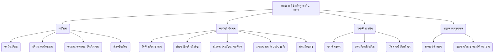

# Class 9 Hindi - Sparsh Chapter 105
**Language:** हिंदी

```markdown
# [कक्षा 9] स्पर्श - अध्याय 105 - शुक्रतारे के समान

## 🌟 मुख्य अवधारणाएँ (Core Concepts)

यह अध्याय **स्वामी आनंद** द्वारा लिखित एक **रेखाचित्र** है, जो **महादेव भाई देसाई** के व्यक्तित्व और उनके कार्यों पर केंद्रित है। महादेव भाई, महात्मा गांधी के **निजी सचिव** थे।

1.  **महादेव भाई देसाई का परिचय:**
    *   गांधीजी के निजी सचिव, मित्र, और समर्पित सहयोगी।
    *   गांधीजी द्वारा 'उत्तराधिकारी' और 'वारिस' कहा जाना।
    *   स्वयं को गांधीजी का 'हम्माल' या 'पीर-बावर्ची-भिश्ती-खर' कहने में गौरव अनुभव करना।

2.  **व्यक्तित्व के गुण:**
    *   **समर्पण और निष्ठा:** गांधीजी और स्वतंत्रता आंदोलन के प्रति पूर्ण समर्पण।
    *   **कठिन परिश्रम:** अथक कार्य क्षमता, दिन-रात काम करना।
    *   **सरलता और सज्जनता:** विनम्र, निरभिमानी स्वभाव।
    *   **तेजस्वी प्रतिभा:** बहुमुखी योग्यता, तीव्र बुद्धि।
    *   **सत्यनिष्ठा और विवेक:** विरोधियों के साथ भी विनम्र और सत्यनिष्ठ व्यवहार।

3.  **कार्य और योगदान:**
    *   **गांधीजी के सहायक:** गांधीजी की दिनचर्या, पत्र-व्यवहार, मुलाकातों का प्रबंधन।
    *   **लेखन और संपादन:**
        *   'यंग इंडिया' और 'नवजीवन' पत्रिकाओं का प्रबंधन और लेखन।
        *   गांधीजी के लेखों, भाषणों, वार्ताओं का सटीक और विस्तृत लेखन।
        *   त्रुटिहीन टिप्पणियाँ (Notes) तैयार करना।
    *   **अनुवाद कार्य:** गांधीजी की आत्मकथा 'सत्य के प्रयोग' का अंग्रेजी अनुवाद। टैगोर, शरत्चंद्र की रचनाओं का अनुवाद।
    *   **उत्कृष्ट लिखावट:** अत्यंत सुंदर और स्पष्ट लिखावट, जिसकी प्रशंसा वायसराय भी करते थे।

4.  **'शुक्रतारे के समान' उपाधि:**
    *   शुक्रतारे की तरह तेजस्वी, प्रभावशाली लेकिन अल्पकालिक उपस्थिति।
    *   आधुनिक भारत के उषाकाल (स्वतंत्रता संग्राम) में चमककर शीघ्र अस्त हो जाना (अकाल मृत्यु)।

5.  **लेखक का दृष्टिकोण:**
    *   स्वामी आनंद महादेव भाई की प्रतिभा, ऊर्जा और समर्पण से अभिभूत हैं।
    *   महान व्यक्तियों की सफलता में निष्ठावान सहयोगियों के महत्व पर जोर।

📊 **अवधारणा पदानुक्रम:**



## 📘 प्रमुख सीखें (Key Learnings)

1.  **महादेव भाई देसाई का अद्वितीय व्यक्तित्व:** वे केवल गांधीजी के सचिव नहीं थे, बल्कि उनके मित्र, सहायक और एक तरह से उनके पूरक थे। उनका स्वयं को 'पीर-बावर्ची-भिश्ती-खर' कहना उनकी बहुमुखी प्रतिभा और सेवा भावना को दर्शाता है। वे गांधीजी के प्रति इतने समर्पित थे कि उनका अपना जीवन गांधीजी के साथ एकाकार हो गया था।

2.  **असाधारण कार्यक्षमता और समर्पण:** महादेव भाई दिन में घंटों काम करते थे, यात्राओं, सभाओं, मुलाकातों के बीच भी लिखने, पढ़ने और गांधीजी के कार्यों को संभालने का समय निकाल लेते थे। वे जेट की गति से लिखते थे, बिना शॉर्टहैंड जाने भी पूरी बातचीत को शब्दशः दर्ज कर लेते थे, जिसमें कॉमा तक की गलती नहीं होती थी। 📈 उनकी कार्यक्षमता का अनुमान इसी से लगाया जा सकता है कि वे एक घंटे में चार घंटे का काम निपटा देते थे।

3.  **लेखन कला और उसका महत्व:** उनकी लिखावट इतनी सुंदर और स्पष्ट थी कि वायसराय भी उसे देखकर प्रभावित होते थे। उनके द्वारा लिखे गए पत्र, टिप्पणियाँ और गांधीजी की आत्मकथा का अनुवाद (सत्य के प्रयोग) स्वतंत्रता आंदोलन के विचारों को फैलाने और दस्तावेजीकरण में अत्यंत महत्वपूर्ण साबित हुए। यह दर्शाता है कि स्पष्ट और प्रभावी संचार किसी भी बड़े लक्ष्य के लिए कितना आवश्यक है।

4.  **सत्यनिष्ठा और विनम्रता:** महादेव भाई अत्यंत व्यस्त और प्रभावशाली होने के बावजूद सरल, सज्जन और निरभिमानी बने रहे। वे गांधीजी की कठोर आलोचना करने वाले समाचार पत्रों को भी जवाब देते समय पूरी सत्यनिष्ठा और विवेक का पालन करते थे। यह गांधीजी द्वारा दी गई तालीम का प्रभाव था।

5.  **शुक्रतारे से तुलना का औचित्य:** लेखक ने महादेव भाई की तुलना शुक्रतारे से इसलिए की है क्योंकि शुक्रतारा आकाश में अपनी चमक और प्रभा के लिए अद्वितीय है, पर वह অল্প समय (सुबह या शाम) के लिए ही दिखाई देता है। इसी प्रकार, महादेव भाई ने स्वतंत्रता संग्राम के उषाकाल में अपनी प्रतिभा और सेवा से सबको মুগ্ধ किया, परन्तु उनकी अकाल मृत्यु (49-50 वर्ष की आयु में) हो गई, जिससे वे शुक्रतारे की तरह ही शीघ्र अस्त हो गए।

6.  **सहयोगियों का महत्व:** लेखक यह रेखांकित करते हैं कि गांधीजी जैसे महान व्यक्ति भी अपने लक्ष्यों को तभी प्राप्त कर पाते हैं जब उनके पास महादेव भाई और प्यारेलाल जी जैसे समर्पित और योग्य सहयोगी हों, जो उनकी अन्य चिंताओं और उलझनों का भार अपने ऊपर ले लें।

## 🧩 सक्रिय अधिगम (Active Learning)

*   **गतिविधि: शोध-आधारित केस स्टडी विश्लेषण 🔍**
    *   **विषय:** महादेव भाई देसाई की 'यंग इंडिया' और 'नवजीवन' के प्रबंधन में भूमिका।
    *   **कार्य:** इंटरनेट या पुस्तकालय से जानकारी एकत्र करें कि महादेव भाई ने इन पत्रिकाओं के संपादन, प्रसार और सामग्री तैयार करने में कैसे योगदान दिया। ब्रिटिश सरकार की प्रतिक्रिया और इन पत्रिकाओं के प्रभाव पर एक संक्षिप्त रिपोर्ट (केस स्टडी) तैयार करें।
    *   **मूल्यांकन:** रिपोर्ट में महादेव भाई की संगठनात्मक और संपादकीय क्षमताओं का मूल्यांकन करें।

*   **चर्चा: वास्तविक दुनिया के प्रभावों का आलोचनात्मक विश्लेषण 🌍**
    *   **प्रश्न:**
        1.  महादेव भाई देसाई जैसे व्यक्तियों का, जो मुख्य नेता न होते हुए भी पृष्ठभूमि में रहकर महत्वपूर्ण कार्य करते हैं, किसी बड़े आंदोलन (जैसे भारतीय स्वतंत्रता संग्राम) की सफलता में क्या योगदान होता है? मूल्यांकन करें।
        2.  लेखक ने महादेव भाई की तुलना 'शुक्रतारे' से की है। क्या यह तुलना उपयुक्त है? इसके पक्ष और विपक्ष में तर्क दें।
        3.  महादेव भाई की कार्यशैली (अत्यधिक परिश्रम, निजी जीवन का अभाव) आज के संदर्भ में कितनी प्रासंगिक है? इसके सकारात्मक और नकारात्मक पहलुओं पर विचार करें।
    *   **प्रारूप:** कक्षा में छोटे समूहों में चर्चा करें और फिर अपने निष्कर्ष प्रस्तुत करें।

## 📝 मूल्यांकन तैयारी (Assessment Prep)

*   **केस स्टडी आधारित प्रश्न:**
    *   पंजाब में फौजी शासन के दौरान पीड़ितों की मदद करने और उनकी बातों को गांधीजी तक पहुँचाने में महादेव भाई की भूमिका का वर्णन करें।
    *   महादेव भाई की लिखावट की विशेषताओं का उल्लेख करते हुए बताएं कि यह क्यों महत्वपूर्ण मानी जाती थी? वायसराय की प्रतिक्रिया का संदर्भ लें।
*   **आशय स्पष्टीकरण:**
    *   "अपना परिचय उनके 'पीर-बावर्ची-भिश्ती-खर' के रूप में देने में वे गौरवान्वित महसूस करते थे।" - इसका आशय महादेव भाई की किस विशेषता से है?
    *   "इस पेशे में आमतौर पर स्याह को सफ़ेद और सफ़ेद को स्याह करना होता था।" - वकालत के पेशे के बारे में ऐसा क्यों कहा गया है और महादेव भाई इससे कैसे अलग थे?
    *   "देश और दुनिया को मुग्ध करके शुक्रतारे की तरह ही अचानक अस्त हो गए।" - इस पंक्ति का महादेव भाई के जीवन के संदर्भ में क्या अर्थ है?
*   **विश्लेषणात्मक प्रश्न:**
    *   महादेव भाई के किन गुणों ने उन्हें देश-विदेश में सबका लाड़ला बना दिया था? पाठ के आधार पर विस्तार से लिखें।
    *   महादेव भाई की अकाल मृत्यु के क्या कारण माने गए हैं? गांधीजी पर इसका क्या प्रभाव पड़ा?
*   **डायग्राम/फ्लोचार्ट:** महादेव भाई की दिनचर्या या उनके द्वारा संभाले जाने वाले विभिन्न कार्यों को दर्शाने वाला एक फ्लोचार्ट बनाने का अभ्यास करें। 📈

## 🌏 भारतीय संदर्भ (Bharatiya Context)

1.  **स्वतंत्रता संग्राम:** यह अध्याय भारतीय स्वतंत्रता संग्राम (विशेषकर 1917-1942 के दौरान) की कार्यप्रणाली की झलक देता है। इसमें **जलियाँवाला बाग हत्याकांड (1919)**, पंजाब में **फौजी शासन**, गांधीजी की **पलवल स्टेशन पर गिरफ्तारी**, **'यंग इंडिया'** और **'नवजीवन'** जैसे पत्रों की भूमिका का उल्लेख है, जो आंदोलन के महत्वपूर्ण हिस्से थे।
2.  **गांधीवादी विचार और कार्यशैली:** महादेव भाई का जीवन **सेवाधर्म**, **सत्यनिष्ठा**, **अहिंसक प्रतिरोध** (विरोधियों से भी विवेकपूर्ण व्यवहार) और **कठिन परिश्रम** जैसे गांधीवादी मूल्यों का प्रतीक है। उनका चरखा कातना भी गांधीजी के रचनात्मक कार्यक्रम का हिस्सा था।
3.  **प्रमुख भारतीय व्यक्तित्व:** पाठ में महात्मा गांधी के अतिरिक्त **बाल गंगाधर तिलक** ('केसरी' समाचार पत्र), **एनी बेसेंट**, **शंकरलाल बैंकर**, **उमर सोबानी**, **जमनादास द्वारकादास**, **नरहरि भाई पारीख**, **प्यारेलाल जी** जैसे स्वतंत्रता सेनानियों और सहयोगियों का जिक्र आता है। **कालीनाथ राय** ('ट्रिब्यून' के संपादक) का उल्लेख तत्कालीन पत्रकारिता और ब्रिटिश दमन को दर्शाता है।
4.  **महत्वपूर्ण स्थान:** अध्याय में **गुजरात (किमीडी गाँव, अहमदाबाद, साबरमती आश्रम)**, **महाराष्ट्र**, **पंजाब (लाहौर, अमृतसर)**, **दिल्ली**, **शिमला**, **वर्धा (सेवाग्राम, मगनवाड़ी)**, **बिहार**, **उत्तर प्रदेश** और **कालापानी (अंडमान)** जैसे स्थानों का संदर्भ आता है, जो ऐतिहासिक और भौगोलिक दृष्टि से महत्वपूर्ण हैं।
5.  **सामाजिक-राजनीतिक डेटा (संदर्भ):**
    *   **समाचार पत्रों की भूमिका:** 'यंग इंडिया', 'नवजीवन', 'केसरी', 'ट्रिब्यून', 'बॉम्बे क्रॉनिकल' जैसे पत्रों का उल्लेख दिखाता है कि स्वतंत्रता संग्राम में जनमत निर्माण और विचारों के प्रसार के लिए समाचार पत्र कितने महत्वपूर्ण थे।
    *   **ब्रिटिश शासन का दमन:** फौजी शासन, नेताओं की गिरफ्तारी, जन्मकैद (कालापानी), संपादकों को सजा, देश निकाला (हार्नीमैन) जैसी घटनाएँ ब्रिटिश सरकार की दमनकारी नीतियों को दर्शाती हैं।
    *   **राष्ट्रीय एकता:** महादेव भाई का 'आसेतुहिमाचल' (सेतुबंध रामेश्वर से हिमाचल तक) लोकप्रिय होना, देश के कोने-कोने से लोगों का गांधीजी से मिलने आना, राष्ट्रीय एकता और आंदोलन की व्यापकता को दर्शाता है।

यह अध्याय न केवल एक व्यक्ति का जीवन-चित्र है, बल्कि भारतीय स्वतंत्रता संग्राम के एक महत्वपूर्ण कालखंड का सजीव दस्तावेज़ भी है।
```