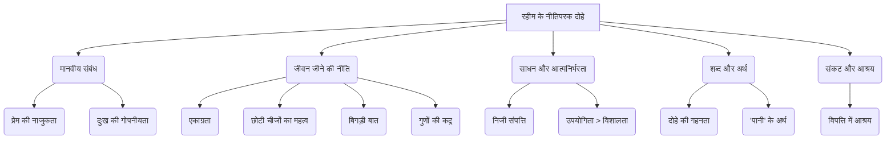

# Class 9 Hindi - Sparsh Chapter 107
**Language:** हिंदी

```markdown
# [कक्षा 9] स्पर्श - पाठ १०७: रहीम के दोहे

*(पाठ्यपुस्तक में यह पाठ संख्या भिन्न हो सकती है, कृपया अपनी पुस्तक से मिलान करें। यहाँ दिए गए दोहे अब्दुर्रहीम खानखाना 'रहीम' द्वारा रचित हैं।)*

## 🌟 मुख्य अवधारणाएँ (Core Concepts)

यह पाठ रहीम दास जी के नीतिपरक दोहों पर केंद्रित है, जो जीवन के व्यावहारिक पहलुओं पर गहरी अंतर्दृष्टि प्रदान करते हैं। मुख्य अवधारणाओं को इस प्रकार समझा जा सकता है:

1.  **मानवीय संबंध और व्यवहार:**
    *   प्रेम संबंधों की नाजुकता (`धागा प्रेम का`)
    *   निजी दुःख को गोपनीय रखने की सलाह (`निज मन की बिथा`)
    *   दूसरों के प्रति कैसा व्यवहार करें

2.  **जीवन जीने की कला और नीति:**
    *   एकाग्रता का महत्व (`एकै साधे सब सधै`)
    *   छोटी वस्तुओं की उपयोगिता (`लघु न दीजिये डारि`)
    *   बिगड़ी हुई बात का न सुधर पाना (`बिगरी बात बनै नहीं`)
    *   कला और गुणों की कद्र (`नाद रीझि`)

3.  **साधन, संपत्ति और आत्मनिर्भरता:**
    *   निजी संपत्ति का महत्व (`निज संपति बिना`)
    *   उपयोगिता का महत्व (बड़े होने से अधिक महत्वपूर्ण) (`धनि रहीम जल पंक को`)

4.  **शब्दों की शक्ति और अर्थ:**
    *   दोहे की संक्षिप्तता में गहन अर्थ (`दीरघ दोहा अरथ के`)
    *   'पानी' शब्द के विविध अर्थ (चमक, इज्जत, जल) (`पानी राखिए`)

5.  **संकट और आश्रय:**
    *   विपत्ति में आश्रय स्थल का महत्व (`चित्रकूट में रमि रहे`)

📊 **अवधारणा पदानुक्रम (Concept Hierarchy):**



## 📘 मुख्य सीख (Key Learnings)

इन दोहों से हमें जीवन जीने के महत्वपूर्ण सबक मिलते हैं:

1.  **प्रेम संबंध अनमोल हैं (रहिमन धागा प्रेम का...):** प्रेम का रिश्ता एक धागे की तरह नाजुक होता है। इसे झटके से नहीं तोड़ना चाहिए। अगर यह एक बार टूट जाता है, तो फिर से जुड़ नहीं पाता, और अगर जुड़ भी जाए तो उसमें गाँठ पड़ जाती है।
    *   **शिक्षा:** रिश्तों को सावधानी और सम्मान से निभाना चाहिए।
    *   📈 **रेखाचित्र:** धागा --- (टूटने पर) ---> टूटा धागा --- (जोड़ने पर) ---> गाँठ वाला धागा (पहले जैसा नहीं)

2.  **अपना दुःख छिपाकर रखें (रहिमन निज मन की बिथा...):** अपने मन का दुःख अपने मन में ही रखना चाहिए। दूसरों को बताने पर वे उसे सुनकर हँसी उड़ा सकते हैं (इठला सकते हैं), लेकिन कोई भी आपके दुःख को बाँटकर कम नहीं करेगा।
    *   **शिक्षा:** अपनी कमजोरियों या दुःखों का प्रदर्शन न करें, केवल विश्वासपात्रों से ही साझा करें।

3.  **एकाग्रता से सब सधता है (एकै साधे सब सधै...):** एक समय में एक मुख्य कार्य पर ध्यान केंद्रित करने से वह कार्य सिद्ध हो जाता है और उसके साथ अन्य कार्य भी स्वतः सध जाते हैं। यदि आप सब कुछ एक साथ साधने की कोशिश करेंगे, तो कुछ भी हाथ नहीं लगेगा। जैसे पेड़ की जड़ को सींचने से ही उसे पर्याप्त फल और फूल लगते हैं, न कि हर पत्ते या डाली को अलग-अलग सींचने से।
    *   **शिक्षा:** लक्ष्य निर्धारित करें और उस पर ध्यान केंद्रित करें।
    *   📈 **प्रवाह चित्र:** [एक मुख्य लक्ष्य/जड़ पर ध्यान] --> [उसे साधना/सींचना] --> [सभी संबंधित लक्ष्य/पूरा पेड़ सफल/हरा-भरा]

4.  **हर चीज़ का अपना महत्व है (रहिमन देखि बड़ेन को...):** बड़ी या प्रभावशाली चीज़ों को देखकर छोटी चीज़ों का त्याग नहीं करना चाहिए। हर वस्तु का अपना स्थान और उपयोग होता है। जहाँ सुई काम आती है, वहाँ तलवार कुछ नहीं कर सकती।
    *   **शिक्षा:** किसी को या किसी वस्तु को छोटा समझकर उसका अनादर न करें।

5.  **आत्मनिर्भरता सर्वश्रेष्ठ सहायक है (रहिमन निज संपति बिना...):** जब व्यक्ति के पास अपनी संपत्ति या सामर्थ्य नहीं होता, तो विपत्ति में कोई उसकी सहायता नहीं करता। ठीक वैसे ही जैसे बिना पानी के कमल को सूर्य भी नहीं बचा सकता (सूर्य कमल को खिलाता है, पर पानी के बिना वह भी मुरझा जाता है)।
    *   **शिक्षा:** आत्मनिर्भर बनना अत्यंत महत्वपूर्ण है।

6.  **'पानी' का महत्व (रहिमन पानी राखिए...):** रहीम कहते हैं कि 'पानी' को बनाए रखना चाहिए, क्योंकि 'पानी' के बिना सब सूना है। 'पानी' चले जाने पर मोती (चमक), मनुष्य (इज्जत/सम्मान) और चूना (जल) का कोई मूल्य नहीं रहता। यहाँ 'पानी' शब्द के तीन अर्थ हैं।
    *   **शिक्षा:** चमक, सम्मान और जल जीवन के लिए आवश्यक हैं, इन्हें बनाए रखना चाहिए।
    *   📊 **चार्ट:**
        *   मोती के संदर्भ में 'पानी' = चमक (Lustre)
        *   मनुष्य के संदर्भ में 'पानी' = इज्जत/सम्मान (Honour)
        *   चूने के संदर्भ में 'पानी' = जल (Water)

## 🧩 सक्रिय अधिगम (Active Learning)

1.  **गतिविधि: शोध-आधारित केस स्टडी विश्लेषण 🔍**
    *   **विषय:** "रहिमन निज मन की बिथा, मन ही राखो गोय।"
    *   **कार्य:** आजकल सोशल मीडिया पर लोग अपनी निजी भावनाएं और दुःख खुलकर साझा करते हैं। रहीम की इस सलाह के संदर्भ में, इसके सकारात्मक और नकारात्मक प्रभावों का विश्लेषण करें। क्या रहीम की सलाह आज भी प्रासंगिक है? अपने तर्कों के समर्थन में वास्तविक जीवन के उदाहरण (बिना नाम लिए) या समाचारों से उदाहरण खोजें और एक संक्षिप्त रिपोर्ट तैयार करें।

2.  **चर्चा: वास्तविक दुनिया के प्रभावों का आलोचनात्मक विश्लेषण 🌍**
    *   **विषय:** "जहाँ काम आवे सुई, कहा करे तरवारि।"
    *   **चर्चा बिंदु:**
        *   आज के कॉर्पोरेट जगत या सरकारी तंत्र में, क्या अक्सर छोटे कर्मचारियों या छोटी भूमिकाओं के महत्व को अनदेखा किया जाता है?
        *   उदाहरण देकर समझाएं कि कैसे किसी प्रोजेक्ट या संगठन में तथाकथित 'छोटी' भूमिकाएँ महत्वपूर्ण साबित हुई हैं।
        *   इस दोहे से हम टीम वर्क और प्रत्येक सदस्य के सम्मान के बारे में क्या सीख सकते हैं? कक्षा में समूह बनाकर इन बिंदुओं पर चर्चा करें।

## 📝 मूल्यांकन तैयारी (Assessment Prep)

1.  **केस स्टडी 1:**
    *   एक गाँव में बहुत बड़ा और भव्य तालाब है, लेकिन उसका पानी खारा है और किसी काम का नहीं। पास में ही एक छोटा सा कीचड़ भरा गड्ढा है, जिसका मीठा पानी छोटे जीव-जंतु पीकर अपनी प्यास बुझाते हैं। रहीम के दोहे "धनि रहीम जल पंक को..." के आधार पर बताइए कि कौन सा जल स्रोत अधिक धन्य है और क्यों? इससे हमें क्या सीख मिलती है?

2.  **केस स्टडी 2:**
    *   अमित ने गुस्से में आकर अपने सबसे अच्छे दोस्त रोहित से कुछ ऐसा कह दिया जिससे उनकी दोस्ती में दरार आ गई। बाद में अमित ने माफी मांगी और रोहित ने उसे माफ भी कर दिया, लेकिन उनके रिश्ते में पहले जैसी बात नहीं रही। रहीम के दोहे "टूटे से फिर ना मिले, मिले गाँठ परि जाय" के संदर्भ में इस स्थिति का विश्लेषण करें। क्या दोस्ती पूरी तरह से पहले जैसी हो सकती है? क्यों या क्यों नहीं?

3.  **रेखाचित्र/मानचित्रण:**
    *   "रहिमन पानी राखिए..." दोहे में 'पानी' शब्द के तीनों अर्थों (मोती, मानुष, चून के संदर्भ में) को दर्शाते हुए एक माइंड मैप या चार्ट बनाएं। 📝

## 🌏 भारतीय संदर्भ (Bharatiya Context)

रहीम के दोहे मध्यकालीन भारत के सामाजिक और सांस्कृतिक ताने-बाने को दर्शाते हैं, लेकिन उनकी प्रासंगिकता आज भी उतनी ही है। ये दोहे भारतीय नीति-शास्त्र और लोक-ज्ञान का अभिन्न हिस्सा हैं।

1.  **नीति और व्यवहार:** ये दोहे भारतीय संस्कृति में सदाचार, विनम्रता, आत्मनिर्भरता और रिश्तों के सम्मान जैसे मूल्यों पर जोर देते हैं। उदाहरण के लिए, 'पानी राखिए' में 'इज्जत' का महत्व भारतीय सामाजिक संरचना में गहरे तक समाया हुआ है।

2.  **भाषा और साहित्य:** रहीम ने अवधी और ब्रजभाषा का प्रयोग किया, जो उस समय उत्तर भारत की प्रमुख साहित्यिक भाषाएँ थीं। उनके दोहे सरल, सहज भाषा में गहरी बात कहने की भारतीय काव्य परंपरा (जैसे कबीर के दोहे) का उत्कृष्ट उदाहरण हैं।

3.  **ऐतिहासिक संदर्भ:** रहीम अकबर के नवरत्नों में से एक थे। उनका जीवन और रचनाएँ मुगलकालीन भारत की गंगा-जमुनी तहज़ीब और दरबारी संस्कृति की झलक प्रस्तुत करती हैं। उनका संस्कृत, फारसी और हिंदी का ज्ञान विभिन्न सांस्कृतिक धाराओं के संगम का प्रतीक है।

4.  **उदाहरण:**
    *   `आत्मनिर्भरता ('निज संपति बिना...')`: भारत में पारंपरिक रूप से बचत और संकट के लिए तैयारी को महत्व दिया जाता रहा है, जो इस दोहे में झलकता है।
    *   `एकाग्रता ('एकै साधे...')`: योग और ध्यान जैसी भारतीय परंपराएं मन की एकाग्रता पर बल देती हैं, जिसका महत्व रहीम ने व्यावहारिक जीवन के संदर्भ में बताया है।
    *   `चित्रकूट का संदर्भ`: चित्रकूट का उल्लेख सीधे तौर पर रामायण से जुड़ा है, जो भारतीय जनमानस में गहरे तक व्याप्त है। यह विपत्ति में शांति और आश्रय पाने के स्थान का प्रतीक है।

ये दोहे केवल कविता नहीं, बल्कि भारतीय समाज द्वारा सदियों से संजोए गए ज्ञान और अनुभव का सार हैं।
```