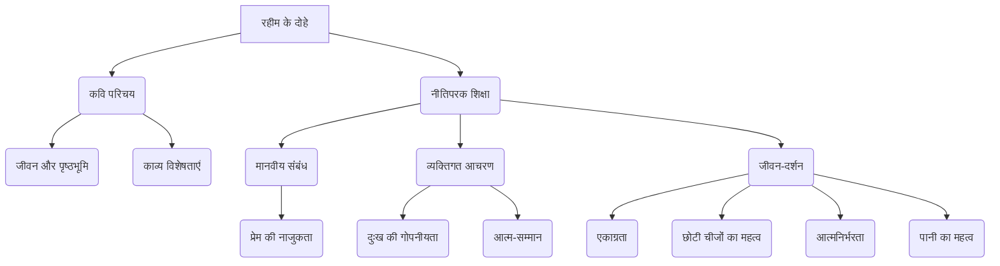

# Class 9 Hindi - Sparsh Chapter 107
**Language:** हिंदी

```markdown
# [कक्षा 9] स्पर्श - पाठ 107: रहीम के दोहे

*(कृपया ध्यान दें: दिए गए पाठ्यांश के अनुसार, यह रहीम के दोहे से संबंधित है। अध्याय संख्या 107 एक प्लेसहोल्डर हो सकती है, वास्तविक अध्याय संख्या भिन्न हो सकती है।)*

## 🌟 मुख्य अवधारणाएँ (Core Concepts)

यह खंड रहीम के जीवन और उनके नीतिपरक दोहों में निहित मुख्य विचारों को एक पदानुक्रम में प्रस्तुत करता है:

1.  **कवि परिचय - अब्दुर्रहीम खानखाना (1556-1626)**
    *   जन्म और पृष्ठभूमि (लाहौर, पूरा नाम)
    *   भाषा ज्ञान (अरबी, फारसी, संस्कृत, हिंदी)
    *   सांस्कृतिक महत्व (मध्ययुगीन दरबारी संस्कृति के प्रतिनिधि, अकबर के नवरत्न)
    *   काव्य विषय (श्रृंगार, नीति, भक्ति)
    *   लोकप्रियता और शैली (सरल, सहज, बोधगम्य दोहे, दैनिक जीवन के दृष्टांत)
    *   भाषा पर अधिकार (अवधी और ब्रज)
    *   प्रमुख कृतियाँ (रहीम सतसई, श्रृंगार सतसई, मदनाष्टक, आदि - 'रहीम ग्रंथावली' में संकलित)

2.  **नीतिपरक दोहे - शिक्षा और सीख**
    *   **मानवीय संबंध:**
        *   प्रेम का महत्व और नाजुकता (`धागा प्रेम का`)
        *   दूसरों के प्रति व्यवहार
    *   **व्यक्तिगत आचरण:**
        *   दुःख को गोपनीय रखना (`निज मन की बिथा`)
        *   आत्म-सम्मान और मर्यादा (`पानी राखिए - मानुष`)
        *   करणीय और अकरणीय कार्य
    *   **जीवन-दर्शन:**
        *   एकाग्रता का महत्व (`एके साधै सब सधै`)
        *   छोटी चीजों की उपयोगिता (`लघु न दीजिये डारि`)
        *   आत्मनिर्भरता का मूल्य (`निज संपति बिना`)
        *   विपत्ति में आश्रय (`चित्रकूट में रमि रहे`)
        *   शब्दों की शक्ति और गहराई (`दीरघ दोहा अरथ के`)
        *   उपयोगिता का महत्व (बनाम विशालता) (`धनि रहीम जल पंक को`)
        *   दानशीलता और कृतज्ञता (`नाद रीझि`)
        *   बिगड़ी बात का न बनना (`बिगरी बात बनै नहीं`)
        *   'पानी' का बहुआयामी महत्व (`पानी राखिए - मोती, मानुष, चून`)

📊 **अवधारणा पदानुक्रम:**


## 📘 मुख्य सीख (Key Learnings)

रहीम के दोहे हमें जीवन जीने की कला सिखाते हैं। यहाँ कुछ प्रमुख सीखों का विस्तृत वर्णन है:

1.  **प्रेम संबंधों की नाजुकता:**
    *   **दोहा:** `रहिमन धागा प्रेम का, मत तोड़ो चटकाय। टूटे से फिर ना मिले, मिले गाँठ परि जाय॥`
    *   **सीख:** प्रेम का संबंध एक धागे की तरह नाजुक होता है। इसे झटके से नहीं तोड़ना चाहिए। यदि यह एक बार टूट जाता है, तो फिर पहले जैसा नहीं जुड़ता; अगर जुड़ता भी है, तो उसमें गाँठ पड़ जाती है, जो हमेशा रिश्तों में एक दरार का एहसास कराती है।
    *   📈 **दृष्टांत:** टूटे हुए धागे में लगी गाँठ।

2.  **दुःख को स्वयं तक सीमित रखना:**
    *   **दोहा:** `रहिमन निज मन की बिथा, मन ही राखो गोय। सुनि अठिलैहैं लोग सब, बाँटि न लैहैं कोय॥`
    *   **सीख:** अपने मन के दुःख या पीड़ा को अपने मन में ही छिपाकर रखना चाहिए। दूसरों को बताने पर वे सहानुभूति दिखाने के बजाय उसका मजाक उड़ा सकते हैं। कोई भी आपके दुःख को वास्तव में बाँटकर कम नहीं करेगा।

3.  **एकाग्रता का महत्व:**
    *   **दोहा:** `एके साधै सब सधै, सब साधे सब जाय। रहिमन मूलहिं सींचिबो, फूलै फलै अघाय॥`
    *   **सीख:** एक समय में एक ही मुख्य कार्य पर ध्यान केंद्रित करने से सभी कार्य सफल हो जाते हैं। यदि आप एक साथ कई लक्ष्यों के पीछे भागते हैं, तो कुछ भी हासिल नहीं होता। ठीक वैसे ही जैसे पेड़ की जड़ को सींचने से ही पूरा पेड़ हरा-भरा होकर फल देता है, न कि हर पत्ते या टहनी को अलग-अलग सींचने से।
    *   🌳 **रेखाचित्र:**
        ```mermaid
        graph TD
            R(जड़ को सींचना) --> T(पूरा पेड़);
            T --> F(फूल);
            T --> Fr(फल);
        ```

4.  **छोटी वस्तुओं का महत्व:**
    *   **दोहा:** `रहिमन देखि बड़ेन को, लघु न दीजिये डारि। जहाँ काम आवे सुई, कहा करे तरवारि॥`
    *   **सीख:** बड़ी या प्रभावशाली चीजों को देखकर छोटी चीजों की उपेक्षा नहीं करनी चाहिए। हर वस्तु का अपना महत्व होता है और सही समय पर वही काम आती है। जहाँ कपड़े सिलने के लिए सुई की आवश्यकता होती है, वहाँ तलवार किसी काम की नहीं होती।

5.  **'पानी' का त्रिविध महत्व:**
    *   **दोहा:** `रहिमन पानी राखिए, बिनु पानी सब सून। पानी गए न ऊबरै, मोती, मानुष, चून॥`
    *   **सीख:** रहीम कहते हैं कि 'पानी' का बहुत महत्व है, इसे बनाए रखना चाहिए। 'पानी' के बिना सब व्यर्थ है। यहाँ 'पानी' के तीन अर्थ हैं:
        *   **मोती:** चमक (Luster)
        *   **मानुष (मनुष्य):** इज्जत, सम्मान (Honor)
        *   **चून (चूना/आटा):** जल (Water)
    *   इन तीनों के लिए 'पानी' चला जाए तो उनका कोई मूल्य नहीं रहता।
    *   💧 **रेखाचित्र:**
        ```mermaid
        graph TD
            P(पानी) --> M(मोती - चमक);
            P --> H(मानुष - सम्मान);
            P --> C(चून - जल);
            M -- बिनु पानी --> MV(मूल्यहीन);
            H -- बिनु पानी --> HV(मूल्यहीन);
            C -- बिनु पानी --> CV(मूल्यहीन);
        ```

## 🧩 सक्रिय अधिगम (Active Learning)

1.  **गतिविधि: शोध-आधारित विश्लेषण 🔍**
    *   **कार्य:** रहीम के दोहों में वर्णित नैतिक सिद्धांतों (जैसे - आत्मनिर्भरता, विवेक, विनम्रता) के वास्तविक जीवन में अनुप्रयोग के उदाहरण खोजें। आप समाचारों, इतिहास, या अपने आस-पास की घटनाओं से उदाहरण लेकर विश्लेषण कर सकते हैं कि इन सिद्धांतों का पालन करने या न करने के क्या परिणाम हुए। (उदाहरण: 'निज संपति बिना' - आत्मनिर्भरता का महत्व दर्शाने वाली कोई कहानी या घटना)।

2.  **चर्चा: वास्तविक दुनिया के प्रभावों का आलोचनात्मक विश्लेषण 🌍**
    *   **विषय 1:** कक्षा में चर्चा करें - "जहाँ काम आवे सुई, कहा करे तरवारि"। आज के संदर्भ में छोटी चीज़ों, छोटे पदों या सामान्य लोगों का क्या महत्व है?
    *   **विषय 2:** "बिनु पानी सब सून" - मनुष्य के संदर्भ में 'पानी' (सम्मान) के महत्व पर विचार-विमर्श करें। समाज में सम्मान खोने के क्या परिणाम हो सकते हैं?
    *   **शोध:** पता करें कि 'चित्रकूट' भारत के किस राज्य में स्थित है और इसका ऐतिहासिक/धार्मिक महत्व क्या है? (संकेत: पाठ में श्रीराम का संदर्भ दिया गया है)।

## 📝 मूल्यांकन तैयारी (Assessment Prep)

परीक्षा की तैयारी के लिए निम्नलिखित पर ध्यान दें:

1.  **दोहों का अर्थ और भाव:** प्रत्येक दोहे का सरलार्थ और उसमें निहित गहरा नैतिक संदेश समझें।
    *   **उदाहरण:** 'टूटे से फिर ना मिले, मिले गाँठ परि जाय' का भाव स्पष्ट करें।
2.  **पाठ आधारित प्रश्न:** पाठ्यपुस्तक में दिए गए प्रश्नों (जैसे - प्रेम का धागा टूटने पर क्या होता है?, पंक जल को धन्य क्यों कहा गया है?) के उत्तर तैयार करें।
3.  **पंक्तियों की पहचान:** दिए गए भाव को व्यक्त करने वाली सही पंक्तियाँ पाठ से पहचानना सीखें।
    *   **उदाहरण:** 'जिस पर विपदा पड़ती है वही इस देश में आता है' - यह भाव किस पंक्ति में है? (`जा पर बिपदा पड़त है, सो आवत यह देस`)
4.  **शब्दार्थ और भाषा:** दोहों में प्रयुक्त पुराने/ब्रज/अवधी शब्दों (जैसे - बिथा, गोय, मूलहिं, पंक, नट, तरवारि, मानुष, चून) के आधुनिक हिंदी अर्थ समझें और याद करें।
5.  **विश्लेषणात्मक प्रश्न:** दोहों में दिए गए दृष्टांतों (जैसे - फटा दूध, सुई-तलवार, जड़ सींचना, मोती-मानुष-चून) की प्रासंगिकता और उनके द्वारा समझाए गए सिद्धांत का विश्लेषण करने का अभ्यास करें।
    *   📈 **रेखाचित्रों का प्रयोग:** 'एके साधै' या 'पानी राखिए' जैसे दोहों के अर्थ को स्पष्ट करने के लिए सरल रेखाचित्र बनाने का अभ्यास करें (जैसा ऊपर 'मुख्य सीख' में दिखाया गया है)।

## 🌏 भारतीय संदर्भ (Bharatiya Context)

रहीम के दोहे भारतीय संस्कृति और मूल्यों से गहरे जुड़े हुए हैं:

1.  **ऐतिहासिक संदर्भ:** रहीम मुगल बादशाह अकबर के नवरत्नों में से एक थे। उनका जीवन और कार्य उस काल की गंगा-जमुनी तहज़ीब (संस्कृति का मिश्रण) का प्रतीक है, जहाँ फारसी और भारतीय परंपराएँ मिलती थीं।
2.  **नैतिक मूल्य:** दोहों में परिलक्षित मूल्य जैसे - प्रेम का सम्मान, वचन का पालन, विनम्रता, परोपकार, आत्मनिर्भरता, विवेक, मर्यादा - भारतीय नीति-शास्त्र और दर्शन के अभिन्न अंग हैं।
3.  **सांस्कृतिक प्रतीक:**
    *   **चित्रकूट:** इसका उल्लेख सीधे तौर पर भारतीय महाकाव्य रामायण से जुड़ा है, जहाँ भगवान राम ने वनवास का कुछ समय बिताया था। यह विपत्ति में शांति और आश्रय का प्रतीक बन गया है।
    *   **'पानी':** भारतीय संस्कृति में 'पानी' (जल) जीवन का प्रतीक है, और 'पानी' (इज्जत/मान) सामाजिक प्रतिष्ठा का। रहीम ने इस एक शब्द के माध्यम से गहरे सांस्कृतिक अर्थों को व्यक्त किया है।
4.  **भाषा:** रहीम ने अपने समय की लोक भाषाओं - ब्रज और अवधी - का प्रयोग कर साहित्य को आम जन तक पहुँचाया, जो हिंदी साहित्य के विकास में महत्वपूर्ण योगदान है।
5.  **सामाजिक प्रासंगिकता:** रहीम के दोहे सदियों बाद भी भारतीय समाज में प्रासंगिक हैं और लोगों को सही आचरण और मूल्यों की याद दिलाते रहते हैं। वे अक्सर लोक कहावतों के रूप में उद्धृत किए जाते हैं।

📊 **भारतीय मूल्य:** रहीम के दोहे भारतीय समाज में प्रचलित अनेक नैतिक मूल्यों (जैसे - संबंध निभाना, स्वाभिमान, संतोष, विवेक) को दर्शाते हैं, जो पीढ़ी दर पीढ़ी सिखाए जाते हैं।
```