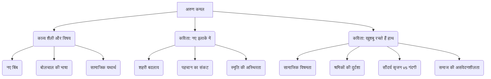

# Class 9 Hindi - Sparsh Chapter 110
**Language:** हिंदी

```markdown
# [कक्षा 9] स्पर्श - पाठ 11 (अरुण कमल)

*(नोट: पाठ संख्या 110 के बजाय, यह सामग्री अरुण कमल की कविताओं पर आधारित है, जो आमतौर पर कक्षा 9 'स्पर्श' भाग 1 में पाठ 11 के आसपास होती हैं। कृपया अपनी पाठ्यपुस्तक से पाठ संख्या सत्यापित करें।)*

## 🌟 मुख्य अवधारणाएँ (Core Concepts)

यह पाठ कवि अरुण कमल और उनकी दो कविताओं पर केंद्रित है:

1.  **कवि परिचय: अरुण कमल**
    *   जन्म: 15 फरवरी 1954, नासरीगंज, रोहतास (बिहार)
    *   कार्य: पटना विश्वविद्यालय में प्राध्यापक
    *   सम्मान: साहित्य अकादमी पुरस्कार सहित कई अन्य पुरस्कार
    *   प्रमुख कृतियाँ:
        *   कविता-संग्रह: 'अपनी केवल धार', 'सबूत', 'नए इलाके में', 'पुतली में संसार'
        *   आलोचना: 'कविता और समय'
        *   अनुवाद: मायकोव्स्की की आत्मकथा, जंगल बुक (हिंदी में), युवा कवियों की कविताओं का अंग्रेज़ी अनुवाद ('वॉयसेज़')
    *   काव्य शैली: नए बिंब, बोलचाल की भाषा, खड़ी बोली के लय-छंद, जीवन के विविध क्षेत्रों का चित्रण, शोषणमूलक व्यवस्था के प्रति आक्रोश और नई मानवीय व्यवस्था की आकांक्षा।

2.  **कविता 1: 'नए इलाके में'**
    *   **मुख्य विषय:** शहरीकरण और तीव्र बदलाव
        *   बदलाव की गति: दुनिया का रोज़ पुराना पड़ जाना
        *   पहचान का संकट: पुराने निशानों का मिटना, रास्ता भूलना
        *   स्मृति की अस्थिरता: यादों के भरोसे न जी पाना
        *   अनिश्चितता और अकेलापन

3.  **कविता 2: 'खुशबू रचते हैं हाथ'**
    *   **मुख्य विषय:** सामाजिक विषमता और श्रम का शोषण
        *   विरोधाभास: सौंदर्य (खुशबू) रचने वालों का गंदगी में जीवन
        *   श्रमिकों की दुर्दशा: अभावग्रस्त, अस्वस्थकर माहौल में काम करना
        *   समाज की संवेदनहीनता: उपेक्षित श्रमिक वर्ग
        *   श्रम का महत्व और उसकी उपेक्षा

📊 **अवधारणा पदानुक्रम:**



## 📘 प्रमुख सीख (Key Learnings)

1.  **'नए इलाके में': बदलते शहर का यथार्थ**
    *   यह कविता तेजी से बदलते शहरों के अनुभव को दर्शाती है। कवि बताते हैं कि नए बसते इलाकों में रोज़ नए मकान बन रहे हैं, जिससे पुराने निशान (पीपल का पेड़, ढहा हुआ घर, खाली ज़मीन का टुकड़ा) मिट जाते हैं।
    *   इस निरंतर बदलाव के कारण कवि अक्सर अपना रास्ता भूल जाते हैं। उन्हें लगता है कि दुनिया इतनी तेज़ी से बदल रही है कि एक दिन में ही पुरानी पड़ जाती है।
    *   स्मृति या याददाश्त भी इस बदलाव में सहायक नहीं होती। कवि को लगता है जैसे वह बसंत में जाकर पतझड़ में या बैसाख में जाकर भादों में लौटा हो – यानी थोड़े ही समय में इतना बदलाव आ गया है कि सब कुछ अपरिचित लगता है।
    *   कविता शहरी जीवन में पहचान के संकट, अकेलेपन और अनिश्चितता की ओर इशारा करती है। अंत में, हर दरवाज़ा खटखटाकर पूछना ही एकमात्र उपाय बचता है, जो इस भटकाव को और गहराता है।

2.  **'खुशबू रचते हैं हाथ': समाज का कड़वा सच**
    *   यह कविता समाज की उन कड़वी सच्चाइयों और विषमताओं को उजागर करती है जहाँ सुंदरता और खुशबू बनाने वाले हाथ खुद बदबूदार और गंदी बस्तियों में रहने को मजबूर हैं।
    *   कवि उन हाथों का वर्णन करते हैं जो अगरबत्तियाँ बनाते हैं – उभरी नसों वाले, घिसे नाखूनों वाले, पीपल के नए पत्तों जैसे कोमल (बच्चों के), जूही की डाल जैसे खुशबूदार (युवतियों के), गंदे, कटे-पिटे, ज़ख्मों से फटे हुए हाथ। ये सभी तरह के हाथ (बूढ़े, बच्चे, युवा, महिला, पुरुष) इस काम में लगे हैं।
    *   📈 **विरोधाभास:**
        | बनाने वाले (श्रमिक)                     | बनाई गई वस्तु (उत्पाद)             |
        | :-------------------------------------- | :--------------------------------- |
        | गंदी गलियों, नालों के पार, कूड़े के ढेर | मशहूर अगरबत्तियाँ                 |
        | बदबूदार टोले (बस्ती) में रहते हैं       | केवड़ा, गुलाब, खस, रातरानी की खुशबू |
        | गंदे, कटे-फटे, ज़ख्मी हाथ              | दुनिया में खुशबू फैलाना            |
        | अभाव और गंदगी में जीवन                  | सौंदर्य और सुगंध का सृजन           |
    *   कविता सवाल उठाती है कि जो वर्ग समाज के लिए सौंदर्य और खुशहाली (सुगंध) का निर्माण करता है, वही वर्ग इतनी उपेक्षा और दयनीय स्थिति में क्यों जी रहा है? यह श्रम के शोषण और सामाजिक न्याय की कमी पर एक मार्मिक टिप्पणी है।

## 🧩 सक्रिय अधिगम (Active Learning)

*   **गतिविधि: शोध-आधारित केस स्टडी विश्लेषण 🔍**
    *   **विषय:** भारत में लघु और कुटीर उद्योग (जैसे अगरबत्ती बनाना, माचिस, मोमबत्ती, लिफ़ाफ़े, पापड़, मसाले कूटना आदि) में लगे श्रमिकों की सामाजिक-आर्थिक स्थिति।
    *   **कार्य:** छात्र समूह बनाकर किसी एक लघु उद्योग का चयन करें। इंटरनेट, पुस्तकालय या संभव हो तो स्थानीय कारीगरों से बात करके जानकारी एकत्र करें:
        *   श्रमिकों की कार्य दशाएँ (काम के घंटे, स्वास्थ्य, सुरक्षा)।
        *   उनकी आय और जीवन स्तर।
        *   क्या उन्हें सरकारी योजनाओं का लाभ मिलता है?
        *   इस उद्योग का राष्ट्रीय अर्थव्यवस्था में क्या योगदान है?
    *   **प्रस्तुति:** निष्कर्षों को केस स्टडी के रूप में प्रस्तुत करें, जिसमें आँकड़ों और वास्तविक उदाहरणों का समावेश हो। 'खुशबू रचते हैं हाथ' कविता से तुलना करें।

*   **चर्चा: वास्तविक दुनिया के प्रभावों का आलोचनात्मक विश्लेषण 🌍**
    *   **बिंदु 1 ('नए इलाके में'):** भारत के शहरों (जैसे दिल्ली NCR, बेंगलुरु, मुंबई) में हो रहे तीव्र विकास और शहरीकरण के सामाजिक और मनोवैज्ञानिक प्रभावों पर चर्चा करें। क्या इससे लोगों में अपनेपन की भावना कम हो रही है? पुराने पड़ोस और पहचान खोने का अनुभव कैसा होता है?
    *   **बिंदु 2 ('खुशबू रचते हैं हाथ'):** समाज में मौजूद आर्थिक विषमता पर चर्चा करें। उन व्यवसायों/श्रमिकों के बारे में सोचें जो आवश्यक सेवाएँ या उत्पाद प्रदान करते हैं लेकिन फिर भी हाशिए पर हैं (जैसे सफाई कर्मचारी, निर्माण मज़दूर, घरेलू सहायक)। इस स्थिति के क्या कारण हैं और इसे कैसे सुधारा जा सकता है?
    *   **आलोचनात्मक प्रश्न:** कवि अरुण कमल अपनी कविताओं के माध्यम से समाज की किन समस्याओं पर हमारा ध्यान आकर्षित करना चाहते हैं? क्या ये समस्याएँ आज भी प्रासंगिक हैं?

## 📝 मूल्यांकन तैयारी (Assessment Prep)

*   **मुख्य भाव और संदेश:** दोनों कविताओं के केंद्रीय भाव (Main theme) और कवि के संदेश (Message) को समझें।
    *   'नए इलाके में': तीव्र शहरीकरण से उत्पन्न भटकाव, अनिश्चितता और पहचान का संकट।
    *   'खुशबू रचते हैं हाथ': सामाजिक विषमता, श्रम का शोषण और सौंदर्य रचने वालों की उपेक्षा।
*   **पंक्तियों की व्याख्या:** महत्वपूर्ण पंक्तियों का अर्थ और संदर्भ सहित व्याख्या (जैसे "यहाँ स्मृति का भरोसा नहीं", "दुनिया की सारी गंदगी के बीच / दुनिया की सारी खुशबू रचते रहते हैं हाथ") का अभ्यास करें।
*   **काव्य सौंदर्य:** कवि द्वारा प्रयुक्त भाषा (बोलचाल, खड़ी बोली), बिंब (imagery), और अलंकार (जैसे उपमा - 'पीपल के पत्ते-से नए-नए हाथ', 'जूही की डाल-से खुशबूदार हाथ') को पहचानें और उनके प्रभाव को समझें।
*   **प्रश्न-अभ्यास:** पाठ्यपुस्तक में दिए गए प्रश्नों के उत्तर लिखने का अभ्यास करें।
*   **केस स्टडी और डायग्राम:** सक्रिय अधिगम में तैयार की गई केस स्टडी और मुख्य सीख में दिए गए तुलनात्मक चार्ट/डायग्राम (📈) जैसे सहायक उपकरणों का उपयोग पुनरावृत्ति (revision) के लिए करें।

## 🌏 भारतीय संदर्भ (Bharatiya Context)

*   **शहरीकरण का प्रभाव:** 'नए इलाके में' कविता भारत के तेजी से फैलते महानगरों और शहरों की वास्तविकता को दर्शाती है। दिल्ली NCR, हैदराबाद, पुणे जैसे शहरों में निरंतर निर्माण कार्य, पुरानी बस्तियों का उजड़ना और नए, अपरिचित परिवेश का बनना आम है। इससे विस्थापन, सामुदायिक पहचान का ह्रास और मानसिक तनाव जैसी समस्याएँ उत्पन्न होती हैं। राष्ट्रीय अपराध रिकॉर्ड ब्यूरो (NCRB) या शहरी विकास मंत्रालय के आँकड़े इस बदलाव की गति और इसके सामाजिक प्रभावों पर प्रकाश डाल सकते हैं।
*   **असंगठित क्षेत्र और श्रम:** 'खुशबू रचते हैं हाथ' भारत के विशाल असंगठित क्षेत्र (Unorganized Sector) में कार्यरत करोड़ों श्रमिकों की स्थिति का प्रतिनिधित्व करती है।
    *   **उदाहरण 1:** अगरबत्ती उद्योग मुख्य रूप से कर्नाटक, तमिलनाडु और गुजरात में केंद्रित है, जहाँ लाखों महिलाएँ घरों में या छोटी इकाइयों में न्यूनतम मज़दूरी पर काम करती हैं।
    *   **उदाहरण 2:** फिरोजाबाद का चूड़ी उद्योग या शिवकाशी का पटाखा उद्योग, जहाँ बाल श्रम और असुरक्षित कार्य परिस्थितियाँ गंभीर समस्याएँ रही हैं।
    *   **उदाहरण 3:** बुनकर, बीड़ी मज़दूर, निर्माण श्रमिक आदि भी अक्सर इसी तरह की उपेक्षा और शोषण का शिकार होते हैं।
*   **आर्थिक/सामाजिक आँकड़े 📊:** राष्ट्रीय नमूना सर्वेक्षण संगठन (NSSO) या श्रम मंत्रालय के आँकड़े दर्शाते हैं कि असंगठित क्षेत्र के श्रमिकों की आय कम होती है, उन्हें सामाजिक सुरक्षा (जैसे स्वास्थ्य बीमा, पेंशन) नहीं मिलती और वे अक्सर गरीबी रेखा के नीचे जीवनयापन करते हैं। यह कविता इन आँकड़ों के पीछे छिपी मानवीय त्रासदी को उजागर करती है। यह दिखाती है कि सकल घरेलू उत्पाद (GDP) में योगदान देने के बावजूद यह वर्ग सामाजिक और आर्थिक रूप से कितना पिछड़ा हुआ है।
```