# Class 9 Ict - Ict Chapter 01
**Language:** English

```markdown
# [Class 9] Ict - Chapter 01: Introduction to ICT

## 🌟 Core Concepts

```mermaid
graph TD
    A[ICT: Information & Communication Technology] --> B(Information);
    A --> C(Communication);
    A --> D(Technology);

    B -- Meaningful Data --> B1(Example: Muskan's Profile);
    B -- Aids --> B2(Decision Making - Poster Competition);

    C -- Imparting/Exchanging Info --> C1(Elements);
    C1 --> C1a(Sender - e.g., Muskan);
    C1 --> C1b(Message - e.g., Experiment Video);
    C1 --> C1c(Medium - e.g., Messenger App);
    C1 --> C1d(Receiver - e.g., Classmates);
    C -- Verbal/Non-Verbal --> C2(Feelings, Thoughts, Emotions);

    D -- Methods, Systems, Devices --> D1(Result of Scientific Knowledge);
    D -- For Practical Purposes --> D2(Example: Mobile Camera for Museum Photos);
    D -- Used for --> D3(Creation & Communication of Info);

    A -- Definition --> E{Technologies used to create, display, store, process, transmit, share or exchange information electronically};

    A -- Evolution --> F(Ancient: Smoke, Drums, Pigeons);
    F --> G(Modern: Radio, TV, Computers, Internet, Smartphones);
    G -- Impact --> G1(Fast, Global Reach, Reduced Size, Increased Speed);

    A -- Why ICT? --> H(Benefits);
    H --> H1(Anywhere, Anytime Communication - e.g., Social Media, Blogs);
    H --> H2(Time Saving & Cost Effective - e.g., Muskan & Nishi's Video Calls);
    H --> H3(Access to Instant Data - e.g., Weather Check for Trip);
    H --> H4(Creation of Information - e.g., Nishi's Hampi Video Edit);
    H --> H5(Store & Organise - e.g., Digital Stamp Collection);
    H --> H6(Scope for Learning - e.g., Muskan's MOOC on Puppetry);
    H --> H7(Plan & Manage - e.g., Library Reminders, Exam Schedule);

    A -- How ICT is Useful? --> I(Applications);
    I --> I1(Everyday Life - e-News, Shopping, Bills);
    I --> I2(Education - Teaching, Learning, Assessment, Inclusive Ed);
    I --> I3(Art - Creation, Dissemination, Appreciation);
    I --> I4(Science & Technology - Health, Telecommunication, Agriculture);
    I --> I5(Business - Transportation, Marketing, Tourism);
    I --> I6(Administration - Public Safety, e-Governance);

    I2 -- Specific Examples --> I2a(OERs, Assistive Tech - Talking Books);
    I4 -- Specific Examples --> I4a(Robotic Surgery, Satellite Comm., Weather Prediction);
    I5 -- Specific Examples --> I5a(GPS, Online Reservations, Online Marketing);
    I6 -- Specific Examples --> I6a(Crime Tracking, Citizen Services);
```



## 📘 Key Learnings

**1. Understanding ICT:**

*   **ICT** stands for **Information and Communication Technology**. It encompasses technologies used electronically to create, display, store, process, transmit, share, or exchange information.
*   **Information:** Data presented in a meaningful way. For example, Muskan's school profile (Class IX, age 14, hobbies) is information used by her teacher to select her for a competition. Information aids decision-making.
*   **Communication:** The process of imparting or exchanging information (ideas, feelings, thoughts) through speaking, writing, or other media. Effective communication requires a **Sender**, **Message**, **Medium**, and **Receiver** working in sync. When Muskan shared her experiment video via a Messenger App:
    *   Sender: Muskan
    *   Message: Experiment Video & Explanation
    *   Medium: Messenger App / Internet / Smartphone/Laptop
    *   Receiver: Classmates
*   **Technology:** Methods, systems, and devices resulting from scientific knowledge used for practical purposes. For instance, Muskan used a mobile phone (technology) to capture photos of mineral ores at the Bhubaneswar State Museum and shared them on her blog.

**2. Evolution of ICT:**

*   Communication evolved from slow, sometimes unreliable ancient methods (smoke signals, drums, pigeons) to modern, fast, and global ICTs.
*   Key modern ICT tools include radio, television, computers, telephones, smartphones, digital cameras, laptops, the internet, etc.
*   The digital revolution transformed traditional media (e.g., analog TV to digital TV, print newspapers to e-newspapers).

**3. Importance and Benefits of ICT (Why ICT?):**

*   **Facilitates Communication:** Enables connection anywhere, anytime, often cost-effectively (e.g., Muskan and Nishi using Skype/Google Meet for video calls instead of costly phone calls).
*   **Access to Instant Data:** Provides immediate information for decision-making and knowledge acquisition (e.g., Muskan checking Mount Abu's temperature online before a trip).
*   **Creation & Sharing of Information:** Allows creating content in various formats (text, image, audio, video) and easy modification/sharing (e.g., Nishi sharing her Hampi visit via Facebook Live, Muskan editing the video).
*   **Storage & Organisation:** Helps manage information efficiently for easy retrieval (e.g., Muskan digitizing and tagging her grandfather's stamp collection).
*   **Enhanced Learning Opportunities:** Provides access to vast resources, online courses (like MOOCs), enabling learning anytime, anywhere, at one's own pace (e.g., Muskan learning puppetry through a MOOC).
*   **Planning & Management:** Aids in scheduling, setting reminders, and managing activities (e.g., Muskan using a calendar app for library book return dates and exam schedules).

**4. Applications of ICT (How ICT is Useful?):**

ICT impacts numerous fields:

*   **Everyday Life:** Reading e-newspapers, online shopping, paying bills, using mobile apps, booking appointments.
*   **Education:**
    *   *Teaching/Learning/Assessment:* Used for admissions, timetables, instruction (e-resources like OERs), evaluation, managing resources.
    *   *Inclusive Education:* Assistive technologies (talking books, GPS sticks) help learners with special needs.
*   **Art & Culture:** Creating, compiling, and disseminating art forms; showcasing creative work to wider audiences.
*   **Science & Technology:**
    *   *Health:* Precise surgeries (robotics), remote medical collaboration.
    *   *Telecommunication:* Advanced satellite communication, affordable smartphones, app-based services.
    *   *Agriculture & Natural Resources:* Accurate weather forecasting (helping farmers in India), resource location (oil wells via satellite).
*   **Business:**
    *   *Transportation:* GPS navigation, RADAR systems (air/train), app-based transport services, online reservations.
    *   *Marketing:* Online sales via websites/apps, creating new employment opportunities.
    *   *Tourism:* Online hotel booking, virtual exploration of destinations, online payments.
*   **Administration:**
    *   *Public Safety & Security:* Data collection/dissemination for police, criminal identification (digital footprints).
    *   *e-Governance:* Using ICT for government services to citizens, business interactions, and inter-agency communication, aiming for speed, convenience, efficiency, and transparency (relevant to Digital India).

```mermaid
graph LR
    subgraph Communication Process
        direction LR
        Sender(Sender e.g., Muskan) -- Message (Video) --> Medium(Medium e.g., App) -- Message --> Receiver(Receiver e.g., Classmates)
    end

    subgraph ICT Benefits
        direction TB
        Benefit1[Access Instant Data<br/>(Weather Check)] --> Decision(Better Planning)
        Benefit2[Create/Share Info<br/>(Hampi Video)] --> Impact(Wider Audience Reach)
        Benefit3[Store/Organise Data<br/>(Stamp Collection)] --> Advantage(Easy Retrieval/Preservation)
        Benefit4[Learn Anytime<br/>(MOOC)] --> Outcome(Skill Development)
        Benefit5[Plan/Manage<br/>(Calendar App)] --> Result(Avoid Fines/Organised)
    end
```

## 🧩 Active Learning

*   **Activity: Research-based Case Study Analysis 🔍**
    *   **Task:** Select one application area of ICT mentioned in the chapter (e.g., Education, Health, Agriculture, e-Governance, Business) that is relevant to your local community or India. Research a specific, real-world example (e.g., the BHIM UPI app for payments, use of telemedicine in rural areas, online learning platforms like DIKSHA, e-NAM portal for farmers, local municipal corporation's online services).
    *   **Analysis:** Describe how ICT (Information, Communication, Technology components) is used in this example. Evaluate its benefits (e.g., efficiency, accessibility, cost-saving) and challenges or limitations (e.g., digital divide, security concerns, need for digital literacy) in the Indian context.
    *   **Output:** Prepare a short report or presentation summarizing your findings. (Bloom's Level: Evaluating/Creating)

*   **Discussion: Critical Analysis of Real-world Impacts 🌍**
    *   **Prompt:** The chapter highlights numerous benefits of ICT. However, widespread ICT adoption also presents challenges. Critically analyse the statement: "ICT integration in education guarantees improved learning outcomes for all students in India."
    *   **Consider:** Discuss factors such as equitable access to devices and internet connectivity across different regions and socio-economic groups, the digital literacy levels of students and teachers, the quality of digital content, potential distractions, data privacy concerns, and the importance of pedagogical integration versus mere technology deployment. Argue for or against the statement, providing reasoned justifications based on the Indian context. (Bloom's Level: Evaluating)

## 📝 Assessment Prep

*   **Case Study 1:**
    A small handicraft artisan from a village in Rajasthan uses a smartphone to take pictures of her products. She uploads these pictures to an e-commerce website and also shares them via WhatsApp with potential buyers in cities. She uses an online payment app to receive money.
    *   Identify the Information, Communication, and Technology components in this scenario.
    *   Explain how ICT helps her overcome geographical limitations.
    *   Evaluate the potential impact of this ICT usage on her business and livelihood. (Bloom's Level: Evaluating)

*   **Case Study 2:**
    During the monsoon season, the Indian Meteorological Department (IMD) issues warnings about heavy rainfall and potential flooding via SMS alerts, dedicated websites, and mobile apps. Disaster management agencies use this information to alert citizens and prepare evacuation plans. News channels also broadcast these updates.
    *   Describe the flow of information from the source (IMD) to the citizens. Identify the different ICT tools and media involved.
    *   Analyse how ICT contributes to public safety in this scenario.
    *   Create a simple diagram illustrating this communication network. (Bloom's Level: Analysing/Creating)

*   **Diagram Task:**
    Based on Muskan's example of digitizing her grandfather's stamp collection:
    *   Create a flowchart outlining the steps she took (scanning, adding tags like country, date, event).
    *   Explain how 'Storing and Organising' information using ICT, as demonstrated in this example, is superior to traditional methods (like a physical album). (Bloom's Level: Creating/Evaluating)

## 🌏 Bharatiya Context

This chapter uses examples relatable to the Indian context:

1.  **Educational Setting:** Muskan attends a "Government School, Tajpur," reflecting typical school environments in India. Her participation in a poster competition on "Dance forms of India" highlights cultural relevance.
2.  **Geographical References:** Examples mention specific Indian locations like Bengaluru (Karnataka), Bhubaneswar (Odisha), Hampi (Karnataka), and Mount Abu (Rajasthan), making the scenarios geographically grounded.
3.  **Socio-Economic Aspects:** The cost-effectiveness of video calls (Skype/Meet) versus traditional phone calls is a significant factor for many Indian families, as highlighted by Muskan and Nishi's situation.
4.  **Digital India Relevance:**
    *   **e-Governance:** The mention of ICT in administration and public services aligns with India's push towards e-Governance for transparency and efficiency (e.g., online citizen services).
    *   **Agriculture:** Using meteorological data (weather forecasts) accessed via ICT is crucial for farmers, a significant part of India's population.
    *   **Online Learning (MOOCs):** Muskan's use of a MOOC relates to initiatives like SWAYAM and NPTEL, promoting accessible online education in India.
    *   **Telecommunication Growth:** The text notes the impact of low-cost smartphones and cost-effective services, reflecting India's telecom revolution and increasing internet penetration.
5.  **Cultural Heritage:** Muskan digitizing her grandfather's stamp collection and Nishi sharing her visit to the historical site of Hampi demonstrate how ICT can be used to preserve and share cultural and historical information.
6.  **Transportation:** Use of GPS in vehicles and online reservations for trains/flights are common applications of ICT experienced by many Indians.
```