# Class 9 Ict - Ict Chapter 02
**Language:** English

```markdown
# [Class 9] Ict - Chapter 02: Creating Textual Communication

## 🌟 Core Concepts

```mermaid
graph TD
    A[Textual Communication] --> B(Digital Documents);
    B --> C{Word Processors};
    C --> D[LibreOffice Writer];
    C --> E[Document Lifecycle];
    E --> F(Creating);
    E --> G(Editing);
    E --> H(Formatting);
    E --> I(Saving);
    E --> J(Printing/Sharing);

    F --> F1(Opening Application);
    F --> F2(New Document - Ctrl+N);
    F --> F3(Typing Text);
    F --> F4(Using Keyboard Keys);

    G --> G1(Cursor Movement);
    G --> G2(Deletion - Backspace/Delete);
    G --> G3(Spelling & Grammar Check - F7);
    G --> G4(Find & Replace - Ctrl+H);
    G --> G5(Cut/Copy/Paste - Ctrl+X/C/V);

    H --> H1(Page Setup);
    H1 --> H1a(Size - A4);
    H1 --> H1b(Orientation - Portrait/Landscape);
    H1 --> H1c(Margins);
    H1 --> H1d(Background Color);

    H --> H2(Text Formatting);
    H2 --> H2a(Font Name/Size/Style/Color);
    H2 --> H2b(Bold - Ctrl+B);
    H2 --> H2c(Italic - Ctrl+I);
    H2 --> H2d(Underline - Ctrl+U);

    H --> H3(Paragraph Formatting);
    H3 --> H3a(Alignment - Left/Center/Right/Justified);
    H3 --> H3b(Line Spacing);
    H3 --> H3c(Paragraph Spacing);
    H3 --> H3d(Indentation);

    H --> H4(Lists);
    H4 --> H4a(Bulleted Lists - Unordered);
    H4 --> H4b(Numbered Lists - Ordered);

    H --> H5(Tables);
    H5 --> H5a(Insertion);
    H5 --> H5b(Adding Rows/Columns);
    H5 --> H5c(Formatting - Borders);
    H5 --> H5d(Merging Cells);

    H --> H6(Inserting Images);
    H --> H7(Headers & Footers);

    I --> I1(Save - Ctrl+S);
    I --> I2(Save As);
    I --> I3(File Naming);
    I --> I4(Saving Formats - .odt);
    I --> I5(Exporting as PDF - Non-editable);

    J --> J1(Print Preview);
    J --> J2(Printing);
    J --> J3(Soft Copy vs Hard Copy);
    J --> J4(Ethical Considerations);

    style A fill:#f9f,stroke:#333,stroke-width:2px
    style C fill:#ccf,stroke:#333,stroke-width:2px
    style E fill:#ffc,stroke:#333,stroke-width:2px
```



*   **Textual Communication:** Sharing information and experiences using written text.
*   **Digital Documents:** Electronic files containing text, created using software like text editors or word processors.
*   **Word Processor:** A software application (e.g., LibreOffice Writer) used for creating, editing, formatting, storing, and printing digital documents. It allows for enhanced presentation compared to simple text editors.
*   **Document Lifecycle:** The process of creating, modifying, saving, and finalizing a digital document.

## 📘 Key Learnings

**1. Introduction to Word Processors:**
*   Word processors like LibreOffice Writer help create organised, systematic, effective, and presentable digital documents.
*   They offer features beyond basic text entry, such as varied text styles, colours, sizes, image insertion, and layout control.
*   **Example:** Tanya's report (Fig 2.2) is more visually appealing and organised than Rishi's initial plain text report (Fig 2.3) because she used a word processor.

**2. Creating and Opening Documents:**
*   Open the word processor application (e.g., double-clicking the Writer icon).
*   Create a new blank document (`File -> New` or `Ctrl + N`). The default name is often 'Untitled 1'.
*   Open an existing document (`File -> Open` or `Ctrl + O`).

**3. Understanding the Keyboard:**
*   **Enter Key:** Moves the cursor to the next line.
*   **Tab Key:** Moves the cursor several spaces (usually 5) to the right.
*   **Backspace Key:** Deletes the character to the *left* of the cursor.
*   **Delete Key:** Deletes the character to the *right* of the cursor.
*   **Shift Key:** Used with alphabet keys for uppercase (or lowercase if Caps Lock is ON) and with number/symbol keys to type the upper symbol.
*   **Caps Lock Key:** Toggles between typing all letters in uppercase and lowercase.
*   **Insert Key:** Toggles between insert mode (new text pushes existing text) and overtype mode (new text replaces existing text).
*   **Cursor:** The blinking vertical line indicating the typing position.
    ```
    [Diagram: Basic Keyboard Layout Highlighting Enter, Backspace, Delete, Shift, Caps Lock, Tab, Insert Keys]
    ```

**4. Page Setup:**
*   Setting page properties ensures consistency. Access via `Format -> Page` (or similar menu).
*   **Page Size:** Standard sizes like A4.
*   **Orientation:**
    *   *Portrait:* Taller than wide (like a standard letter).
    *   *Landscape:* Wider than tall.
*   **Margins:** Blank space around the edges of the page (Top, Bottom, Left, Right).
*   **Background:** Setting a page colour or image.
    ```
    [Diagram: Page Setup Dialog Box showing options for Size, Orientation, Margins, Background]
    ```

**5. Saving Documents:**
*   Crucial to save work regularly to prevent data loss.
*   **Save (`Ctrl + S`):** Updates the existing file with changes.
*   **Save As:** Saves the file for the first time, saves with a new name, or saves in a different location/format.
*   Use meaningful filenames (e.g., `bookFairReportRishi.odt`). The `.odt` extension indicates an OpenDocument Text file (LibreOffice Writer's default).
*   **Closing:** Close the document (`File -> Close`) or the application (Close button).

**6. Text Formatting:**
*   Modifying the appearance of text using the Formatting Toolbar.
*   **Font Name:** Typeface (e.g., Times New Roman, Arial, Calibri).
*   **Font Size:** Controls the height of the characters.
*   **Font Style:** Bold (`Ctrl + B`), Italic (`Ctrl + I`), Underline (`Ctrl + U`).
*   **Font Color:** Changing the colour of the selected text.
    ```
    [Diagram: Formatting Toolbar showing Font Name, Size, Bold, Italic, Underline, Color options]
    ```

**7. Paragraph Formatting:**
*   Adjusting the layout and spacing of paragraphs.
*   **Alignment:**
    *   *Align Left:* Text aligned to the left margin (ragged right edge).
    *   *Center Horizontally:* Text centered between margins.
    *   *Align Right:* Text aligned to the right margin (ragged left edge).
    *   *Justified:* Text aligned to both left and right margins (adjusts spacing between words).
*   **Line Spacing:** Vertical distance between lines within a paragraph.
*   **Paragraph Spacing:** Extra space added before or after a paragraph.
*   **Indentation:** Moving the first line or the entire paragraph edge away from the margin (often using the Tab key for the first line).
    ```
    [Diagram: Paragraph Formatting options showing Alignment icons, Line Spacing settings, Indentation markers]
    ```

**8. Editing Tools:**
*   **Spelling & Grammar Check (`F7`):**
    *   Identifies potential errors (Red wavy line for spelling, Green wavy line for grammar).
    *   Provides suggestions for corrections.
    *   Allows adding words (like proper nouns, e.g., "Pragati Maidan") to the dictionary to prevent them from being flagged as errors.
    *   *Limitation:* Cannot detect correctly spelled but contextually wrong words (e.g., 'fare' instead of 'fair').
*   **Find & Replace (`Ctrl + H`):**
    *   Searches for specific text within the document.
    *   Optionally replaces found text with different text, either one instance at a time or all occurrences.

**9. Cut, Copy, and Paste:**
*   Manipulating blocks of text.
*   **Cut (`Ctrl + X`):** Removes selected text from its original location and places it on the clipboard.
*   **Copy (`Ctrl + C`):** Copies selected text to the clipboard, leaving the original text intact.
*   **Paste (`Ctrl + V`):** Inserts the content from the clipboard at the cursor's position.

**10. Creating Lists:**
*   Organising items using symbols or numbers.
*   **Bulleted List:** Uses symbols (●, ■, ○, etc.) for items where order is *not* important.
*   **Numbered List:** Uses numbers (1, 2, 3...) or letters (a, b, c...) for items where order *is* important (e.g., steps in a process).
    ```
    [Diagram: Toolbar buttons for Bulleted and Numbered Lists]
    ```

**11. Working with Tables:**
*   Organising data in rows and columns.
*   **Insert Table:** Specify the initial number of rows and columns (`Table -> Insert Table`).
*   **Modify Table:** Add or delete rows/columns (`Table -> Insert/Delete`).
*   **Format Table:** Apply borders, shading, alignment within cells (`Table -> Properties` or right-click menu).
*   **Merge Cells:** Combine two or more adjacent cells into a single larger cell (Select cells -> `Table -> Merge Cells` or right-click). Useful for headings spanning multiple columns/rows (e.g., merging cells for 'Textbooks' category in Rishi's table).
    ```
    [Diagram: Table Insertion Dialog Box and Table Formatting Options (Borders, Merging)]
    ```

**12. Inserting Images:**
*   Adding pictures or photographs to the document (`Insert -> Image`). Images can be resized and positioned.

**13. Headers and Footers:**
*   **Header:** Text or graphics appearing at the *top* of every page (e.g., document title, author name).
*   **Footer:** Text or graphics appearing at the *bottom* of every page (e.g., page numbers).
*   Accessed via `Insert -> Header & Footer`.

**14. Printing and Finalizing:**
*   **Print Preview (`File -> Print Preview`):** Shows how the document will look when printed, allowing for layout checks before printing.
*   **Printing (`File -> Print` or `Ctrl + P`):** Sends the document to a printer. Options include selecting the printer, number of copies, and specific pages to print.
*   **Soft Copy:** The digital version of the document (on screen or saved file).
*   **Hard Copy:** The printed version on paper.
*   **Saving as PDF (`File -> Export As -> Export as PDF`):** Creates a Portable Document Format file. PDFs preserve formatting and are generally non-editable, making them suitable for sharing final versions.

**15. Ethical Considerations:**
*   It is unethical to view or modify someone else's digital documents without their permission.
*   Be mindful of resource usage: Print only when necessary to save paper and contribute to environmental conservation (saving trees).

## 🧩 Active Learning

*   **Activity: Research-based Case Study Analysis 🔍**
    *   **Scenario:** Your school recently organised its Annual Sports Day. Research the main events, winners (use hypothetical names if needed), and highlights of the day.
    *   **Task:** Create a two-page digital report using LibreOffice Writer (or equivalent) summarising the event. Apply the following features learned in this chapter:
        1.  Set Page Size to A4, Orientation to Portrait, and Margins to 1 inch on all sides.
        2.  Give the report a suitable Title, centered and bold.
        3.  Write an introductory paragraph (justified alignment).
        4.  Create a bulleted list of the main track events held.
        5.  Create a numbered list detailing the steps involved in the opening ceremony march-past.
        6.  Insert a table listing at least 3 field events, the winner's name, and their class/house. Format the table with borders and merge cells if appropriate for event categories.
        7.  Use Bold and Italic formatting for emphasis where needed (e.g., winner names, event names).
        8.  Run a Spelling & Grammar check.
        9.  Insert 'Annual Sports Day Report' as a header and automatic page numbers as a footer.
        10. Insert a relevant (generic sports day) picture.
        11. Use Print Preview to check the layout.
        12. Save the document as `SportsDayReport_[YourName].odt` and also export it as a PDF file `SportsDayReport_[YourName].pdf`.
    *   **Evaluation:** Evaluate how effectively the formatting features enhance the readability and presentation of the report compared to plain text.

*   **Discussion: Critical Analysis of Real-world Impacts 🌍**
    1.  **Formatting & Perception:** How does the formatting (or lack thereof) in a document (like a resume, a project report, or an official letter) influence the reader's perception of the content and the author? Discuss examples.
    2.  **Editable vs. Non-editable Formats:** When is it more appropriate to share a document in its original editable format (like `.odt`) versus a non-editable format like PDF? Consider scenarios like collaborative work, submitting assignments, publishing official notices (e.g., government circulars available on india.gov.in).
    3.  **Digital Documentation & Accessibility:** How have word processors impacted the way information is created and shared in India, particularly in education (like NCERT e-books) and government services? Discuss potential benefits and challenges (e.g., digital divide).
    4.  **Ethics of Digital Content:** Revisit the ethical point about not editing others' work. Discuss the implications in group projects or when using information found online. How can we ensure proper attribution and respect intellectual property in digital documents?

## 📝 Assessment Prep

*   **Case Studies:**
    *   *Scenario 1:* A student needs to create a list of steps for a science experiment. Which list type (Bulleted or Numbered) is appropriate and why? Which menu option would they use?
    *   *Scenario 2:* Examine Figure 2.25 (Table with Merged Cells). Explain the steps Rishi likely took to merge the cells for 'Textbooks' and 'Audio/Video CDs'. Why is merging useful here?
    *   *Scenario 3:* A document contains the word "colour" flagged by spell check (red wavy line) because the dictionary is set to US English. What are two ways the student can handle this if they intend to use British English spelling? (Hint: Ignore, Add to Dictionary).
*   **Diagram Interpretation:**
    *   Be prepared to identify tools on the Formatting Toolbar (Fig 2.11) and explain their functions (e.g., Bold, Align Center, Font Size).
    *   Understand the options presented in dialog boxes like Page Setup (Fig 2.7), Spelling & Grammar Check (Fig 2.14), Find & Replace (Fig 2.16), and Table Insertion (Fig 2.20).
*   **Skill Application:** Expect tasks requiring you to apply specific formatting or editing features described in the chapter to a given piece of text or document structure. (Similar to Activities 2, 3, 4, 5).

## 🌏 Bharatiya Context

*   **Data Presentation:** Word processors are essential tools for presenting economic and social data clearly. For instance, data released by government bodies like the National Statistical Office (NSO) or NITI Aayog is often presented in reports formatted using such tools, incorporating tables and charts for better understanding. Imagine creating a table similar to Fig 2.23, but listing state-wise literacy rates or population figures obtained from Census of India data.
*   **Government & Education Documents:** Many official documents, circulars (e.g., on cbse.gov.in), and educational materials, including NCERT textbooks themselves (often available as PDFs), are created using word processing software. The formatting standards (like page size, margins, use of headers/footers) ensure consistency and readability.
*   **Localisation & Language:** While the chapter uses English examples, word processors support various Indian languages. Features like spell check and dictionaries are available for languages like Hindi, Bengali, Tamil, etc., facilitating digital document creation across India. The example of adding "Pragati Maidan" (a specific place in Delhi) to the dictionary highlights handling unique Indian proper nouns.
*   **Social Initiatives:** Documenting activities for social causes, like the Red Cross Cleanliness Drive mentioned in the exercises, often involves creating reports, posters, or summaries using word processors. This relates to national initiatives like the Swachh Bharat Abhiyan, where digital documentation plays a role in tracking progress and raising awareness.
```