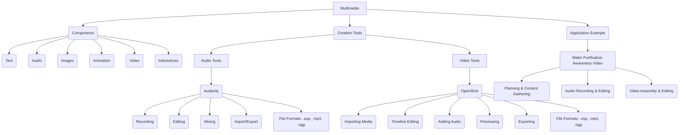

# Class 9 Ict - Ict Chapter 03
**Language:** English

```markdown
# [Class 9] Ict - Chapter 03 (Based on provided text: Chapter 4 - Creating Audio-Video Communication)

## 🌟 Core Concepts

This chapter introduces the creation and editing of audio and video resources, moving beyond static images.

1.  **Multimedia:**
    *   Definition: Use of more than one medium of expression (text, audio, images, animation, videos, interactives).
    *   Contrast: Different from traditional printed or hand-produced material.
    *   Content: Information expressed through media (speech, writing, art).
    *   Interactives: Two-way communication involving user interaction and feedback.
2.  **Audio Creation & Editing:**
    *   Purpose: Enhancing communication, creating impactful resources.
    *   Recording Devices: Analog vs. Digital (e.g., Smartphone, Laptop Audio Interface, Recorders).
    *   **Audacity (Free Open Source Software):**
        *   Functionality: Recording, editing, importing/exporting audio, mixing tracks, adding effects, using multiple tracks.
        *   Interface Basics: File Menu (New), Tracks Menu (Add New), Recording Controls (Record, Stop), Selection Tool, Edit Menu (Delete).
        *   Process:
            *   Start New Project.
            *   Add Track(s).
            *   Record Narration (using microphone).
            *   Edit: Remove unwanted sounds (coughing, fumbles) using Selection Tool & Delete.
            *   Import Music/Sound Effects: File -> Import -> Audio.
            *   Mix Tracks: Tracks Menu -> Mix.
            *   Save Project: Default `.aup` format (editable).
            *   Export Audio: Convert to usable formats like `.mp3` or `.ogg` (File -> Export).
3.  **Video Creation & Editing:**
    *   Purpose: Combining various media (video footage, images, audio) for comprehensive communication.
    *   Planning: Defining topic, collecting information (text, images, video clips), scripting audio narration.
    *   **OpenShot Video Editor (Free Open Source Software):**
        *   Functionality: Importing media, arranging clips on a timeline, adding audio, previewing, exporting video.
        *   Interface Basics: Project Files window, Timeline (Tracks), Preview Window, Toolbar (Save, Export).
        *   Process:
            *   Organize: Collect all video files, images, audio narration in one place.
            *   Import Files: Add video clips, images, audio files to the Project Files window (using Import button or Ctrl+F).
            *   Arrange on Timeline:
                *   Drag and drop images/video clips onto tracks (e.g., Track 2). Sequence can be rearranged.
                *   Alternatively, use 'Add to Timeline' option.
            *   Add Audio: Drag audio file (e.g., background music, narration) onto a separate track (e.g., Track 1).
            *   Preview: Use the Play button in the Preview Window to check the video.
            *   Save Project: Default `.osp` format (editable) using Save icon or Ctrl+S.
            *   Export Video: Convert to usable formats like `.mp4` or `.ogg` (using Export button).
4.  **File Formats:**
    *   Audio Project (Editable): `.aup` (Audacity)
    *   Audio Export (Usable): `.mp3`, `.ogg`
    *   Video Project (Editable): `.osp` (OpenShot)
    *   Video Export (Usable): `.mp4`, `.ogg`

📊 **Concept Hierarchy:**



## 📘 Key Learnings

**1. Understanding Multimedia:**
Multimedia enhances communication by combining different media types like text, audio, images, animation, and video. Unlike static print materials, it can be interactive and more engaging. The chapter uses the example of creating a resource about water purification to illustrate the power of multimedia.

**2. Planning a Multimedia Project:**
Creating effective multimedia content requires planning. As demonstrated by the students (Neer, Nancy, Raima), the process involves:
*   **Defining the Topic:** E.g., 'Waterborne diseases and their prevention.'
*   **Content Gathering:** Collecting relevant information (facts about water pollution, diseases, purification methods) from various sources (library books, expert interviews like talking to a doctor, teacher guidance).
*   **Media Collection:** Gathering or creating necessary media elements (text notes, images, recording video footage of activities like water purification techniques).
*   **Scripting:** Writing the audio narration based on collected information.
*   **Assigning Roles:** Deciding who will perform specific tasks (research, interviews, recording).

**3. Creating and Editing Audio with Audacity:**
Audacity is a free tool for working with audio.
*   **Recording:** You can record voice narration using a built-in or external microphone. It's important to maintain silence during recording. Use the Red record button to start and the Stop button (or Space Bar) to finish.
*   **Editing:** Unwanted sounds (like coughs, pauses, mistakes) can be removed. Use the **Selection Tool** to highlight the unwanted part and press **Delete** or use the Edit menu.
*   **Adding Music/Effects:** Import existing audio files (like background music) using `File -> Import -> Audio`. They appear on a new track.
*   **Mixing:** Combine multiple tracks (e.g., narration and background music) using the `Tracks -> Mix` option.
*   **Saving vs. Exporting:**
    *   Save the project as an `.aup` file (`File -> Save Project`). This keeps all tracks separate and allows future editing.
    *   Export the final audio into a standard format like `.mp3` or `.ogg` (`File -> Export`) to use it in presentations, videos, or play it on standard players.

📈 **Audacity Workflow Diagram:**

```mermaid
graph LR
    A[Start New Project] --> B(Add Track);
    B --> C{Record Audio?};
    C -- Yes --> D[Record Narration];
    C -- No --> E[Import Audio File];
    D --> F(Edit Audio - Remove Noise/Errors);
    E --> F;
    F --> G{Add More Tracks?};
    G -- Yes --> B;
    G -- No --> H(Mix Tracks);
    H --> I[Save Project (.aup)];
    H --> J[Export Audio (.mp3/.ogg)];
```

**4. Creating and Editing Video with OpenShot:**
OpenShot is a free tool for editing videos.
*   **Importing Media:** Add your video clips, images, and audio files into the 'Project Files' window using the Import button or `Ctrl+F`.
*   **Using the Timeline:** The timeline is where you arrange your media. Drag and drop images, video clips, and audio files from 'Project Files' onto different **Tracks**. The order on the track determines the sequence in the final video. You can rearrange clips by dragging them.
*   **Adding Audio:** Drag an audio file (narration, music) onto a separate track in the timeline (often Track 1 or a lower track).
*   **Previewing:** Watch your video in the 'Preview Window' using the Play button to see how it looks and sounds.
*   **Saving vs. Exporting:**
    *   Save the project frequently as an `.osp` file (`File -> Save Project` or `Ctrl+S`). This preserves your editing work and allows you to make changes later.
    *   Export the final video into a standard format like `.mp4` or `.ogg` using the Export button. This creates a single video file playable on various devices and platforms.

📈 **OpenShot Workflow Diagram:**

```mermaid
graph LR
    A[Start New Project] --> B(Import Media - Video, Images, Audio);
    B --> C(Drag Media to Timeline Tracks);
    C --> D(Arrange Sequence of Clips);
    D --> E(Add Audio Track - Music/Narration);
    E --> F(Preview Video);
    F --> G{Make Changes?};
    G -- Yes --> C;
    G -- No --> H[Save Project (.osp)];
    H --> I[Export Video (.mp4/.ogg)];
```

## 🧩 Active Learning

*   **Activity: Research-based Case Study Analysis 🔍**
    *   **Scenario:** Imagine your school wants to create awareness about the importance of waste segregation and recycling. Following the steps outlined by Neer, Nancy, and Raima:
        1.  **Plan:** Define the exact message. What information is crucial? (Types of waste, segregation methods, benefits of recycling, local recycling facilities).
        2.  **Research:** Where would you gather information? (Municipal corporation website, environmental NGOs, science textbooks, interviews with sanitation workers or environmentalists).
        3.  **Content Creation:** What media would you create? (Short video interviews, photos of segregated waste bins, audio narration explaining the process, animated graphics showing the recycling loop).
        4.  **Tool Usage:** Outline the steps you would take in Audacity to record and clean the audio narration, and add background music. Outline the steps in OpenShot to combine video clips, images, and the final audio into a short awareness video.
        5.  **Evaluation:** How would you judge if your multimedia resource is effective? (Clarity of message, engagement level, accuracy of information).

*   **Discussion: Critical Analysis of Real-World Impacts 🌍**
    *   Consider the example of the 'Waterborne diseases and their prevention' video the students planned. Discuss the following:
        *   **Impact:** How might a video explaining water purification techniques be more impactful than just reading about it or seeing posters? (Visual demonstration, emotional connection through narration, wider reach via sharing).
        *   **Accessibility:** How does creating content in digital formats (audio/video) affect its accessibility compared to printed materials? Consider people with different literacy levels or visual impairments.
        *   **Credibility:** The students planned to talk to a doctor and consult teachers. Why is using credible sources important when creating informational multimedia content, especially on health topics?
        *   **Challenges:** What challenges might students face when creating such multimedia projects? (Access to devices/software, technical skills, time management, ensuring factual accuracy).
        *   **Evaluation:** How can multimedia projects like this contribute to achieving larger goals, such as improving public health outcomes related to waterborne diseases in a community or region?

## 📝 Assessment Prep

*   **Case Study 1: Creating an Audio Guide**
    *   **Scenario:** You need to create a short audio guide (2 minutes) explaining the key features of the Qutub Minar for tourists.
    *   **Task:**
        1.  List the steps you would take to plan and create this audio guide.
        2.  Which software discussed in the chapter would you use?
        3.  Describe how you would record the narration and add background instrumental music using this software. Mention specific menu options or tools (e.g., recording button, import audio, mix tracks).
        4.  What file format would you save the project in for future edits?
        5.  What file format(s) would you export the final audio guide in for easy sharing and playback?

*   **Case Study 2: Making a Video Tutorial**
    *   **Scenario:** Create a short video tutorial (1-2 minutes) demonstrating how to properly wash hands to prevent the spread of germs, using images, short video clips, and a voice-over.
    *   **Task:**
        1.  List the media elements you would need (images, video clips, audio narration).
        2.  Which video editing software mentioned in the chapter would you use?
        3.  Describe the process of importing these media elements into the software.
        4.  Explain how you would arrange the images and video clips on the timeline and add the audio narration track. Refer to concepts like 'Tracks' and 'Timeline'.
        5.  What file format is used for saving the editable video project?
        6.  What file format(s) would be suitable for exporting the final tutorial video for sharing online?

*   **Diagram/Tool Identification:**
    *   Identify the main components of the Audacity interface shown in Fig 4.1 (e.g., Menu bar, Transport toolbar, Tracks area).
    *   Identify the main components of the OpenShot interface shown in Fig 4.8 (e.g., Project Files, Preview Window, Timeline).
    *   Explain the purpose of the 'Export' function in both Audacity and OpenShot, contrasting it with the 'Save Project' function.

## 🌏 Bharatiya Context

*   **Public Health Awareness:** The central example of creating a multimedia project on **waterborne diseases (Diarrhoea, Dysentery, Typhoid Fever, Cholera, Hepatitis A, Jaundice)** and **water purification** is highly relevant to India. These diseases remain significant public health challenges in many parts of the country. Using accessible tools like Audacity and OpenShot empowers students and communities to create localized awareness materials in regional languages, potentially contributing to national health initiatives like the **Swachh Bharat Abhiyan** (Clean India Mission) which emphasizes sanitation and hygiene.
*   **Digital India Initiative:** Learning to create digital audio and video content aligns with the goals of the **Digital India** programme, which aims to empower citizens digitally. Skills in creating multimedia content are valuable for communication, education, and entrepreneurship in an increasingly digital nation.
*   **Accessibility of Tools:** The chapter focuses on **free and open-source software (FOSS)** like Audacity and OpenShot. This is particularly important in the Indian context, ensuring that students can learn and practice these skills without the barrier of expensive software licenses. Recording using readily available devices like **smartphones**, which have high penetration in India, further enhances accessibility for creating basic audio-visual content.
*   **Educational Content Creation:** These tools can be used to create educational resources relevant to the Indian curriculum and context, such as explaining concepts from science (like water purification), social studies (local history), or languages (storytelling, poetry recitation). This supports diverse learning needs and can make learning more engaging.
```