# Class 9 Ict - Ict Chapter 04
**Language:** English

```markdown
# [Class 9] Ict - Chapter 04: Creating Visual Communication

*(Note: The provided text refers to Chapter 3 content, but the request specifies Chapter 4. This summary follows the content provided, which focuses on image editing using GIMP.)*

## 🌟 Core Concepts

```mermaid
graph TD
    A[Image Manipulation using GIMP] --> B(GIMP Interface);
    A --> C(Basic Image Operations);
    A --> D(Image Enhancement);
    A --> E(Working with Layers);
    A --> F(Advanced Techniques);
    A --> G(File Management);

    B --> B1(Canvas);
    B --> B2(Toolbox);
    B --> B3(Layer Palette);

    C --> C1(Opening Images);
    C --> C2(Cropping);
    C --> C3(Copying & Pasting);
    C --> C4(Flipping);
    C --> C5(Rotating);
    C --> C6(Scaling);

    D --> D1(Brightness Adjustment);
    D --> D2(Clone Tool - Repairing/Removing);

    E --> E1(Creating New Layers);
    E --> E2(Duplicating Layers);
    E --> E3(Merging Layers);
    E --> E4(Layer Masks);
    E --> E5(Opacity Control);

    F --> F1(Creating Reflections);
    F --> F2(Adding Text with Effects);
    F --> F3(Creating Collages);

    G --> G1(Saving - .xcf format);
    G --> G2(Exporting - JPEG, PNG, TIFF);
    G --> G3(Understanding File Formats);
```



*   **GIMP (GNU Image Manipulation Program):** A powerful Free and Open Source Software (FOSS) for image editing, photo retouching, collage creation, and free-form drawing.
*   **Image Editing Fundamentals:** Techniques to modify and enhance digital images for clarity, composition, and specific requirements.
*   **Layers:** A fundamental concept in GIMP, allowing different elements of an image (or separate images) to be manipulated independently on transparent sheets stacked on top of each other within the canvas.
*   **Tools:** Specific functions within GIMP (like Crop, Scale, Clone, Text) used to perform distinct editing tasks.
*   **File Formats:** Different ways digital images are stored (e.g., GIMP's native .xcf, common formats like JPEG, PNG, TIFF), each with characteristics affecting quality, file size, and compatibility.

## 📘 Key Learnings

**1. Introduction to GIMP Environment:**
*   **GIMP:** A versatile multimedia tool for image manipulation. It's a Free and Open Source alternative, making it accessible.
*   **Canvas:** The primary workspace where images are opened, created, and modified. Its size is often measured in **pixels** (the smallest illuminated dots on a screen).
*   **Toolbox:** Contains various tools for selection, painting, transformation, etc. Tooltips appear on hovering, often showing shortcut keys. Pressing F1 provides help.
*   **Layers:** Images in GIMP are typically composed of layers. Each layer can hold a part of the image or a separate element. The Layer Palette helps manage these layers.

**2. Basic Image Modifications:**
*   **Opening an Image:** Use `File -> Open` to load an existing image onto the canvas.
*   **Cropping:** Removing unwanted outer areas of an image. Can be done using the Crop tool from the Toolbox or via `Tools -> Selection Tools -> Rectangle Select` followed by `Image -> Crop to Selection`. This improves composition and removes distractions.
    *   *Diagram Concept:* Show an image with dotted lines indicating the area to be kept, and the outer area greyed out or marked for removal.
*   **Copying and Pasting:** Images or parts of images can be copied and pasted, often into new layers (`Edit -> Paste as -> New Layer`) to duplicate elements or combine images. The Move Tool repositions elements.
*   **Flipping:** Creating a mirror image, either horizontally or vertically (`Tools -> Transform Tools -> Flip`). Useful for symmetrical arrangements or correcting orientation.
    *   *Diagram Concept:* Show an image and its horizontally flipped counterpart side-by-side.
*   **Rotating:** Turning an image around a central point by a specific angle (e.g., 90 degrees) (`Tools -> Transform Tools -> Rotate`).
    *   *Diagram Concept:* Show an image rotated 90 degrees clockwise.
*   **Scaling:** Resizing an image, which changes its pixel dimensions and file size. Scaling down reduces size, useful for web use or emailing. Can be done via `Tools -> Transform Tools -> Scale` or `Image -> Scale Image`.
    *   *Diagram Concept:* Show a large image and a smaller, scaled-down version, perhaps with pixel dimensions indicated.

**3. Enhancing Image Quality:**
*   **Brightness/Contrast:** Adjusting the lightness and intensity of an image (`Colors -> Brightness-Contrast`). Essential for correcting dull or poorly lit photos.
    *   *Diagram Concept:* Show a dull image side-by-side with a brightened version.
*   **Clone Tool:** Repairing imperfections or removing unwanted objects (like text on a board) by 'painting' over them with pixels copied from another area of the image (`Tools -> Paint Tools -> Clone`). Requires selecting a source point (Ctrl + Click) and then painting over the target area.
    *   *Diagram Concept:* Show an image with an unwanted element circled, then show the same image after using the Clone Tool, with the element seamlessly removed.

**4. Working with Layers for Complex Edits:**
*   **Creating Reflections:** A multi-step process involving:
    1.  Creating a new image with a transparent background.
    2.  Pasting the original image.
    3.  Duplicating the image layer.
    4.  Flipping the duplicate vertically.
    5.  Positioning the flipped image below the original.
    6.  Adding a Layer Mask (White) to the flipped layer.
    7.  Applying a Gradient (Blend Tool) to the mask to create a fading effect.
    8.  Adjusting opacity and merging layers (`Layer -> Merge Down`).
    *   *Diagram Concept:* A sequence showing the original image, the flipped duplicate below it, the gradient mask applied, and the final reflection effect.
*   **Adding Text with Effects:**
    1.  Create a new image canvas.
    2.  Use the Text Tool to add text (creates a new layer).
    3.  Apply filters for effects (e.g., `Filters -> Blur -> Gaussian Blur`, `Filters -> Render -> Clouds -> Plasma`, `Filters -> Map -> Bump Map`) often using intermediate layers ('New from Visible') and layer masks to isolate the effect on the text.
    *   *Diagram Concept:* Show plain text, then the text after applying plasma and bump map filters for a stylized look.

**5. Combining Images:**
*   **Creating a Collage:** Combining multiple images onto a single canvas. This involves:
    1.  Creating a new, larger canvas.
    2.  Opening individual images as new layers (`File -> Open as Layers`).
    3.  Using the Scale Tool and Move Tool to resize and position each image layer within the collage layout.
    *   *Diagram Concept:* Show multiple smaller images arranged aesthetically on a larger background canvas.

**6. File Management:**
*   **Saving:** GIMP's native format is `.xcf`, which preserves layers and other editing information but can result in large files. Use `File -> Save As`.
*   **Exporting:** To create standard image files for sharing or web use, export the image (`File -> Export As`) into formats like:
    *   **JPEG (.jpg):** Widely compatible, good compression (smaller file size), but lossy (some quality loss). Good for photographs.
    *   **PNG (.png):** Lossless compression (retains quality), supports transparency. Good for graphics, logos, images needing transparency. Can be larger than JPEG.
    *   **TIFF (.tif):** High quality, often lossless, supports layers. Results in very large files, used in professional printing/archiving.
*   **Resolution (PPI/DPI):** Pixels Per Inch (PPI) refers to screen resolution, while Dots Per Inch (DPI) refers to printer resolution. Higher values generally mean better quality but larger file sizes.

## 🧩 Active Learning

*   **Activity: Research-based Case Study Analysis 🔍**
    *   **Scenario:** Imagine the Ministry of Tourism, Government of India, wants to create a digital brochure promoting tourism in a lesser-known region (e.g., tribal areas of Chhattisgarh, wetlands of West Bengal, or historical sites in rural Rajasthan). They have collected photographs, but many are poorly lit, have distracting elements, or need resizing for the brochure layout.
    *   **Task:** As a digital media intern, you are given a set of 5 hypothetical images (describe them, e.g., a dull landscape, a portrait with unwanted background elements, a wide shot needing cropping, a detailed artifact needing focus, a group photo). Using the GIMP techniques learned (Brightness, Crop, Scale, Clone Tool, Layers):
        1.  **Evaluate:** Assess each image and identify the specific editing required to make it suitable for the brochure. Justify your assessment.
        2.  **Plan:** Outline the step-by-step process you would follow in GIMP for *two* of the images. Specify which tools you would use and why.
        3.  **Create:** (Optional, if GIMP is available) Perform the edits on sample images.
        4.  **Justify Export Format:** Decide whether JPEG or PNG would be more appropriate for the final images in the *digital* brochure and explain your reasoning based on quality, file size, and intended use.

*   **Discussion: Critical Analysis of Real-World Impacts 🌍**
    1.  **Ethics of Editing:** Discuss the ethical line in photo editing. When does enhancing an image (like the village mela photos) become misleading? Consider examples like advertisements, news photography, and social media. Is removing an "unknown person" from a photo (as in 'Do it yourself' exercise 2) always acceptable?
    2.  **FOSS in India:** GIMP is Free and Open Source Software (FOSS). How does the availability of powerful, free tools like GIMP impact digital literacy and skill development in India, especially in schools or small businesses with limited budgets? Compare this with the cost of proprietary software.
    3.  **Visual Communication & Economy:** How do skills in creating visual communication (editing photos, making collages, adding text effects) contribute to the modern Indian economy? Think about fields like digital marketing, e-commerce (product photos), media, education, and personal branding.

## 📝 Assessment Prep

*   **Case Study 1:** A student documented their school's Annual Sports Day. The photos include: (a) A winning moment captured from far away, needing cropping and possibly brightening. (b) A group photo where a banner in the background has text from a previous event. (c) Several action shots that need to be combined into a collage for the school newsletter.
    *   **Task:** Describe the GIMP tools and steps needed to prepare these images for the newsletter. Explain how you would remove the incorrect text on the banner using the Clone Tool. Detail the process of creating the collage using layers, scaling, and positioning.
*   **Case Study 2:** You need to create a simple logo (as text) for a local handicraft initiative, "Gram Kala". The logo needs to look visually interesting and be usable on a website.
    *   **Task:** Outline the steps in GIMP to create the text "Gram Kala", apply a visual effect (like Bump Map or a simple gradient), ensure the background is transparent, and export it in a suitable format (like PNG) for web use. Justify your choice of export format.
*   **Diagram Interpretation:**
    *   *(Present a diagram showing the Layer Palette with multiple layers, some visible, some hidden, one with a layer mask)*: Explain what this Layer Palette indicates. What would happen if you merged the visible layers? What is the purpose of the layer mask shown?
    *   *(Present a diagram illustrating the Clone Tool being used - source point selected, painting over an unwanted object)*: Describe the process being shown and the purpose of the Clone Tool in this context. What does the user need to do before starting to paint with the Clone tool?

## 🌏 Bharatiya Context

*   **Documenting Local Culture:** The scenario of Samayra and Shirom photographing a **village mela** highlights how image editing skills can be used to document and share vibrant aspects of Indian culture and traditions effectively. Similarly, creating collages of **festival celebrations** at home (Exercise 3) helps preserve and share personal and community heritage.
*   **Digital India & Skill Development:** GIMP, being FOSS, aligns well with the objectives of **Digital India**. It provides access to powerful digital tools without cost barriers, enabling students and citizens across different economic strata to acquire valuable digital skills. Government schools and skill development centres can leverage such tools extensively. For instance, the **National Institute of Electronics & Information Technology (NIELIT)** often incorporates FOSS in its digital literacy programs.
*   **Economic Relevance:** In India's growing digital economy, skills in image manipulation are increasingly important.
    *   **E-commerce:** Small businesses and artisans using platforms like the **Government e-Marketplace (GeM)** or private e-commerce sites need good product photos, often requiring editing for clarity and appeal.
    *   **Media & Communication:** News portals, social media influencers, and digital marketing agencies rely heavily on visually compelling content, demanding image editing proficiency. Data from Statista indicates rapid growth in digital advertising spending in India, much of which is visual.
    *   **Education & Information:** Creating clear diagrams, enhancing images for presentations, and developing informative visuals are crucial in online education and public information campaigns (e.g., health awareness posters by the **Ministry of Health and Family Welfare**).
*   **Data Representation:** While this chapter focuses on editing photos, the principles of visual clarity and composition are essential when creating charts or infographics to represent **national economic or social data** (e.g., literacy rates from the National Family Health Survey (NFHS), GDP growth figures from the National Statistical Office (NSO)). Clear visuals make complex data more understandable to a wider audience.
```