# Class 9 Ict - Ict Chapter 04
**Language:** English

```markdown
# [Class 9] Ict - Chapter 04: Creating Visual Communication

*(Note: The provided text is labelled Chapter 3 internally, but the user request specified Chapter 4. This summary follows the content provided, which focuses on Image Manipulation using GIMP.)*

## 🌟 Core Concepts

```mermaid
graph TD
    A[Image Manipulation using GIMP] --> B(GIMP Basics);
    A --> C(Image Editing Operations);
    A --> D(Image Transformation);
    A --> E(Image Enhancement);
    A --> F(Layer Management);
    A --> G(Advanced Techniques);
    A --> H(File Handling);

    B --> B1(GIMP Interface: Canvas, Toolbox, Layers Palette);
    B --> B2(Understanding Pixels & Resolution - DPI/PPI);

    C --> C1(Cropping: Removing Unwanted Areas);
    C --> C2(Copying & Pasting Images);

    D --> D1(Flipping: Horizontal/Vertical Mirroring);
    D --> D2(Rotating: Changing Orientation);
    D --> D3(Scaling: Resizing Images);

    E --> E1(Brightness/Contrast Adjustment);
    E --> E2(Clone Tool: Repairing/Removing Elements);

    F --> F1(Adding New Layers);
    F --> F2(Duplicating Layers);
    F --> F3(Moving Layers);
    F --> F4(Layer Masks: Selective Editing);
    F --> F5(Merging Layers);
    F --> F6(Layer Opacity);

    G --> G1(Creating Reflections);
    G --> G2(Adding Text & Effects - Blur, Plasma, Bump Map);
    G --> G3(Creating Collages);

    H --> H1(Opening Images);
    H --> H2(Creating New Images);
    H --> H3(Saving: Native .xcf Format);
    H --> H4(Exporting: JPEG, PNG, TIFF Formats);
```



*   **GIMP (GNU Image Manipulation Program):** A powerful Free and Open Source Software (FOSS) for tasks like photo editing, creating compositions, and image authoring.
*   **Canvas:** The primary workspace where images are opened, created, and modified.
*   **Layers:** Images in GIMP are typically composed of multiple layers stacked upon each other. Editing can be done on individual layers without affecting others.
*   **Pixels:** The smallest individual dots of colour that make up a digital image. Image size is often measured in pixels (width x height).
*   **Resolution (DPI/PPI):** Dots Per Inch (DPI) relates to printer output quality, while Pixels Per Inch (PPI) relates to screen display density. Higher values generally mean better quality but larger file sizes.
*   **Image Manipulation:** The process of altering an image using various tools and techniques like cropping, scaling, rotating, adjusting colours, and combining multiple images.

## 📘 Key Learnings

**1. Introduction to GIMP Environment:**
*   GIMP provides a versatile environment for image editing. Key components include the **Canvas** (main editing area), the **Toolbox** (containing tools for selection, painting, transformation, etc.), and the **Layers Palette** (for managing image layers).
*   GIMP's native file format is **.xcf**, which preserves layer information but can be large. For sharing or web use, images are typically **exported** to formats like **JPEG** (good compression, widely compatible), **PNG** (good quality, supports transparency), or **TIFF** (high quality, often used in printing).

**2. Basic Image Operations:**
*   **Opening Images:** Use `File -> Open` to load existing image files onto the canvas.
*   **Creating New Images:** Use `File -> New` to create a blank canvas, specifying dimensions (width, height in pixels) and background (e.g., white, black, transparent).
*   **Cropping:** Removing unwanted portions of an image. Select the **Crop Tool** from the Toolbox, drag to define the desired area, and press Enter. Alternatively, use a selection tool (like Rectangle Select) and then `Image -> Crop to Selection`.
    *   *Diagram Concept:* Imagine a photo with extra space on the sides; cropping removes this space, focusing on the main subject.

**3. Image Transformations:**
*   **Copying & Pasting:** Duplicate parts of an image or entire images. Often involves pasting `As New Layer` (`Edit -> Paste As -> New Layer`) to keep elements separate.
*   **Flipping:** Creating a mirror image. Use the **Flip Tool** (`Tools -> Transform Tools -> Flip`) to flip horizontally or vertically. Often done on a duplicated layer to preserve the original.
*   **Rotating:** Changing the image's orientation. Use the **Rotate Tool** (`Tools -> Transform Tools -> Rotate`) to rotate by specific degrees (e.g., 90°, 180°) or freely.
*   **Scaling:** Resizing an image (changing its pixel dimensions). Use `Image -> Scale Image` or the **Scale Tool** (`Tools -> Transform Tools -> Scale`). Scaling down reduces file size but also detail.
    *   *Diagram Concept:* Show an image shrinking or enlarging, with its pixel dimensions changing (e.g., 800x600px scaled down to 400x300px).

**4. Enhancing Image Appearance:**
*   **Brightness & Contrast:** Adjusting the tonal range to make images clearer or more impactful. Useful for correcting dull or poorly lit photos. Access via `Tools -> Color Tools -> Brightness-Contrast`.
*   **Clone Tool:** Repairing imperfections or removing unwanted objects by 'painting' over them with pixels copied from another area (the source). Select the **Clone Tool** (`Tools -> Paint Tools -> Clone`), `Ctrl+Click` on the source area, then paint over the target area. Adjust brush size and opacity for natural results.
    *   *Diagram Concept:* Show a pointer selecting a 'good' texture area (Ctrl+Click), then another pointer painting over an unwanted spot using that texture.

**5. Working with Layers:**
*   Layers are fundamental to complex editing. They allow non-destructive modifications.
*   **Adding/Duplicating:** Create new blank layers (`Layer -> New Layer`) or copies of existing ones (`Right-click layer -> Duplicate Layer`).
*   **Managing:** Use the Layers Palette (`Windows -> Dockable Dialogs -> Layers`) to select, reorder, show/hide, lock, and delete layers.
*   **Layer Masks:** Control the visibility of parts of a layer. Add a mask (`Right-click layer -> Add Layer Mask`), then paint on the mask (black hides, white reveals, grey is semi-transparent). Used for effects like reflections or seamless blending.
*   **Merging:** Combine multiple layers into one (`Right-click layer -> Merge Down`). This makes changes permanent on the merged layer.
*   **Opacity:** Control the transparency of a layer using the Opacity slider in the Layers Palette.

**6. Advanced Techniques:**
*   **Creating Reflections:** Involves duplicating the object's layer, flipping the duplicate vertically, positioning it below the original, adding a layer mask to the flipped layer, applying a gradient (e.g., white-to-transparent) to the mask using the **Blend Tool**, and adjusting opacity for a realistic effect.
*   **Adding Text & Effects:** Use the **Text Tool** to add text (creates a new text layer). Apply various filters for effects:
    *   `Filters -> Blur -> Gaussian Blur`: Softens the text.
    *   `Filters -> Render -> Clouds -> Plasma`: Creates a colourful, cloud-like pattern (can be used as a texture).
    *   `Filters -> Map -> Bump Map`: Creates a 3D lighting effect using another layer/channel as a height map. Combining these with layer masks can create sophisticated text styles.
*   **Creating Collages:** Combine multiple images onto a single canvas. Open the first image, then add others using `File -> Open as Layers`. Use the **Move Tool** and **Scale Tool** on each layer to arrange and resize the images into a composition.

## 🧩 Active Learning

*   **Activity: Research-based Case Study Analysis 🔍**
    *   **Task:** Find a publicly available dataset related to an Indian economic or social indicator (e.g., literacy rate changes over decades from Census data, state-wise agricultural output from Ministry of Agriculture reports, or renewable energy adoption trends from Ministry of New and Renewable Energy). The data might be in a table or a basic chart.
    *   **Objective:** Use GIMP to create a visually compelling graphic presenting this data. This could involve:
        1.  Taking a screenshot of a basic chart or creating a simple visual representation (e.g., bar graph elements).
        2.  Importing relevant images (e.g., icons representing education, farming, solar panels).
        3.  Using GIMP tools to enhance clarity (brightness/contrast), crop unnecessary elements, add clear text labels/titles with effects, and arrange elements into an informative collage or infographic.
        4.  Export the final image as a JPEG or PNG.
    *   **Evaluation:** Assess the clarity, visual appeal, and accuracy of the final graphic in communicating the chosen data.

*   **Discussion: Critical Analysis of Real-World Impacts 🌍**
    *   **Topic:** The Ethics and Impact of Image Manipulation in Presenting Economic and Social Data.
    *   **Prompts:**
        1.  How can tools like GIMP be used ethically to *clarify* complex data (e.g., highlighting trends in poverty reduction data from NITI Aayog reports)?
        2.  Conversely, how could image manipulation be used unethically to *mislead* the public regarding economic performance or social issues in India (e.g., selectively cropping graphs, altering colours to evoke specific emotions, removing context)?
        3.  Discuss examples where visual presentation significantly influenced public perception of government schemes or economic reports (e.g., visualisations of infrastructure projects, employment statistics).
        4.  What responsibility do creators have to ensure the visualisations they produce using tools like GIMP are accurate and not misleading, especially when dealing with sensitive national data?
        5.  How can viewers become more critical consumers of visually presented data, particularly in online media and advertisements?

## 📝 Assessment Prep

*   **Case Study 1: Enhancing Festival Imagery**
    *   **Scenario:** You have a photograph taken during a dimly lit Diwali celebration at home. The picture is dull, and there's an unwanted object (e.g., a messy corner) visible.
    *   **Task:** Describe the steps you would take in GIMP to:
        1.  Improve the brightness and contrast to make the festive lights vibrant.
        2.  Crop the image to remove the distracting object and improve composition.
        3.  Add a text caption like "Diwali Celebrations 2024" with a subtle glow effect.
        4.  Save the original .xcf file and export a final JPEG version suitable for sharing.

*   **Case Study 2: Creating an Informative Graphic**
    *   **Scenario:** You need to create a simple visual for a school project comparing the population density of two major Indian cities (e.g., Mumbai vs. Delhi) based on recent census data.
    *   **Task:** Explain how you would use GIMP to:
        1.  Create a new canvas.
        2.  Use basic shapes or imported icons to represent the cities.
        3.  Add text labels with the city names and population density figures.
        4.  Potentially use colour (e.g., Bucket Fill) or simple visual cues to suggest density differences.
        5.  Ensure all elements are aligned and clearly presented.

*   **Diagram Task:**
    *   Draw a simple block diagram illustrating the concept of layers in GIMP. Show a background layer, a layer with an image (e.g., the Taj Mahal), and a text layer on top. Label each layer.
    *   Draw a flowchart outlining the basic steps involved in using the Clone Tool to remove a small unwanted element from a photograph.

## 🌏 Bharatiya Context

*   **Village Mela Example:** The chapter uses the scenario of photographing a "village mela" (fair) as a practical starting point for needing image editing, reflecting a common cultural event in India.
*   **Festival Collages:** GIMP skills can be directly applied to create vibrant collages showcasing celebrations of diverse Indian festivals like Holi, Eid, Christmas, Pongal, or Durga Puja, combining multiple photos into a single shareable image.
*   **Enhancing Heritage Site Photos:** Tourists often take photos of India's rich heritage sites (e.g., Qutub Minar, Ajanta Caves, Hampi ruins). GIMP can be used to enhance these photos – correcting perspective, improving colours, removing distracting elements, or adding informative captions.
*   **Visualising National Data:** As explored in the Active Learning section, GIMP is a valuable tool for students and professionals to create clearer visualisations of data from Indian sources like the National Statistical Office (NSO), Reserve Bank of India (RBI), or various Ministries, making complex information about India's economy and society more accessible. For instance, creating infographics about literacy rates, agricultural production, or progress in government initiatives like 'Digital India'.
```