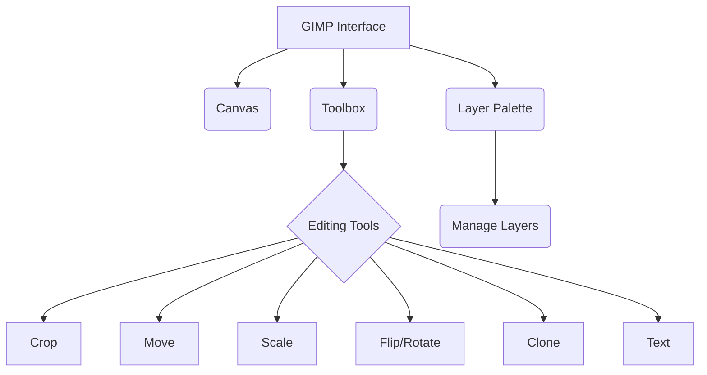
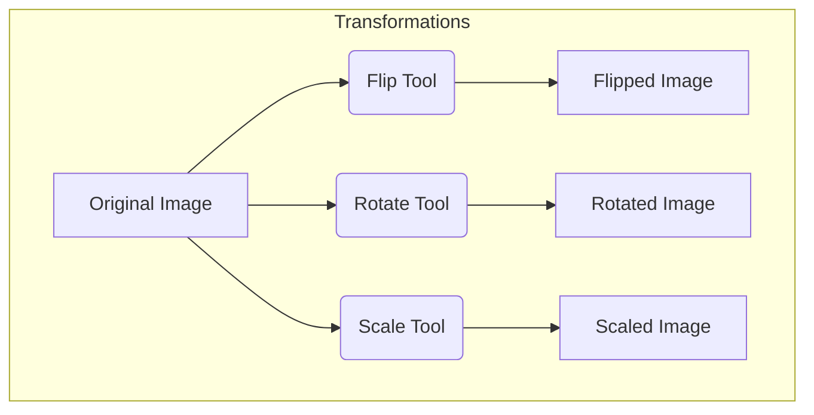

# Class 9 Ict - Ict Chapter 04
**Language:** English

```markdown
# [Class 9] Ict - Chapter 04

*(Note: The content below is based on the provided text labelled "Chapter 3: Creating Visual Communication" in the source material, as requested by the prompt's structure for Chapter 04.)*

## 🌟 Core Concepts

This chapter introduces the fundamentals of digital image editing using a Free and Open Source Software (FOSS) tool, GIMP (GNU Image Manipulation Program). It focuses on manipulating and enhancing images for visual communication.

1.  **Introduction to Image Editing**
    *   Need for Image Editing (Enhancing dull/unfocused photos)
    *   Software Tools: Graphics Editors (e.g., GIMP)
    *   Availability: Desktop Software & Smartphone Apps
2.  **GIMP Interface & Basics**
    *   GIMP: FOSS Multimedia Tool
    *   Core Components:
        *   **Canvas:** The primary workspace for image manipulation.
        *   **Toolbox:** Contains various tools for editing (Selection, Paint, Transform, etc.).
        *   **Layers:** Stacking individual image components for complex compositions.
        *   **Layer Palette:** Dialog for managing layers.
    *   Basic Operations: Opening Images, Creating New Canvas (specifying size in pixels).
    *   File Format: Native format `.xcf`.
3.  **Basic Image Manipulation Techniques**
    *   **Cropping:** Removing unwanted portions of an image.
    *   **Layers:** Adding, duplicating, and managing layers for non-destructive editing and composition.
    *   **Transformations:**
        *   **Copying & Pasting:** Duplicating image elements.
        *   **Moving:** Repositioning elements within the canvas.
        *   **Flipping:** Creating a mirror image (horizontal/vertical).
        *   **Rotating:** Changing the orientation of an image.
        *   **Scaling:** Resizing an image (changing pixel dimensions); understanding PPI/DPI.
4.  **Image Enhancement & Repair**
    *   **Brightness/Contrast:** Adjusting tonal values to improve clarity and visual appeal.
    *   **Reflection Effect:** Creating a simulated reflection using layers, masks, and blend tools.
    *   **Clone Tool:** Repairing imperfections or removing unwanted objects by copying pixels from another area.
5.  **Adding Text & Effects**
    *   **Text Tool:** Adding textual elements to images.
    *   **Text Effects:** Applying filters (e.g., Blur, Plasma, Bump Map) and using layer masks for creative text designs.
6.  **Composition & Output**
    *   **Collage Creation:** Combining multiple images into a single composition on one canvas.
    *   **Saving & Exporting:**
        *   Saving work in progress (`.xcf`).
        *   Exporting final images to standard formats (JPEG, PNG, TIFF) for sharing and printing, considering quality and file size trade-offs.

## 📘 Key Learnings

**1. Understanding GIMP Environment:**
GIMP is a powerful Free and Open Source tool for image editing. Key interface elements include the **Canvas** (your digital drawing board), the **Toolbox** (holding tools like Crop, Move, Scale, Text, Clone), and the **Layer Palette** (for managing image layers). An image's size is measured in **pixels**, the smallest dots on a screen. GIMP's native file format is `.xcf`, which preserves layers and editing information.

**Diagrammatic Representation (Conceptual):**


**2. Essential Image Editing Operations:**

*   **Opening & Selecting:** Open existing images (`File > Open`). When selecting pictures, consider clarity, content relevance, and size.
*   **Cropping:** To remove unwanted edges or areas, use the **Crop Tool** from the Toolbox or select an area and use `Image > Crop to Selection`. (Ref: Fig 3.4)
*   **Working with Layers:** Layers allow you to work on parts of an image independently. Create new layers (`Layer > New Layer`), duplicate existing ones, and paste content into new layers (`Edit > Paste as > New Layer`). Use the **Move Tool** to position elements on different layers. (Ref: Fig 3.6)

**3. Transforming Images:**

*   **Flipping:** Create a mirror image using the **Flip Tool**. You can flip horizontally or vertically. (Ref: Fig 3.8, 3.9)
*   **Rotating:** Change the image orientation using the **Rotate Tool**. (Ref: Fig 3.10)
*   **Scaling:** Resize an image using `Image > Scale Image` or `Tools > Transform Tools > Scale`. Scaling down reduces the number of pixels and file size, useful for emails or web use. (Ref: Fig 3.11a, 3.11b)

**Diagrammatic Representation (Conceptual):**


**4. Enhancing and Repairing Images:**

*   **Brightness:** Improve dull images using brightness/contrast adjustment tools (conceptually shown in Fig 3.12).
*   **Clone Tool:** Remove unwanted objects (like text on a board in Fig 3.23) or repair damaged areas. Select the **Clone Tool**, press `Ctrl` and click on a source area, then paint over the area to be fixed. (Ref: Fig 3.24)

**5. Adding Text and Creating Effects:**

*   Use the **Text Tool** to add captions or titles. Set foreground/background colours for visibility. Text is added on a new layer.
*   Apply effects using the `Filters` menu (e.g., `Filters > Blur > Gaussian Blur`, `Filters > Render > Clouds > Plasma`, `Filters > Map > Bump Map`) combined with layer masks for sophisticated results. (Ref: Fig 3.19 - 3.22)

**6. Creating Collages:**

*   Start with a new canvas. Open images as layers (`File > Open as Layers`).
*   Use the **Scale Tool** and **Move Tool** on each layer to resize and position the images within the canvas to create a composite image or collage. (Ref: Fig 3.25a, 3.25b)

**7. Saving and Exporting:**

*   Save your project frequently using `File > Save As` (saves as `.xcf`).
*   To create standard image files for sharing, use `File > Export As`. Choose formats like **JPEG** (good compression, widely used), **PNG** (good quality, supports transparency), or **TIFF** (high quality, large size). Adjust quality settings during export as needed.

## 🧩 Active Learning

*   **Activity: Research-based Case Study Analysis 🔍**
    *   **Case Study:** Imagine you are documenting a local government initiative promoting digital literacy in rural India using photographs. The initial photos are poorly lit and contain distracting background elements.
    *   **Task:** Research specific GIMP tools (Brightness/Contrast, Levels, Curves, Crop, Clone/Heal tool). Prepare a step-by-step plan outlining how you would use these tools to:
        1.  Improve the brightness and clarity of the photos.
        2.  Remove distracting elements to focus on the core message (people learning).
        3.  Create a small, informative collage showcasing the initiative's progress for a presentation.
    *   **Evaluation:** Justify your choice of tools and export format (e.g., JPEG for web, PNG for presentation slides) based on the intended use.

*   **Discussion: Critical Analysis of Real-world Impacts 🌍**
    *   **Topic:** The Ethics and Impact of Image Manipulation.
    *   **Prompts:**
        1.  Discuss scenarios where using the **Clone Tool** or other manipulation techniques might be considered unethical (e.g., altering news photographs, misrepresenting product features).
        2.  How can manipulated images affect the perception of social issues or economic data presented visually? (e.g., making poverty seem less severe, exaggerating infrastructure development).
        3.  Evaluate the importance of transparency and disclosure when digitally altered images are used in public communication, especially concerning data from sources like the National Statistical Office (NSO) or Reserve Bank of India (RBI). Should there be standards for indicating image manipulation?

## 📝 Assessment Prep

*   **Case Study 1: The Village Fair Report**
    *   **Scenario:** Samayra and Shirom's photos from the village fair (like the one in Fig 3.1) are dull and have unwanted areas (Fig 3.3). They need to create a visually appealing collage for a newspaper article.
    *   **Task:** Describe the sequence of GIMP operations Shirom would perform, including: Opening the image, Cropping (Fig 3.4), Adjusting Brightness (Fig 3.12), potentially using Layers (Fig 3.6) for composition, and finally combining images into a Collage (Fig 3.25). Explain *why* each step is necessary.
*   **Case Study 2: Removing Unwanted Elements**
    *   **Scenario:** You have a group photograph taken during a school event celebrating 'Ek Bharat Shreshtha Bharat', but an unknown person is visible in the corner.
    *   **Task:** Explain how you would use the **Clone Tool** (Fig 3.23, 3.24) in GIMP to remove the unwanted person while maintaining a natural look. What challenges might you face, and how would you address them (e.g., matching textures, adjusting brush size/opacity)?
*   **Diagram Analysis:**
    *   Be prepared to identify tools in the GIMP Toolbox (Fig 3.5).
    *   Understand diagrams illustrating processes like Scaling (Fig 3.11a/b), Layer management (Fig 3.16, 3.17, 3.20), and applying effects (Fig 3.21). Explain what is happening in each diagram.

## 🌏 Bharatiya Context

1.  **Documenting Local Culture:** The initial scenario involves capturing images at a **village mela (fair)**, a common cultural event across India. GIMP skills allow students to better document and share experiences from such local events.
2.  **Festival Collages:** The "Do it yourself" exercise suggests creating a collage for a **festival celebrated at home**. This directly connects the learned skills to personal cultural expression, relevant to India's diverse festivals (e.g., Diwali, Eid, Holi, Pongal).
3.  **Visualizing National Data:** While the chapter focuses on photo editing, these skills are transferable. Imagine using GIMP to enhance charts or create infographics based on **Indian economic or social data**. For example, creating visually engaging graphics to represent literacy rates from the National Family Health Survey (NFHS), agricultural production statistics from the Ministry of Agriculture & Farmers Welfare, or visualizing state-wise contributions to India's GDP using data from government portals like `data.gov.in`. Clear visual presentation makes complex national data more accessible.
4.  **Skill Development for Digital India:** Proficiency in tools like GIMP contributes to digital literacy, aligning with the goals of the **Digital India** initiative, empowering students with skills relevant in various digital communication fields.
```