# Class 9 Ict - Ict Chapter 07
**Language:** English

```markdown
# [Class 9] Ict - Chapter 07: Safety and Security in the Cyber World

## 🌟 Core Concepts

```mermaid
graph TD
    A[Cyber World Safety & Security] --> B(Understanding the Cyber World);
    A --> C(Email Security);
    A --> D(Social Networking Security);
    A --> E(Cyberbullying);
    A --> F(Digital Footprint);
    A --> G(Identity Theft);

    B --> B1(Parallel to Real World: Need for Caution);
    B --> B2(Sharing & Accessing Resources);
    B --> B3(Connecting & Interacting);

    C --> C1(Spam Mails);
    C --> C2(Phishing);
    C --> C3(Protection Strategies);

    D --> D1(Creating Accounts Safely);
    D --> D2(Privacy Settings);
    D --> D3(Safe Communication & Sharing);
    D --> D4(Password Security);

    E --> E1(Definition & Forms);
    E --> E2(Impact);
    E --> E3(Response Strategies: Do Not Respond, Screenshot, Block/Report, Talk, Be Private, Be Aware);

    F --> F1(Definition: Online Trail);
    F --> F2(Persistence of Information);

    G --> G1(Definition: Using Someone Else's Identity);
    G --> G2(Prevention: Password Security, Limit Personal Info Sharing);

    C1 --> C1a(Characteristics: Unknown Sender, Lucrative Offers, Malicious Intent);
    C2 --> C2a(Methods: Fake Websites, Malicious Links/Attachments);
    C2 --> C2b(Goal: Steal Sensitive Info - Usernames, Passwords, Financial Details);

    D3 --> D3a(Avoiding Oversharing: Personal Details, Photos, Plans);
    D3 --> D3b(Protecting Friends' Privacy);
    D3 --> D3c(Verifying Information Before Forwarding);

    E1 --> E1a(Nasty Comments);
    E1 --> E1b(Fake Profiles/Defamation);
    E1 --> E1c(Threats/Abuse);
    E1 --> E1d(Exclusion);
    E1 --> E1e(Unauthorized Photo Sharing);
    E1 --> E1f(Rumors/Lies);
    E1 --> E1g(Account Hijacking);
```



*   **Cyber World:** The online environment where users interact, share, and access information via the Internet. Requires caution similar to the real world.
*   **Digital Footprint:** The trail of data left behind by a user's online activity. This information can persist online indefinitely.
*   **Email Security:** Protecting oneself from threats transmitted via email.
    *   **Spam:** Unsolicited and often unwanted emails, frequently sent with malicious intent (e.g., fake lottery wins, dubious offers).
    *   **Phishing:** Fraudulent attempts to obtain sensitive information (usernames, passwords, credit card details) by disguising as a trustworthy entity in electronic communication. Often involves fake websites or malicious links/attachments.
*   **Social Networking Security:** Practices to ensure safety while using social media platforms.
    *   **Privacy Settings:** Controls determining who can see the information shared on a profile.
    *   **Identity Theft:** Deliberately using someone else's identity, often for financial gain or to cause reputational damage.
*   **Cyberbullying:** Using electronic communication to bully a person, typically by sending messages of an intimidating or threatening nature, spreading rumors, or sharing embarrassing content.
*   **Malware:** Malicious software designed to harm or exploit any programmable device, service or network (e.g., viruses).

## 📘 Key Learnings

**1. Navigating the Cyber World Safely:**
Just as we learn safety rules for the real world, navigating the internet (the "cyber world") requires specific precautions. We share information, connect with people, and access resources online, creating a digital footprint.

**2. Email Security: Recognizing and Avoiding Threats**
Email is a common tool, but it's also a channel for threats.

*   **Spam Mails:**
    *   **What:** Unsolicited emails, often from unknown senders.
    *   **Intent:** Can be harmless advertising, but often malicious, aiming to trick users.
    *   **Red Flags:** Offers that seem too good to be true (e.g., winning a lottery you didn't enter, free expensive items - Fig 7.2, 7.3), urgent calls to action, poor grammar/spelling (e.g., incorrect spelling in sender's ID - Activity 1), requests for personal information.
    *   **Action:** Ignore, delete, and do not reply or forward.

*   **Phishing:**
    *   **What:** Attempts to steal sensitive data (login credentials, bank details) by impersonating legitimate organizations (banks, government agencies, etc.).
    *   **Methods:** Emails containing links to fake websites that mimic real ones (Fig 7.4), or attachments containing malware.
    *   **Red Flags:** Requests for account verification or personal details via email, suspicious URLs (always check the address bar carefully - look for `https://` and verify the domain name), urgent warnings about account security.
    *   **Action:** Do not click links or download attachments from suspicious emails. Verify requests through official channels (e.g., visit the bank's official website directly, not via the email link).

    ```mermaid
    graph LR
        A[Receive Email] --> B{Is Sender Known & Trusted?};
        B -- Yes --> C{Is Content Expected/Reasonable?};
        B -- No --> D[Treat as Suspicious];
        C -- Yes --> E[Proceed Cautiously];
        C -- No --> D;
        D --> F{Does it Ask for Personal Info/Login?};
        F -- Yes --> G[Likely Phishing - Delete/Report];
        F -- No --> H{Does it Contain Links/Attachments?};
        H -- Yes --> I{Are Links/Attachments Expected & Verified?};
        H -- No --> J[Delete/Ignore];
        I -- No --> G;
        I -- Yes --> E;
    ```
    *Diagram: Basic Phishing Email Check Flow*

*   **Protection Rules:**
    *   Never share personal information (name, DOB, address, passwords) via email.
    *   Be skeptical of lucrative offers.
    *   Do not open attachments/links from unknown senders. Trust only verified websites.
    *   Check URLs carefully for authenticity (e.g., `gov.in` for government sites).
    *   Do not forward suspicious emails.

**3. Social Networking: Connecting Safely**
Social networking sites allow connection but require careful management of information.

*   **Account Creation & Profile Management:**
    *   Use a valid email ID but avoid revealing excessive personal information (age, full address, phone number, school details) publicly.
    *   Configure privacy settings carefully to control who sees your posts and information.
*   **Safe Practices:**
    *   Use strong, unique passwords and change them frequently. Never share passwords (except possibly with parents/guardians).
    *   Connect and communicate primarily with people you know offline.
    *   Be mindful of what you post: Avoid content that could hurt others, reveal sensitive personal information, or compromise your or your friends' privacy (e.g., group photos with location tags, specific plans). Remember your digital footprint!
    *   Do not create fake profiles.
    *   Verify information before sharing/forwarding.
    *   Log out after use, especially on shared devices.
*   **Identity Theft:** A major risk where someone steals and uses your personal information. Prevent this by guarding passwords and personal details.

**4. Understanding and Responding to Cyberbullying**
Cyberbullying is a serious online harassment issue.

*   **Forms:** Nasty comments, spreading rumors, posting embarrassing photos/videos without consent, creating fake profiles to defame someone, threats, exclusion from online groups, account hijacking.
*   **Impact:** Can be emotionally and psychologically damaging.
*   **Response Strategy:**
    *   **Do Not Respond/Retaliate:** Engaging can escalate the situation.
    *   **Screenshot:** Keep evidence of the bullying.
    *   **Block & Report:** Use platform tools to block the bully and report the behavior to the site administrators.
    *   **Talk About It:** Inform trusted adults (parents, teachers, guardians). Do not suffer in silence.
    *   **Be Private:** Maintain high privacy settings and connect only with known individuals.
    *   **Be Aware:** Stay informed about online safety measures.

## 🧩 Active Learning

*   **Activity: Case Study Analysis 🔍**
    1.  **Scenario:** Imagine you receive an email claiming to be from the 'Income Tax Department of India' stating there's an error in your parent's tax filing and asking you to click a link to verify their PAN card and bank details immediately to avoid a penalty. The sender's email is `incometax.updates@gmail.com` and the link looks like `http://incometaxindiaefilling.co.in/verify`.
    2.  **Task:** Analyse this email based on the concepts learned. Identify at least 3 red flags indicating it might be a phishing attempt. Explain *why* each identified element is suspicious, referencing concepts like sender domain, URL structure, and the nature of the request. (Hint: Consider official government domain names in India).
    3.  **Research Extension:** Briefly research the official website URL for income tax e-filing in India. How does it compare to the link in the scenario?

*   **Discussion: Balancing Online Presence and Privacy 🌍**
    1.  Social networking sites offer great ways to connect and share. However, sharing information online creates a permanent digital footprint and carries risks like identity theft and cyberbullying.
    2.  **Discuss:** As a class, debate the following:
        *   What are the biggest benefits of using social media for students?
        *   What are the most significant risks associated with sharing personal information (photos, location, opinions) online?
        *   How can students strike a balance between enjoying the benefits of social networking and protecting their privacy and safety? Suggest practical rules or guidelines the class could agree on.
        *   Critically analyse the statement: "If you haven't done anything wrong, you have nothing to hide online." Does privacy matter even if you aren't doing anything illicit? Why?

## 📝 Assessment Prep

*   **Case Study 1 (Phishing):** Review Fig 7.2, 7.3, and 7.4. For each figure, list the specific clues (sender address, subject line, content, links, attachments, spelling/grammar) that suggest the email is spam or a phishing attempt. Explain the potential danger if a user interacts with each email.
*   **Case Study 2 (Cyberbullying Response):** A student finds that someone has created a fake social media profile using their name and photos, posting embarrassing comments. Based on the chapter, outline the step-by-step actions the student should take.
*   **Diagram Analysis:** Explain the process flow diagram for checking suspicious emails provided in the "Key Learnings" section. How does following this process help prevent falling victim to phishing?
*   **Concept Application:** Define 'Digital Footprint' and explain why it's important to be careful about posting photos and personal details on social networking sites, even among friends.

## 🌏 Bharatiya Context

*   **Recognizing Authentic Indian Websites:** When dealing with emails or links claiming to be from Indian government bodies or banks, pay close attention to the URL. Official Government of India websites typically use domains ending in `gov.in` or `nic.in` (e.g., `uidai.gov.in` for Aadhaar, `incometaxindiaefiling.gov.in` for Income Tax). Reputable Indian banks use secure connections (`https://`) and their official domain names (e.g., `onlinesbi.com`). Be wary of slight variations or different endings (like `.com` or `.org` for government services, or misspelled domains).
*   **Protecting Sensitive National Data:** Information like your Aadhaar number, PAN card number, and bank account details linked via UPI are valuable targets for identity theft in India. Never share these details in response to unsolicited emails, messages, or phone calls. Official bodies rarely ask for such sensitive information via insecure channels.
*   **Reporting Cybercrime in India:** If you become a victim of cyberbullying, phishing, identity theft, or other cybercrimes, it's crucial to report it. India has a dedicated National Cyber Crime Reporting Portal (`cybercrime.gov.in`) where citizens can report incidents. Informing parents/guardians and school authorities is the first step, and they can assist in formal reporting if necessary. Awareness campaigns like the 'Cyber Dost' initiative by the Ministry of Home Affairs also provide safety tips relevant to the Indian context.
```