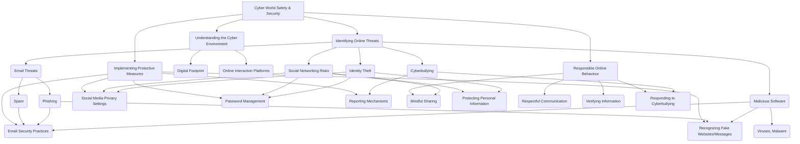

# Class 9 Ict - Ict Chapter 07
**Language:** English

```markdown
# [Class 9] Ict - Chapter 07: Safety and Security in the Cyber World

## 🌟 Core Concepts

This chapter introduces the concept of the **Cyber World** and the critical need for **Safety and Security** within it. Just as we practice safety in the real world, we must adopt cautious and responsible behaviour online. Key areas include understanding online threats and implementing protective measures.



**Hierarchy:**
1.  **Cyber World:** The online environment where users interact, share, and access resources.
    *   **Digital Footprint:** The trail of data left by a user's online activity.
2.  **Online Threats:** Dangers present in the cyber world.
    *   **Email Fraud:**
        *   **Spam:** Unsolicited, often malicious emails (e.g., fake lottery wins, dubious offers).
        *   **Phishing:** Attempts to steal sensitive information (usernames, passwords, financial details) by masquerading as a trustworthy entity via email or fake websites.
    *   **Malware (Malicious Software):** Software designed to harm or exploit computer systems (often spread via malicious links or attachments).
    *   **Social Networking Risks:**
        *   **Identity Theft:** Stealing and using someone's personal information for fraudulent purposes or defamation.
        *   **Cyberbullying:** Using digital communication tools to harass, threaten, or harm others. Includes posting nasty comments, spreading rumours, creating fake profiles, sharing embarrassing content without consent, etc.
3.  **Safety Measures & Responsible Behaviour:** Actions to protect oneself online.
    *   **Email Protection:** Identifying suspicious emails, avoiding unknown links/attachments, not sharing personal info, verifying sender identity.
    *   **Social Networking Safety:** Using strong, unique passwords; managing privacy settings; being selective about connections; thinking before posting; protecting personal and friends' information; logging out properly.
    *   **Responding to Cyberbullying:** Not retaliating, documenting evidence (screenshots), blocking/reporting offenders, seeking help from trusted adults (parents, teachers).
    *   **General Cyber Hygiene:** Keeping software updated, using security software, being cautious on public Wi-Fi, verifying information before sharing.

## 📘 Key Learnings

**1. Understanding the Cyber World:**
*   The internet connects us globally, creating a 'cyber world' parallel to the real world.
*   **Digital Footprint:** Every online action (posts, searches, clicks) contributes to your digital footprint, which can persist indefinitely. (Fig. 7.1 concept)

**2. Email Security:**
*   Emails are essential but can be vectors for threats.
*   **Spam:** Unwanted emails, often deceptive. Signals include unknown senders, urgent calls to action, requests for personal data, or offers that seem too good to be true. (Fig. 7.2)
*   **Phishing:** Deceptive emails or websites designed to steal sensitive data (login credentials, bank details). They often mimic legitimate organizations. Look for suspicious sender addresses (e.g., misspelled domain names - Fig. 7.3 Activity 1), generic greetings, urgent warnings, or links leading to non-standard URLs. (Fig. 7.4)
    *   **Diagram: Identifying Phishing Emails**
        ```mermaid
        graph LR
            A[Receive Email] --> B{Is Sender Known & Expected?};
            B -- Yes --> C{Does Content Seem Normal?};
            B -- No --> D[Treat with Extreme Caution];
            C -- Yes --> E[Proceed Carefully];
            C -- No --> D;
            D --> F{Hover Over Links - Check URL?};
            F -- Suspicious URL --> G[Mark as Spam/Phishing, Delete];
            F -- Looks OK --> H{Are Attachments Expected?};
            H -- No --> G;
            H -- Yes --> I{Scan Attachment Before Opening};
            I -- Malicious --> G;
            I -- Clean --> E;
            D --> J{Does it Ask for Personal/Login Info?};
            J -- Yes --> G;
            J -- No --> F;
        ```
*   **Protection:**
    *   Verify sender identity before opening emails or clicking links.
    *   Never provide personal/financial information via email.
    *   Be wary of unsolicited attachments and lucrative offers.
    *   Check URLs carefully: Secure sites often use `https://` and have legitimate domain names (e.g., `gov.in` for government sites, `.com` for commercial sites but verify the *exact* domain).

**3. Social Networking Safety:**
*   Platforms for connecting and sharing but require careful management.
*   **Risks:** Exposure of personal information, identity theft, cyberbullying.
*   **Account Security:**
    *   Use strong, unique passwords and change them regularly. Never share them (except possibly with parents/guardians).
    *   Configure privacy settings to control who sees your information.
*   **Responsible Sharing:**
    *   Limit sharing of personal details (age, address, school, phone number).
    *   Be mindful that posts create a digital footprint.
    *   Protect friends' privacy – avoid tagging or sharing their info without consent.
    *   Avoid posting real-time locations or detailed plans.
    *   Do not create or engage with fake profiles.
*   **Identity Theft:** Using someone else's identity online. Prevent by safeguarding personal information and passwords.
*   **Cyberbullying:** Repeated harassment or intimidation online. It's a serious offense.
    *   **Forms:** Mean comments, threats, spreading rumours, impersonation, exclusion, sharing embarrassing content.
    *   **Response Strategy:**
        1.  **Do Not Respond/Retaliate:** Engaging can escalate the situation.
        2.  **Document:** Take screenshots as evidence.
        3.  **Block & Report:** Use platform tools to block the bully and report the behaviour. (Fig. 7.5)
        4.  **Seek Support:** Talk to trusted adults (parents, teachers, counsellors). (Fig. 7.6)
        5.  **Enhance Privacy:** Review and strengthen privacy settings.

**4. General Cybersecurity:**
*   Protecting hardware, software, and data from cyberattacks.
*   Be cautious about links and downloads from any source, not just email.
*   Log out of accounts when finished, especially on shared devices.
*   Verify information found online before believing or sharing it.

## 🧩 Active Learning

*   **Activity: Case Study Analysis 🔍**
    *   **Scenario:** You receive a message on a social media platform from someone claiming to be a distant relative you've never met. They share a sad story and ask for money to help with an emergency. They provide a link to a crowdfunding site.
    *   **Task:**
        1.  Identify potential risks in this scenario (e.g., phishing, scam, fake profile).
        2.  List the steps you would take to verify the person's identity and the legitimacy of the request *without* clicking the link initially.
        3.  Evaluate the safety of clicking the provided link. What checks would you perform on the website if you decided to investigate further?
        4.  Create a short checklist (3-5 points) for handling unsolicited requests for help or information online.

*   **Discussion: Critical Analysis 🌍**
    *   **Topic 1: The Double-Edged Sword of Digital Footprints:** Discuss the potential long-term benefits and drawbacks of having a persistent digital footprint. How might a digital footprint created in Class 9 impact future educational or career opportunities? Evaluate the statement: "Anything posted online can stay there forever."
    *   **Topic 2: Balancing Connection and Privacy on Social Media:** Critically analyze the default privacy settings of popular social media platforms used by teenagers. Are they sufficient? Debate the responsibility of the platform versus the user in ensuring online safety. How can users effectively manage their privacy without completely disconnecting?
    *   **Topic 3: Impact and Response to Cyberbullying:** Discuss the psychological and social effects of cyberbullying on individuals. Evaluate the effectiveness of different response strategies (ignoring, retaliating, reporting, seeking help). How can schools and communities create a supportive environment to combat cyberbullying?

## 📝 Assessment Prep

*   **Case Study 1: Email Evaluation**
    *   An email arrives with the subject "Urgent: Your Bank Account Security Alert!" It asks you to click a link immediately to verify your recent transactions due to suspicious activity detected. The sender's email is `security_update@online-bank-services.com`. The link text says "Click here to secure your account" but hovering over it shows the URL `http://192.168.1.10/login-bank`.
    *   **Questions:**
        1.  Identify at least three red flags indicating this might be a phishing attempt.
        2.  Explain why the URL `http://192.168.1.10/login-bank` is highly suspicious for a bank login page.
        3.  What is the safest course of action upon receiving such an email?

*   **Case Study 2: Social Media Post Analysis**
    *   A friend posts a group photo from a recent school trip, tagging everyone and mentioning the school's name and the location of the trip in the caption.
    *   **Questions:**
        1.  Evaluate the potential privacy risks associated with this post for the individuals tagged.
        2.  From a cyber safety perspective, what advice would you give your friend about posting group photos and related information?
        3.  Create a simple diagram illustrating how seemingly harmless information (like school name, location, tagged friends) could potentially be misused.

*   **Diagram Interpretation:**
    *   **Task:** Label the parts of the following URLs and determine which one is likely safer for entering sensitive information, explaining why:
        *   `http://www.mybank.co.in/login.php`
        *   `https://secure.mybank.co.in/signin`
    *   *(Expected Labeling: Protocol (http/https), Subdomain (www, secure), Domain Name (mybank.co.in), Path (/login.php, /signin). Explanation should focus on HTTPS indicating encryption).*

## 🌏 Bharatiya Context

*   **Real-world Examples:** The text mentions checking URLs. Legitimate Indian government and financial websites often use specific domain structures. For instance:
    *   `https://uidai.gov.in/` (Unique Identification Authority of India - Aadhaar) - Uses `https` for security and `.gov.in` indicating a Government of India entity.
    *   `https://www.incometax.gov.in/` (formerly incometaxindiaefiling.gov.in) - Official Income Tax portal, also uses `https` and `.gov.in`.
    *   `https://www.onlinesbi.sbi/` (State Bank of India) - Official banking portal, uses `https` and the bank's specific domain `.sbi`. Phishing sites might use variations like `onlinesbi.co` or `sbi-online.net`. Recognizing these official patterns helps identify fakes.
*   **National Resources & Laws:**
    *   **CERT-In (Indian Computer Emergency Response Team):** The national nodal agency for responding to computer security incidents. They provide advisories and guidelines for online safety.
    *   **National Cyber Crime Reporting Portal (www.cybercrime.gov.in):** A Government of India initiative where citizens can report all types of cybercrimes, including online fraud, cyberbullying, and identity theft.
    *   **Information Technology (IT) Act, 2000 (and amendments):** Provides the legal framework for electronic governance and deals with cybercrimes in India. Sections of this act address issues like identity theft (Section 66C), cheating by personation (Section 66D), and violation of privacy (Section 66E), making actions like phishing and cyberbullying punishable offenses.
*   **Digital India & Awareness:** The push towards Digital India increases online activity, making cybersecurity awareness crucial. Government and educational institutions run campaigns to educate citizens, including students, about safe online practices, recognizing the importance of protecting personal data and navigating the cyber world securely, especially with the rise in digital payments and online services. Data from the National Crime Records Bureau (NCRB) often highlights trends in cybercrime, emphasizing the need for constant vigilance.
```