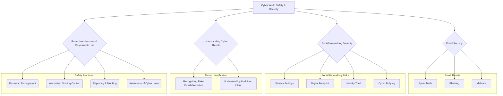
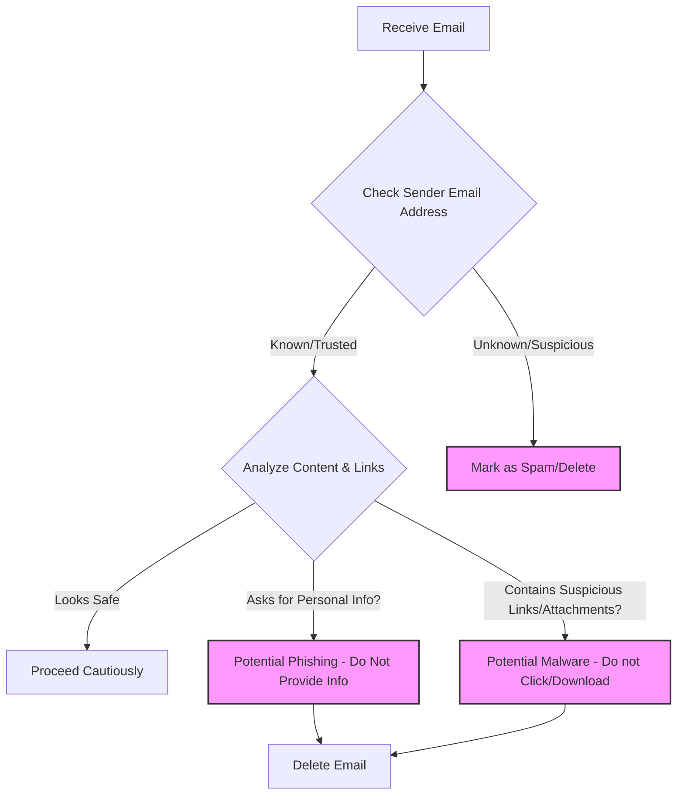

# Class 9 Ict - Ict Chapter 07
**Language:** English

```markdown
# [Class 9] Ict - Chapter 07: Safety and Security in the Cyber World

## 🌟 Core Concepts


*   **Cyber World:** The online environment where users interact, share, and access resources via the Internet.
*   **Digital Footprint:** The trail of data left behind by a user's online activity.
*   **Cyber Threats:** Malicious activities like spam, phishing, malware, identity theft, and cyber bullying.
*   **Cyber Security:** Protecting internet-connected systems (hardware, software, data) from cyber attacks.
*   **Responsible Use:** Practicing caution, verifying information, protecting personal data, and respecting others online.

## 📘 Key Learnings

**1. Introduction to the Cyber World:**
*   Just as we practice safety in the real world, caution is crucial in the cyber world.
*   Our online activities create a **Digital Footprint**, which can persist even after deletion. (Fig. 7.1)

**2. Email Safety:**
*   Emails are common tools for communication but can be exploited.
*   **Spam Mails:** Unsolicited emails, often from unknown sources, with tempting offers (e.g., lottery wins, free expensive items) or requests for personal information. They often have malicious intent.
    *   **Identifying Spam:** Look for unknown senders, suspicious offers, urgency prompts (e.g., "valid for 48 hours"), poor grammar, or spelling errors (e.g., incorrect spelling in sender's email ID as shown in Fig 7.3 analysis). (Fig. 7.2, Fig. 7.3)
*   **Phishing:** Attempts to trick users into revealing sensitive information (usernames, passwords, bank details) by posing as a trustworthy source (e.g., a bank, government agency). This often involves directing users to fake websites that mimic legitimate ones or installing malware via links/attachments. (Fig. 7.4)
    *   **Identifying Phishing Websites:** Check the URL carefully. Secure and legitimate websites often use `https://` and have recognizable domain names. Fake URLs might have slight misspellings or unusual extensions. (Activity 2 examples: `http://www.uiidai.gov.in/`, `http://www.incometakindiaefilling.gov.in/`, `https://onlinesbi.com` - note the use of `.gov.in` for government sites and `https` for secure banking).
*   **Malware (Malicious Software):** Harmful software (like viruses) that can be installed via malicious links or attachments, potentially corrupting systems or stealing data.
*   **Protection from Email Fraud:**
    *   Do not reply to unknown senders.
    *   Never provide personal information.
    *   Ignore lucrative offers from unreliable sources.
    *   Do not click links or open attachments from unknown senders. Trust only known websites.
    *   Verify website URLs (check for `https` and correct domain).
    *   Do not forward spam or suspicious emails.

**3. Social Networking Safety:**
*   Social networking sites allow connecting with people globally but require careful usage.
*   **Account Creation & Privacy:**
    *   Use an email ID to create accounts.
    *   Avoid revealing excessive personal information (age, address, school, contact details) to prevent **Identity Theft**.
    *   Configure privacy settings carefully to control who sees your information.
*   **Safe Practices on Social Networks:**
    *   Never share passwords (except with parents/guardians). Change them frequently. Use strong passwords.
    *   Communicate only with known people.
    *   Be mindful of others' feelings when posting.
    *   Be cautious posting photos/videos; they contribute to your digital footprint and stay online.
    *   Protect friends' privacy (avoid posting their details, group photos without consent).
    *   Avoid posting detailed plans or activities.
    *   Do not create fake profiles.
    *   Report compromised accounts immediately.
    *   Verify information before forwarding.
    *   Avoid opening links/attachments received via social media.
    *   Log out after use, never leave accounts unattended.
*   **Identity Theft:** Deliberate use of someone else's identity for gain or defamation. Prevent it by safeguarding passwords and personal information.

**4. Understanding and Handling Cyber Bullying:**
*   **Cyber Bullying:** Using electronic communication to bully a person, typically by sending messages of an intimidating or threatening nature, spreading rumors, posting embarrassing content, or creating fake profiles for defamation. It is a serious offense punishable under Cyber Law.
*   **Forms of Cyber Bullying:** Nasty comments, fake profiles, threats, exclusion from groups, posting embarrassing photos without permission, spreading rumors, stealing passwords to send inappropriate messages, offensive chat.
*   **Responding to Cyber Bullying:**
    *   **Do Not Respond/Retaliate:** Engaging can worsen the situation.
    *   **Screenshot:** Keep evidence of the bullying.
    *   **Block and Report:** Use platform features to block the bully and report the incident to the site administrators. (Fig. 7.5)
    *   **Talk About It:** Inform parents, teachers, or trusted adults. Do not suffer alone. (Fig. 7.6)
    *   **Be Private:** Maintain high privacy settings and connect only with known individuals.
    *   **Be Aware:** Stay updated on online safety measures.

```mermaid
graph LR
    A[Receives Cyber Bullying Message/Post] --> B{Do Not Respond};
    A --> C[Take Screenshot (Evidence)];
    A --> D{Block the Bully};
    A --> E{Report to Platform};
    A --> F{Talk to Parent/Teacher/Trusted Adult};
    F --> G[Seek Support & Resolution];
```
*Diagram: Steps to Handle Cyber Bullying*

## 🧩 Active Learning

*   **Activity: Research-based Case Study Analysis 🔍**
    *   **Scenario:** Imagine a Class 9 student, Priya, frequently posts updates on her social media profile, including her school name, location check-ins at cafes, and photos with friends tagged. She receives a friend request from someone she doesn't recognize, but they have mutual friends.
    *   **Task:**
        1.  Identify the potential risks Priya is exposed to based on her online behavior (e.g., risk of identity theft, stalking, cyber bullying).
        2.  Evaluate the safety of accepting the friend request. What steps should Priya take before deciding? (e.g., check mutual friends, examine the profile for authenticity, message mutual friends).
        3.  Suggest specific changes Priya should make to her privacy settings and posting habits to enhance her online safety, referencing the principles discussed in the chapter.
*   **Discussion: Critical Analysis of Real-World Impacts 🌍**
    *   **Topic:** The Double-Edged Sword of Social Media for Teenagers.
    *   **Prompts:**
        1.  Discuss the benefits of social networking for students (e.g., staying connected, learning, collaboration).
        2.  Critically analyze the potential negative impacts, focusing on cyber bullying and identity theft as discussed in the chapter. How prevalent are these issues among young people in India?
        3.  Evaluate the effectiveness of platform-provided safety features (blocking, reporting, privacy settings). Are they sufficient? What more could be done by platforms, schools, or the government?
        4.  How can awareness campaigns about digital footprints and online safety be made more effective for students in India?

## 📝 Assessment Prep

*   **Case Studies:**
    *   **Case 1 (Phishing):** Aman receives an email seemingly from his bank asking him to click a link and verify his account details due to a security update. The email address looks slightly different from the usual bank communications, and the link points to `http://online-sbii-verify.com` instead of the official `https://onlinesbi.com`. Analyze the situation. What type of threat is this? What specific clues indicate danger? What should Aman do?
    *   **Case 2 (Cyber Bullying):** Sunita finds a fake profile using her name and pictures, posting offensive comments. Evaluate the situation. What form of cyber threat is this? Outline the step-by-step actions Sunita should take according to the chapter's guidelines (Screenshot, Block/Report, Talk About It).
    *   **Case 3 (Information Oversharing):** Ravi posts excitedly about his family's upcoming vacation, including dates and destination, on his public social media profile. Evaluate the risks associated with this post. What advice would you give Ravi regarding sharing personal plans online?
*   **Diagrams:**
    *   Draw a flowchart illustrating how to identify a potential phishing email.
    *   Create a diagram showing the relationship between sharing personal information online, digital footprint, and the risk of identity theft.
    *   Illustrate the process of reporting cyber bullying on a generic social media platform.


*Diagram: Identifying Phishing/Spam Emails*

## 🌏 Bharatiya Context

*   **Prevalence of Phishing:** Phishing attempts frequently target customers of major Indian banks (like SBI, mentioned in Activity 2) and users of government services. Scammers often create fake websites mimicking official portals like the Income Tax Department (`incometaxindiaefiling.gov.in`) or UIDAI (`uidai.gov.in`). Awareness of correct government domain extensions (`.gov.in`, `.nic.in`) is crucial.
*   **Social Media Usage & Risks:** India has a vast and growing number of social media users, including young people. This increases exposure to risks like cyber bullying and the spread of misinformation (fake news). Verifying information from trusted sources before sharing is essential in the Indian context, where misinformation can have significant social consequences.
*   **Cyber Laws in India:** India has specific cyber laws (like the Information Technology Act, 2000, and subsequent amendments) that address cybercrimes including identity theft, phishing, and cyber bullying. Understanding that these actions have legal consequences is important for promoting responsible online behavior among students. Reporting mechanisms exist through local police and national cybercrime reporting portals.
*   **Digital India Initiative:** As India moves towards greater digitization through initiatives like Digital India, the digital footprint of citizens is expanding. This necessitates increased awareness and education about cyber safety and security practices, starting from the school level, to protect personal and national data.
```