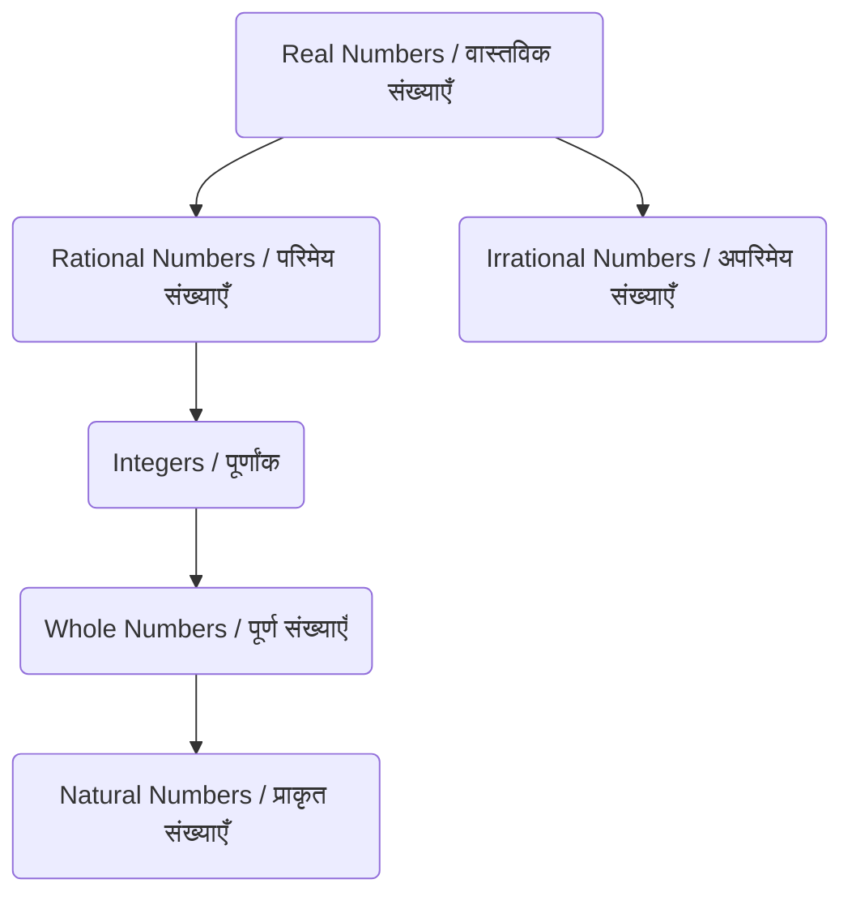

# Class 9 Maths - General Chapter 101
**Language:** Hinglish

```markdown
# [Class 9] संख्या पद्धति (Number Systems) - Chapter 1

## 🌟 Core Concepts (मुख्य अवधारणाएँ) 📊

Yeh chapter number systems ke foundations ko explore karta hai. Hum alag-alag tarah ke numbers aur unke relationships ko samjhenge.

1.  **Number Types (संख्याओं के प्रकार):**
    *   Prakrit Sankhyayein (Natural Numbers - N): 1, 2, 3, ... (Counting numbers)
    *   Poorn Sankhyayein (Whole Numbers - W): 0, 1, 2, 3, ... (Natural numbers + Zero)
    *   Poornank (Integers - Z): ..., -3, -2, -1, 0, 1, 2, 3, ... (Whole numbers + Negative natural numbers)
        *   *Z 'zahlen' (German word for 'to count') se aata hai.*
    *   Parimey Sankhyayein (Rational Numbers - Q): Numbers jo p/q form mein likhe ja sakte hain, jahan p aur q integers hain aur q ≠ 0.
        *   *Q 'Quotient' se aata hai.*
        *   Includes N, W, Z.
        *   Equivalent rational numbers (e.g., 1/2 = 2/4). Standard form assumes p, q are co-prime.
    *   Aparimey Sankhyayein (Irrational Numbers): Numbers jo p/q form mein *nahi* likhe ja sakte (e.g., √2, √3, π, 0.10110111...).
    *   Vastavik Sankhyayein (Real Numbers - R): Collection of all Rational and Irrational numbers. Har real number ko number line par uniquely represent kiya ja sakta hai.

2.  **Number Line Representation (संख्या रेखा पर निरूपण):**
    *   Visualizing different number types on the number line.
    *   Locating irrational numbers like √2, √3 geometrically using Pythagoras theorem.
    *   Square root spiral construction.

3.  **Decimal Expansions (दशमलव प्रसार):**
    *   **Rational Numbers:**
        *   Terminating (शांत दशमलव): Remainder becomes 0 (e.g., 7/8 = 0.875).
        *   Non-terminating Recurring (अनवसानी आवर्ती): Remainder repeats, causing digits in quotient to repeat (e.g., 10/3 = 3.333..., 1/7 = 0.142857...). Bar notation (e.g., 3.3̄, 0.142857).
    *   **Irrational Numbers:**
        *   Non-terminating Non-recurring (अनवसानी अनावर्ती): Decimal expansion goes on forever without repeating (e.g., √2 = 1.41421..., π = 3.14159...).

4.  **Operations on Real Numbers (वास्तविक संख्याओं पर संक्रियाएँ):**
    *   Properties (Commutative, Associative, Distributive).
    *   Rational +/–/×/÷ Rational = Rational (except division by 0).
    *   Rational +/– Irrational = Irrational.
    *   Non-zero Rational ×/÷ Irrational = Irrational.
    *   Irrational +/–/×/÷ Irrational = Can be Rational or Irrational.
    *   Identities involving square roots (e.g., √ab = √a √b, (√a + √b)(√a - √b) = a - b).
    *   Rationalizing the denominator (हर का परिमेयकरण): Making the denominator a rational number.

5.  **Laws of Exponents for Real Numbers (वास्तविक संख्याओं के लिए घातांक नियम):**
    *   Review of laws for integer exponents (a^m * a^n = a^(m+n), (a^m)^n = a^(mn), etc.).
    *   Extension to rational exponents (a^(p/q), where a > 0).
    *   Definition: a^(m/n) = (n√a)^m = n√(a^m).
    *   Applying laws to simplify expressions with rational exponents.

## 📘 Key Learnings (मुख्य सीख) 📈

**1. Number System Hierarchy (संख्या प्रणाली पदानुक्रम):**
Imagine ek bag (jhola).
*   Pehle sirf Natural numbers (N) daale: {1, 2, 3, ...}. Yeh N ka collection hai.
*   Phir zero (0) daala: Ab bag mein Whole numbers (W) hain {0, 1, 2, ...}.
*   Phir saare negative integers daale: Ab bag mein Integers (Z) hain {..., -2, -1, 0, 1, 2, ...}.
*   Phir fractions jaise 1/2, -3/4, 2005/2006 daale: Ab bag mein Rational numbers (Q) hain. Har number p/q form mein hai (q≠0).
*   Kya number line par kuch bacha? Haan! Numbers like √2, π jo p/q form mein nahi likhe ja sakte. Yeh Irrational numbers hain.
*   Jab humne irrationals ko bhi bag mein daal diya, toh bag mein saare Real Numbers (R) aa gaye.



**2. Locating Irrationals (अपरिमेय संख्याओं का स्थान निर्धारण):**
Hum √2, √3 jaise numbers ko number line par construct kar sakte hain.
*   **√2 ke liye:** Ek 1 unit side wala square (OABC) banayein. Diagonal OB ki length Pythagoras theorem se √(1² + 1²) = √2 hogi. Compass se O ko center aur OB ko radius maan kar number line par arc banayein, jahan cut karega woh point P, √2 ko represent karega.

    ```mermaid
    graph TD
        subgraph Square OABC
            O --- A;
            A --- B;
            B --- C;
            C --- O;
            O --- B;
        end
        O -- 1 unit --> A;
        A -- 1 unit --> B;
        O -- "Diagonal = √2" --> B;

    ```
    *(Imagine this square placed on the number line with O at 0)*

*   **√3 ke liye:** √2 (OB) par 1 unit perpendicular line (BD) banayein. OD ki length Pythagoras theorem se √((√2)² + 1²) = √(2 + 1) = √3 hogi. O ko center aur OD ko radius maan kar number line par arc banayein, jahan cut karega woh point Q, √3 ko represent karega.

**3. Decimal Expansions ka Matlab (दशमलव प्रसार का अर्थ):**
Kisi number ka decimal form uski nature batata hai:
*   **Terminating (Shant):** Division process end ho jata hai (remainder 0). Yeh *Rational* hai. Example: 1/4 = 0.25.
*   **Non-Terminating Recurring (Anvasani Avarti):** Division chalta rehta hai, lekin remainders ka ek pattern repeat hota hai, isliye quotient mein digits ka block repeat hota hai. Yeh bhi *Rational* hai. Example: 1/3 = 0.333... = 0.3̄.
*   **Non-Terminating Non-Recurring (Anvasani Anavarti):** Division chalta rehta hai, aur koi repeating pattern nahi banta. Yeh *Irrational* hai. Example: π = 3.14159265...

**4. Rationalizing (परिमेयकरण):**
Jab kisi expression ke denominator mein square root ho (e.g., 1/√2), toh use simplify karne ke liye denominator ko rational banate hain.
*   **Example:** Rationalise 1 / (√7 - √6)
    *   Identity use karenge: (a-b)(a+b) = a² - b²
    *   Numerator aur denominator ko (√7 + √6) se multiply karenge (conjugate).
    *   [1 / (√7 - √6)] * [(√7 + √6) / (√7 + √6)]
    *   = (√7 + √6) / [ (√7)² - (√6)² ]
    *   = (√7 + √6) / (7 - 6)
    *   = (√7 + √6) / 1 = √7 + √6

**5. Laws of Exponents (घातांक नियम):**
Yeh rules calculations ko easy banate hain, especially jab powers fractional hon.
*   **Rule:** a^(p/q) = q√(a^p)
*   **Example:** Simplify 2^(2/3) * 2^(1/3)
    *   Use rule: a^m * a^n = a^(m+n)
    *   2^(2/3 + 1/3) = 2^(3/3) = 2^1 = 2

## 🧩 Active Learning (सक्रिय शिक्षण)

**Activity: Research-based Case Study Analysis (शोध-आधारित केस स्टडी विश्लेषण) 🔍**

*   **Topic:** Analyzing Number Usage in India's Budget Highlights.
*   **Task:** Government budget reports ya news articles dekhein (online search karein for "India Budget Highlights PDF" ya similar terms). Identify different types of numbers used:
    *   Large whole numbers/integers (e.g., total expenditure in Crores - ₹39,44,909 crore).
    *   Rational numbers (e.g., growth rates like 8.5%, which is 8.5/100 or 17/200; fiscal deficit as % of GDP).
    *   Are there any situations where irrational numbers might be implicitly involved (e.g., complex financial models, though not usually shown in highlights)?
*   **Analysis:** Ek choti report banayein discussing:
    1.  Kis type ke numbers sabse zyada use hue hain aur kyun? (Which number types are most common and why?)
    2.  Kya bade numbers ko represent karne ke liye koi special notation (like crores, lakhs, or scientific notation principles) use kiya gaya hai? (Any special notations for large numbers?)
    3.  Rational numbers (percentages, fractions) ka data ko samajhne mein kya role hai? (What is the role of rational numbers in understanding the data?)

**Discussion: Critical Analysis of Real-world Impacts (वास्तविक दुनिया के प्रभावों का आलोचनात्मक विश्लेषण) 🌍**

*   **Prompt 1:** Humne dekha ki √2 irrational hai. Engineers aur architects ko bridges ya buildings design karte waqt precise measurements ki zaroorat hoti hai. Kya unke liye √2 jaise numbers ki exact value na jaan pana ek problem hai? Woh isse kaise deal karte hain? (Discuss the practical implications of irrational numbers in fields requiring precision like engineering. How do they handle it? Hint: Approximations).
*   **Prompt 2:** Why is it important to distinguish between rational and irrational numbers? Socho computer programming, scientific research, ya even basic financial calculations ke baare mein. (Rational aur irrational numbers mein difference karna kyun zaroori hai? Think about different fields).
*   **Prompt 3:** The text mentions π ≈ 22/7. Yeh ek rational approximation hai. Aise approximations kab useful hote hain aur kab potentially misleading ho sakte hain? (When are rational approximations like π ≈ 22/7 useful, and when can they be misleading?).

## 📝 Assessment Prep (मूल्यांकन तैयारी) 📝

*   **Classification Problems:** Diye gaye numbers ko Rational/Irrational classify karna aur reason dena (e.g., √23, √225, 0.3796, 7.478..., 1.101001...). [Exercise 1.3, Q9]
*   **Representation:** √5, √9.3 jaise numbers ko number line par geometrically represent karna. [Exercise 1.2, Q3; Exercise 1.4, Q4]
    *   *Diagrams banana important hai!*
*   **Conversion:** Repeating decimals ko p/q form mein convert karna (e.g., 0.6̄, 0.47̄, 0.001̄). [Exercise 1.3, Q3]
*   **Simplification:** Expressions involving square roots ko simplify karna using identities (e.g., (√5 + √2)²). [Exercise 1.4, Q2]
*   **Rationalization:** Denominators ko rationalise karna (e.g., 1/(√7 - 2)). [Exercise 1.4, Q5]
*   **Exponents:** Laws of exponents use karke expressions ko simplify karna (e.g., (64)^(1/2), 7^(1/2) * 8^(1/2)). [Exercise 1.5, Q1, Q3]
*   **True/False with Justification:** Statements ko evaluate karna (e.g., Every integer is a whole number. Every rational number is a real number.). [Exercise 1.1, Q4; Exercise 1.2, Q1]

## 🌏 Bharatiya Context (भारतीय संदर्भ) 📊

*   **Ancient Indian Mathematics:** Hamare desh ka mathematics mein significant contribution raha hai.
    *   **Zero (Shunya):** The concept of zero, crucial for the number system, originated in India. Iske bina modern mathematics and calculations possible nahi hote.
    *   **Sulbasutras (शुल्बसूत्र):** Vedic period (approx. 800 BC - 500 BC) ke mathematical texts hain. Inmein geometric constructions ke rules hain, aur √2 ka ek remarkable approximation diya gaya hai:
        √2 ≈ 1 + 1/3 + 1/(3*4) - 1/(3*4*34) ≈ 1.4142156... Yeh modern value ke kaafi close hai! Yeh dikhata hai ki ancient Indian mathematicians irrational quantities ke saath kaam kar rahe the.
    *   **Aryabhatta (आर्यभट्ट):** Great Indian mathematician and astronomer (476–550 CE). Unhone π ki value ko four decimal places tak accurately calculate kiya tha (3.1416).
*   **Data Representation:** Aajkal, India ki economic aur social data (like population census, GDP figures, literacy rates) ko present karne ke liye hum sabhi tarah ke real numbers - integers, rationals (percentages, ratios), aur kabhi-kabhi large numbers ke liye scientific notation ke principles ka istemaal karte hain. Understanding number systems helps in interpreting this data correctly. For example, understanding percentages (rational numbers) is crucial to analyze economic growth or survey results.

```