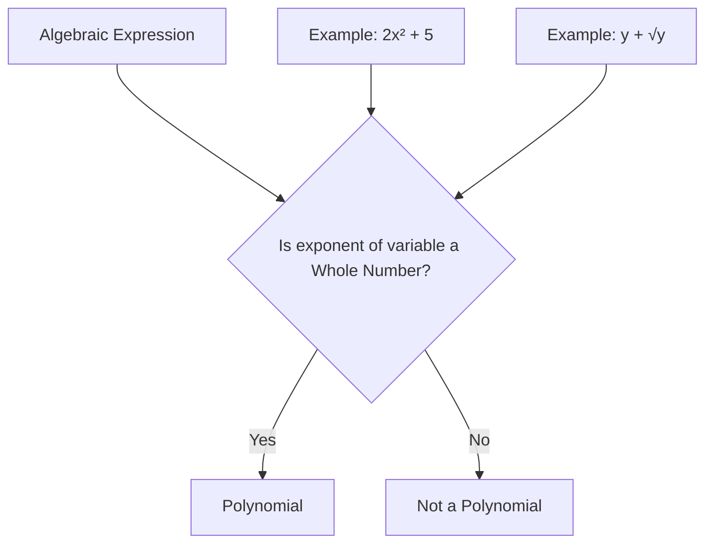

# Class 9 Maths - General Chapter 102
**Language:** Hinglish

```markdown
# [Class 9] Maths - Chapter 2: Polynomials (बहुपद)

## 🌟 Core Concepts (मुख्य अवधारणाएँ)

Polynomials ka concept hierarchy neeche diya gaya hai:

1.  **Algebraic Expressions (बीजीय व्यंजक)**
    *   Variables (चर) & Constants (अचर)
    *   Terms (पद)
    *   Coefficients (गुणांक)
2.  **Polynomials (बहुपद)**
    *   Definition: Expressions with whole number exponents for variables. (चर की घात केवल पूर्ण संख्या)
    *   **Polynomials in One Variable (एक चर वाले बहुपद)**
        *   Terms of a Polynomial (बहुपद के पद)
        *   Coefficients (गुणांक)
        *   Constant Polynomial (अचर बहुपद) (e.g., 5, -2, 7)
        *   Zero Polynomial (शून्य बहुपद) (0)
        *   **Degree of a Polynomial (बहुपद की घात)**
            *   Highest power of the variable. (चर की उच्चतम घात)
            *   Degree of non-zero constant polynomial is 0.
            *   Degree of zero polynomial is not defined (परिभाषित नहीं).
        *   **Types based on Number of Terms (पदों की संख्या के आधार पर प्रकार)**
            *   Monomial (एकपदी) - 1 term
            *   Binomial (द्विपद) - 2 terms
            *   Trinomial (त्रिपद) - 3 terms
        *   **Types based on Degree (घात के आधार पर प्रकार)**
            *   Linear Polynomial (रैखिक बहुपद) - Degree 1 (e.g., `ax + b, a ≠ 0`)
            *   Quadratic Polynomial (द्विघाती बहुपद) - Degree 2 (e.g., `ax² + bx + c, a ≠ 0`)
            *   Cubic Polynomial (त्रिघाती बहुपद) - Degree 3 (e.g., `ax³ + bx² + cx + d, a ≠ 0`)
    *   Polynomials in More Than One Variable (एक से अधिक चरों वाले बहुपद - Brief Intro)
3.  **Zeroes of a Polynomial (बहुपद के शून्यक)**
    *   Definition: A number 'c' such that p(c) = 0.
    *   Finding zeroes (especially for linear polynomials: `-b/a`).
    *   Value of a polynomial p(x) at x = k is p(k).
    *   Relation to roots of polynomial equations (p(x) = 0 के मूल).
4.  **Factorisation of Polynomials (बहुपदों का गुणनखंडन)**
    *   **Factor Theorem (गुणनखंड प्रमेय)**
        *   If p(a) = 0, then (x - a) is a factor of p(x).
        *   If (x - a) is a factor of p(x), then p(a) = 0.
    *   **Methods of Factorisation**
        *   Splitting the Middle Term (मध्य पद को विभक्त करना) - For quadratic polynomials (`ax² + bx + c`).
        *   Using Factor Theorem - For quadratic and cubic polynomials.
5.  **Algebraic Identities (बीजीय सर्वसमिकाएँ)**
    *   Standard Identities (मानक सर्वसमिकाएँ) and their use in factorisation and evaluation.
        *   (x + y)² = x² + 2xy + y²
        *   (x - y)² = x² - 2xy + y²
        *   x² - y² = (x + y)(x - y)
        *   (x + a)(x + b) = x² + (a + b)x + ab
        *   (x + y + z)² = x² + y² + z² + 2xy + 2yz + 2zx
        *   (x + y)³ = x³ + y³ + 3xy(x + y)
        *   (x - y)³ = x³ - y³ - 3xy(x - y)
        *   x³ + y³ + z³ - 3xyz = (x + y + z)(x² + y² + z² - xy - yz - zx)

## 📘 Key Learnings (मुख्य बातें)

**1. Polynomial Kya Hai? (What is a Polynomial?)**
Ek algebraic expression jisme variables (jaise x, y, t) ki power (exponent ya घात) hamesha **whole numbers** (पूर्ण संख्याएँ - 0, 1, 2, 3, ...) hoti hai, use polynomial kehte hain.
*   **Example:** `3x² + 5x - 2` ek polynomial hai variable 'x' mein.
*   **Non-Example:** `x + 1/x` (yaani `x + x⁻¹`) polynomial nahi hai kyunki power -1 whole number nahi hai. `√t + 3` (yaani `t^(1/2) + 3`) bhi polynomial nahi hai kyunki power 1/2 whole number nahi hai.

**Diagrammatic Representation:**


**2. Degree of Polynomial (बहुपद की घात)**
Kisi polynomial mein variable ki sabse **highest power** (उच्चतम घात) ko us polynomial ki degree kehte hain.
*   `p(x) = 7x⁵ - 3x² + 9` ki degree 5 hai.
*   `q(y) = 4y - 8` (Linear Polynomial) ki degree 1 hai.
*   `r(t) = 5t² + t - 1` (Quadratic Polynomial) ki degree 2 hai.
*   `s(u) = 6u³ + u` (Cubic Polynomial) ki degree 3 hai.
*   Constant polynomial jaise `p(x) = 7` (isko `7x⁰` likh sakte hain) ki degree 0 hoti hai.
*   Zero polynomial `p(x) = 0` ki degree defined nahi hai.

**3. Zeroes of a Polynomial (बहुपद के शून्यक)**
Ek real number 'c' ko polynomial `p(x)` ka zero (शून्यक) kehte hain agar `p(c) = 0`. Matlab, variable ki jagah 'c' rakhne par polynomial ki value zero ho jaye.
*   Agar `p(x) = x - 2` hai, toh `p(2) = 2 - 2 = 0`. Isliye, 2 polynomial `p(x)` ka zero hai.
*   Linear polynomial `ax + b` ka zero `-b/a` hota hai.
*   Ek polynomial ke ek se zyada zeroes bhi ho sakte hain. Jaise `p(x) = x² - 4` ke zeroes 2 aur -2 hain, kyunki `p(2) = 2² - 4 = 0` aur `p(-2) = (-2)² - 4 = 0`.

**Finding Zeroes Flowchart:**
```mermaid
graph TD
    A[Polynomial p(x)] --> B{Set p(x) = 0};
    B --> C[Solve the equation for x];
    C --> D[The value(s) of x are the Zeroes];

    E[Example: p(x) = 2x + 5] --> F{Set 2x + 5 = 0};
    F --> G[Solve: 2x = -5 => x = -5/2];
    G --> H[Zero is -5/2];
```

**4. Factor Theorem (गुणनखंड प्रमेय)**
Yeh theorem zeroes aur factors ke beech ka relation batata hai. Ek polynomial `p(x)` (jiski degree ≥ 1 ho) aur koi real number 'a' ke liye:
*   Agar `p(a) = 0` hai, toh `(x - a)` polynomial `p(x)` ka ek factor (गुणनखंड) hoga.
*   Agar `(x - a)` polynomial `p(x)` ka ek factor hai, toh `p(a) = 0` hoga.

**Example:** Check karna hai ki `(x - 1)` polynomial `p(x) = x³ + 2x² - x - 2` ka factor hai ya nahi.
*   Zero of `(x - 1)` is `x = 1`.
*   Calculate `p(1) = (1)³ + 2(1)² - (1) - 2 = 1 + 2 - 1 - 2 = 0`.
*   Kyunki `p(1) = 0` hai, isliye Factor Theorem ke according, `(x - 1)` polynomial `p(x)` ka ek factor hai.

**5. Factorisation (गुणनखंडन)**
Polynomial ko uske factors ke product ke form mein likhna factorisation kehlata hai.
*   **Quadratic Polynomial (`ax² + bx + c`)**:
    *   **Splitting the Middle Term:** `b` ko aise do numbers `p` aur `q` mein split karo ki `p + q = b` aur `p * q = ac`.
        *   Example: `6x² + 17x + 5`. Yahan `a=6, b=17, c=5`. `ac = 30`. Humein do numbers chahiye jinka sum 17 aur product 30 ho. Woh hain 15 aur 2.
        *   `6x² + 2x + 15x + 5 = 2x(3x + 1) + 5(3x + 1) = (3x + 1)(2x + 5)`.
    *   **Using Factor Theorem:** Agar `p(a) = 0` aur `p(b) = 0`, toh `(x-a)` aur `(x-b)` factors honge.
*   **Cubic Polynomial:**
    *   Pehle Factor Theorem use karke ek factor `(x - a)` find karo (constant term ke factors ko try karke).
    *   Phir polynomial ko `(x - a)` se divide karo ya terms ko adjust karke `(x - a)` common lo.
    *   Jo quadratic quotient milega, usko factorise karo.
    *   Example: `x³ – 2x² – x + 2`. Try `x=1`. `p(1) = 1-2-1+2 = 0`. So `(x-1)` is a factor.
    *   `x³ – x² – x² + x – 2x + 2 = x²(x-1) - x(x-1) - 2(x-1) = (x-1)(x² - x - 2)`
    *   Factorise `x² - x - 2 = x² - 2x + x - 2 = x(x-2) + 1(x-2) = (x-2)(x+1)`.
    *   So, `x³ – 2x² – x + 2 = (x-1)(x+1)(x-2)`.

**6. Algebraic Identities (बीजीय सर्वसमिकाएँ)**
Yeh equations hoti hain jo variables ki sabhi values ke liye true hoti hain. Inka use multiplication aur factorisation ko easy banane ke liye hota hai.
*   `(x + y)² = x² + 2xy + y²`
*   `(x - y)² = x² - 2xy + y²`
*   `x² - y² = (x + y)(x - y)`
*   `(x + a)(x + b) = x² + (a + b)x + ab`
*   `(x + y + z)² = x² + y² + z² + 2xy + 2yz + 2zx`
*   `(x + y)³ = x³ + y³ + 3xy(x + y)`
*   `(x - y)³ = x³ - y³ - 3xy(x - y)`
*   `x³ + y³ + z³ - 3xyz = (x + y + z)(x² + y² + z² - xy - yz - zx)`
    *   Special Case: Agar `x + y + z = 0`, toh `x³ + y³ + z³ = 3xyz`.

**Example (Identity Use):**
*   Evaluate `102³` using identity:
    *   `102³ = (100 + 2)³`
    *   Use `(x + y)³ = x³ + y³ + 3xy(x + y)` with `x=100, y=2`.
    *   `(100)³ + (2)³ + 3(100)(2)(100 + 2)`
    *   `1000000 + 8 + 600(102)`
    *   `1000000 + 8 + 61200 = 1061208`
*   Factorise `8a³ + b³ + 12a²b + 6ab²`:
    *   This looks like `(x+y)³`. Let's check.
    *   `8a³ = (2a)³`
    *   `b³ = (b)³`
    *   `12a²b = 3(2a)²(b)`
    *   `6ab² = 3(2a)(b)²`
    *   Yes, this is `(2a + b)³ = (2a + b)(2a + b)(2a + b)`.

## 🧩 Active Learning (सक्रिय शिक्षण)

**1. Activity: Polynomial Models ki Khoj (Research-based Case Study Analysis) 🔍**
*   **Task:** Apne aas paas dekho ya internet par search karo aur kam se kam 2 real-life formulas dhoondo jo polynomial form mein hain. Jaise:
    *   Kisi simple object ka Area ya Volume ka formula (e.g., Area of rectangle `l*b`, Volume of cuboid `l*b*h`). Agar length, breadth, height ko variables (x, y, z) ya expressions like `(x+1)` se represent karein toh kya formula polynomial banta hai?
    *   Simple Interest ka formula (`P*R*T/100`). Agar Principal (P) ko `x` maanein aur Rate (R), Time (T) constant ho, toh kya yeh linear polynomial hai?
*   **Analysis:** In formulas ko identify karo, unke variables, terms, degree batao. Kya yeh linear, quadratic, ya cubic hain? Batao yeh formula kis situation mein use hota hai. Apne findings class mein present karo.

**2. Discussion: Polynomials ka Asli Duniya par Prabhav (Critical Analysis of Real-world Impacts) 🌍**
*   **Topic:** Kya polynomials real-world situations ko hamesha perfectly model kar sakte hain? Kyun ya kyun nahi?
*   **Points to consider:**
    *   Polynomials continuous functions hote hain. Kya real-world data hamesha continuous hota hai? (Jaise population growth - log fractions mein nahi badhte).
    *   Polynomial graphs infinity tak jaate hain. Kya real-world quantities (like cost, height, population) hamesha infinity tak badh sakti hain?
    *   Factorisation ka kya practical use ho sakta hai? (e.g., kisi problem ko simpler parts mein break karna, optimal values find karna - higher classes mein).
    *   Kya aap koi aisi situation soch sakte hain jahan linear model (degree 1 polynomial) kaafi hoga? Aur kahan quadratic ya cubic model ki zaroorat pad sakti hai? (e.g., path of a thrown ball - quadratic).

## 📝 Assessment Prep (मूल्यांकन तैयारी)

Is chapter se exams mein in topics par questions aa sakte hain:

1.  **Identify Polynomials:** Diye gaye expressions mein se polynomials pehchano aur reason batao.
2.  **Degree, Coefficients, Terms:** Kisi polynomial ka degree, specific term ka coefficient, ya terms likhne ko kaha ja sakta hai.
3.  **Classify Polynomials:** Linear, quadratic, cubic ya monomial, binomial, trinomial mein classify karna.
4.  **Value of Polynomial:** `p(x)` ki value kisi given `x` par find karna (e.g., find `p(2)`).
5.  **Zeroes of Polynomial:**
    *   Verify karna ki given number polynomial ka zero hai ya nahi.
    *   Linear polynomial ka zero find karna.
    *   Zeroes aur coefficients ke beech relation (higher classes mein zyada detail mein).
6.  **Factor Theorem:**
    *   Check karna ki `(x-a)` polynomial `p(x)` ka factor hai ya nahi.
    *   `k` ki value find karna agar `(x-a)` factor diya ho.
7.  **Factorisation:**
    *   Quadratic polynomials ko factorise karna (splitting middle term / factor theorem).
    *   Cubic polynomials ko factorise karna (using factor theorem).
8.  **Algebraic Identities:**
    *   Identities use karke products find karna (e.g., `103 * 97`).
    *   Identities use karke expressions expand karna (e.g., `(2x - y + 3z)²`).
    *   Identities use karke expressions factorise karna (e.g., `49a² + 70ab + 25b²`, `x³ + 8y³ + z³ - 6xyz`).

**Case Study / Diagram based questions:** Aapko ek situation di ja sakti hai (jaise rectangle ka area ya cuboid ka volume polynomial form mein) aur uske dimensions find karne ko kaha ja sakta hai (factorisation ka use karke). Ya identity based diagrammatic proof (visual representation) se related question ho sakta hai.

## 🌏 Bharatiya Context (भारतीय संदर्भ)

Polynomials ek fundamental mathematical tool hain jinka application Bharat ke context mein bhi samjha ja sakta hai:

1.  **Krishi (Agriculture):** Maan lijiye ki kisan dwara use kiye gaye fertilizer (khaad) ki मात्रा (quantity) `x` kg hai, aur fasal ki paidawar (yield) `Y` quintals mein ek simplified quadratic model `Y(x) = -0.1x² + 5x + 50` se di jaati hai (yeh ek hypothetical model hai). Is polynomial se hum samajh sakte hain ki kaise ek limit ke baad zyada khaad daalne se bhi paidawar kam ho sakti hai (kyunki `x²` ka coefficient negative hai).
2.  **Laghu Udyog (Small Scale Industries):** Ek chhota udyog jo handmade items banata hai, uske cost (लागत) aur profit (मुनाफ़ा) ko polynomials se model kiya ja sakta hai. Agar `n` items banane ka cost `C(n) = 10n + 200` (₹ mein) hai (linear polynomial) aur selling price per item `(50 - 0.1n)` hai, toh total revenue `R(n) = n * (50 - 0.1n) = 50n - 0.1n²` (quadratic polynomial) hoga. Profit `P(n) = R(n) - C(n)` bhi ek polynomial hoga. Isse business decisions lene mein madad mil sakti hai.
3.  **Infrastructure Planning:** Kisi project, jaise road banane mein, lagne wale material ya cost ka estimation polynomial expressions ka use karke kiya ja sakta hai, jahan variables project ke dimensions (length, width) ho sakte hain. Maan lijiye `x` kilometer lambi sadak banane ka anumanit kharch (estimated cost in ₹ Lakhs) `C(x) = 2x³ + 5x² + 10x + 50` hai (cubic polynomial, hypothetical).

Yeh examples dikhate hain ki kaise polynomials, jo abhi hum seekh rahe hain, complex real-world situations ko mathematically represent karne aur analyze karne ka base banate hain, including those relevant to India's economy and society.
```