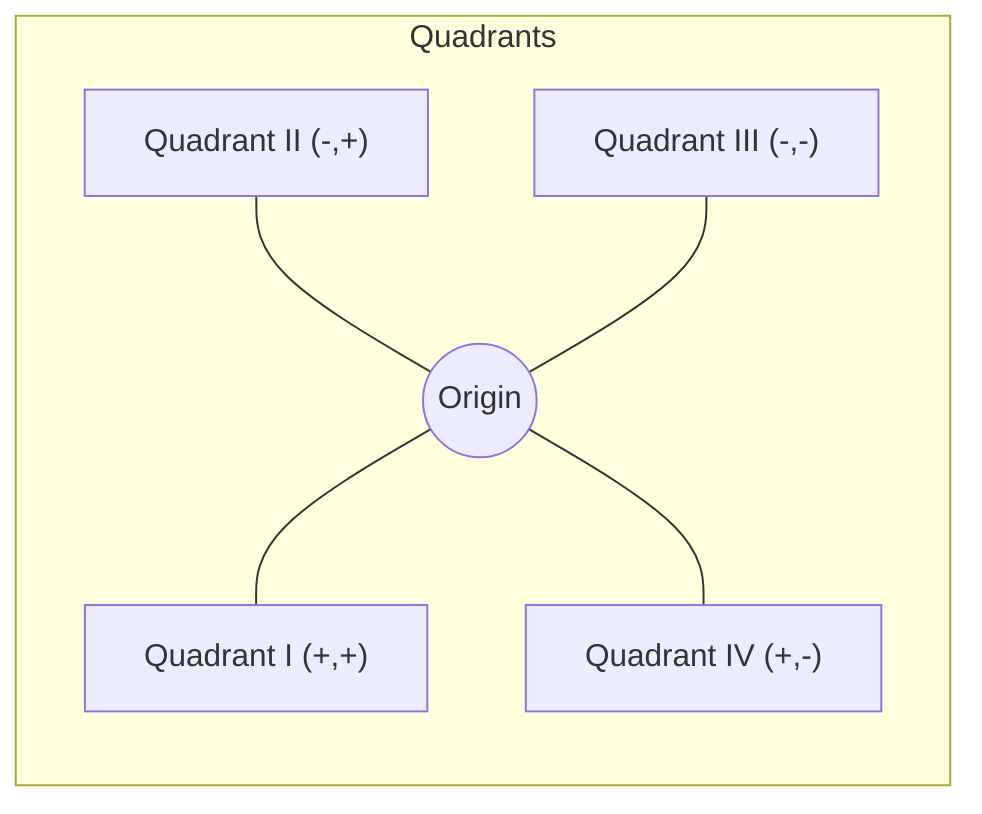

# Class 9 Maths - General Chapter 103
**Language:** English

```markdown
# [Class 9] Maths - Chapter 3: Coordinate Geometry

## 🌟 Core Concepts

📊 **Coordinate Geometry Hierarchy:**

1.  **Need for Location:**
    *   Describing position requires reference points/lines.
    *   Single reference (like a number line) is insufficient in a plane.
    *   Two independent pieces of information are needed to fix a point in a plane (e.g., street number & house number, distance from two edges).
2.  **Cartesian System (Developed by René Descartes):**
    *   Uses two perpendicular lines to locate points in a plane.
    *   **Coordinate Axes:**
        *   **x-axis:** The horizontal number line (X'OX).
        *   **y-axis:** The vertical number line (Y'OY).
        *   **Origin (O):** The point where the x-axis and y-axis intersect (their zeroes). Coordinates: (0, 0).
    *   **Coordinate Plane (Cartesian Plane or xy-plane):** The plane containing the coordinate axes.
3.  **Coordinates of a Point (x, y):**
    *   An ordered pair describing a unique location.
    *   **x-coordinate (Abscissa):** Perpendicular distance from the y-axis, measured along the x-axis. Positive to the right (OX), negative to the left (OX').
    *   **y-coordinate (Ordinate):** Perpendicular distance from the x-axis, measured along the y-axis. Positive upwards (OY), negative downwards (OY').
    *   Convention: Always write the x-coordinate first, then the y-coordinate, enclosed in parentheses: (x, y). Note: (x, y) ≠ (y, x) unless x = y.
4.  **Quadrants:**
    *   The two axes divide the plane into four regions.
    *   Numbered I, II, III, IV in an anti-clockwise direction starting from the top right (OX direction).
    *   **Sign Conventions:**
        *   Quadrant I: (+, +) (Positive x, Positive y)
        *   Quadrant II: (–, +) (Negative x, Positive y)
        *   Quadrant III: (–, –) (Negative x, Negative y)
        *   Quadrant IV: (+, –) (Positive x, Negative y)
5.  **Points on Axes:**
    *   Any point on the **x-axis** has a y-coordinate of 0. Its coordinates are of the form **(x, 0)**.
    *   Any point on the **y-axis** has an x-coordinate of 0. Its coordinates are of the form **(0, y)**.

## 📘 Key Learnings

**1. Introduction to Coordinate System:**
To precisely locate an object or a point in a two-dimensional plane, we need a system. Just like specifying a house requires a street number and a house number, or locating a dot on paper requires its distance from two perpendicular edges, locating a point mathematically requires two references. Coordinate Geometry provides this framework using two perpendicular lines.

**2. The Cartesian Coordinate System:**
This system, named after René Descartes, uses two perpendicular number lines intersecting at their origins.
*   The horizontal line is the **x-axis**.
*   The vertical line is the **y-axis**.
*   Their point of intersection is the **Origin (O)**.
*   Positive directions are typically to the right (x-axis) and upwards (y-axis). Negative directions are to the left (x-axis) and downwards (y-axis).
*   This setup creates the **Coordinate Plane** or **Cartesian Plane**.

📈 **Diagrammatic Representation:**
Imagine two number lines crossing at 0. The horizontal line X'OX is the x-axis, and the vertical line Y'OY is the y-axis. The point O is the origin.

```mermaid
graph TD
    subgraph Cartesian Plane
        direction RL
        O((Origin O(0,0))) --- X(Positive x-axis)
        O --- X'(Negative x-axis)
        O --- Y(Positive y-axis)
        O --- Y'(Negative y-axis)
    end
```

**3. Coordinates: Abscissa and Ordinate:**
A point P in the plane is located by an ordered pair (x, y).
*   **x-coordinate (Abscissa):** The perpendicular distance of P from the y-axis. It's positive if measured along OX and negative if measured along OX'.
*   **y-coordinate (Ordinate):** The perpendicular distance of P from the x-axis. It's positive if measured along OY and negative if measured along OY'.

📈 **Example:** For point P(4, 3) (as in Fig 3.10):
*   Draw PM perpendicular to the x-axis and PN perpendicular to the y-axis.
*   Abscissa (x) = PN = OM = 4 units (distance from y-axis).
*   Ordinate (y) = PM = ON = 3 units (distance from x-axis).
*   Coordinates are (4, 3).

**4. Quadrants and Sign Conventions:**
The axes divide the plane into four quadrants (I, II, III, IV). The signs of the coordinates (x, y) depend on the quadrant:

| Quadrant | x-coordinate (Abscissa) | y-coordinate (Ordinate) | Point Form | Region                 |
| :------- | :---------------------- | :---------------------- | :--------- | :--------------------- |
| I        | +                       | +                       | (+, +)     | Enclosed by OX and OY  |
| II       | –                       | +                       | (–, +)     | Enclosed by OX' and OY |
| III      | –                       | –                       | (–, –)     | Enclosed by OX' and OY'|
| IV       | +                       | –                       | (+, –)     | Enclosed by OX and OY' |

📈 **Visual:**


**5. Points on the Axes:**
*   A point on the x-axis is at zero distance from the x-axis, so its y-coordinate is 0. Example: A(4, 0) lies on the positive x-axis. C(–5, 0) lies on the negative x-axis.
*   A point on the y-axis is at zero distance from the y-axis, so its x-coordinate is 0. Example: B(0, 3) lies on the positive y-axis. D(0, –4) lies on the negative y-axis.
*   The Origin O has coordinates (0, 0).

## 🧩 Active Learning

**Activity: Plotting India's Progress 🔍**

1.  **Research:** Find the approximate Literacy Rate (%) for any 5 Indian states from the latest available census data (e.g., Census 2011 or recent NSSO surveys). Also, find the approximate Per Capita Income (in ₹) for the same 5 states for a recent year.
2.  **Represent:** Create a coordinate plane on graph paper. Let the x-axis represent Literacy Rate (%) and the y-axis represent Per Capita Income (in ₹ Thousands). Choose appropriate scales for both axes (e.g., 1 cm = 10% on x-axis, 1 cm = ₹ 20,000 on y-axis).
3.  **Plot:** For each state, represent its data as a point (Literacy Rate, Per Capita Income). Label each point with the state's name. For example, if State A has 80% literacy and ₹1,20,000 per capita income, plot the point (80, 120) [assuming y-axis is in thousands].
4.  **Analyze:** Observe the scatter plot. Do states with higher literacy rates generally tend to have higher per capita incomes based on your sample? In which quadrant would all these points lie? Why?

**Discussion: Why a Standard System Matters 🌍**

*   René Descartes' system (Cartesian coordinates) is a globally accepted convention. Why is having a standard system for locating points so important in fields like:
    *   **Mapping & Navigation:** (Think latitude/longitude, GPS) How does it help pinpoint locations accurately anywhere on Earth?
    *   **Computer Graphics & Design:** How are coordinates used to create images, animations, or design objects (like cars or buildings) on computers?
    *   **Data Visualization:** How does plotting data (like economic growth, population changes, scientific measurements) on a coordinate plane help in understanding trends and patterns? Discuss the consequences if different countries or fields used different conventions (e.g., writing y-coordinate first, or using different axis orientations).

## 📝 Assessment Prep

**Case Study 1: Reading a City Map**

Refer to Fig 3.14 in the textbook (or a similar diagram showing points on a coordinate plane).
1.  Identify the coordinates of points B, C, L, M, H, D.
2.  Identify the points corresponding to the coordinates (2, -4) and (-3, -5).
3.  Determine the abscissa of point D and the ordinate of point H.
4.  Which points lie on the axes? State their coordinates.
5.  Which points lie in Quadrant II? Quadrant IV?

**Case Study 2: Economic Indicator Graph**

📈 The graph below shows India's approximate GDP Growth Rate (%) over five consecutive financial years (FY). The x-axis represents the Financial Year (1 = FY1, 2 = FY2, etc.) and the y-axis represents the Growth Rate (%).

*(Imagine a simple line graph or bar chart plotted on a coordinate plane. Example points could be: (1, 7.2), (2, 8.0), (3, 6.5), (4, 4.0), (5, 5.1))*

1.  Represent the data for each year as coordinate points (Year, Growth Rate).
2.  What was the approximate growth rate in FY3? (Read the ordinate for x=3).
3.  In which year was the growth rate the highest? What were its coordinates?
4.  In which year was the growth rate the lowest? What were its coordinates?
5.  If the graph was extended to FY0 (previous year) and the point was (0, 6.8), where would this point lie relative to the y-axis?

**Diagram Practice:**
1.  Plot the following points on a Cartesian plane: P(3, 5), Q(-2, 4), R(-4, -6), S(5, -3), T(0, 6), U(-5, 0).
2.  Identify the quadrant or axis where each point lies.

## 🌏 Bharatiya Context

Coordinate geometry helps visualize data relevant to India. Here are some examples:

1.  **State-wise Development Indicators:** We can plot various states on a coordinate plane using indicators like Literacy Rate (%) on the x-axis and Infant Mortality Rate (per 1000 births) on the y-axis. For instance, points like Kerala (approx. 94, 7) and Bihar (approx. 62, 29) can be plotted to visually compare development status. (Data indicative).
2.  **Economic Growth Trajectory:** India's quarterly or annual GDP growth rate can be plotted over time. The x-axis represents time (quarters or years), and the y-axis represents the growth percentage. For example, plotting points like (Year 2021, 5.8%), (Year 2022, 9.1%), (Year 2023, 7.2%) helps visualize economic trends. (Data indicative).
3.  **Population Density Mapping:** Major Indian cities can be represented on a grid. If we consider a reference point (like Delhi as approx. origin), we could roughly plot Mumbai, Chennai, Kolkata using relative coordinates based on their geographical location (simplified Eastings and Northings) or plot City Index vs Population Density. For example, (Mumbai Index 1, Density ~20000/sq km), (Delhi Index 2, Density ~11000/sq km). This helps visualize population distribution patterns. (Data indicative).
```