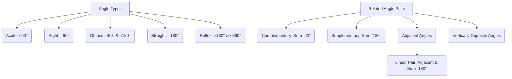

# Class 9 Maths - General Chapter 106
**Language:** English

```markdown
# [Class 9] Maths - Chapter 6: Lines and Angles

## 🌟 Core Concepts

This chapter explores the fundamental properties of lines and angles, focusing on the relationships formed when lines intersect or are parallel.

**📊 Concept Hierarchy:**

1.  **Basic Geometric Terms:**
    *   Line, Line Segment, Ray
    *   Collinear & Non-collinear Points
    *   Angle: Arms, Vertex
    *   Types of Angles: Acute, Right, Obtuse, Straight, Reflex
2.  **Pairs of Angles:**
    *   Complementary Angles (Sum = 90°)
    *   Supplementary Angles (Sum = 180°)
    *   Adjacent Angles (Common vertex, common arm, non-common arms on different sides)
    *   Linear Pair of Angles (Adjacent angles whose non-common arms form a line; Sum = 180°)
    *   Vertically Opposite Angles (Formed by two intersecting lines, opposite to each other)
3.  **Lines:**
    *   Intersecting Lines (Meet at a point)
    *   Non-intersecting (Parallel) Lines (Constant perpendicular distance between them)
4.  **Relationships involving Lines and Angles:**
    *   **Axioms & Theorems for Intersecting Lines:**
        *   Axiom 6.1 (Linear Pair Axiom - Part 1): If a ray stands on a line, the sum of adjacent angles is 180°.
        *   Axiom 6.2 (Linear Pair Axiom - Part 2): If the sum of two adjacent angles is 180°, their non-common arms form a line.
        *   Theorem 6.1: If two lines intersect, vertically opposite angles are equal.
    *   **Relationships involving Parallel Lines and a Transversal:**
        *   Corresponding Angles (Axiom/Converse)
        *   Alternate Interior Angles (Theorem/Converse)
        *   Interior Angles on the Same Side of the Transversal (Consecutive Interior Angles) (Theorem/Converse)
    *   **Theorem for Lines Parallel to the Same Line:**
        *   Theorem 6.6: Lines parallel to the same line are parallel to each other.

## 📘 Key Learnings

**1. Basic Terms and Definitions (Revision):**
*   **Line Segment (AB):** Part of a line with two endpoints. Length denoted by AB.
*   **Ray (AB →):** Part of a line with one endpoint, extending indefinitely in one direction.
*   **Line (AB ↔):** Extends indefinitely in both directions.
*   **Angle:** Formed by two rays originating from the same endpoint (vertex).
*   **Types of Angles:**
    *   Acute: 0° < angle < 90°
    *   Right: angle = 90°
    *   Obtuse: 90° < angle < 180°
    *   Straight: angle = 180°
    *   Reflex: 180° < angle < 360°
*   **Related Angles:**
    *   Complementary: Sum is 90°.
    *   Supplementary: Sum is 180°.
    *   Adjacent: Share vertex and one arm; non-common arms on opposite sides.
    *   Linear Pair: Adjacent angles forming a straight line (sum = 180°).
    *   Vertically Opposite: Formed by intersecting lines, opposite each other.

**📈 Diagram: Types of Angles & Related Pairs**


**2. Intersecting Lines and Associated Angles:**
*   **Linear Pair Axiom (Axioms 6.1 & 6.2):**
    *   If a ray stands on a line, the sum of the two adjacent angles formed is 180°. (Fig 6.6)
    *   Conversely, if the sum of two adjacent angles is 180°, the non-common arms form a line. (Fig 6.7)
    *   *Diagram:*
        ```mermaid
        graph LR
            subgraph Linear Pair
                A --- O --- B
                O --- C
                angle1(∠AOC)
                angle2(∠BOC)
            end
            A -- Ray OC stands on Line AB --> B;
            B -- Axiom 6.1 --> C(∠AOC + ∠BOC = 180°);
            C -- Axiom 6.2 --> D(If ∠AOC + ∠BOC = 180°, then AOB is a line);
        ```
*   **Vertically Opposite Angles Theorem (Theorem 6.1):**
    *   When two lines intersect, the vertically opposite angles formed are equal. (Fig 6.8)
    *   *Proof Idea:* Uses the Linear Pair Axiom. If lines AB and CD intersect at O, then ∠AOC + ∠AOD = 180° and ∠AOD + ∠BOD = 180°. Equating these gives ∠AOC = ∠BOD. Similarly, ∠AOD = ∠BOC.
    *   *Diagram:*
        ```mermaid
        graph TD
            subgraph Intersecting Lines AB & CD at O
                A --- O --- B
                C --- O --- D
                angle1(∠AOC)
                angle2(∠BOD)
                angle3(∠AOD)
                angle4(∠BOC)
            end
            Intersecting --> VOA(Vertically Opposite Angles);
            VOA --> Eq1(∠AOC = ∠BOD);
            VOA --> Eq2(∠AOD = ∠BOC);
        ```

**3. Parallel Lines and Transversals:**
*   **Parallel Lines:** Lines that never intersect, maintaining a constant perpendicular distance. (Fig 6.5 ii)
*   **Transversal:** A line intersecting two or more other lines at distinct points.
*   **Angles Formed by a Transversal:** Corresponding Angles, Alternate Interior Angles, Alternate Exterior Angles, Interior Angles on the same side (Consecutive Interior).
*   **Key Relationships (Axioms & Theorems - Not explicitly numbered in summary but covered in Ch 6):**
    *   If a transversal intersects two *parallel* lines:
        *   Each pair of corresponding angles is equal. (Corresponding Angles Axiom)
        *   Each pair of alternate interior angles is equal.
        *   Each pair of interior angles on the same side of the transversal is supplementary (sum = 180°).
    *   Conversely, if a transversal intersects two lines such that *any one* of the following holds:
        *   A pair of corresponding angles is equal. (Converse of Corresponding Angles Axiom)
        *   A pair of alternate interior angles is equal.
        *   A pair of interior angles on the same side of the transversal is supplementary.
        *   Then the two lines are *parallel*.

**📈 Diagram: Parallel Lines and Transversal**
```mermaid
graph TD
    subgraph Parallel Lines m || n with Transversal t
        direction LR
        L1---A---L2(Line m)
        L3---B---L4(Line n)
        T1---A---B---T2(Transversal t)

        style L1 fill:none,stroke:none
        style L2 fill:none,stroke:none
        style L3 fill:none,stroke:none
        style L4 fill:none,stroke:none
        style T1 fill:none,stroke:none
        style T2 fill:none,stroke:none

        subgraph Angles at A
            a1(Top-Left) --- a2(Top-Right)
            a3(Bottom-Left) --- a4(Bottom-Right)
        end
        subgraph Angles at B
            b1(Top-Left) --- b2(Top-Right)
            b3(Bottom-Left) --- b4(Bottom-Right)
        end
    end
    P[Parallel Lines m || n] --> C{Angles Formed};
    C --> CA(Corresponding Angles Equal: a1=b1, a2=b2, a3=b3, a4=b4);
    C --> AIA(Alternate Interior Angles Equal: a4=b1, a3=b2);
    C --> CIA(Consecutive Interior Angles Supplementary: a4+b2=180°, a3+b1=180°);

    Converse{Converse Theorems} --> P;
    CA --> Converse;
    AIA --> Converse;
    CIA --> Converse;

```

**4. Lines Parallel to the Same Line (Theorem 6.6):**
*   Lines that are parallel to the same line are parallel to each other. (Fig 6.18)
*   If line *m* || line *l* and line *n* || line *l*, then line *m* || line *n*.
*   *Proof Idea:* Uses the Corresponding Angles Axiom and its converse. Draw a transversal intersecting all three lines. Angles formed by the transversal with *m* and *n* can be related to the angle formed with *l*, proving equality and thus parallelism between *m* and *n*.

## 🧩 Active Learning

**Activity: Research-based Case Study Analysis 🔍**

*   **Topic:** Application of Lines and Angles in Indian Urban Planning or Infrastructure.
*   **Task:** Research the layout of a planned city in India (e.g., Chandigarh, Gandhinagar, Navi Mumbai) or a major infrastructure project (e.g., Delhi Metro network, Golden Quadrilateral highway project).
    *   Identify examples of parallel lines (roads, tracks) and intersecting lines (junctions, crossings).
    *   Analyze how specific angles are used in road intersections (e.g., right angles, acute/obtuse angles) and their potential impact on traffic flow and safety.
    *   Consider how railway engineers ensure tracks remain parallel and manage angles at switches and crossings.
    *   Prepare a short report or presentation with diagrams illustrating your findings. Evaluate the effectiveness of the geometric planning observed.

**Discussion: Critical Analysis of Real-World Impacts 🌍**

*   **Topic:** Precision in Angles and Parallelism.
*   **Questions:**
    1.  Why is the concept of parallel lines crucial in construction (e.g., walls of a building, railway tracks)? What could happen if lines intended to be parallel are not?
    2.  Consider manufacturing processes (e.g., cutting tiles, assembling furniture, designing machine parts). How critical is the accuracy of angles? Discuss potential consequences of errors (e.g., instability, poor fit, malfunction).
    3.  In navigation (aviation or maritime), pilots and captains use angles for direction (bearings). How do the concepts of angles and lines apply here? Why is precision vital?
    4.  Reflect on the examples given in the chapter introduction (hut model, architect's plan, ray diagrams in physics, force diagrams). Evaluate the importance of understanding lines and angles in these diverse fields.

## 📝 Assessment Prep

**Case Studies & Diagrams 📝**

*   **Case Study 1:** An architect is designing a staircase. The steps need to be parallel to the floor, and the handrail needs to be parallel to the slope of the stairs. A supporting beam makes an angle of 110° with the floor. Draw a diagram representing this situation. Using the properties of parallel lines and transversals, determine the angle the handrail makes with the supporting beam. Justify your steps using axioms or theorems.
*   **Case Study 2:** Two parallel roads are intersected by a third road (transversal). At one intersection, the acute angle formed is 50°. Draw a diagram. Find all other angles at both intersections, clearly stating the geometric reasons (Linear Pair Axiom, Vertically Opposite Angles Theorem, Corresponding Angles Axiom, Alternate Interior Angles Theorem, etc.).
*   **Diagram-Based Problems:** Practice solving problems similar to Examples 1-6 and Exercises 6.1 & 6.2, which involve finding unknown angles using the properties learned. Pay close attention to providing reasons for each step. For example:
    *   Given intersecting lines with one angle known, find others.
    *   Given a figure with parallel lines and a transversal, find unknown angles x, y, z.
    *   Prove relationships between angles based on given conditions (e.g., Exercise 6.1 Q3, Q5; Exercise 6.2 Q5).
    *   Problems involving angle bisectors and parallel lines (e.g., Example 2, Example 5).

## 🌏 Bharatiya Context

**National Economic/Social Data & Geometry 📊**

1.  **Infrastructure Development (e.g., Bharatmala Pariyojana):** India's extensive highway development projects involve meticulous planning using geometric principles. Roads are often designed as parallel carriageways. Interchanges and junctions (like cloverleafs or roundabouts) are designed using specific curves and angles derived from geometric calculations to ensure smooth traffic flow and safety. The angle at which slip roads merge or diverge from the main highway is critical. Analyzing maps or plans of such projects reveals practical applications of parallel lines, intersecting lines, and angles.
2.  **Railway Network Expansion:** The Indian Railways network, one of the largest in the world, relies heavily on the geometry of lines and angles. Maintaining the precise gauge (distance between parallel rails) is crucial for train stability. Designing track layouts for stations, junctions, and crossings involves complex arrangements of intersecting and parallel lines, using specific angles (e.g., for 'switches' or 'points' that guide trains from one track to another). Theorem 6.6 (Lines parallel to the same line are parallel) is implicitly fundamental here.
3.  **Analyzing Economic Trends (NSO/RBI Data):** Consider a line graph showing India's GDP growth rate (%) over the last 10 years, using data from the National Statistical Office (NSO) or RBI.
    *   Each segment connecting two consecutive years' data points forms a line segment.
    *   The **angle** this line segment makes with the horizontal axis (or its **slope**) represents the rate of change in GDP growth during that year. A steeper upward angle indicates faster acceleration in growth, while a downward angle indicates deceleration or contraction.
    *   Comparing the angles/slopes of segments from different periods allows for evaluating whether economic growth is accelerating or slowing down. For instance, comparing the average angle of the graph line from 2014-2019 versus 2004-2009 provides a visual and geometric way to assess changes in economic momentum.
```