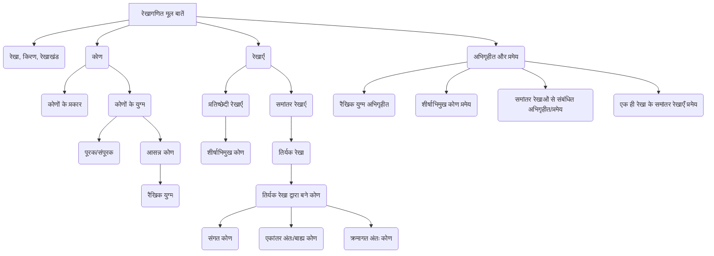

# Class 9 Maths - General Chapter 106
**Language:** हिंदी

```markdown
# [कक्षा 9] गणित - अध्याय 6: रेखाएँ और कोण

## 🌟 मुख्य अवधारणाएँ (Core Concepts)

**रेखागणित की मूलभूत शब्दावली और परिभाषाएँ:**
*   **रेखाखंड (Line Segment):** दो अंत बिंदुओं वाली रेखा का एक भाग। (जैसे AB)
*   **किरण (Ray):** एक अंत बिंदु वाली रेखा का एक भाग। (जैसे →AB)
*   **रेखा (Line):** दोनों दिशाओं में असीमित रूप से फैली हुई। (जैसे ↔AB)
*   **संरेख बिंदु (Collinear Points):** तीन या अधिक बिंदु जो एक ही रेखा पर स्थित हों।
*   **असंरेख बिंदु (Non-collinear Points):** तीन या अधिक बिंदु जो एक ही रेखा पर स्थित न हों।
*   **कोण (Angle):** जब दो किरणें एक ही अंत बिंदु से प्रारंभ होती हैं।
    *   **भुजाएँ (Arms):** कोण बनाने वाली किरणें।
    *   **शीर्ष (Vertex):** उभयनिष्ठ अंत बिंदु।

**कोणों के प्रकार (Types of Angles):**
*   **न्यून कोण (Acute Angle):** 0° और 90° के बीच।
*   **समकोण (Right Angle):** ठीक 90°।
*   **अधिक कोण (Obtuse Angle):** 90° से अधिक और 180° से कम।
*   **ऋजु कोण (Straight Angle):** ठीक 180°।
*   **प्रतिवर्ती कोण (Reflex Angle):** 180° से अधिक और 360° से कम।

**कोणों के युग्म (Pairs of Angles):**
*   **पूरक कोण (Complementary Angles):** दो कोण जिनका योग 90° हो।
*   **संपूरक कोण (Supplementary Angles):** दो कोण जिनका योग 180° हो।
*   **आसन्न कोण (Adjacent Angles):**
    *   उभयनिष्ठ शीर्ष (Common vertex)
    *   उभयनिष्ठ भुजा (Common arm)
    *   अनुभयनिष्ठ भुजाएँ उभयनिष्ठ भुजा के विपरीत ओर हों।
*   **कोणों का रैखिक युग्म (Linear Pair of Angles):** दो आसन्न कोण जिनकी अनुभयनिष्ठ भुजाएँ एक रेखा बनाती हैं (योग 180°)।
*   **शीर्षाभिमुख कोण (Vertically Opposite Angles):** जब दो रेखाएँ प्रतिच्छेद करती हैं, तो आमने-सामने बनने वाले कोणों के युग्म।

**रेखाएँ (Lines):**
*   **प्रतिच्छेदी रेखाएँ (Intersecting Lines):** वे रेखाएँ जो एक बिंदु पर मिलती हैं।
*   **समांतर रेखाएँ (Parallel Lines):** वे रेखाएँ जो कभी नहीं मिलतीं (उनके बीच की लंबवत दूरी हमेशा समान रहती है)।

**तिर्यक रेखा और संबंधित कोण (Transversal and Related Angles):**
*   **तिर्यक रेखा (Transversal):** वह रेखा जो दो या अधिक रेखाओं को भिन्न-भिन्न बिंदुओं पर प्रतिच्छेद करती है।
*   **संगत कोण (Corresponding Angles):** तिर्यक रेखा के एक ही ओर और रेखाओं के सापेक्ष समान स्थिति वाले कोण।
*   **एकांतर अंतः कोण (Alternate Interior Angles):** तिर्यक रेखा के विपरीत ओर और दो रेखाओं के बीच स्थित कोण।
*   **एकांतर बाह्य कोण (Alternate Exterior Angles):** तिर्यक रेखा के विपरीत ओर और दो रेखाओं के बाहर स्थित कोण।
*   **तिर्यक रेखा के एक ही ओर के अंतः कोण (Consecutive Interior Angles / Co-interior Angles):** तिर्यक रेखा के एक ही ओर और दो रेखाओं के बीच स्थित कोण (इन्हें क्रमागत अंतः कोण या सह-अंतः कोण भी कहते हैं)।

**अभिगृहीत और प्रमेय (Axioms and Theorems):**
*   **रैखिक युग्म अभिगृहीत (Linear Pair Axiom):** (अभिगृहीत 6.1 और 6.2)
*   **शीर्षाभिमुख कोण प्रमेय (Vertically Opposite Angles Theorem):** (प्रमेय 6.1)
*   **समांतर रेखाओं से संबंधित अभिगृहीत और प्रमेय:** (संगत कोण अभिगृहीत, एकांतर अंतः कोण प्रमेय, क्रमागत अंतः कोण प्रमेय और उनके विलोम)
*   **एक ही रेखा के समांतर रेखाएँ प्रमेय (Lines Parallel to the Same Line Theorem):** (प्रमेय 6.6)

📊 **अवधारणा पदानुक्रम (Concept Hierarchy):**


## 📘 मुख्य सीख (Key Learnings)

1.  **रैखिक युग्म अभिगृहीत (Linear Pair Axiom):**
    *   **अभिगृहीत 6.1:** यदि एक किरण एक रेखा पर खड़ी हो, तो इस प्रकार बने दोनों आसन्न कोणों का योग 180° होता है।
        ```mermaid
        graph TD
            subgraph अभिगृहीत 6.1
                A---O---B;
                O---C;
                LabelA[∠AOC]
                LabelB[∠BOC]
                LabelSum((∠AOC + ∠BOC = 180°))
            end
        ```
        📈 **चित्र:** रेखा AB पर किरण OC खड़ी है। ∠AOC और ∠BOC आसन्न कोण हैं। अतः ∠AOC + ∠BOC = 180°.
    *   **अभिगृहीत 6.2 (विलोम):** यदि दो आसन्न कोणों का योग 180° है, तो उनकी अनुभयनिष्ठ भुजाएँ एक रेखा बनाती हैं।

2.  **शीर्षाभिमुख कोण प्रमेय (Vertically Opposite Angles Theorem):**
    *   **प्रमेय 6.1:** यदि दो रेखाएँ परस्पर प्रतिच्छेद करती हैं, तो शीर्षाभिमुख कोण बराबर होते हैं।
        ```mermaid
        graph TD
            subgraph प्रमेय 6.1
                A---O---B;
                C---O---D;
                Label1[∠AOC = ∠BOD]
                Label2[∠AOD = ∠BOC]
            end
        ```
        📈 **चित्र:** रेखाएँ AB और CD बिंदु O पर प्रतिच्छेद करती हैं। ∠AOC और ∠BOD शीर्षाभिमुख कोण हैं, अतः ∠AOC = ∠BOD। इसी प्रकार, ∠AOD = ∠BOC।
    *   **उपपत्ति (Proof Idea):** रैखिक युग्म अभिगृहीत का उपयोग करके। जैसे, ∠AOC + ∠AOD = 180° और ∠AOD + ∠BOD = 180°। इन दोनों से निष्कर्ष निकलता है कि ∠AOC = ∠BOD।

3.  **समांतर रेखाएँ और तिर्यक रेखा (Parallel Lines and Transversal):**
    *   **संगत कोण अभिगृहीत (Corresponding Angles Axiom):** यदि एक तिर्यक रेखा दो समांतर रेखाओं को प्रतिच्छेद करती है, तो संगत कोणों का प्रत्येक युग्म बराबर होता है। (और इसका विलोम भी सत्य है)।
    *   **एकांतर अंतः कोण प्रमेय (Alternate Interior Angles Theorem):** यदि एक तिर्यक रेखा दो समांतर रेखाओं को प्रतिच्छेद करती है, तो एकांतर अंतः कोणों का प्रत्येक युग्म बराबर होता है। (और इसका विलोम भी सत्य है)।
    *   **क्रमागत अंतः कोण प्रमेय (Consecutive Interior Angles Theorem):** यदि एक तिर्यक रेखा दो समांतर रेखाओं को प्रतिच्छेद करती है, तो तिर्यक रेखा के एक ही ओर के अंतः कोणों का प्रत्येक युग्म संपूरक (योग 180°) होता है। (और इसका विलोम भी सत्य है)।
        ```mermaid
        graph TD
            subgraph समांतर रेखाएँ और तिर्यक रेखा
                direction LR
                subgraph रेखाएँ
                    L1[रेखा l] --- M1( );
                    L2[रेखा m] --- M2( );
                    style M1 fill:none,stroke:none
                    style M2 fill:none,stroke:none
                end
                subgraph तिर्यक रेखा t
                    T1 --- T2;
                    style T1 fill:none,stroke:none
                    style T2 fill:none,stroke:none
                end
                P1 --- P2 --- P3 --- P4 --- P1;
                style P1 fill:none,stroke:none
                style P2 fill:none,stroke:none
                style P3 fill:none,stroke:none
                style P4 fill:none,stroke:none
                L1 -- 1/2 --> P1;
                L1 -- 3/4 --> P2;
                L2 -- 5/6 --> P3;
                L2 -- 7/8 --> P4;
                T1 -- ∠1, ∠2, ∠7, ∠8 --> L1;
                T2 -- ∠3, ∠4, ∠5, ∠6 --> L2;

                Rel1((यदि l || m, तब))
                Rel1 --> C1(∠1=∠5, ∠2=∠6, ∠4=∠8, ∠3=∠7 [संगत कोण]);
                Rel1 --> C2(∠4=∠6, ∠3=∠5 [एकांतर अंतः कोण]);
                Rel1 --> C3(∠1=∠7, ∠2=∠8 [एकांतर बाह्य कोण]);
                Rel1 --> C4(∠4+∠5=180°, ∠3+∠6=180° [क्रमागत अंतः कोण]);
            end
        ```
        📈 **चित्र:** रेखा l || रेखा m, t तिर्यक रेखा है। उपरोक्त संबंध लागू होते हैं।

4.  **एक ही रेखा के समांतर रेखाएँ (Lines Parallel to the Same Line):**
    *   **प्रमेय 6.6:** वे रेखाएँ जो एक ही रेखा के समांतर हों, परस्पर समांतर होती हैं।
    *   यदि रेखा l || रेखा m और रेखा n || रेखा m, तो रेखा l || रेखा n।

## 🧩 सक्रिय अधिगम (Active Learning)

*   **गतिविधि: अनुसंधान-आधारित केस स्टडी विश्लेषण 🔍 (Activity: Research-based Case Study Analysis)**
    *   **विषय:** अपने आसपास (स्कूल भवन, घर, पुल, फर्नीचर) या प्रसिद्ध भारतीय संरचनाओं (जैसे, इंडिया गेट, हावड़ा ब्रिज, जयपुर शहर की योजना, मंदिरों की वास्तुकला) में प्रतिच्छेदी और समांतर रेखाओं तथा विभिन्न प्रकार के कोणों के उदाहरण खोजें।
    *   **कार्य:** इन संरचनाओं के चित्र/ब्लूप्रिंट (यदि उपलब्ध हों) का विश्लेषण करें। पहचानें कि कोणों और रेखाओं के गुणों का उपयोग स्थिरता, डिज़ाइन और कार्यक्षमता सुनिश्चित करने के लिए कैसे किया गया है। उदाहरण के लिए, पुलों में त्रिभुजाकार संरचनाएं क्यों आम हैं? इमारतों में दीवारें और फर्श आमतौर पर समकोण पर क्यों होते हैं?
    *   **प्रस्तुति:** अपने निष्कर्षों को चित्रों और मापों (अनुमानित) के साथ प्रस्तुत करें।

*   **चर्चा: वास्तविक दुनिया के प्रभावों का आलोचनात्मक विश्लेषण 🌍 (Discussion: Critical Analysis of Real-world Impacts)**
    *   **प्रश्न:** सोचिए, अगर वास्तुकार (architect) या इंजीनियर रेखाओं और कोणों के गुणों को सटीक रूप से लागू न करें तो क्या होगा? इमारतों, पुलों या मशीनों की सुरक्षा और स्थिरता पर क्या प्रभाव पड़ेगा?
    *   **चर्चा बिंदु:**
        *   दैनिक जीवन में कोणों और समांतर रेखाओं की सटीकता का महत्व (जैसे, बढ़ईगीरी, सड़क निर्माण)।
        *   कला और डिज़ाइन में रेखाओं और कोणों का उपयोग (जैसे, रंगोली, वास्तुकला पैटर्न)।
        *   नेविगेशन (दिशा निर्धारण) और खगोल विज्ञान में कोणों की भूमिका।
        *   क्या होगा यदि रेलवे ट्रैक पूरी तरह समानांतर न हों?

## 📝 मूल्यांकन तैयारी (Assessment Prep)

*   **केस स्टडीज और आरेख-आधारित प्रश्न 📝 (Case Studies & Diagram-based Questions):**
    *   दिए गए आरेखों में अज्ञात कोणों का मान ज्ञात करने के लिए रैखिक युग्म अभिगृहीत, शीर्षाभिमुख कोण प्रमेय और समांतर रेखाओं के गुणों का उपयोग करें (NCERT अभ्यास 6.1, 6.2 के समान)।
    *   **उदाहरण केस स्टडी:** एक बढ़ई एक मेज बना रहा है। मेज का ऊपरी सतह समतल होने और पैर जमीन पर लंबवत होने के लिए उसे किन कोणों और रेखा संबंधों का ध्यान रखना होगा? यदि एक पैर थोड़ा तिरछा हो जाए, तो कोणों में क्या परिवर्तन आएगा और स्थिरता पर क्या प्रभाव पड़ेगा? (आरेख बनाकर विश्लेषण करें)।
    *   **आरेख उदाहरण:**
        ```mermaid
        graph TD
            subgraph प्रश्न
                A --- O --- B;
                C --- O --- D;
                E --- O;
                LabelAOC[∠AOC = ?]
                LabelBOE[∠BOE = 30°]
                LabelBOD[∠BOD = 40°]
                FindCOE[∠COE = ?]
                FindReflexCOE[प्रतिवर्ती ∠COE = ?]
                Condition[दिया है: AB एक रेखा है, ∠BOE=30°, ∠BOD=40°]
            end
        ```
        *   उपरोक्त आरेख में ∠AOC, ∠COE और प्रतिवर्ती ∠COE ज्ञात करें। (संकेत: ∠AOC = ∠BOD, AB एक ऋजु रेखा है)।

*   **सिद्ध करने वाले प्रश्न:** प्रमेयों (जैसे प्रमेय 6.1) को सिद्ध करना या दिए गए कथनों को अभिगृहीतों/प्रमेयों का उपयोग करके सिद्ध करना (जैसे अभ्यास 6.1 का प्रश्न 3, 4, 5)।

## 🌏 भारतीय संदर्भ (Bharatiya Context)

*   **प्राचीन भारतीय वास्तुकला और नगर नियोजन:**
    *   हड़प्पा सभ्यता के शहरों (जैसे धोलावीरा, लोथल) की योजना में समकोण पर काटती सड़कें समांतर और लंबवत रेखाओं के ज्ञान को दर्शाती हैं।
    *   वैदिक यज्ञ वेदियों के निर्माण में सटीक ज्यामितीय आकृतियों और कोणों का उपयोग होता था, जैसा कि शुल्बसूत्रों में वर्णित है।
    *   **उदाहरण:** जयपुर शहर की योजना ग्रिड पैटर्न पर आधारित है, जिसमें सड़कें एक-दूसरे को समकोण पर काटती हैं, जो रेखाओं और कोणों के सिद्धांतों का उत्कृष्ट उदाहरण है।

*   **मंदिर वास्तुकला:**
    *   भारत के कई प्राचीन और मध्यकालीन मंदिरों (जैसे, कोणार्क सूर्य मंदिर, खजुराहो के मंदिर) के डिजाइन में जटिल ज्यामितीय पैटर्न, समरूपता और विभिन्न कोणों का उपयोग स्पष्ट रूप से दिखाई देता है। शिखर की संरचना, मंडप के स्तंभों की व्यवस्था कोणों और रेखाओं के सटीक ज्ञान पर आधारित है।

*   **पारंपरिक कला और शिल्प:**
    *   **रंगोली/कोलम:** दक्षिण भारत में फर्श पर बनाई जाने वाली कोलम या देश के अन्य हिस्सों में रंगोली, बिंदुओं के ग्रिड का उपयोग करके बनाई जाती है, जिसमें सीधी रेखाओं, वक्रों और कोणों से जटिल पैटर्न बनाए जाते हैं। यह समांतर रेखाओं, प्रतिच्छेदी रेखाओं और समरूपता का एक सुंदर अनुप्रयोग है।
    *   **कपड़ा डिजाइन:** पारंपरिक भारतीय वस्त्रों, जैसे साड़ियों और शॉल पर पाए जाने वाले पैटर्न अक्सर ज्यामितीय आकृतियों, समांतर रेखाओं और कोणों पर आधारित होते हैं।

*   **आधुनिक भारत:**
    *   रेलवे नेटवर्क का विशाल जाल समांतर पटरियों पर निर्भर करता है।
    *   पुलों, राजमार्गों और फ्लाईओवर के निर्माण में कोणों और रेखाओं के सिद्धांतों का व्यापक उपयोग होता है ताकि वे सुरक्षित और स्थिर हों।
```