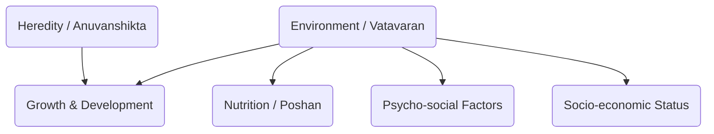

# Class 9 Physical Education - Physical Education Chapter 102
**Language:** Hinglish

```markdown
# [Class 9] Physical Education - Chapter 102: Growing up with Confidence

## 🌟 Core Concepts (Mukhya Avdharnayein) 📊

Yeh chapter 'Adolescence' yaani kishoravastha ke important stage par focus karta hai. Hum seekhenge:

1.  **Adolescence ki Samajh (Understanding Adolescence):**
    *   Growth (Vriddhi): Sharir ka size mein badhna (quantitative).
    *   Development (Vikas): Qualitative aur quantitative changes jo maturity laate hain.
    *   Maturation (Paripakvata): Functional capacity ka develop hona (jaise chalna, bolna seekhna).
    *   Adolescence (Kishoravastha): Bachpan aur adulthood ke beech ka transition period (approx. 10-19 saal), jisme tezi se physical, mental, emotional badlav aate hain.

2.  **Growth ko Prabhavit Karne Wale Factors (Factors Affecting Growth):**
    *   **Heredity (Anuvanshikta):** Genes jo parents se milte hain (height, body type - ectomorph, mesomorph, endomorph).
    *   **Environment (Vatavaran):**
        *   **Nutrition (Poshan):** Balanced diet ki zaroorat, nutrients (proteins, carbs, fats, vitamins, minerals), undernutrition/malnutrition ka asar (stunted growth, *iodine deficiency* se mental/physical growth retardation).
        *   **Psycho-social Environment (Manovaijnyanik-Samajik Mahol):** Emotional stress ka growth par negative asar. Stressful environment growth rok sakta hai.
        *   **Socio-economic Status (Samajik-Arthik Stithi):** Gareebi (*poverty*), kam resources se growth par asar. *Jaise Srinivas ka case jhuggi mein rehne aur kam khane ki wajah se.*

3.  **Self-Concept aur Self-Esteem (Aatm-Avdharna aur Aatm-Samman):**
    *   Apne baare mein soch ('Self') develop hona.
    *   Physical changes ka self-image par asar.
    *   Peer group (saathi samuh) ka influence aur acceptance ki zaroorat.
    *   Positive self-esteem confidence ke liye zaroori hai.

4.  **Psychological Security (Manovaijnyanik Suraksha):**
    *   Stress-free mahol ki ahmiyat.
    *   Parental support ki zaroorat.
    *   Secure feel karne wale bachhe studies aur relationships mein behtar hote hain.

5.  **Mental Health Challenges (Mansik Swasthya Chunautiyan):**
    *   **Anxiety (Chinta):** Ghabrahat, bechaini. Normal ho sakti hai, lekin zyada hone par problem.
    *   **Depression (Avasaad):** Lambe samay tak udaasi, nirasha, social withdrawal.
    *   **Psychosis:** Reality se contact toot jaana (delusions, hallucinations).
    *   **Suicidal Tendency (Aatmahatya ki Pravritti):** Depression se judi ho sakti hai, impulsive behaviour. Help lena zaroori hai.

6.  **Drug/Substance Abuse (Nasheele Padarthon ka Durupyog):**
    *   Kyun hota hai (peer pressure, low self-esteem).
    *   Drug 'Use' (dawai ke liye) vs 'Abuse' (galat istemal). *Jaise cough syrup ka case.*
    *   Types: Stimulants, Depressants, Narcotics, Hallucinogens.
    *   Symptoms: Physical, Behavioural, Performance related.
    *   Consequences: Health risks (HIV/STIs ka khatra), family/society par bojh.

7.  **Sexual Harassment/Abuse (Yaun Utpeedan/Shoshan):**
    *   Definition: Unwelcome sexual behaviour (physical, verbal, non-verbal).
    *   Boys aur girls dono vulnerable ho sakte hain.
    *   Accused aksar jaan-pehchan wala hota hai.
    *   Confidence se 'NO' kehna aur trusted adults (parents, teachers) ko batana zaroori hai.
    *   *POCSO Act, 2012* ke baare mein jaankari.

## 📘 Key Learnings (Mukhya Baatein) 📈

**1. Growth, Development, Maturation mein Antar:**

*   **Growth:** Sirf size badhna (Height, Weight). Quantitative. *Jaise ek saal mein height 5 inch badh gayi.*
*   **Development:** Overall changes (physical, mental, social, emotional). Qualitative + Quantitative. *Jaise bachhe ka samajhdar hona.*
*   **Maturation:** Sharir ke parts ka function karne layak hona. Functional capacity. *Jaise reproductive organs ka mature hona puberty mein.*

**(Conceptual Diagram: Growth -> Development -> Maturation Flow)**
```mermaid
graph LR
    A[Growth (Size Increase)] --> B(Development (Overall Changes));
    B --> C(Maturation (Functional Readiness));
```

**2. Factors Affecting Growth:**

*   **Heredity:** Aapke genes decide karte hain potential growth ko. Lambe parents ke bachhe usually lambe hote hain. Body types (patla - ectomorph, muscular - mesomorph, gol-matol - endomorph) bhi heredity par depend karte hain. Isliye apne physique ko lekar negative nahi sochna chahiye.
*   **Environment:**
    *   **Nutrition:** Sabse important external factor. Balanced diet (santulit aahar) jisme sabhi nutrients (Proteins, Carbohydrates, Fats, Vitamins, Minerals, Water) sahi quantity mein ho, zaroori hai. Kami se growth ruk sakti hai (*stunting*), galat khan-paan se *obesity* ho sakti hai. *Bharat mein Iodine ki kami se bachne ke liye Iodised Salt ka istemal zaroori hai.*
    *   **Psycho-social:** Stress, tension, khushi, family support - yeh sab hormones par asar daalkar growth ko affect karte hain. Bahut zyada physical exercise (jaise athletes mein) menarche (first menstruation) delay kar sakti hai.
    *   **Socio-economic:** Gareebi, saaf-safai ki kami, poshan ki kami growth ko kam kar deti hai. *Bharat mein National Family Health Survey (NFHS) ke data aksar malnutrition ke high rates dikhate hain, khaaskar economically weaker sections mein.*

**(Conceptual Diagram: Factors Influencing Growth)**


**3. Self-Esteem aur Confidence:**
Adolescence mein body changes ke kaaran self-consciousness badhti hai. Dosto ki acceptance important ho jaati hai. Positive self-image aur self-esteem build karna zaroori hai. Parents, teachers aur friends ka support ismein madad karta hai. Low self-esteem se performance par bura asar padta hai.

**4. Mental Health Issues se Nipटना:**
Anxiety aur depression common hain but agar serious ho toh help lena zaroori hai (parents, teachers, counsellors). Physical activity aur hobbies mein busy rehna madad karta hai. Suicidal thoughts aane par turant kisi trusted adult se baat karni chahiye.

**5. Drug Abuse se Bachav:**
Drugs temporary relief dete hain lekin long-term mein health, relationships aur future barbaad kar dete hain. Symptoms pehchan kar madad lena/dena zaroori hai. Healthy lifestyle, nutritious food, exercise, yoga aur positive relationships drug abuse se bachne mein madad karte hain.

**6. Sexual Harassment ko Pehchanna aur Rokna:**
Kisi bhi tarah ka unwelcome sexual behaviour harassment hai. Yeh ek crime hai. Agar aisa ho toh chup na rahein. Confidence se 'NO' kahein aur turant parents ya kisi bharosemand bade ko inform karein. *POCSO Act bachhon ko sexual offences se bachane ke liye banaya gaya hai.*

## 🧩 Active Learning (Sakriya Adhyayan)

*   **Activity: Research-based Case Study Analysis 🔍**
    *   **Case Study Analysis:** Text mein diye gaye cases (Suleman/George, Suresh, Neeta/Sheena, Srinivas/Ali, Raman/Robin/Rina, Mohit, Sabina/Monica, Reena/Hemant) ko analyze karein.
        *   *Srinivas ke case mein, uski slow growth ke liye kaun se socio-economic aur environmental factors responsible the? Agar aap Ali hote, toh Srinivas ki madad kaise karte?*
        *   *Raman ke cough syrup lene ko 'abuse' kyu kaha gaya hai? Adolescents mein substance abuse ke common reasons kya ho sakte hain?*
        *   *Reena ke situation mein Hemant ka comment "When a girl says no, she means yes" galat kyu hai? Reena ko kya karna chahiye tha? Teacher ismein kya positive role play kar sakti hai?*
*   **Discussion: Critical Analysis of Real-world Impacts 🌍**
    *   **Bharat mein gareebi aur poshan ki kami ka kishoron ke growth aur health par kya asar padta hai?** Discuss karein ki *Mid-Day Meal Scheme* jaise sarkari programmes kitne effective hain.
    *   **Media (TV, Social Media) Indian teenagers ki body image aur self-esteem ko kaise influence karta hai?** Iske positive aur negative impacts par charcha karein.
    *   **School aur community level par drug abuse ko rokne ke liye kya strategies apnayi ja sakti hain?** Apne local area ke context mein discuss karein.
    *   **POCSO Act, 2012 kitna effective hai aur iske implementation mein kya challenges hain?** Awareness badhane ke liye kya kiya ja sakta hai?

## 📝 Assessment Prep (Mulyankan ki Tayari) 📝

*   **Case Studies:**
    *   Ek situation imagine karein jahan ek student ko exam pressure ki wajah se anxiety ho rahi hai. Uske possible symptoms likhein aur use kya karna chahiye?
    *   Ek scenario banayein jahan ek adolescent ko peer pressure mein smoking try karne ke liye kaha ja raha hai. Woh confidently 'NO' kaise keh sakta/sakti hai? Iske kya consequences ho sakte hain?
*   **Diagrams:**
    *   Growth ko influence karne wale factors ka diagram banayein aur explain karein.
    *   Balanced Diet ke components ko list karein aur unka importance batayein.
    *   Drug abuse ke physical aur behavioural symptoms ko differentiate karein.

**(Example Question):** Growth, Development aur Maturation mein kya antar hai? Ek-ek udaharan (example) dekar samjhaayein.

## 🌏 Bharatiya Context (Indian Context) 📊

*   **Economic Data & Health:** Bharat mein *National Family Health Survey (NFHS)* ke aankde (data) dikhate hain ki malnutrition (kuposhan), khaas kar ke stunting (kam height) aur wasting (kam wajan), adolescents mein ek badi samasya hai, jo unke overall growth aur development ko prabhavit karti hai. Yeh samasya gareeb parivaron mein zyada payi jaati hai.
*   **Social Issues:** *Jhuggi* jaise mahaul mein rehne wale bachhon ko nutrition aur hygiene ki kami se growth related problems ho sakti hain (Ref: Srinivas Case). Complexion ko lekar societal pressure (Ref: Shalini Case) self-esteem par asar daal sakta hai.
*   **Legal Framework:** *Protection of Children from Sexual Offences (POCSO) Act, 2012* Bharat mein bachhon ko sexual abuse se suraksha pradan karne wala ek mahatvapurna kanoon hai. Iske baare mein jaagrukta (awareness) zaroori hai.
*   **Public Health Initiatives:** *Iodised Salt* ka promotion iodine deficiency disorders ko kam karne mein kaafi safal raha hai, jo mental aur physical growth ke liye zaroori hai. *Mid-Day Meal Scheme* schools mein nutrition improve karne ka ek prayas hai.
```