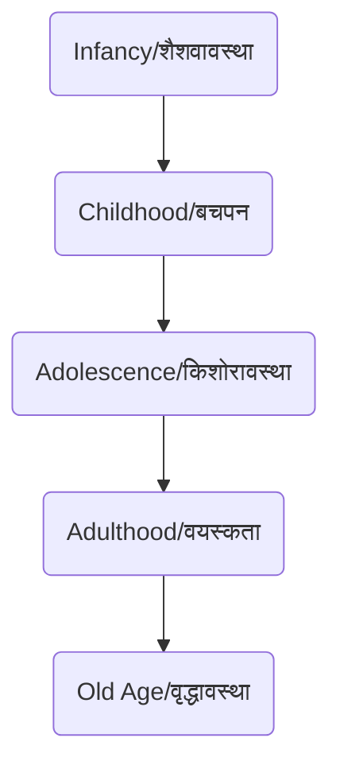
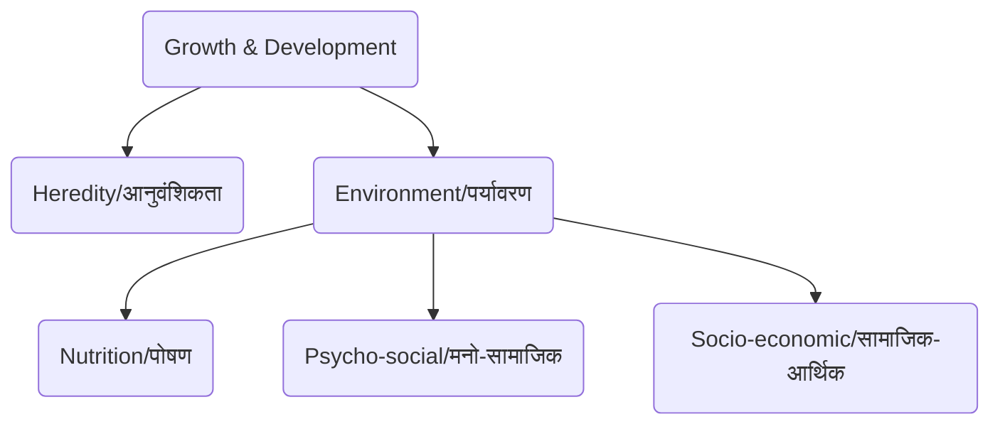

# Class 9 Physical Education - Physical Education Chapter 102
**Language:** Hinglish

```markdown
# [Class 9] Physical Education - Chapter 102: Growing up with Confidence (आत्मविश्वास के साथ बड़ा होना)

## 🌟 Core Concepts (मुख्य अवधारणाएं)

Yeh chapter 'Growing up with Confidence' par focus karta hai, especially adolescence (kishoravastha) ke dauran hone wale changes par. Hum samjhenge ki growth, development, aur maturation kya hai aur in par kin cheezon ka asar padta hai. Saath hi, self-esteem, psychological security, aur adolescence ke challenges jaise anxiety, depression, drug abuse, aur sexual harassment ko bhi discuss karenge.

📊 **Concept Hierarchy:**

1.  **Growth, Development & Maturation (वृद्धि, विकास और परिपक्वता)**
    *   Growth (वृद्धि): Quantitative increase in size/mass (मात्रात्मक वृद्धि).
    *   Development (विकास): Qualitative & Quantitative changes leading to organization (गुणात्मक और मात्रात्मक परिवर्तन).
    *   Maturation (परिपक्वता): Functional capacity ka measure (कार्यात्मक क्षमता).
2.  **Adolescence (किशोरावस्था)**
    *   Definition: Transition period (10-19 years) bachpan aur adulthood ke beech.
    *   Characteristics: Rapid physical, cognitive, socio-emotional changes, puberty, reproductive maturity.
3.  **Determinants of Growth & Development (वृद्धि और विकास के निर्धारक)**
    *   Heredity (आनुवंशिकता): Genes ka role (height, body type - ectomorph, mesomorph, endomorph). Hormones ka influence.
    *   Environment (पर्यावरण):
        *   Nutrition (पोषण): Balanced diet ki importance. Undernutrition/Malnutrition ka effect. Junk food se obesity. Iodine deficiency.
        *   Psycho-social Environment (मनो-सामाजिक वातावरण): Stress ka negative impact. Emotional support ki zaroorat.
        *   Socio-economic Status (सामाजिक-आर्थिक स्थिति): Poverty, poor living conditions ka asar.
4.  **Self-Concept & Self-Esteem (आत्म-अवधारणा और आत्म-सम्मान)**
    *   Importance during adolescence.
    *   Role of peers, parents, teachers.
    *   Positive self-image ki zaroorat.
5.  **Psychological Security (मनोवैज्ञानिक सुरक्षा)**
    *   Stress-free environment ki value.
    *   Parental support ka role.
    *   Insecurity ke consequences (Anxiety, Depression).
6.  **Challenges during Adolescence (किशोरावस्था की चुनौतियाँ)**
    *   Anxiety (चिंता) & Depression (अवसाद): Symptoms, causes, coping strategies.
    *   Psychosis (मनोविकृति): Severe mental disorder.
    *   Suicidal Tendency (आत्महत्या की प्रवृत्ति): Causes and prevention.
    *   Drug/Substance Abuse (नशे का दुरुपयोग): Reasons (peer pressure), types of drugs (stimulants, depressants, narcotics, hallucinogens), symptoms, consequences. 'Use' vs 'Abuse'.
    *   Sexual Harassment/Abuse (यौन उत्पीड़न / दुर्व्यवहार): Definition, types, importance of saying 'No', seeking help. POCSO Act.

## 📘 Key Learnings (मुख्य सीख)

**1. Growth, Development, aur Maturation mein Antar (Difference):**
*   **Growth (वृद्धि):** Sharir ke size ya mass ka badhna, jaise height aur weight. Yeh quantitative (मात्रात्मक) hai. Example: Ek saal mein height ka 5 inch badhna.
*   **Development (विकास):** Sharir aur mann mein hone wale qualitative (गुणात्मक) aur quantitative changes ka progression. Example: Bachhe ka simple sounds se saaf bolna seekhna.
*   **Maturation (परिपक्वता):** Sharir ke organs ya functions ka puri tarah develop ho jana. Example: Puberty ke end mein reproductive organs ka mature hona. Crawl karne wale bachhe ka chalna seekhna.

📈 **Diagram: Stages of Human Life**


**2. Adolescence: Ek Critical Stage (किशोरावस्था: एक महत्वपूर्ण चरण):**
Yeh 10-19 saal ki age ka time hai jab body, mind, emotions mein tezi se badlav aate hain (Growth Spurt). Puberty (यौवनारम्भ) shuru hoti hai, secondary sexual characteristics develop hote hain. Is stage mein confidence ke saath badlav ko samajhna aur accept karna zaroori hai.

**3. Growth ko Influence karne wale Factors (वृद्धि को प्रभावित करने वाले कारक):**
*   **Heredity (आनुवंशिकता):** Aapke parents se mile genes aapki height, body structure (ectomorph - patla, mesomorphic - medium, endomorphic - gol-matol) tay karte hain. Lekin yeh sab kuch nahi hai. Hormones bhi important role play karte hain. Apne physique ko lekar negative feel nahi karna chahiye kyunki yeh largely control se bahar hai.
*   **Environment (पर्यावरण):**
    *   **Nutrition (पोषण):** Sabse important external factor. Balanced diet (संतुलित आहार) jisme proteins, carbohydrates, fats, vitamins, minerals ho, growth ke liye essential hai. Kami se growth ruk sakti hai (stunted growth). *India mein, National Family Health Survey (NFHS) data aksar undernutrition ki problem highlight karta hai, especially in economically weaker sections.* Iodised salt ki kami se mental/physical growth retardation ho sakti hai.
    *   **Psycho-social (मनो-सामाजिक):** Stressful environment, jaise ghar mein constant jhagde ya pressure, growth hormone secretion ko affect karke growth rok sakta hai. Positive environment aur emotional support zaroori hai.
    *   **Socio-economic Status (सामाजिक-आर्थिक स्थिति):** Gareebi (Poverty), malnutrition, saaf-safai ki kami, aur bachpan mein heavy physical labour growth par bura asar daalte hain. *Jaise text mein Srinivas ka example hai jo 'jhuggi' mein rehta hai aur uski growth slow hai.*

📈 **Diagram: Determinants of Growth**


**4. Self-Esteem aur Psychological Security (आत्म-सम्मान और मनोवैज्ञानिक सुरक्षा):**
Adolescence mein 'main kaisa dikhta/dikhti hoon' ya 'log mere baare mein kya sochte hain' important ho jaata hai (Self-concept). Positive self-esteem (खुद को महत्व देना) confidence ke liye zaroori hai. Parents, teachers, aur friends ka support ismein help karta hai. Psychological security (मानसिक रूप से सुरक्षित महसूस करना) stress-free environment aur family support se aati hai. Iski kami se anxiety aur depression ho sakta hai.

**5. Adolescence ke Challenges aur Unse Bachav (किशोरावस्था की चुनौतियाँ और बचाव):**
*   **Anxiety/Depression (चिंता/अवसाद):** Thodi chinta normal hai (exam se pehle), par zyada anxiety nuksan karti hai. Depression mein udaasi, neend/khane ki problems, hopelessness feel hoti hai. Physical activity, hobbies, aur zaroorat padne par parents/teachers/counsellor se baat karna madad karta hai.
*   **Drug Abuse (नशे का दुरुपयोग):** Peer pressure ya low self-esteem ke karan shuru ho sakta hai. Medical use ('Use') alag hai, non-medical use ('Abuse') harmful aur addictive hai. Isse physical (aankhein laal hona, wajan kam/zyada hona), behavioural (mood swings, jhoot bolna), aur performance (padhai mein grades girna) related problems hoti hain. *Yeh HIV/AIDS jaise infections ka risk bhi badhata hai.*
*   **Sexual Harassment/Abuse (यौन उत्पीड़न/दुर्व्यवहार):** Koi bhi unwelcome sexual behaviour (physical touch, comments, showing pornography). Yeh ek crime hai. Aksar abuse karne wala jaan-pehchan ka hota hai. Aisi situation mein turant kisi trusted adult (parents, teacher) ko batana chahiye. Confidence se 'NO' kehna seekhna important hai. *India mein bachhon ko sexual offences se bachane ke liye Protection of Children from Sexual Offences (POCSO) Act, 2012 hai.*

## 🧩 Active Learning (सक्रिय शिक्षण)

**Activity 1: Research-based Case Study Analysis (शोध-आधारित केस स्टडी विश्लेषण) 🔍**
*   **Case:** Text mein diye gaye Srinivas (Activity 2.3) ke case ko dobara padhein. Woh Class IX mein hai, short aur skinny hai, jiske karan classmates use 'bauna'/'gittha' kehkar chidhate hain. Woh ek 'jhuggi' mein rehta hai, pita alcoholic hai, maa bahut mehnat karti hai, ghar mein khane ki kami hai.
*   **Task:** Research karein ki India mein poverty aur malnutrition bachhon ki growth ko kaise affect karte hain. National Family Health Survey (NFHS) ya UNICEF India ki reports se data dhundhne ki koshish karein. Analyse karein ki Srinivas ki situation mein kaun se factors (Heredity, Nutrition, Psycho-social, Socio-economic) uski slow growth ke liye responsible hain. Agar aap Ali (Srinivas ka dost) hote toh kya karte? Apne findings class mein present karein.

**Discussion: Critical Analysis of Real-world Impacts (वास्तविक दुनिया के प्रभावों का आलोचनात्मक विश्लेषण) 🌍**
*   **Topic:** Drug Abuse ka individual, family, aur society par kya impact padta hai? Discuss karein ki peer pressure kaise kaam karta hai aur isse kaise deal kiya ja sakta hai. Kya schools aur communities drug abuse prevention mein effective role play kar sakti hain? Kaise?
*   **Topic 2:** Sexual Harassment ko rokne mein hum sabki kya responsibility hai? POCSO Act 2012 ke baare mein jaanein. Public places ko girls/women ke liye safer banane ke liye kya steps liye ja sakte hain? Case Study 2 (Sabina & Monica) aur Case Study 3 (Reena & Hemant) par discuss karein. Kya 'When a girl says no, she means yes' jaise statements harmful hain? Kyun?

## 📝 Assessment Prep (मूल्यांकन तैयारी)

**Case Studies & Diagrams (केस स्टडी और आरेख) 📝**

1.  **Case Study Analysis:**
    *   **Case 1 (Suleman & George):** Suleman lamba hai, George chhota. George height badhane ke liye latakta hai. Counsellor ne kya salah di hogi? (Hint: Heredity ka role).
    *   **Case 2 (Suresh):** Suresh Class IX mein short, skinny, thaka hua dikhta tha. Doctor ne dawai nahi di, par Class XI tak woh normal grow kar gaya. Kaise? (Hint: Nutrition aur care ka role).
    *   **Case 3 (Neeta & Sheena):** Neeta ko 12 saal mein periods shuru hue, Sheena ko 14 tak nahi. Teacher ne unki chinta kaise door ki hogi? (Hint: Individual variation in maturation).
    *   **Case Study (Raman & Robin):** Robin ko cough syrup doctor ne di (Use). Raman ne taste ke liye lena shuru kiya aur ab roz leta hai (Abuse). Kyun? Aur kaun se substances abuse hote hain?

2.  **Diagram Analysis:**
    *   Neeche diye gaye diagram ko samjhein aur explain karein ki low self-esteem ek cycle kaise ban sakta hai:
    ```mermaid
    graph TD
        A(Low Self-Esteem/कम आत्म-सम्मान) --> B(Negative Expectations/नकारात्मक उम्मीदें);
        B --> C(Poor Effort/Effort Avoidance/कम प्रयास या प्रयास से बचना);
        C --> D(Failure/असफलता);
        D --> E(Self-Blame/खुद को दोष देना);
        E --> A;
    ```
    *   Drug abuse ke physical aur behavioural symptoms ko list karne wala ek mind map banayein.

## 🌏 Bharatiya Context (भारतीय संदर्भ)

*   **Socio-economic Impact:** Bharat mein aaj bhi kaafi log gareebi rekha se neeche rehte hain. Malnutrition (kuposhan) ek badi samasya hai, jiska seedha asar bachhon ki physical aur mental growth par padta hai. Srinivas jaise bachhon ki kahani (jo 'jhuggi' mein rehta hai) is reality ko dikhati hai. Sarkari schemes jaise Mid-Day Meal ka aim is problem ko kam karna hai.
*   **Nutrition & Health:** Iodine deficiency se hone wale goitre aur mental retardation ko rokne ke liye Iodised Salt (iodine-yukt namak) ka istemal bahut zaroori hai. Bharat sarkar ne iske liye national programs chalaye hain.
*   **Social Norms & Gender:** 'Ladkiyan kamzor hoti hain' jaise myths ko todna zaroori hai. Sabko equal opportunities milni chahiye. Sexual harassment ke khilaf awaaz uthana aur laws jaise POCSO Act 2012 ka hona important steps hain. Hemant jaise ladkon ki soch ('When a girl says no, she means yes') ko challenge karna zaroori hai.
*   **Family & Community Support:** Bharatiya samaj mein family aur community ka role important hai. Adolescents ko challenges face karne mein family support system (parivaar ka sahara) bahut madad kar sakta hai. Teachers aur counsellors ka role bhi critical hai.
```