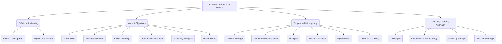

# Class 9 Physical Education - Physical Education Chapter 103
**Language:** English

```markdown
# [Class 9] Physical Education - Chapter 103

*(Note: Based on the provided text corresponding to Chapter 3)*

## 🌟 Core Concepts

A hierarchical breakdown of the fundamental concepts covered in this chapter:

1.  **Physical Education (PE): Redefined**
    *   Beyond Games: Moving past the traditional view of PE as just games/sports periods.
    *   Holistic Development: Aiming for the complete development of a child – physical, mental, social, emotional, and spiritual.
    *   Integral Part of Education: Recognizing PE's role in overall school education.
2.  **Aims and Objectives of Physical Education**
    *   Primary Aim: Holistic personality development for a healthy and productive life.
    *   Specific Objectives:
        *   Motor Skill Development (Strength, Speed, Endurance, Coordination, Flexibility, Agility, Balance)
        *   Technique & Tactic Acquisition (Games & Sports)
        *   Knowledge of Human Body & Exercise Effects
        *   Understanding Growth & Development Processes
        *   Socio-Psychological Development (Emotions, Leadership, Team Spirit, Values)
        *   Lifelong Health Habits Promotion
3.  **Scope of Physical Education: A Multi-disciplinary Field**
    *   Games & Sports as Cultural Heritage
    *   Mechanical Aspects (Biomechanics: Motion, Force, Levers)
    *   Biological Aspects (Anatomy, Physiology, Exercise Physiology)
    *   Health Education & Wellness (Hygiene, Nutrition, Disease Prevention, First Aid)
    *   Psycho-social Aspects (Personality, Motivation, Learning, Group Dynamics)
    *   Talent Identification & Training (Sports Training Principles)
4.  **Teaching-Learning Approaches in Physical Education**
    *   Challenges: Lack of infrastructure, time, trained teachers, appreciation.
    *   Importance of Methodology: Ensuring participation and effective learning.
    *   Inclusivity: Need to involve *all* students, including differently-abled children.
    *   Physical Education Cards (PEC) Methodology: An innovative approach for structured, inclusive, and effective PE classes.

📊 **Concept Hierarchy Diagram (Conceptual):**



## 📘 Key Learnings

1.  **Understanding Physical Education:** Physical Education is not merely playing games but an educational process using physical activities to foster the holistic development (physical, mental, social, emotional, spiritual) of an individual. It aims to develop physical fitness, motor skills, knowledge, values like cooperation and sportsmanship, and promote a healthy lifestyle.
    *   *Key Definitions:*
        *   **Webster's Dictionary:** Instruction in body development/care, from exercises to hygiene, gymnastics, and athletics management.
        *   **Columbia Encyclopaedia:** Organised instruction in motor activities contributing to physical growth, health, and body image.
        *   **Central Advisory Board of Physical Education and Recreation (India):** Education *through* physical activities for total personality development.

2.  **Objectives - The 'Why' of PE:** The objectives guide PE programs towards achieving the overall aim.
    *   **Physical/Motor:** Developing strength, speed, endurance, coordination, flexibility, agility, balance.
    *   **Cognitive:** Understanding rules, techniques, strategies, human body functions, growth processes, health principles.
    *   **Socio-Emotional:** Cultivating team spirit, leadership, followership, emotional control, respect, cooperation, self-confidence.
    *   **Health:** Promoting lifelong positive health habits and preventing lifestyle diseases.

3.  **Scope - The Breadth of PE:** PE draws knowledge from various disciplines.
    *   **Cultural:** Games like **Kho-Kho, Kabaddi, Archery, Lezim, Wrestling** are part of India's cultural heritage, evolving from survival skills to competitive sports.
    *   **Scientific:** Incorporates principles from:
        *   *Physics (Mechanics):* Laws of motion, force, levers, gravity's effect on movement.
        *   *Biology:* Anatomy (joints, muscles), Physiology (effects of exercise on body systems - circulatory, respiratory, etc.), Heredity.
    *   **Health Sciences:** Hygiene, nutrition, communicable/non-communicable diseases, first aid, safety.
    *   **Social Sciences (Psychology/Sociology):** Individual differences, personality, motivation, learning theories, group dynamics, values.
    *   **Sports Science:** Talent identification, training methods (aerobic, anaerobic), skill perfection, warming up, cooling down.

    📈 **Diagrammatic Representation (Conceptual - Scope):**
    *(Imagine a central circle labeled "Physical Education" with spokes connecting to other circles labeled: "Sports History & Culture," "Biomechanics," "Exercise Physiology," "Health & Nutrition," "Sports Psychology," "Sociology of Sport," "Training Methods")*

4.  **Effective Teaching-Learning:** The way PE is taught is crucial.
    *   **Challenge:** Often undervalued, leading to poor implementation (unsupervised play, focus on select few).
    *   **Need:** Inclusive participation of *all* students, including those differently-abled, viewing differences as a resource.
    *   **PEC Methodology (Physical Education Cards):** A structured, inclusive method developed via a **joint initiative (Govt. of India, British Council, UNICEF, UK Sports)**.
        *   Ensures equal participation.
        *   Provides clear instructions on cards for teachers and students.
        *   Facilitates vocabulary and pedagogical understanding.
        *   Links activities to objectives and evaluation.

    📈 **Diagrammatic Representation (Conceptual - PEC Features):**
    *(Imagine a card graphic with sections: Activity Name, Objective Link, Equipment, Instructions for All Students, Inclusion Notes, Evaluation Pointer)*

## 🧩 Active Learning

1.  **Activity: School PE Program Evaluation (Research-based Case Study)** 🔍
    *   **Task:** Critically evaluate the Physical Education program in *your own school* based on the concepts learned in this chapter.
    *   **Research:** Gather information (as suggested in Activity 3.1):
        *   Number of PE periods allocated per week/class.
        *   Typical activities conducted during these periods.
        *   Percentage of students actively participating.
        *   Nature of instruction/guidance provided by the teacher.
        *   Opportunities for learning rules, techniques, and health concepts.
        *   Inclusivity measures for differently-abled students or those less inclined towards sports.
    *   **Analysis & Creation:** Prepare a structured report comparing your findings with the aims, objectives, and scope of PE discussed in the chapter. Identify strengths and areas for improvement. Evaluate *how effectively* the current program contributes to the holistic development of *all* students.

2.  **Discussion: Real-World Impacts and Inclusivity** 🌍
    *   **Topic 1:** Critically analyze the statement: "Physical Education in most Indian schools focuses more on identifying talent for competitive sports rather than promoting health and fitness for all." Discuss the potential long-term consequences of such an approach on individual and community health.
    *   **Topic 2:** Based on Box 3.3 (iii) and the text's emphasis on inclusion: Imagine a classmate uses a wheelchair. Brainstorm and evaluate *creative and practical strategies* to meaningfully include them in various PE activities (e.g., modified games, adapted roles, specific skill drills). Discuss the challenges and benefits of creating truly inclusive PE environments.
    *   **Topic 3:** How can community resources (parks, local sports clubs, health professionals, traditional game practitioners) be leveraged by schools to enhance the quality and scope of their Health and Physical Education programs, especially considering potential limitations in school infrastructure or expertise? Evaluate the feasibility and potential impact of such collaborations.

## 📝 Assessment Prep

1.  **Case Study Analysis:**
    *   **Scenario 1:** A school principal argues that due to limited playground space and only one PE teacher, the school must focus PE periods on training the school teams (Cricket, Kho-Kho) for inter-school competitions. Other students are allowed free play during this time. Evaluate this approach against the core aims and objectives of Physical Education as defined by NCERT. Does this align with the principle of holistic development and inclusivity? Justify your evaluation.
    *   **Scenario 2:** A PE teacher uses PEC cards for a Grade 9 class. The activity involves learning basic Kabaddi skills. The cards detail warm-up, skill drills in small groups ensuring everyone attempts the moves, modified rules for beginners, and specific roles for students who might be temporarily injured (e.g., scorekeeping, observing technique). Evaluate the effectiveness of this methodology in achieving PE objectives compared to a teacher who just divides the class into two teams for a match.

2.  **Diagram-Based Questions:**
    *   Create a flowchart illustrating the key components within the 'Scope of Physical Education'.
    *   Draw a mind map showing how participation in Physical Education contributes to the different dimensions of holistic development (Physical, Mental, Social, Emotional).

## 🌏 Bharatiya Context

1.  **National Curriculum Framework:** Physical Education is recognized as an integral part of the curriculum and is a **compulsory subject from Classes I-X** in schools following CBSE/State Board guidelines, aiming for the holistic development of children across India.
2.  **Cultural Heritage in Sports:** India has a rich tradition of indigenous games and sports that are part of its cultural fabric. Examples like **Kabaddi, Kho-Kho, Wrestling (Kushti), Mallakhamb, Lezim (Maharashtra), and Archery** reflect regional diversity and historical practices, forming an important part of the PE scope. Promoting these games helps preserve cultural heritage alongside modern sports.
3.  **National Initiatives & Data:**
    *   The development of the **PEC (Physical Education Cards) methodology** is a significant India-specific initiative resulting from collaboration between the **Ministry of Human Resource Development (now Ministry of Education), Government of India**, and international bodies like the British Council, UNICEF, and UK Sports. This highlights a national effort to improve PE transaction.
    *   While specific *economic* data isn't central to this chapter's text, the emphasis on health, disease prevention (non-communicable diseases), and developing healthy lifestyles through PE has significant long-term *socio-economic implications* for the nation by potentially reducing healthcare burdens and improving workforce productivity. Data from national health surveys (like NFHS) often indicates challenges related to physical activity levels and nutrition among adolescents, underscoring the importance of effective school PE programs.
```