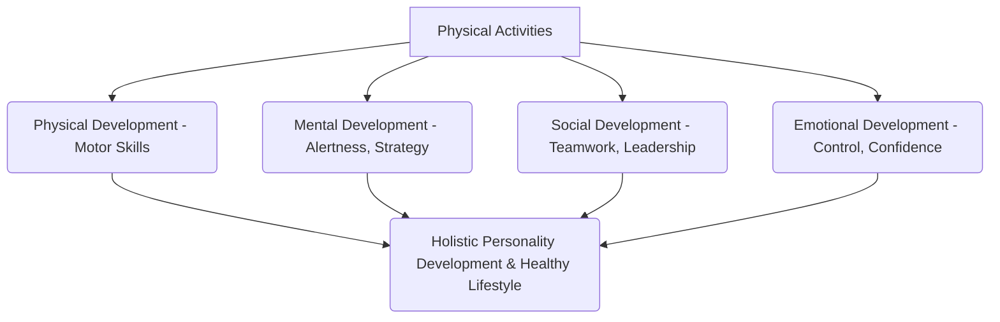

# Class 9 Physical Education - Physical Education Chapter 103
**Language:** Hinglish

```markdown
# [Class 9] Physical Education - Chapter 3: Physical Education ka Parichay

## 🌟 Core Concepts
Yeh chapter Physical Education (PE) ke core concepts ko detail mein samjhata hai. Yahan ek concept hierarchy di gayi hai 📊:

1.  **Physical Education (Sharirik Shiksha) - Buniyadi Samajh (Basic Understanding)**
    *   Aam Dharana vs Asli Matlab (Common Perception vs Real Meaning)
    *   Paribhasha (Definition) - Webster's, Columbia, Central Advisory Board ke anusaar.
    *   Holistic Development (Sampurna Vikas) - Body, Mind, Spirit (Sharir, Mann, Atma)

2.  **PE ke Uddeshya (Objectives of Physical Education)**
    *   Motor Abilities ka Vikas (Gatishil Kshamtaon ka Vikas - Strength, Speed, Endurance, Flexibility, etc.)
    *   Techniques aur Tactics ki Samajh (Takneek aur Ranneeti)
    *   Human Body ki Knowledge (Manav Sharir ka Gyan)
    *   Growth & Development se Relation (Vikas aur Vriddhi se Sambandh)
    *   Socio-Psychological Aspects (Samajik-Manovaigyanik Pehlu - Emotions, Team Spirit, Leadership)
    *   Healthy Habits (Swasth Aadatein) - Lifelong Fitness

3.  **PE ka Scope (Kshetra - Multi-disciplinary Nature)**
    *   Games & Sports as Cultural Heritage (Khelkood - Sanskritik Virasat - e.g., Kho-Kho, Kabaddi)
    *   Mechanical Aspects (Yantrik Pehlu - Force, Motion, Gravity)
    *   Biological Contents (Jaivik Tatva - Body Systems, Exercise Effects)
    *   Health Education & Wellness (Swasthya Shiksha aur Kalyan - Hygiene, Nutrition, Diseases)
    *   Psycho-social Content (Manovaigyanik-Samajik Tatva - Personality, Motivation, Values)
    *   Talent Identification & Training (Pratibha Pehchan aur Prashikshan)

4.  **Teaching-Learning Approach (Shikshan-Adhigam Vidhi)**
    *   Importance aur Challenges (Mahatva aur Chunautiyan - Infrastructure, Teacher Training, Sabki Bhagidari)
    *   Inclusivity (Samaveshan) - Sabhi Bachhon ki Bhagidari (Participation of ALL children, including differently-abled)
    *   Physical Education Cards (PEC) Methodology - Ek Innovative Approach

## 📘 Key Learnings

**1. Physical Education Kya Hai? (What is PE?)**
Aam taur par log sochte hain ki PE ka matlab sirf school mein games khelna ya PT karna hai. Lekin, yeh usse kahin zyada hai.
*   **Definition:** PE ek *integral part* hai education ka, jo physical activities ke through bachchon ke *total personality* (sampurna vyaktitva) – yani body, mind, aur spirit – ka development karta hai. Yeh sirf physical fitness tak seemit nahi hai.
*   **Holistic Approach:** Yeh physical, social, emotional, aur mental development mein contribute karta hai. Isse bachche healthy lifestyle ke liye zaroori skills, knowledge, aur values (jaise cooperation, respect, self-confidence) seekhte hain.

**2. PE ke Mukhya Uddeshya Kya Hain? (Main Objectives of PE?)** 🎯
PE ka aim sirf physical development nahi, balki overall growth hai:
*   **Motor Skills:** Strength (Shakti), Speed (Gati), Endurance (Sehansheelta), Flexibility (Lachilapan), Coordination (Samanvay), Agility (Furti), Balance (Santulan) develop karna.
*   **Game Skills:** Khelon ki techniques (takneek) aur strategies (ranneeti) sikhana.
*   **Knowledge:** Human body aur exercise ke effects ko samajhna.
*   **Social Skills:** Teamwork (Team Bhavna), leadership, discipline (anushasan), aur sportsmanship develop karna.
*   **Healthy Lifestyle:** Lifelong fitness ke liye achhi aadatein (habits) daalna.

**Diagram: PE ke Objectives ka Flow** 📈


**3. PE ka Scope Kitna Wide Hai? (How Wide is the Scope of PE?)** 🌐
PE ek *multi-disciplinary* subject hai, jiska scope bahut وسیع (vast) hai:
*   **Cultural Link:** Hamare traditional games (Kho-Kho, Kabaddi, Kushti) hamari sanskriti se jude hain.
*   **Science Link:** Physics ke concepts (force, motion, lever) sports movements ko samajhne mein help karte hain.
*   **Biology Link:** Body systems (muscular, circulatory, respiratory) par exercise ka kya asar hota hai, yeh samajhna.
*   **Health Link:** Nutrition, hygiene, diseases se bachav, first aid ki jaankari.
*   **Psychology Link:** Motivation, personality development, anxiety management.
*   **Training:** Talent ko pehchan kar specific sports ke liye train karna.

**4. Sabhi Ke Liye PE - Teaching Methods (PE for All - Teaching Methods)** 👩‍🏫👨‍🏫
Effective PE ke liye zaroori hai ki *har bachcha* participate kare, na ki sirf kuch selected students.
*   **Inclusivity (Samaveshan):** Differently-abled students ko bhi barabar ka mauka milna chahiye. Unki differences ko problem nahi, balki resource samajhna chahiye.
*   **PEC Methodology:** Physical Education Cards (PEC) ek aisi technique hai jo MHRD aur British Council ne develop ki hai. Iske features hain:
    *   Ensures *equal participation* of all students.
    *   Teachers aur students dono ke liye easy-to-use cards.
    *   Activities ko organize karna aasan banata hai.
    *   Objectives achieve hue ya nahi, yeh evaluate karne mein help karta hai.

## 🧩 Active Learning

*   **Activity: Apne School ki PE ka Analysis (Research-based Case Study) 🔍**
    *   Apne school mein PE periods ka observation karo. Ek choti report taiyyar karo:
        *   Kitne periods hote hain?
        *   Kya *sabhi* students participate karte hain? Ya sirf kuch hi?
        *   PE period mein kya activities hoti hain? Kya teachers guide karte hain?
        *   Kya differently-abled students ke liye koi special provisions hain?
    *   Apni findings ko Chapter mein bataye gaye PE ke objectives se compare karo. *Evaluate* karo ki aapke school mein PE kitna effective hai.

*   **Discussion: Real-World Impacts aur Solutions 🌍**
    *   Class mein discuss karo: Kuch students PE activities mein participate kyun nahi karna chahte? Unhe kaise motivate kiya ja sakta hai?
    *   Agar aapki class mein koi differently-abled student hai (jaise koi wheelchair use karta hai), toh aap use apni games/activities mein *include* karne ke liye kya *creative* ideas soch sakte ho? (Creating solutions)
    *   PE ek healthy aur socially responsible society banane mein kaise madad kar sakta hai?

## 📝 Assessment Prep

*   **Case Study 1:** Ek PE teacher school mein sirf Volleyball team ke 12 students ko hi regular coaching dete hain, kyunki unhe inter-school competition jeetna hai. Baaki students ko free play ke liye chhod diya jaata hai. Kya yeh teacher PE ke *holistic development* ke objective ko poora kar rahe hain? Apne answer ke liye reasons do. 📝 (Evaluating)
*   **Case Study 2:** School mein PE ke liye ground chhota hai aur equipment bhi kam hai. Teacher ko 40 students ki class ko engage karna hai. PEC methodology is situation mein kaise help kar sakti hai? Ek sample activity plan (using PEC idea) suggest karo. 💡 (Creating)
*   **Diagram Task:** Ek mind map ya flowchart banao jo PE ke *multi-disciplinary scope* ko darshata ho, jismein different subjects (Biology, Physics, Psychology, etc.) se iske connections dikhaye gaye hon. 📊

## 🌏 Bharatiya Context

*   **Cultural Heritage (Sanskriti Virasat):** Bharat mein khel sirf manoranjan nahi, hamari sanskriti ka abhinn ang hain. Games jaise **Kabaddi, Kho-Kho, Gilli Danda, Kushti (Wrestling), Mallakhamb** hamari rich tradition ko reflect karte hain. PE in traditional games ko promote karke hamari cultural roots ko strong karta hai. 🇮🇳
*   **Social Development (Samajik Vikas):** PE teamwork, discipline, respect jaise values sikha kar bachchon ko behtar nagrik banne mein madad karta hai. Yeh social inclusion ko bhi badhawa deta hai jab sabhi bachche ek saath khelte hain.
*   **National Health & Fitness:** Swasth Nagrik, Swasth Rashtra! PE bachpan se hi healthy habits ko promote karta hai, jo aage chalkar lifestyle diseases (jaise diabetes, obesity) ko kam karne mein madad kar sakta hai. Government ke initiatives jaise **Khelo India** bhi isi direction mein ek kadam hai, jo grassroots level par sports ko badhawa dekar national health aur sporting talent ko improve karne ka लक्ष्य (aim) rakhta hai. Ek fit aur active population desh ki productivity aur *overall well-being* (samagra kalyan) ke liye zaroori hai. 📊
```