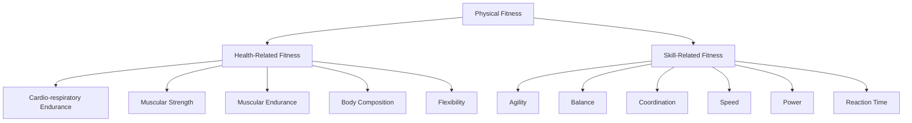

# Class 9 Physical Education - Physical Education Chapter 104
**Language:** English

```markdown
# [Class 9] Physical Education - Chapter 104

*(Note: Based on the provided text content, this chapter corresponds to Chapter 4: Physical Fitness)*

## 🌟 Core Concepts

This chapter explores the fundamental concept of Physical Fitness, its significance in modern life, its various components, and methods for its development and maintenance.

📊 **Concept Hierarchy:**

1.  **Physical Fitness:**
    *   **Definition:** The capacity to perform daily activities without undue fatigue; the body's ability to function efficiently and effectively during work and leisure.
    *   **Importance & Need:**
        *   Core precondition for health.
        *   Counteracts sedentary lifestyles caused by technological advancements.
        *   Addresses rising concerns like childhood obesity.
        *   Improves overall quality of life.
    *   **Benefits:** Comprehensive physical, mental, and social advantages.
2.  **Components of Physical Fitness:**
    *   **Health-Related Fitness:** Essential for general health and well-being.
        *   Cardio-respiratory Endurance
        *   Muscular Strength
        *   Muscular Endurance
        *   Body Composition
        *   Flexibility
    *   **Skill-Related Fitness:** Important for athletic performance and specific activities.
        *   Agility
        *   Balance
        *   Coordination (Neuro Muscular Adaptations)
        *   Speed
        *   Power (Strength + Speed)
        *   Reaction Time
3.  **Developing Physical Fitness:**
    *   **Types of Activities:**
        *   Aerobic Exercise (with oxygen, sustained duration, e.g., jogging)
        *   Anaerobic Exercise (without oxygen, high intensity, short duration, e.g., sprinting)
        *   Team Games & Individual Sports
    *   **Essential Practices:**
        *   Warming Up (Prepares body, reduces injury risk)
        *   Cooling Down (Gradual recovery, prevents adverse effects)

## 📘 Key Learnings

**1. Understanding Physical Fitness:**

*   **Definition:** Physical fitness is not merely the absence of disease but the **body's ability to function efficiently and effectively** in work and leisure activities, enabling individuals to carry out daily tasks without excessive fatigue. Optimum efficiency is key.
*   **Variability:** Fitness is relative; it differs based on age, occupation (e.g., athlete vs. factory worker), and individual needs.
*   **Modern Relevance:** Technological advancements and lifestyle changes have reduced routine physical activity, making conscious efforts towards fitness crucial to combat issues like obesity and maintain health. Beware of misleading advertisements for quick fitness solutions; regular exercise is essential.

**2. Importance and Benefits:**

Adopting a healthy lifestyle that promotes physical fitness significantly improves the quality of life. Key benefits include:
*   **Physiological:**
    *   Improved heart and lung function (better oxygen supply).
    *   Enhanced muscle tone and good posture.
    *   Faster recovery from illness/injury.
    *   Reduced risk of cardiovascular diseases.
    *   Control of body fat and maintenance of ideal body weight (linked with proper diet).
    *   Increased energy levels.
    *   Delayed ageing process.
*   **Psychological:**
    *   Improved mood, reduced depression and anxiety.
    *   Increased self-confidence.
*   **Functional:**
    *   Ability to meet life's challenges.
    *   Postponed fatigue during activity and quicker recovery afterwards.

**3. Components of Physical Fitness:**

Physical fitness is broadly categorized into two types:

*   **A. Health-Related Components:**
    *   **Cardio-respiratory Endurance:** Ability of circulatory and respiratory systems to supply fuel during sustained activity (e.g., jogging, swimming).
    *   **Muscular Strength:** Maximum force a muscle/group can exert in a single effort (e.g., lifting weights).
    *   **Muscular Endurance:** Ability of a muscle/group to exert submaximal force repeatedly or sustain contraction (e.g., push-ups).
    *   **Body Composition:** Proportion of fat mass to lean body mass (muscle, bone, organs). Measured using indicators like BMI.
    *   **Flexibility:** Range of motion around a joint (e.g., stretching, yoga).

*   **B. Skill-Related Components:**
    *   **Agility:** Ability to change body position and direction quickly and efficiently (e.g., dodging in sports).
    *   **Balance:** Ability to maintain equilibrium while stationary or moving (e.g., handstand).
    *   **Coordination:** Ability to use senses and body parts together smoothly and accurately (e.g., dribbling a basketball).
    *   **Speed:** Ability to perform a movement or cover a distance quickly (e.g., sprinting).
    *   **Power:** Ability to exert maximum muscular force instantly (combines speed and strength) (e.g., jumping, throwing).
    *   **Reaction Time:** Time elapsed between stimulus and reaction (e.g., starting a race).

📈 **Diagrammatic Representation: Components of Physical Fitness**



**4. Activities for Developing Fitness:**

*   **Aerobic Activities:** ("With oxygen") Sustained exercises that improve cardio-respiratory endurance and strengthen the heart and lungs (e.g., walking, jogging, swimming, cycling, aerobic dance).
*   **Anaerobic Activities:** ("Without oxygen") High-intensity, short-duration exercises that build muscle strength, speed, and bone density (e.g., sprinting, weightlifting, jumping).
*   **Games and Sports:** Most team games and individual sports incorporate various fitness components.

**5. Warming Up and Cooling Down:**

*   **Warming Up:** Performed *before* activity. Consists of gradual physical activity (e.g., light jogging, joint mobility exercises, dynamic stretches) for 8-12 minutes. Aims to prepare the body mentally and physically, increase muscle temperature, reduce stiffness, and prevent injury.
*   **Cooling Down:** Performed *after* activity. Consists of low-intensity activity (e.g., walking) followed by static stretching (10-30 seconds per stretch) for 5-10 minutes each. Helps the body gradually return to its resting state, prevents blood pooling, relaxes muscles, and aids recovery.
*   **Intensity:** The rigor of warm-up and cool-down should match the intensity of the main activity.

## 🧩 Active Learning

*   **Activity: Research-based Case Study Analysis 🔍**
    *   **Scenario:** Adapt Activity 4.4 (Football Coach). A coach assesses players' speed by timing them running 5 lengths (720m) of a field. Player 1 takes 320s (Avg Speed = 2.25 m/s). Player 2 takes 4 min 10 sec (250s). Player 3 takes 6 min 10 sec (370s). Player 4 takes 6 min 10 sec (370s).
    *   **Task:**
        1.  Calculate the average speed for Players 2, 3, and 4.
        2.  Evaluate which player demonstrates the highest speed based on this test.
        3.  Critically analyse if 'speed' alone is sufficient to determine the overall 'physical fitness' of a football player. Which other *skill-related* and *health-related* components are crucial for football? Justify your answer using concepts learned.
        4.  Suggest two different activities (one aerobic, one anaerobic) the coach could incorporate into training to improve the players' overall fitness.

*   **Discussion: Critical Analysis of Real-World Impacts 🌍**
    *   **Topic:** The text states that science, technology (automated equipment, mobiles), and lifestyle changes have reduced daily physical activity, impacting health and fitness. Simultaneously, the marketing of packaged foods and fitness products has increased.
    *   **Prompts:**
        1.  Evaluate the positive and negative impacts of technology on the physical fitness levels of young people in India today.
        2.  Critically discuss the influence of media advertisements for health products and packaged foods on fitness choices. Are these reliable paths to fitness? Why or why not? (Refer to text warnings about shortcuts and side effects).
        3.  How can individuals and communities promote a culture of physical fitness despite modern conveniences and marketing pressures?

## 📝 Assessment Prep

*   **Case Study Application:**
    *   Refer to the Football Coach case study under 'Active Learning'. Be prepared to calculate speed, interpret results, and relate specific fitness components (speed, endurance, agility etc.) to performance in a given sport.
    *   Consider Activity 4.2 (BMI Calculation). If a student's height is 1.60m and weight is 65kg, calculate their BMI. Using the Indian norms provided (Underweight <18.5, Normal 18.6-23, Overweight 23.1-30, Obese >30), evaluate their weight status. Discuss why Body Composition is a crucial health-related fitness component.

*   **Diagram Interpretation:**
    *   Be able to identify and define the components listed under Health-Related and Skill-Related Fitness (refer to the mermaid diagram above).
    *   Explain the difference between Aerobic and Anaerobic exercise using examples.

*   **Conceptual Questions:**
    *   Why is physical fitness considered multi-dimensional and relative, not a universal standard?
    *   Explain the physiological process behind warming up (reducing muscle stiffness) and cooling down (preventing rapid blood pressure drop).
    *   Evaluate the statement: "Well-being cannot be achieved without physical fitness." Justify with at least two reasons based on the text's listed benefits.

## 🌏 Bharatiya Context

*   **BMI Norms:** The text highlights that the Indian Health Ministry has adopted stricter Body Mass Index (BMI) cut-offs compared to global standards. For Indians, a BMI between **23.1 kg/m² and 30 kg/m²** is considered overweight, whereas the global cut-off often starts at 25 kg/m². This emphasizes a specific health concern and standard within the Indian population.
    *   *Calculation Reminder:* BMI = Weight (kg) / [Height (m)]²
*   **Lifestyle Impact:** The chapter implicitly addresses the Indian context where rapid urbanization and technological adoption (increased use of vehicles, automated devices, screen time) have led to more sedentary lifestyles, contributing to health issues like obesity and cardiovascular diseases, even among younger populations.
*   **Market Influence:** The increased marketing of packaged foods and 'quick-fix' health/fitness products via various media channels (TV, newspapers) is a relevant phenomenon in India. The text cautions against relying on these shortcuts, promoting regular physical exercise as the sustainable path to fitness, reflecting a need for critical consumer awareness in the Indian market.
```