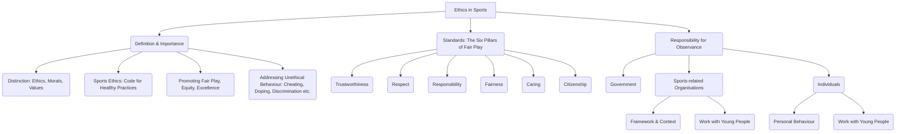

# Class 9 Physical Education - Physical Education Chapter 108
**Language:** English

```markdown
# [Class 9] Physical Education - Chapter 8: Ethics in Sports

*(Note: Based on the provided text, the chapter appears to be Chapter 8, not 108)*

## 🌟 Core Concepts



## 📘 Key Learnings

**1. Understanding Ethics and Sports Ethics:**

*   **Ethics:** A branch of philosophy defining right and wrong conduct for individuals and society. It's a code guiding behaviour and decision-making based on principles. While often used interchangeably with 'morals' and 'values', ethics specifically refers to a system or set of rules determining proper conduct.
*   **Sports Ethics:** A positive concept applying ethical principles to the sporting context. It's a code of conduct promoting healthy sporting practices, fair play, equity, and human excellence. It encompasses behaviour *and* mindset, aiming to eliminate negative actions on and off the field.
    *   *Key Idea:* Sports ethics is more than just following rules; it includes friendship, respect, and the sporting spirit (Box 8.2).

**2. Importance of Sports Ethics:**

*   Sports contribute to physical, psychological, and emotional well-being, social development, goal-setting, leadership, and managing success/failure.
*   However, the competitive nature of sports can lead to unethical behaviours like cheating, doping, violence, discrimination, excessive commercialisation, and corruption.
*   Ethics provides a framework to combat these issues, ensuring sport remains a positive force for individual development and social cohesion. It promotes:
    *   Fair Play
    *   Equity (Institutional & Personal)
    *   Human Excellence
    *   Mutual Respect & Solidarity

**3. The Six Pillars of Fair Play (Standards of Sports Ethics):**

These standards apply universally across all levels of sport.

```mermaid
graph LR
    subgraph Six Pillars
        P1[Trustworthiness]
        P2[Respect]
        P3[Responsibility]
        P4[Fairness]
        P5[Caring]
        P6[Citizenship]
    end

    P1 --> P1a(Pursue victory with honour<br>Demand integrity<br>Follow rules' spirit & letter<br>Reject dishonesty);
    P2 --> P2a(Respect traditions & opponents<br>No verbal abuse/taunting<br>Win with grace, lose with dignity);
    P3 --> P3a(Be a positive role model<br>Safeguard health (Anti-doping)<br>Take responsibility for actions);
    P4 --> P4a(Adhere to fair play<br>Ensure rules are followed<br>Reject unfair advantages);
    P5 --> P5a(Show concern for others<br>Avoid careless/injurious behaviour<br>Encourage teammates positively<br>Report dangerous conduct);
    P6 --> P6a(Play by the rules<br>Follow the spirit of rules<br>Resist bending rules<br>Consider community impact);
```

**4. Responsibility for Observing Sports Ethics:**

Upholding sports ethics is a shared responsibility among various stakeholders.

*   **Government:**
    *   Encourage ethical standards in all sports settings.
    *   Ensure integrity in funding.
    *   Support ethical organisations/individuals.
    *   Promote ethics in school curricula (Physical Education).
    *   Combat threats like match-fixing, trafficking, illegal betting.
    *   Prevent racism and intolerance in sport.
    *   Support research on youth involvement and ethics.
*   **Sports-related Organisations (Federations, Associations, etc.):**
    *   Publish clear ethical guidelines and apply sanctions.
    *   Ensure decisions align with ethical codes.
    *   Raise awareness through campaigns, awards, training.
    *   Reward ethical behaviour, not just competitive success.
    *   Adapt competition structures and rules for young people, emphasizing ethics.
    *   Implement safeguards against harassment, abuse, and exploitation of young athletes.
    *   Ensure coaches/staff are qualified and understand child development.
*   **Individuals (Parents, Teachers, Coaches, Athletes, Officials, Spectators, etc.):**
    *   Set a positive example (role models).
    *   Do not reward or condone unfair play.
    *   Ensure appropriate qualifications for working with youth.
    *   Prioritize child's health, safety, and welfare above all else.
    *   Provide age-appropriate sporting experiences, avoiding undue pressure.
    *   Focus on enjoyment, personal achievement, and skill acquisition.
    *   Treat all young people with equal interest.
    *   Encourage children to devise games/rules and take responsibility.
    *   Inform families about risks/rewards of high performance.

## 🧩 Active Learning

*   **Activity 1: Research-based Case Study Analysis 🔍**
    *   *(Based on Activity 8.1)* Research the specific codes of sports ethics documented by:
        1.  An international body (e.g., International Olympic Committee - IOC, FIFA).
        2.  An Indian national sports federation (e.g., BCCI for Cricket, AIFF for Football, Hockey India).
        3.  The Sports Authority of India (SAI) or the Ministry of Youth Affairs and Sports, Government of India.
    *   **Analysis:** Compare and contrast these codes. Identify common principles and any differences in emphasis or specific rules. Evaluate how effectively these codes address issues like doping, fair play, and protection of young athletes in the Indian context. Present findings as a brief report.
*   **Activity 2: Ethical Dilemma Evaluation 🤔**
    *   *(Based on Activity 8.3)* Analyse the scenarios presented in Activity 8.3 (page 116-117). For each scenario, determine if the action is Clearly Ethical, Somewhat Ethical, Somewhat Unethical, or Clearly Unethical. Justify your reasoning based on the Six Pillars of Fair Play.
*   **Discussion: Critical Analysis of Real-world Impacts 🌍**
    *   Discuss recent instances of ethical breaches in national or international sports (e.g., doping scandals, match-fixing allegations in cricket/football, instances of discrimination or abuse).
    *   **Evaluate:**
        *   What were the consequences for the individuals involved, the sport, and society?
        *   Which ethical standards (pillars) were violated?
        *   Whose responsibility was it to prevent or address the situation (Government, Organisation, Individuals)?
        *   How can promoting sports ethics help prevent such occurrences in the future, particularly within the Indian sports ecosystem?

## 📝 Assessment Prep

*   **Case Studies:** Be prepared to analyze scenarios similar to Activity 8.3, identifying the ethical issues and applying the Six Pillars of Fair Play to evaluate the actions.
    *   *Example Case:* A talented young athlete from a rural background in India is offered performance-enhancing drugs by a local coach promising quick success and financial rewards. Analyse the ethical implications for the athlete, coach, and the sports system.
*   **Diagrams:** Practice drawing diagrams to represent:
    1.  The relationship between Ethics, Sports Ethics, and Fair Play.
    2.  The Six Pillars of Fair Play with key descriptors for each.
    3.  The structure of responsibility for sports ethics (Government, Organisations, Individuals).
*   **Long Answer Questions:** Prepare to explain the definition, importance, and standards of sports ethics, and elaborate on the specific responsibilities of different stakeholders (Govt., Orgs., Individuals).

## 🌏 Bharatiya Context

*   **National Responsibility:** The principles of sports ethics are actively promoted by the Government of India through the Ministry of Youth Affairs and Sports, and implemented via bodies like the **Sports Authority of India (SAI)** and various **National Sports Federations (NSFs)**. These organisations are responsible for setting guidelines, ensuring fair play, managing funding ethically, and promoting sports participation across the country. (Ref: Section 8.4.1, 8.4.2; Activity 8.1)
*   **Grassroots Implementation:** Ethical conduct is emphasized in school curricula through Physical Education, aiming to instil values like respect, fairness, and responsibility from a young age in diverse Indian school settings (State Boards, CBSE). (Ref: Section 8.4.1)
*   **Addressing Challenges:** India faces specific challenges related to sports ethics, including ensuring equal opportunities across different socio-economic backgrounds, preventing age fraud in junior competitions, combating doping, and managing the commercial pressures in popular sports like cricket. Applying the code of ethics is crucial for bodies like the **National Anti-Doping Agency (NADA)** India and NSFs. (Ref: Section 8.1, 8.4)
*   **Role Models:** Top Indian sportspersons are often looked upon as role models, making their adherence to ethical standards particularly important for influencing youth across the nation. Their actions, both on and off the field, significantly impact public perception and the values associated with sport in India. (Ref: Section 8.4.3)

```