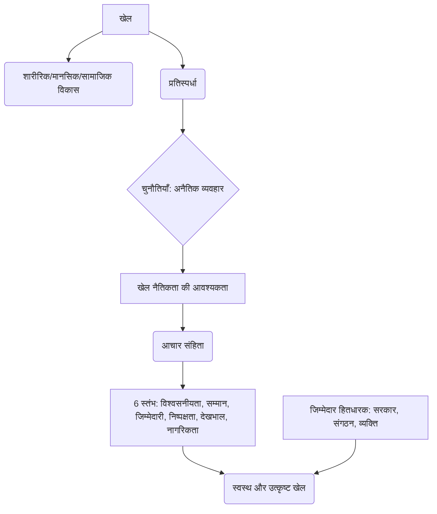

# Class 9 Physical Education - Physical Education Chapter 108
**Language:** हिंदी

```markdown
# [कक्षा 9] शारीरिक शिक्षा - अध्याय 108: खेल नैतिकता

## 🌟 मुख्य अवधारणाएं (Core Concepts)

यह खंड खेल नैतिकता के मूलभूत विचारों को रेखांकित करता है।

1.  **खेल का परिचय और महत्व:**
    *   शारीरिक, मनोवैज्ञानिक और भावनात्मक कल्याण में योगदान।
    *   सामाजिक विकास और अंतःक्रिया में भूमिका।
    *   अनुशासन, लक्ष्य निर्धारण, निर्णय लेना, नेतृत्व क्षमता का विकास।
    *   सफलता और असफलता का प्रबंधन सिखाना।
    *   समग्र विकास (Holistic Development) में सहायक।
2.  **खेल नैतिकता की परिभाषा:**
    *   'एथिक्स' (Ethics) का अर्थ: सही और गलत के बीच सैद्धांतिक विकल्प चुनने का अभ्यास; आचार संहिता जो मानव व्यवहार का मार्गदर्शन करती है।
    *   खेल नैतिकता: स्वस्थ खेल प्रथाओं को बढ़ावा देने और सुनिश्चित करने के लिए आचार संहिता। यह केवल व्यवहार का एक रूप नहीं, बल्कि सोचने का एक विशेष तरीका भी है।
    *   निष्पक्ष खेल (Fair Play), समानता (Equity) और खेल उत्कृष्टता (Sporting Excellence) को बढ़ावा देना।
3.  **खेल नैतिकता के मानक (Standards):**
    *   निष्पक्ष खेल के छह स्तंभ: विश्वसनीयता, सम्मान, जिम्मेदारी, निष्पक्षता, देखभाल, नागरिकता।
4.  **खेलों में अनैतिक व्यवहार:**
    *   धोखाधड़ी, नियमों को तोड़ना-मरोड़ना, डोपिंग, शारीरिक/मौखिक हिंसा, उत्पीड़न, भेदभाव, शोषण, असमान अवसर, अत्यधिक व्यावसायीकरण, भ्रष्टाचार।
5.  **नैतिकता पालन की जिम्मेदारी:**
    *   सरकारें (सभी स्तरों पर)।
    *   खेल-संबंधी संगठन (महासंघ, प्रायोजक, संघ)।
    *   वाणिज्यिक क्षेत्र (निर्माता, विपणन एजेंसियां)।
    *   व्यक्ति (खिलाड़ी, कोच, माता-पिता, शिक्षक, अधिकारी, दर्शक)।

📊 **अवधारणा पदानुक्रम (Concept Hierarchy):**
खेल -> महत्व (समग्र विकास) -> आधुनिक चुनौतियाँ (अनैतिक व्यवहार) -> **खेल नैतिकता की आवश्यकता** -> परिभाषा और अर्थ -> **मानक (6 स्तंभ)** -> पालन की **जिम्मेदारी** (सरकार, संगठन, व्यक्ति) -> स्वस्थ और उत्कृष्ट खेल।

## 📘 मुख्य सीख (Key Learnings)

इस खंड में मुख्य अवधारणाओं की विस्तृत व्याख्या दी गई है।

1.  **खेल नैतिकता क्या है?**
    *   'एथिक्स' या 'नैतिकता' दर्शनशास्त्र की एक शाखा है जो व्यक्ति और समाज के लिए क्या अच्छा है इसे परिभाषित करती है और दायित्वों की प्रकृति स्थापित करती है। सरल शब्दों में, यह सही और गलत के बीच चयन करने के लिए सिद्धांतों का एक समूह है।
    *   खेल नैतिकता विशेष रूप से खेल के संदर्भ में इस आचार संहिता को लागू करती है। इसका उद्देश्य केवल नियमों के भीतर खेलना नहीं है, बल्कि दोस्ती, दूसरों के लिए सम्मान और खेल भावना जैसे मूल्यों को भी शामिल करना है।
    *   यह सभी स्तरों पर लागू होती है - मनोरंजक गतिविधियों से लेकर प्रतिस्पर्धी खेल तक।
    *   **समानता (Equity) के दो आयाम:**
        *   **संस्थागत (Institutional):** प्रदर्शन के अलावा अन्य मानदंडों पर आधारित भेदभाव अस्वीकार्य है; नियम समान रूप से और बिना मनमाने निर्णयों के लागू होने चाहिए।
        *   **व्यक्तिगत (Personal):** निष्पक्ष खेल के सिद्धांतों के अनुसार नियमों का पालन करने का नैतिक दायित्व है।
    *   खेल उत्कृष्टता मानवीय उत्कृष्टता की अभिव्यक्ति होनी चाहिए।

2.  **खेल नैतिकता के मानक (6 स्तंभ):**
    *   **विश्वसनीयता (Trustworthiness):** हमेशा सम्मान के साथ जीत का प्रयास करें; ईमानदारी का प्रदर्शन करें; नियमों की भावना और अक्षर का पालन करें; बेईमानी या धोखाधड़ी में शामिल न हों।
    *   **सम्मान (Respect):** खेल की परंपराओं और अन्य प्रतिभागियों के साथ सम्मान से पेश आएं; विरोधियों और अधिकारियों के मौखिक दुर्व्यवहार सहित असम्मानजनक आचरण में शामिल न हों; शालीनता से जीतें और गरिमा से हारें।
    *   **जिम्मेदारी (Responsibility):** मैदान पर और बाहर एक सकारात्मक रोल मॉडल बनें; अपने स्वास्थ्य की रक्षा करें (जानें कि आप अपने शरीर में क्या डाल रहे हैं); डोपिंग रोधी मुद्दों के बारे में खुद को शिक्षित करें और नीतियों का पालन करें।
    *   **निष्पक्षता (Fairness):** निष्पक्ष खेल के उच्च मानकों का पालन करें; सुनिश्चित करें कि टीमें और एथलीट नियमों से खेलते हैं और दूसरों के साथ उचित व्यवहार करते हैं; कोई भी अनुचित लाभ खेल की भावना और अखंडता का उल्लंघन करता है।
    *   **देखभाल (Caring):** दूसरों के लिए चिंता प्रदर्शित करें; लापरवाह व्यवहार में संलग्न न हों जिससे खुद को या दूसरों को चोट लग सकती है; अपने साथियों को प्रोत्साहित करके टीम की मदद करें; साथियों द्वारा अस्वास्थ्यकर या खतरनाक आचरण को कभी बर्दाश्त न करें।
    *   **नागरिकता (Citizenship):** नियमों से खेलें; नियमों की भावना का पालन करें (नियमों को तोड़-मरोड़ कर फायदा उठाने के प्रलोभन का विरोध करें); अपनी पसंद समुदाय के अन्य सदस्यों को कैसे प्रभावित करती है, इस पर विचार करें।

📈 **चित्रण:**

*(यह डायग्राम खेल, उसके लाभ, चुनौतियों, नैतिकता की आवश्यकता, उसके स्तंभों और जिम्मेदार हितधारकों के बीच संबंध को दर्शाता है।)*

3.  **नैतिकता पालन में विभिन्न हितधारकों की भूमिका:**
    *   **सरकार:** नैतिक मानकों को प्रोत्साहित करना, वित्त पोषण में ईमानदारी सुनिश्चित करना, नैतिक संगठनों का समर्थन करना, नैतिकता संहिता के कार्यान्वयन की निगरानी करना, पाठ्यक्रम में खेल नैतिकता को बढ़ावा देना, मैच फिक्सिंग/अवैध सट्टेबाजी से खेल की अखंडता की रक्षा करना, नस्लवाद/असहिष्णुता की रोकथाम को बढ़ावा देना।
    *   **खेल-संबंधी संगठन:** नैतिक/अनैतिक व्यवहार पर स्पष्ट दिशानिर्देश प्रकाशित करना, नैतिक निर्णय सुनिश्चित करना, जागरूकता बढ़ाना, नैतिक व्यवहार को पुरस्कृत करना, युवा एथलीटों की विशेष जरूरतों को स्वीकार करना, यौन उत्पीड़न/शोषण से सुरक्षा सुनिश्चित करना, योग्य प्रशिक्षक सुनिश्चित करना।
    *   **व्यक्ति (खिलाड़ी, कोच, माता-पिता, आदि):** अच्छा उदाहरण स्थापित करना, अनुचित खेल को पुरस्कृत न करना, बच्चों के स्वास्थ्य/सुरक्षा को प्राथमिकता देना, बच्चों पर अनुचित अपेक्षाएं न थोपना, सभी बच्चों में समान रुचि लेना, व्यक्तिगत उपलब्धि को महत्व देना।

## 🧩 सक्रिय शिक्षण (Active Learning)

1.  **गतिविधि 1: शोध-आधारित केस स्टडी विश्लेषण 🔍**
    *   **कार्य:** विभिन्न अंतरराष्ट्रीय (जैसे अंतर्राष्ट्रीय ओलंपिक समिति - IOC) और राष्ट्रीय खेल निकायों (जैसे भारतीय ओलंपिक संघ - IOA, भारतीय खेल प्राधिकरण - SAI) द्वारा विकसित और जारी किए गए खेल नैतिकता संहिताओं (Codes of Sports Ethics) के बारे में जानकारी एकत्र करें।
    *   **विश्लेषण:** अंतरराष्ट्रीय और भारतीय संहिताओं की तुलना करें। उनमें समानताओं और अंतरों को पहचानें। भारतीय संदर्भ में विशिष्ट नैतिक चुनौतियों (जैसे, जमीनी स्तर पर सुविधाओं तक असमान पहुंच, डोपिंग की घटनाएं) पर ध्यान दें।
    *   **प्रस्तुति:** अपने निष्कर्षों को कक्षा में प्रस्तुत करें।

2.  **गतिविधि 2: वास्तविक दुनिया के प्रभावों का आलोचनात्मक विश्लेषण 🌍**
    *   **चर्चा:** कक्षा में हाल की किसी खेल घटना (राष्ट्रीय या अंतरराष्ट्रीय) पर चर्चा करें जहाँ खेल नैतिकता का उल्लंघन हुआ हो (जैसे, डोपिंग स्कैंडल, मैच फिक्सिंग का आरोप, मैदान पर दुर्व्यवहार)।
    *   **विश्लेषण:** चर्चा करें कि इस तरह की घटनाओं का खिलाड़ियों, खेल की प्रतिष्ठा और समाज पर क्या प्रभाव पड़ता है? भारतीय खेलों की छवि पर ऐसे उल्लंघनों के प्रभाव का आलोचनात्मक मूल्यांकन करें। उदाहरण के लिए, क्रिकेट में स्पॉट फिक्सिंग की घटनाओं ने खेल की विश्वसनीयता को कैसे प्रभावित किया?
    *   **व्यक्तिगत अनुभव:** अपने स्कूल या पड़ोस में आयोजित किसी खेल प्रतियोगिता में देखे गए खेल नैतिकता (सकारात्मक या नकारात्मक) के अपने अनुभव पर एक संक्षिप्त रिपोर्ट लिखें।

3.  **गतिविधि 3: नैतिक दुविधाएं (पाठ्यपुस्तक गतिविधि 8.3 पर आधारित)**
    *   नीचे दी गई स्थितियों पर विचार करें और तय करें कि यह व्यवहार: (क) स्पष्ट रूप से नैतिक, (ख) कुछ हद तक नैतिक, (ग) कुछ हद तक अनैतिक, या (घ) स्पष्ट रूप से अनैतिक है। अपनी पसंद का कारण बताएं।
        *   एक फुटबॉल खिलाड़ी जानबूझकर विरोधी खिलाड़ी को डराने के लिए उसे दर्द पहुँचाने की कोशिश करता है।
        *   एक महत्वपूर्ण क्षण में, एक खिलाड़ी टीम के लिए आवश्यक टाइम-आउट प्राप्त करने के लिए चोट का बहाना करता है।
        *   अंपायर द्वारा कैच-बिहाइंड की अपील ठुकरा दिए जाने के बावजूद, बल्लेबाज पवेलियन लौट जाता है क्योंकि उसे पता है कि गेंद उसके बल्ले से लगी थी।
        *   एक कोच कोचिंग के दौरान अपशब्दों और व्यक्तिगत अपमान का प्रयोग करता है।
        *   आप जानते हैं कि आपका टीम का साथी डोपिंग कर रहा है और आप उसका सामना नहीं करते या गुमनाम रूप से इसकी रिपोर्ट नहीं करते।

## 📝 मूल्यांकन तैयारी (Assessment Prep)

1.  **केस स्टडी विश्लेषण:**
    *   **स्थिति:** आप एक अंतर-विद्यालयीय बैडमिंटन फाइनल मैच में अंपायर हैं। मैच का स्कोर बराबर है और अंतिम पॉइंट खेला जा रहा है। शटल कॉक लाइन के बहुत करीब गिरता है, और आपको लगता है कि यह 'इन' है, लेकिन घरेलू टीम के खिलाड़ी और दर्शक जोरदार 'आउट' की अपील करते हैं। आप पर बहुत दबाव है। आप क्या निर्णय लेंगे और क्यों? अपने निर्णय को खेल नैतिकता के किन स्तंभों (जैसे निष्पक्षता, जिम्मेदारी) के आधार पर सही ठहराएंगे?
    *   **स्थिति 2:** एक प्रतिभाशाली युवा एथलीट को एक कोच प्रशिक्षण दे रहा है। कोच को पता चलता है कि एथलीट के माता-पिता उस पर अत्यधिक दबाव डाल रहे हैं और उसे प्रदर्शन बढ़ाने वाली प्रतिबंधित दवाओं पर विचार करने के लिए प्रोत्साहित कर रहे हैं। कोच की नैतिक जिम्मेदारी क्या है? उसे क्या कदम उठाने चाहिए?

2.  **डायग्राम/फ्लोचार्ट:**
    *   खेल नैतिकता के छह स्तंभों (विश्वसनीयता, सम्मान, जिम्मेदारी, निष्पक्षता, देखभाल, नागरिकता) को दर्शाने वाला एक माइंड मैप या फ्लोचार्ट बनाएं। प्रत्येक स्तंभ के लिए एक या दो प्रमुख व्यवहारों का उल्लेख करें।

3.  **लघु/दीर्घ उत्तरीय प्रश्न:**
    *   खेल नैतिकता से आप क्या समझते हैं? खेलों में इसका क्या महत्व है?
    *   खेल नैतिकता के छह मानकों का संक्षेप में वर्णन करें।
    *   खेल नैतिकता सुनिश्चित करने में सरकार की क्या भूमिका है?
    *   खेल संगठनों की जिम्मेदारियों (विशेषकर युवा एथलीटों के संबंध में) की व्याख्या करें।
    *   एक खिलाड़ी या दर्शक के रूप में आपकी व्यक्तिगत नैतिक जिम्मेदारियां क्या हैं?

## 🌏 भारतीय संदर्भ (Bharatiya Context)

1.  **राष्ट्रीय नीतियां और संगठन:**
    *   **युवा कार्यक्रम और खेल मंत्रालय (Ministry of Youth Affairs and Sports):** भारत में खेलों में नैतिकता और निष्पक्ष खेल को बढ़ावा देने के लिए नीतियां बनाता है। राष्ट्रीय खेल विकास संहिता (National Sports Development Code of India) पारदर्शिता और सुशासन पर जोर देती है।
    *   **राष्ट्रीय डोपिंग रोधी एजेंसी (NADA - National Anti-Doping Agency):** भारत में डोपिंग मुक्त खेल सुनिश्चित करने के लिए जिम्मेदार है। यह एथलीटों का परीक्षण करती है, जागरूकता कार्यक्रम चलाती है और डोपिंग नियमों का उल्लंघन करने वालों पर प्रतिबंध लगाती है। यह खेल नैतिकता के 'जिम्मेदारी' और 'निष्पक्षता' स्तंभों से सीधे जुड़ा है। (स्रोत: NADA India वेबसाइट)
2.  **सामाजिक समावेशन और नैतिकता:**
    *   **खेलो इंडिया (Khelo India) कार्यक्रम:** इसका उद्देश्य जमीनी स्तर पर प्रतिभाओं को पहचानना और उन्हें बढ़ावा देना है, जिससे विभिन्न सामाजिक-आर्थिक पृष्ठभूमि के युवाओं को अवसर मिल सके। इस कार्यक्रम की सफलता के लिए 'निष्पक्षता' (सभी के लिए समान अवसर) और 'सम्मान' (विभिन्न पृष्ठभूमि के खिलाड़ियों के प्रति) जैसे नैतिक मूल्य महत्वपूर्ण हैं। (स्रोत: खेलो इंडिया वेबसाइट)
3.  **प्रेरणादायक उदाहरण:**
    *   भारतीय खेल इतिहास में कई ऐसे खिलाड़ी हुए हैं जिन्होंने उत्कृष्ट खेल भावना का प्रदर्शन किया है (जैसे, अंपायर के फैसले से असहमत होने पर भी शांति से स्वीकार करना, विरोधी खिलाड़ी की मदद करना)। उदाहरण के लिए, अक्सर राहुल द्रविड़ जैसे क्रिकेटरों को उनकी खेल भावना और नैतिक आचरण के लिए सराहा जाता है। ऐसे उदाहरण युवा एथलीटों के लिए 'रोल मॉडल' का काम करते हैं, जो खेल नैतिकता के 'जिम्मेदारी' स्तंभ का हिस्सा है।
4.  **चुनौतियां:**
    *   भारत में खेलों में उम्र संबंधी धोखाधड़ी, डोपिंग की घटनाएं, और कभी-कभी चयन प्रक्रियाओं में पारदर्शिता की कमी जैसी नैतिक चुनौतियां सामने आती रहती हैं। इन मुद्दों से निपटने के लिए मजबूत नैतिक ढांचे और नियमों के सख्त प्रवर्तन की आवश्यकता है।

*(यह सारांश NCERT पाठ्यपुस्तक की सामग्री पर आधारित है और इसे कक्षा 9 के छात्रों के लिए सरल हिंदी में प्रस्तुत किया गया है। इसमें भारतीय संदर्भ और सक्रिय शिक्षण गतिविधियों को शामिल किया गया है।)*
```