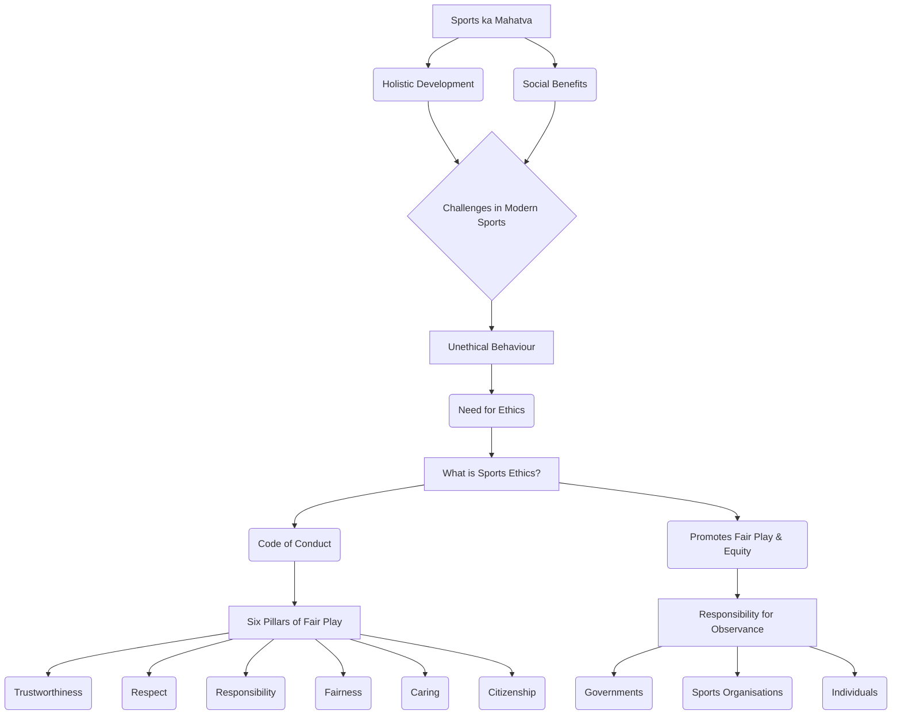
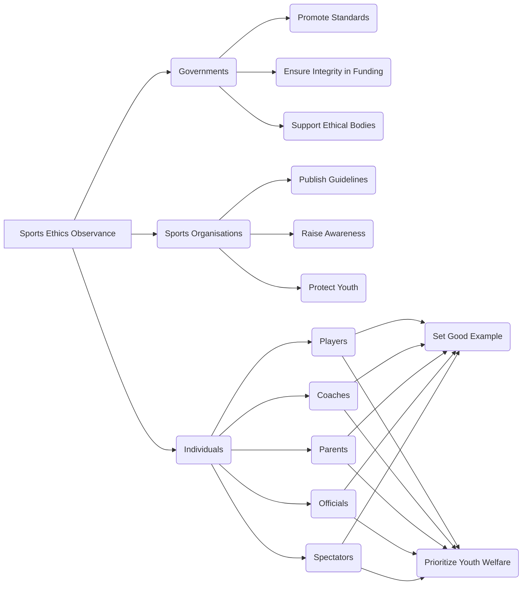

# Class 9 Physical Education - Physical Education Chapter 108
**Language:** Hinglish

```markdown
# [Class 9] Physical Education - Chapter 108 (Chapter 8: Ethics in Sports)

## 🌟 Core Concepts

Yeh section chapter ke mukhya vicharon ko ek hierarchy mein प्रस्तुत karta hai:

1.  **Sports ka Mahatva (Importance of Sports)**
    *   Physical, Psychological, Emotional well-being (Sharirik, Manovaigyanik, Bhavnatmak कल्‍याण)
    *   Social Development & Interaction (Samajik Vikas aur Meljol)
    *   Goal Setting & Discipline (Lakshya Nirdharan aur Anushasan)
    *   Decision-making & Leadership (Nirnay Lena aur Netritva Kshamta)
    *   Holistic Development (Samagra Vikas)
    *   Self-expression & Achievement (Atma-abhivyakti aur Uplabdhi)
    *   Enjoyment & Health (Anand aur Swasthya)
    *   Social Interaction & Bridging Divides (Samajik Meljol aur Bhedbhav Mitana)

2.  **Sports mein Chunautiyan (Challenges in Sports)**
    *   Unethical Behaviour (Anaitik Vyavahar)
        *   Cheating (Dhokhadhadi)
        *   Bending Rules (Niyam Todna-Marodna)
        *   Doping
        *   Violence (Hinsa - Physical/Verbal)
        *   Harassment & Abuse (Utpidan aur Shoshan)
        *   Discrimination (Bhedbhav)
        *   Exploitation (Shoshan)
        *   Excessive Commercialisation (Atyadhik Vyavsayikaran)
        *   Corruption (Bhrashtachar)

3.  **Ethics ki Zarurat (Need for Ethics)**
    *   Ignoring ethics leads to problems.
    *   Ethics helps make principled choices (Siddhantvadi Chunav).

4.  **Sports Ethics kya hai? (What is Sports Ethics?)**
    *   Branch of philosophy defining right/wrong (Sahi/Galat ka Nirdharan).
    *   Code of conduct (Aachar Sanhita) guiding behaviour.
    *   Promotes healthy sporting practices (Swasth Khel Abhyas).
    *   Promotes Fair Play (Nishpaksh Khel) and respect (Samman).
    *   Applies to all levels (sabhi staron par lagu).
    *   Focuses on Equity (Samanta) - Institutional & Personal.

5.  **Sports Ethics ke Standards (Standards of Sports Ethics) - "Six Pillars of Fair Play"**
    *   Trustworthiness (Vishwasniyata)
    *   Respect (Samman)
    *   Responsibility (Zimmedari)
    *   Fairness (Nishpakshta)
    *   Caring (Parvah)
    *   Citizenship (Nagrikta)

6.  **Ethics ke Palan ki Zimmedari (Responsibility for Observance of Ethics)**
    *   Governments (Sarkarein)
    *   Sports-related Organisations (Khel se Jude Sangathan)
    *   Individuals (Vyakti - Players, Coaches, Parents, Officials, etc.)

📊 **Concept Hierarchy Diagram:**



## 📘 Key Learnings

Is section mein hum chapter ke important points ko detail mein samjhenge.

1.  **Sports Ethics ka Arth (Meaning of Sports Ethics):**
    *   Sports Ethics ek tarah ki **aachar sanhita (code of conduct)** hai jo sports mein sahi aur galat ke beech chunav karne mein madad karti hai.
    *   Yeh sirf niyam ke andar khelne se zyada hai; ismein **dosti (friendship), doosron ka samman (respect for others), aur khel bhavna (sporting spirit)** jaise concepts bhi shamil hain.
    *   Iska maqsad **nishpaksh khel (fair play)** ko badhava dena aur har tarah ke galat vyavahar (negative behaviour) ko on-field aur off-field dono jagah khatam karna hai.
    *   Yeh **samanta (equity)** par bhi focus karta hai - institutional (rules sabke liye barabar) aur personal (niyamon ka palan karna).

2.  **Sports Ethics ka Mahatva (Importance of Sports Ethics):**
    *   Aaj ke competitive sports environment mein, cheating, doping, hinsa, bhedbhav jaise anaitik kaam aam ho gaye hain. Ethics in sabse ladne mein madad karta hai.
    *   Yeh sports ki **integrity (akhadta)** ko banaye rakhta hai.
    *   Yeh ensure karta hai ki jeet **merit (yogyata)** aur **talent ke sahi vikas (deserved development of talent)** se mile.
    *   Yeh athletes ke **samagra vikas (holistic development)** mein yogdan deta hai.

3.  **Sports Ethics ke 6 Stambh (The 6 Pillars/Standards of Sports Ethics):**
    Ye 6 pillars fair play ke core elements hain:

    *   📊 **Trustworthiness (Vishwasniyata):**
        *   Hamesha samman ke saath jeet hasil karne ki koshish karein (pursue victory with honour).
        *   Imandari (Integrity) dikhayein aur maangein.
        *   Niyamon ki bhavna (spirit) aur shabdon (letter) ka palan karein.
        *   Beimani (dishonesty), cheating (dhokhadhadi) na karein aur na sahein.

    *   🤝 **Respect (Samman):**
        *   Khel ki paramparao (traditions) aur doosre participants ka samman karein.
        *   Opponents aur officials ka verbal abuse (gaali galoch), taunting (tana marna) jaise disrespectful conduct na karein.
        *   Jeet mein vinamrata (grace) aur haar mein garima (dignity) dikhayein.

    *   🛡️ **Responsibility (Zimmedari):**
        *   Field par aur bahar ek positive role model (sakaratmak adarsh) banein.
        *   Apne swasthya ki raksha karein (safeguard your health). Jaanein ki aap kya consume kar rahe hain.
        *   Anti-doping ke muddo par khud ko educate karein aur rules follow karein.

    *   ⚖️ **Fairness (Nishpakshta):**
        *   Fair play ke uchh standards (high standards) ka palan karein.
        *   Ensure karein ki team niyam se khele aur doosron ke saath fair vyavahar kare.
        *   Koi bhi cheez jo anuchit labh (unfair advantage) de, woh khel ki integrity ke khilaf hai.

    *   ❤️ **Caring (Parvah):**
        *   Doosron ke liye chinta (concern) dikhayein. Aisa koi laparwahi wala kaam na karein jisse khud ko ya doosron ko chot lage.
        *   Apne teammates ko encourage (protsahit) karke team ki madad karein.
        *   Teammates ke anuchit ya khatarnak vyavahar (unhealthy/dangerous conduct) ko kabhi tolerate na karein.

    *   🌍 **Citizenship (Nagrikta):**
        *   Niyamon se khelein (Play by the rules).
        *   Niyamon ki bhavna (spirit of the rules) ka palan karein. Rules ko bend karke advantage lene se bachein.
        *   Ek community (samuday) ke member ke roop mein, sochein ki aapke choices doosron par kaise asar dalte hain.

4.  **Ethics Palan ki Zimmedari Kiski? (Who is Responsible for Observing Ethics?)**
    Sports ethics ko banaye rakhna sabki zimmedari hai jo sports se jude hain:

    *   **Governments (Sarkarein):** Ethical standards ko promote karna, funding mein integrity ensure karna, ethical organisations ko support karna, school curriculum mein ethics shamil karna, match-fixing jaise khatron se bachana.
    *   **Sports Organisations (Khel Sangathan):** Clear ethical guidelines banana, awareness failana, ethical behaviour ko reward karna, youth ke liye sahi competition structure banana, bachchon ko exploitation aur abuse se bachana.
    *   **Individuals (Vyakti):**
        *   **Personal Behaviour:** Achha example set karna, unfair play ko discourage karna.
        *   **Working with Youth:** Bachchon ki health aur safety ko priority dena, unpar anuchit dabav (undue pressure) na dalna, sabhi bachchon mein interest lena (talent ke alawa bhi), unhe personal responsibility sikhana.

📈 **Diagram: Responsibility Flow**



## 🧩 Active Learning

1.  **Activity: Research-based Case Study Analysis 🔍**
    *   **Task:** Research karein kisi recent sports event (National ya International) mein hue ethical issue (like doping, match-fixing, unfair play, discrimination) ke baare mein. Ek short case study taiyyar karein.
    *   **Analysis Points:**
        *   Kya hua tha? (What happened?)
        *   Kaun se ethical pillars (standards) violate hue? (Which ethical pillars were violated?)
        *   Ismein kiski zimmedari thi? (Whose responsibility was involved?)
        *   Iska kya parinam (consequence) hua?
        *   Aise incidents ko future mein kaise roka ja sakta hai? (How can such incidents be prevented?)

2.  **Discussion: Critical Analysis of Real-world Impacts 🌍**
    *   **Topic:** "Kya jeetna hi sab kuch hai?" (Is winning the be-all and end-all in sports?)
    *   **Points to Discuss:**
        *   Sports mein competition ka role kya hai?
        *   Jeetne ke pressure mein athletes anaitik (unethical) kyu ho jate hain?
        *   Fair play aur jeetne ke beech balance kaise banaya ja sakta hai?
        *   School sports mein ethics ka kya mahatva hai?
        *   Activity 8.3 (Textbook page 116-117) ke scenarios par discuss karein - kaun sa behaviour ethical hai aur kaun sa unethical, aur kyu? Apne choices ko justify karein.

## 📝 Assessment Prep

Exam ki taiyyari ke liye in cheezon par focus karein:

1.  **Case Studies:** Activity 8.3 jaise scenarios diye ja sakte hain, jahan aapko situation ko ethical standards ke basis par **evaluate (mulyankan)** karna hoga aur batana hoga ki woh clearly ethical, somewhat ethical, somewhat unethical, ya clearly unethical hai. Apne answer ko justify karna important hoga.
    *   *Example Case:* Ek cricket match mein, fielder ko pata hai ki catch clean nahi tha (zameen ko touch hua), lekin umpire ne out de diya. Fielder chup rehta hai. Yeh kaun sa ethical pillar violate karta hai? Kya yeh ethical hai? Kyu?
2.  **Diagrams:** Upar diye gaye diagrams (Concept Hierarchy, Responsibility Flow) ya 6 Pillars ko represent karne wale diagrams ko samajhna aur explain karna. Aapko shayad khud bhi simple diagrams banane ko kaha ja sakta hai (e.g., showing the relationship between fair play and respect).
3.  **Definitions & Explanations:** Sports Ethics, Fair Play, aur 6 Pillars ki definition aur importance ko explain karna.
4.  **Responsibilities:** Government, Sports Organisations, aur Individuals ki responsibilities ko detail mein batana.

## 🌏 Bharatiya Context

Bharat mein sports ethics ka palan karna aur bhi mahatvapurna hai kyunki:

1.  **National Pride & Unity:** Sports, jaise Cricket, Hockey, Kabaddi, desh ko ek saath laate hain. Ethical conduct desh ki reputation banaye rakhta hai. Unethical behaviour (like match-fixing scandals in cricket) poore desh ko disappoint karta hai.
2.  **Diversity & Inclusion:** Bharat ek vividh (diverse) desh hai. Sports mein ethics yeh ensure karta hai ki sabhi ko **saman avsar (equal opportunities)** mile, chahe unka background, region, ya gender kuch bhi ho. Discrimination (bhedbhav) ko sports se door rakhna zaroori hai.
3.  **Grassroots Development:** Initiatives jaise **Khelo India Games** ka maqsad grassroots level par talent ko badhava dena hai. In platforms par shuru se hi ethical values (naitik mulya) sikhana zaroori hai taaki young athletes sahi raaste par chalein.
4.  **Role Models:** Bharat mein top sportspersons (like Virat Kohli, PV Sindhu, Neeraj Chopra) yuvaon ke liye bade role models hain. Unka ethical behaviour (ya lack thereof) bahut prabhav dalta hai. Unki zimmedari hai ki woh fair play aur integrity ka उदहारण (example) set karein.
5.  **'Spirit of Cricket':** Cricket Bharat mein ek dharm ki tarah hai. 'Spirit of Cricket' – jo fair play, respect, aur rules ki bhavna ka samman karne par zor deta hai – ek important ethical concept hai jise aksar discuss kiya jata hai. (Example: Adam Gilchrist ka walk karna, even when umpire didn't give out).
6.  **Government & Sports Bodies:** Sports Authority of India (SAI) aur National Sports Federations (NSFs) ki zimmedari hai ki woh ethical codes ko implement karein aur monitor karein, especially doping aur age-fraud jaise issues par.

Yeh chapter humein sikhata hai ki sports sirf jeet haar ka khel nahi hai, balki yeh character building (charitra nirman), respect (samman), aur integrity (imandari) sikhane ka ek powerful tool hai. Ethical choices hi sports ki asli spirit ko zinda rakhte hain.
```