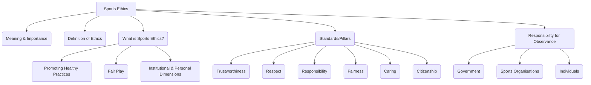

# Class 9 Physical Education - Physical Education Chapter 108
**Language:** Hinglish

```markdown
# [Class 9] Physical Education - Chapter 8: Ethics in Sports

## 🌟 Core Concepts

Yeh chapter sports mein ethics (नीतिशास्त्र) ke importance par focus karta hai. Core concepts hain:

1.  **Sports ka Meaning & Importance:**
    *   Sirf competition jeetna nahi, balki holistic development (शारीरिक, मनोवैज्ञानिक, भावनात्मक).
    *   Discipline, goal-setting, decision-making, leadership sikhata hai.
    *   Social interaction aur cultural bridge ka kaam karta hai.
2.  **Ethics ka Concept:**
    *   Sahi (right) aur galat (wrong) ke beech principled choices karna.
    *   Code of conduct jo human behaviour guide karta hai.
3.  **Sports Ethics:**
    *   Khel mein healthy practices promote karne ke liye code of conduct.
    *   Fair Play (निष्पक्ष खेल) par zor deta hai.
    *   Institutional (sabke liye same rules) aur Personal (rules follow karna) dimensions.
    *   Human excellence ka expression hona chahiye.
4.  **Standards of Sports Ethics (Six Pillars of Fair Play):**
    *   Trustworthiness (भरोसेमंद होना)
    *   Respect (सम्मान)
    *   Responsibility (ज़िम्मेदारी)
    *   Fairness (निष्पक्षता)
    *   Caring (देखभाल)
    *   Citizenship (नागरिकता)
5.  **Responsibility for Observance (कौन ज़िम्मेदार है?):**
    *   Governments (सरकारें)
    *   Sports-related Organisations (खेल संगठन - Federations, Associations, etc.)
    *   Individuals (व्यक्ति - Parents, Teachers, Coaches, Players, Spectators, etc.)

📊 **Concept Hierarchy:**



## 📘 Key Learnings

**Sports Ethics Kya Hai?**
Sports ethics ek positive concept hai jo khel mein hamare actions ko guide karta hai. Yeh sirf rules follow karna nahi hai, balki isme friendship, respect for others, aur sporting spirit jaise values bhi shamil hain. Iska goal hai fair play ko promote karna aur har tarah ke negative behaviour (cheating, doping, discrimination, violence) ko eliminate karna.

**Six Pillars of Fair Play (निष्पक्ष खेल के छह स्तंभ):**

1.  **Trustworthiness (भरोसेमंद होना):**
    *   Hamesha samman ke saath jeet hasil karne ki koshish karo.
    *   Integrity (ईमानदारी) dikhao aur demand karo.
    *   Rules ki spirit aur letter dono ko follow karo. Dishonesty ya cheating mat karo.
    *   *Example:* Agar umpire ne galat decision diya hai lekin aapko pata hai aap out the (like in cricket, caught behind), toh इमानदारी se pavilion laut jana.
2.  **Respect (सम्मान):**
    *   Khel ki traditions aur doosre participants (opponents, officials) ka samman karo.
    *   Verbal abuse, taunting, ya galat tarike se celebrate mat karo.
    *   Jeet mein विनम्रता (grace) aur haar mein गरिमा (dignity) dikhao.
3.  **Responsibility (ज़िम्मेदारी):**
    *   Field par aur bahar, ek positive role model bano.
    *   Apni health ka dhyan rakho. Jaano ki tum kya consume kar rahe ho (anti-doping rules).
    *   Anti-doping policies ke baare mein khud ko educate karo.
    *   *Example:* Ek senior player ka responsibility hai ki woh juniors ko drugs ya galat supplements se door rehne ke liye guide kare.
4.  **Fairness (निष्पक्षता):**
    *   Fair play ke high standards maintain karo.
    *   Ensure karo ki sab rules follow karein aur doosron ko fairly treat karein.
    *   Koi bhi cheez jo unfair advantage de, woh khel ki integrity ke khilaf hai.
    *   *Example:* Referee ka bina kisi bias ke dono teams ke liye consistent decisions lena.
5.  **Caring (देखभाल):**
    *   Doosron ke liye concern dikhao. Aisa koi kaam mat karo jisse khud ko ya doosron ko chot lage.
    *   Apne teammates ko encourage karo.
    *   Unhealthy ya dangerous behaviour ko tolerate mat karo.
    *   *Example:* Agar teammate injured hai, toh uski help karna, na ki use khelne ke liye force karna.
6.  **Citizenship (नागरिकता):**
    *   Rules ke according khelo. Rules khel ko define karte hain.
    *   Rules ki spirit ko follow karo. Advantage ke liye rules ko bend mat karo.
    *   Community (team, class, family) ke member hone ke naate, socho ki tumhare choices doosron ko kaise impact karte hain.

📈 **Diagram: Stakeholder Responsibilities**

```mermaid
graph TD
    G[Government] --> G1(Promote Ethical Standards);
    G --> G2(Support Ethical Orgs/Individuals);
    G --> G3(Monitor Implementation);
    G --> G4(Promote Ethics in Schools);
    G --> G5(Fight Match-fixing, Trafficking);

    O[Sports Organisations] --> O1(Publish Clear Guidelines);
    O --> O2(Ensure Ethical Decisions);
    O --> O3(Raise Awareness - Campaigns, Awards);
    O --> O4(Reward Ethics, not just Wins);
    O --> O5(Protect Young Athletes - Abuse, Exploitation);
    O --> O6(Ensure Qualified Coaches);

    I[Individuals (Players, Coaches, Parents etc.)] --> I1(Be a Positive Role Model);
    I --> I2(Discourage Unfair Play);
    I --> I3(Prioritize Child's Welfare & Safety);
    I --> I4(Avoid Undue Pressure on Children);
    I --> I5(Value Personal Achievement, not just Winning);
    I --> I6(Inform about Risks of High Performance);
```

## 🧩 Active Learning

1.  **Activity (Research-based - Evaluating):** 🔍
    *   **Task:** Research karo ki India mein Sports Authority of India (SAI) ya Board of Control for Cricket in India (BCCI) jaise organisations ke specific codes of ethics kya hain. International Olympic Committee (IOC) ke code se compare karo.
    *   **Evaluate:** Kya Indian codes international standards se align karte hain? Kahan gaps hain? How effective do you think these codes are in preventing unethical practices like doping or age fraud in Indian sports? Apne findings ko class mein present karo.

2.  **Discussion (Critical Analysis - Creating):** 🌍
    *   **Topic:** Real-world impacts of unethical behaviour in sports.
    *   **Prompt:** Discuss recent examples of unethical practices in Indian sports (e.g., match-fixing scandals, doping bans on athletes, issues in selection processes). Inka players, fans, aur desh ki reputation par kya asar padta hai? How can we, as students and future citizens, contribute to creating a more ethical sports culture in India? Kya school level par 'Sports Ethics Pledge' jaisa kuch create karna chahiye? Agar haan, toh usme kya points hone chahiye?

3.  **Activity (Ethical Dilemmas - Applying):** 🤔
    *   Refer to Activity 8.3 in the textbook (page 116-117). Discuss each scenario in small groups. Decide karo ki har action 'Clearly Ethical', 'Somewhat Ethical', 'Somewhat Unethical', ya 'Clearly Unethical' hai. Apne decision ke peeche reasoning explain karo. For example:
        *   *Scenario 7:* जानबूझकर opponent ko red card dilwane ke liye foul fake karna - Yeh clearly unethical hai kyunki yeh fairness aur respect ke principles ke khilaf hai. It's cheating.
        *   *Scenario 10:* Knowing your teammate is doping but not reporting it - Yeh unethical hai kyunki yeh responsibility aur potentially caring (for the teammate's health and the sport's integrity) ke against jaata hai.

## 📝 Assessment Prep

*   **Case Studies:** Activity 8.3 ke scenarios jaise situations exam mein aa sakte hain. Aapko analyze karna hoga ki kaunsa ethical principle violate ho raha hai aur kyu.
    *   *Example Case:* Ek state-level tournament mein, coach ek talented young athlete par jeetne ke liye bahut pressure daalta hai, uski minor injury ko ignore karte hue. Yahan kaun se ethical principles neglect ho rahe hain? (Answer: Caring, Responsibility, prioritizing child's welfare).
*   **Diagrams:** Stakeholder responsibilities (Government, Orgs, Individuals) ka diagram banane ki practice karo (jaisa Key Learnings section mein hai). Explain karo har stakeholder ka role kya hai sports ethics maintain karne mein.
*   **Short/Long Answer Questions:**
    *   Sports ethics kya hai aur yeh important kyu hai?
    *   Fair Play ke six pillars ko examples ke saath explain karo.
    *   Government ki kya responsibilities hain sports ethics ko promote karne mein?
    *   Ek individual (player/coach/spectator) sports ethics ko kaise uphold kar sakta hai?

## 🌏 Bharatiya Context

India mein sports ka culture tezi se badh raha hai, Khelo India jaise initiatives ke saath. Lekin iske saath ethical challenges bhi badh rahe hain.

*   **National Data Link (Social/Ethical):** While specific economic data isn't the focus, unethical practices jaise match-fixing (cricket mein pehle dekha gaya) ya doping scandals (jismein kayi Indian athletes involve hue hain) desh ki sporting image ko kharab karte hain. Yeh sponsorships aur public trust par negative impact daalte hain. Ethical sports conduct national pride aur social cohesion (सामाजिक एकता) ko badhawa deta hai.
*   **India-Specific Examples:**
    1.  **Cricket:** IPL jaise high-stakes tournaments mein fair play aur anti-corruption measures ka importance bahut zyada hai. Past mein spot-fixing ke cases ne sport ki integrity par sawal uthaye the. Ethical conduct (like MS Dhoni ka spirit of cricket award jeetna) positive role modeling ka example hai.
    2.  **Wrestling/Athletics:** Doping aur age fraud (apni age galat batana) ke cases Indian sports mein ek serious concern rahe hain. National Anti-Doping Agency (NADA) isko rokne ke liye kaam karti hai, jo responsibility aur fairness ke principles ko highlight karta hai.
    3.  **Grassroots Level:** School aur district level competitions mein favouritism ya unfair selection ke allegations kabhi kabhi sunne ko milte hain. Yeh institutional fairness ke principle ke khilaf hai. Governments aur sports bodies ki responsibility hai ki transparency ensure karein.
*   **Role Models:** Successful Indian athletes jaise PV Sindhu, Neeraj Chopra, Viswanathan Anand sirf apni performance se nahi, balki apne conduct aur sportsmanship se bhi youth ko inspire karte hain, jo respect aur responsibility ke pillars ko demonstrate karta hai.

Yeh chapter humein yaad dilata hai ki khel sirf jeet haar ka maamla nahi hai, balki character building aur ethical values ko develop karne ka ek powerful tool hai, jo ek strong nation ke liye zaroori hai.
```