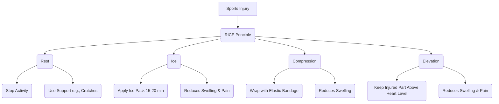

# Class 9 Physical Education - Physical Education Chapter 112
**Language:** Hinglish

```markdown
# [Class 9] Physical Education - Chapter 12: First Aid and Safety

## 🌟 Core Concepts (Mukhya Concepts)

Yeh section First Aid ke basic principles aur alag-alag situations mein uske application ko detail mein samjhata hai.

1.  **First Aid (Prathmik Chikitsa)**
    *   **Meaning (Arth):** Kisi bhi illness (bimari) ya injury (chot) ke liye di jaane wali initial care (shuruaati dekhbhal), jo usually ek non-expert vyakti deta hai jab tak medical help (doctor ya hospital) na mil jaye.
    *   **Importance (Mahatva):**
        *   Self-help (Apni madad): Khud ki chot ya bimari mein madad karna ya doosron ko guide karna.
        *   Help for Others (Doosron ki madad): Zarooratmand logon ki madad karna, unki takleef kam karna ya jaan bachana.
    *   **Objectives (Uddeshya):**
        *   Immediate care (Turant dekhbhal) dena.
        *   Victim ko aur nuksan (harm) se bachana.
        *   Pain (dard) kam karna.
        *   Recovery (theek hone) mein madad karna.

2.  **First Aid Applications (Alag-Alag Cases mein First Aid)**
    *   **Drowning (Doobna):**
        *   Cause: Paani lungs mein jaane se saans na le pana.
        *   Aim: Breathing restore karna, body ko garam rakhna, hospital pahunchana.
        *   Steps: Rescue, Check Breathing (CPR if needed), Treat Hypothermia, Hospital.
        *   *Caution:* Secondary drowning ka risk rehta hai.
    *   **Fire Injuries / Burns (Jalne se Chot):**
        *   Cause: Skin ka aag ya garam cheez ke contact mein aana (Dry Burn).
        *   Assessment: Cause, victim's condition, extent & depth of burn, infection risk.
        *   **Types of Burns:**
            *   Superficial (Outer skin layer - Epidermis)
            *   Partial Thickness (Epidermis destroy, painful)
            *   Full Thickness (Deep layers, often less painful initially, serious)
        *   **First Aid Steps:**
            *   *Severe Burns:* Lie down, Cool water (10+ min), Remove tight items (rings, belts), Cover (sterile dressing), Hospital. Face burns ko cover na karein.
            *   *Mild Burns:* Cool water (10+ min), Remove tight items, Cover (sterile dressing).
        *   *Don'ts:* Blisters phodna nahi, adhesive dressing nahi lagana, ointments/fats nahi lagana.
    *   **Sports Injuries (Khel ki Chotein):**
        *   **Types:**
            *   *Skin Injuries:* Abrasion (ragad), Laceration (phatna), Incision (katna), Puncture (chubh jana), Avulsion (skin ka hissa alag hona).
            *   *Soft Tissue Injuries:* Contusion (bruise/neel padna), Sprain (ligament injury), Strain (muscle/tendon injury).
            *   *Joint Injuries:* Dislocation (joint ka apni jagah se hatna).
            *   *Bone Injuries:* Fracture (haddi ka tootna - open/closed).
        *   **Prevention:** Hazard-free area, Proper warm-up, Conditioning.
        *   **First Aid (RICE Principle):**
            *   **R - Rest:** Injured part ko use na karein.
            *   **I - Ice:** Swelling aur bleeding kam karne ke liye barf lagayein (15-20 min at a time, kapde ke upar).
            *   **C - Compression:** Swelling kam karne ke liye elastic bandage se firmly wrap karein (zyada tight nahi).
            *   **E - Elevation:** Injured part ko heart level se upar rakhein.

3.  **Transporting the Person (Victim ko Medical Help tak Pahunchana):**
    *   Agar medical help available na ho ya emergency ho, toh victim ko safe tareeke se transport karna zaroori hai, bina injury ko badhaye.

## 📘 Key Learnings (Zaroori Baatein)

**1. First Aid Kya Hai? (What is First Aid?)**
First aid woh pehli madad hai jo kisi bimar ya ghayal (injured) vyakti ko di jaati hai, jab tak use proper medical treatment (doctor ya hospital mein ilaaj) na mil jaye. Yeh madad aksar koi trained medical professional nahi, balki koi bhi aam insaan de sakta hai jise iski basic knowledge ho. Kai baar choti-moti choton ya bimariyon mein first aid se hi aaram mil jata hai. Yeh khud ki madad (self-help) aur doosron ki madad (help for others) dono ke liye important hai.

**2. First Aid Ke Uddeshya (Objectives of First Aid):**
First aid ka main maqsad ilaaj karna nahi, balki victim ki safety ensure karna hai jab tak use specialized treatment na mil jaye. Iske mukhya uddeshya hain:
*   **Jaan Bachana (To preserve life):** Victim ko turant madad dekar uski jaan bachana.
*   **Haalat Bigadne se Rokna (To prevent further harm):** Chot ko aur zyada kharab hone se rokna.
*   **Recovery Mein Madad Karna (To promote recovery):** Aisi dekhbhal karna jisse victim jaldi theek ho sake aur use dard se rahat mile.
*   **Dard Kam Karna (To relieve pain):** Victim ki takleef ko kam karna.

**3. Drowning Ke Liye First Aid (First Aid for Drowning):**
Drowning tab hoti hai jab paani lungs mein chala jaata hai aur saans ruk jaati hai.
*   **Steps:**
    1.  **Rescue:** Victim ko paani se nikal kar sukhi jagah layein. Sir ko body se neeche rakhein.
    2.  **Check Breathing:** Peeth ke bal litayein. Airway (saans ki nali) check karein. Agar saans nahi chal rahi toh CPR (Cardio Pulmonary Resuscitation) dein (chest compressions ke saath). *Diagram dekhein (Fig 12.2)*.
    3.  **Treat Hypothermia:** Geele kapde utaar kar dry blanket se dhakein. Hosh mein aane par garam drink dein.
    4.  **Hospital:** Turant doctor ya ambulance bulayein, bhale hi victim theek lag raha ho (secondary drowning ka khatra rehta hai).

**4. Burns Ke Liye First Aid (First Aid for Burns):**
Jab skin aag ya garam cheez se jalti hai. Infection ka khatra badh jaata hai.
*   **Types:** Superficial (bahari), Partial Thickness (thodi gehri, dardnaak), Full Thickness (sabse gehri, serious).
*   **Severe Burns (Gambhir Jalna):**
    1.  Victim ko litayein (jali hui jagah zameen par na lage).
    2.  Kam se kam 10 minute tak thanda paani dalein. Hospital le jaane ka intezam karein.
    3.  Angoothi, ghadi, belt, joote dheere se nikaal dein (sujan aane se pehle). Chipke hue kapde na kheechein.
    4.  Jali hui jagah ko sterile dressing se cover karein.
    5.  Victim ko reassure karte rahein.
*   **Mild Burns (Mamuli Jalna):**
    1.  Kam se kam 10 minute tak thanda paani dalein.
    2.  Tight cheezein nikaal dein.
    3.  Sterile dressing se cover karein.
*   **Kya NA Karein (Don'ts - Box 12.4):** Blisters (chhale) na phodein, adhesive पट्टी (patti) na lagayein, koi cream ya tel na lagayein.

**5. Sports Injuries Ke Liye First Aid (RICE):**
Khelte waqt lagne wali chotein jaise sprain (moch), strain (khichav), contusion (neel). Inke liye RICE principle follow karein:
*   **R - Rest (Aaram):** Chot wale hisse ko aaram dein, use na karein. Crutches ya splint ka use karein.
*   **I - Ice (Barf):** Sujan aur dard kam karne ke liye 15-20 min barf lagayein (direct skin par nahi). Har ghante repeat karein.
*   **C - Compression (Dabav):** Sujan kam karne ke liye elastic bandage se lapetein (zyada tight nahi).
*   **E - Elevation (Unchai):** Chot wale hisse ko dil ke level se upar utha kar rakhein.

**(Diagrammatic Representation of RICE)**


## 🧩 Active Learning (Sક્રિય Seekhna)

*   **Activity 1: First Aid Box Banayein (Make a First Aid Box - Activity 12.1)**
    *   Apni class ke liye ek First Aid Box taiyar karein. Teacher se discuss karke zaroori samaan (cotton, bandage, antiseptic, scissors, pain relief spray, etc.) ki list banayein aur box mein rakhein.
    *   Ek student ko in-charge banayein taaki emergency mein sabko pata ho kisse contact karna hai. Regularly check karein ki saara samaan मौजूद (maujood) hai ya nahi.
*   **Activity 2: Case Study Analysis (Mamle ka Adhyayan)** 🔍
    *   **Scenario:** School ke playground mein football khelte hue ek student gir gaya aur uske ghutne (knee) mein zor se chot lagi, sujan aa gayi aur dard ho raha hai. Use chalne mein dikkat ho rahi hai.
    *   **Task:** Groups mein discuss karein:
        1.  Yeh kis tarah ki injury ho sakti hai (e.g., sprain, contusion)?
        2.  Aap RICE principle ka istemal kaise karenge? Step-by-step batayein.
        3.  Kya is student ko doctor ke paas le jaana zaroori hai? Kyun?
*   **Discussion: Real-World Impact (Vastavik Prabhav par Charcha)** 🌍
    *   India mein road accidents aur gharon mein hone wali common injuries (jaise jalna, katna) mein first aid ki kya ahmiyat (importance) hai?
    *   Kya schools mein first aid training compulsory honi chahiye? Iske fayde aur challenges kya ho sakte hain? Apne vichar vyakt karein.
    *   Community level par first aid awareness kaise badhai ja sakti hai?

## 📝 Assessment Prep (Mulyankan ki Taiyari)

*   **Case Study 1:** Ek cooking class mein student ke haath par garam tel gir gaya. Skin laal ho gayi hai aur dard ho raha hai. Aap kya first aid denge? Steps likhein. Kya aapko koi cheez nahi karni chahiye?
*   **Case Study 2:** Park mein khelte hue ek bachha jhule se gir gaya aur uski kalai (wrist) mein dard hai, sujan hai aur woh use hila nahi paa raha hai. Aapko lagta hai fracture ho sakta hai. Aap RICE mein se kya apply karenge aur use hospital kaise le jayenge?
*   **Diagrams:**
    *   RICE ke steps ko diagram se samjhayein.
    *   Burn ke types (Superficial, Partial, Full Thickness) ko simple diagram se dikhayein.
*   **Important Questions:**
    *   First aid kya hai aur iske mukhya uddeshya kya hain? (What is first aid and its main objectives?)
    *   Khel mein hone wali common injuries kaun si hain? (What are common sports injuries?)
    *   Sprain aur Strain mein kya antar hai? (Difference between Sprain and Strain?)
    *   Severe burn ke liye first aid ke steps kya hain? (What are the first aid steps for severe burns?)
    *   RICE ka full form kya hai aur yeh kab use hota hai? (What is RICE and when is it used?)

## 🌏 Bharatiya Context (Indian Context)

Bharat jaise vishal (vast) aur diverse desh mein, jahan medical facilities har jagah aasani se uplabdh nahi ho sakti, first aid ka gyaan hona bahut zaroori hai.
*   **Accident Prone Areas:** Hamare desh mein road accidents, gharon mein jalne ki ghatnayein (kitchen accidents), aur tyoharon (festivals) ke dauran chotein lagna aam baat hai. Aise mein turant first aid milne se jaan bach sakti hai ya gambhir nuksan se bacha ja sakta hai.
*   **School Safety:** Schools mein khelte koodte bachhon ko chotein lag jaati hain. Teachers aur students ko basic first aid ki training hone se immediate help mil sakti hai. National Disaster Management Authority (NDMA) bhi school safety aur first aid training par zor deti hai.
*   **Community Awareness:** Gaon (villages) aur remote areas mein, jahan hospital door hote hain, community members ko first aid ki jaankari hona jeevan rakshak (life-saving) ho sakta hai. ASHA workers jaise community health workers ismein important bhumika nibhate hain.
*   **Data Point (Example):** National Crime Records Bureau (NCRB) ke data aksar dikhate hain ki Bharat mein accidents (road, fire, drowning) se kaafi deaths hoti hain. Agar bystanders (aas paas ke log) ko first aid pata ho, toh inmein se kai jaanein bachai ja sakti hain. First aid training ko badhawa dena ek important social step hai.
```