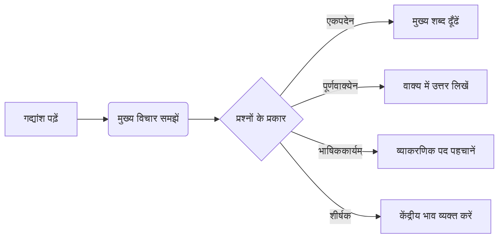

# Class 9 Sanskrit - Abhyasvan Chapter 101
**Language:** हिंदी

```markdown
# [कक्षा 9] अभ्यासवान् भव - अध्याय 101: अपठितावबोधनम्

## 🌟 मुख्य अवधारणाएँ (Core Concepts)

यह अध्याय संस्कृत में **अपठितावबोधनम्** (Unseen Passage Comprehension) के कौशल पर केंद्रित है। इसका अर्थ है - ऐसे गद्यांश को पढ़कर समझना और उस पर आधारित प्रश्नों के उत्तर देना, जिसे पहले पढ़ा न गया हो।

**कौशल सोपान (Skill Hierarchy):**

1.  **पठनम् (Reading):** गद्यांश को ध्यानपूर्वक पढ़ना।
2.  **अर्थग्रहणम् (Comprehension):** गद्यांश के मुख्य भाव, घटनाओं और विवरणों को समझना।
3.  **विश्लेषणम् (Analysis):**
    *   **प्रश्नोत्तरम्:**
        *   `एकपदेन उत्तरत`: पूछे गए प्रश्न का उत्तर गद्यांश से ढूँढकर **एक शब्द** में देना।
        *   `पूर्णवाक्येन उत्तरत`: प्रश्न का उत्तर गद्यांश के आधार पर **पूरे वाक्य** में लिखना।
    *   **भाषिककार्यम् (Language Analysis):** व्याकरण से सम्बंधित प्रश्नों का उत्तर देना:
        *   **विशेषण-विशेष्य** पद पहचानना (Describing word and the word described)।
        *   **कर्तृपद (कर्ता)** और **क्रियापद (क्रिया)** पहचानना (Subject and Verb)।
        *   **अव्ययपद** पहचानना (Indeclinable words)।
        *   **विलोमपद** (Opposite words) या **पर्यायवाची/समानार्थक पद** (Synonyms) गद्यांश से ढूँढना।
        *   **सर्वनाम पद** किसके लिए प्रयुक्त हुआ है, यह बताना (Pronoun reference)।
4.  **संश्लेषणम्/मूल्यांकनम् (Synthesis/Evaluation):**
    *   **शीर्षक-लेखनम्:** गद्यांश के केंद्रीय भाव को समझकर उसके लिए **उचित शीर्षक** (Title) देना।

📊 **अवधारणा पदानुक्रम:**
अपठितावबोधनम्
└──┬── पठन एवं अर्थग्रहण
   ├── प्रश्नोत्तर (एकपद, पूर्णवाक्य)
   ├── भाषिककार्यम् (व्याकरणिक विश्लेषण)
   │   ├── विशेषण-विशेष्य
   │   ├── कर्तृ-क्रिया
   │   ├── अव्यय
   │   ├── विलोम/पर्याय
   │   └── सर्वनाम-संज्ञा संबंध
   └── शीर्षक-चयन

## 📘 प्रमुख शिक्षण बिंदु (Key Learnings)

इस अध्याय के अभ्यास से छात्र सीखेंगे:

1.  **अपठित गद्यांश को कैसे समझें:**
    *   **चरण 1:** गद्यांश को कम से कम दो बार ध्यान से पढ़ें।
    *   **चरण 2:** अपरिचित शब्दों का अर्थ वाक्य के संदर्भ में अनुमान लगाने का प्रयास करें।
    *   **चरण 3:** प्रश्नों को समझें कि वास्तव में क्या पूछा गया है।
    *   **चरण 4:** गद्यांश में संभावित उत्तरों को रेखांकित करें।

2.  **प्रश्नों के उत्तर देने की तकनीक:**
    *   **एकपदेन:** केवल मुख्य सूचना वाला एक ही शब्द लिखें।
        *   *उदाहरण (गद्यांश I):* `(क) आपत्काले केषां वचनं ग्राह्यम्?` उत्तर: `वृद्धानाम्`
    *   **पूर्णवाक्येन:** गद्यांश से वाक्य लेकर या अपने शब्दों में (गद्यांश के आधार पर) पूरा उत्तर लिखें।
        *   *उदाहरण (गद्यांश II):* `(क) केषां जन्म निरर्थकं भवति?` उत्तर: `ये जनाः न स्वार्थाय न परार्थाय किमपि कार्यं कुर्वन्ति, न धर्मम् आचरन्ति, न धनम् उपार्जयन्ति, तेषां जन्म निरर्थकं भवति।`

3.  **भाषिककार्यम् (व्याकरणिक विश्लेषण) कैसे करें:**
    *   **विशेषण/विशेष्य:** विशेष्य (संज्ञा/सर्वनाम) से पहले देखें कि उसकी विशेषता बताने वाला शब्द (विशेषण) कौन सा है। 'कैसा?', 'कितना?' पूछने पर विशेषण मिलता है।
        *   *उदाहरण (गद्यांश I):* `विशालः शाल्मलीतरुः` - यहाँ `विशालः` विशेषण है और `शाल्मलीतरुः` विशेष्य है।
    *   **कर्तृपद/क्रियापद:** वाक्य में 'कौन' प्रश्न करने पर कर्ता (कर्तृपद) मिलता है। वाक्य का मुख्य कार्य बताने वाला शब्द क्रिया (क्रियापद) होता है।
        *   *उदाहरण (गद्यांश III):* `धनेशः पितुः सकाशादेव वेदशास्त्राणाम् अध्ययनं करोति स्म।` - कौन अध्ययन करता था? `धनेशः` (कर्तृपद)। क्या करता था? `करोति स्म` (क्रियापद)।
    *   **अव्ययपद:** ऐसे शब्द चुनें जो किसी भी लिंग, वचन या कारक में बदलते नहीं हैं (जैसे: `च, अपि, एव, अत्र, तत्र, सदा, बहिः, सह, यदा, तदा, स्म` आदि)।
        *   *उदाहरण (गद्यांश II):* `अन्यानि वस्तूनि विनष्टानि पुनरपि लब्धुं शक्यन्ते परं समयो विनष्टो न केनापि उपायेन पुनः परावर्त्ययितुं शक्यते।` - यहाँ `पुनरपि, परं, न, केनापि, पुनः` अव्यय हैं।
    *   **विलोम/पर्याय:** गद्यांश में दिए गए शब्द का विपरीतार्थक (विलोम) या समानार्थक (पर्याय) शब्द ढूँढें।
        *   *उदाहरण (गद्यांश I):* `वृद्धः` का विलोमपद गद्यांश में `तरुणः` है।
        *   *उदाहरण (गद्यांश III):* `श्रुत्वा` का समानार्थक पद गद्यांश में `निशम्य` है।
    *   **सर्वनाम प्रयोग:** देखें कि सर्वनाम (जैसे - सः, तस्य, अहम्, मम, एषः, अस्य आदि) किस संज्ञा के स्थान पर आया है। अक्सर यह सर्वनाम से पहले वाले वाक्य या उसी वाक्य में पहले आई संज्ञा होती है।
        *   *उदाहरण (गद्यांश IV):* `‘अस्य जन्म शान्तिनिकेतने अभवत्।’` - यहाँ `अस्य` सर्वनाम पद `अमर्त्यसेनस्य` (अमर्त्यसेन के लिए) प्रयुक्त हुआ है।

4.  **उचित शीर्षक का चयन:** गद्यांश को पढ़कर समझें कि उसका मुख्य विषय क्या है। गद्यांश किसके बारे में सबसे अधिक बात करता है? वही उसका उपयुक्त शीर्षक हो सकता है।
    *   *उदाहरण:* गद्यांश II का उचित शीर्षक `समयस्य महत्त्वम्` या `समयस्य सदुपयोगः` हो सकता है। गद्यांश IX का शीर्षक `वृक्षाणां महत्त्वम्` या `वृक्षसंरक्षणम्` हो सकता है।

📈 **समझने की प्रक्रिया (Diagrammatic Representation):**



## 🧩 सक्रिय अधिगम (Active Learning)

*   **गतिविधि: गद्यांश-आधारित गहन विश्लेषण (Research-based Case Study Analysis) 🔍**
    *   दिए गए 10 गद्यांशों में से कोई एक चुनें (जैसे, गद्यांश V - उज्जैन वेधशाला, या गद्यांश IV - अमर्त्य सेन)।
    *   उस गद्यांश के मुख्य विषय, उसमें निहित संदेश, और भाषा-शैली का गहराई से विश्लेषण करें।
    *   यदि गद्यांश किसी ऐतिहासिक स्थान (जैसे उज्जैन) या व्यक्ति (जैसे अमर्त्य सेन) से सम्बंधित है, तो उसके बारे में पुस्तकालय या इंटरनेट से अतिरिक्त जानकारी एकत्र करें और कक्षा में प्रस्तुत करें। उदाहरण के लिए, राजा जयसिंह द्वारा बनवाई गई अन्य वेधशालाओं के बारे में जानें।

*   **चर्चा: वास्तविक जीवन प्रभावों का आलोचनात्मक विश्लेषण (Critical Analysis of Real-world Impacts) 🌍**
    *   गद्यांशों में उठाए गए समसामयिक मुद्दों पर कक्षा में समूह चर्चा करें:
        *   **समय का प्रबंधन (गद्यांश II):** विद्यार्थी जीवन में समय के सदुपयोग का क्या महत्व है? समय बर्बाद करने के क्या दुष्परिणाम हो सकते हैं?
        *   **पर्यावरण संरक्षण (गद्यांश IX):** वृक्ष काटने के क्या-क्या दुष्प्रभाव गद्यांश में बताए गए हैं? हम वृक्षारोपण को कैसे बढ़ावा दे सकते हैं?
        *   **प्रौद्योगिकी का प्रभाव (गद्यांश X):** मोबाइल फोन के लाभ और हानियाँ क्या हैं? इसका संतुलित उपयोग कैसे किया जाए?
        *   **संगति का प्रभाव (गद्यांश VIII):** बुरी संगति व्यक्ति को कैसे प्रभावित करती है? इससे कैसे बचा जा सकता है?
        *   **लैंगिक समानता (गद्यांश VII):** रमा की कुंठा के क्या कारण थे? आज समाज में लड़कियों को समान अवसर मिल रहे हैं या नहीं? इस पर अपने विचार व्यक्त करें।

## 📝 मूल्यांकन तैयारी (Assessment Prep)

*   **अभ्यास:** दिए गए सभी 10 अपठित गद्यांशों को हल करने का अभ्यास करें।
*   **प्रश्न प्रारूप:** परीक्षा में आने वाले सभी प्रकार के प्रश्नों (`एकपदेन`, `पूर्णवाक्येन`, `भाषिककार्यम्`, `शीर्षक`) पर विशेष ध्यान दें।
*   **व्याकरण:** `भाषिककार्यम्` के लिए आवश्यक व्याकरणिक बिंदुओं (विशेषण, विशेष्य, कर्ता, क्रिया, अव्यय, विलोम, पर्याय, सर्वनाम) को अच्छी तरह समझें और पहचानने का अभ्यास करें।
*   **समय प्रबंधन:** निर्धारित समय सीमा के भीतर गद्यांश को पढ़कर प्रश्नों के उत्तर देने का अभ्यास करें।
*   **केस स्टडीज और डायग्राम:** गद्यांश V (उज्जैन वेधशाला) या गद्यांश IV (अमर्त्य सेन) को केस स्टडी के रूप में समझें। व्याकरणिक अवधारणाओं को समझने के लिए सरल रेखाचित्र (जैसे ऊपर दिया गया) या तालिकाएँ बनाएँ।

📝 **उदाहरण तालिका (भाषिककार्यम्):**

| गद्यांश | वाक्य                 | प्रश्न प्रकार      | पद          | उत्तर        |
| :------ | :------------------- | :---------------- | :---------- | :---------- |
| I       | विशालः शाल्मलीतरुः   | विशेषणपदम्?       | विशालः      |             |
| I       | विशालः शाल्मलीतरुः   | विशेष्यपदम्?       | शाल्मलीतरुः |             |
| II      | समयः विनष्टः...       | विलोमपदम् (सदुपयोगः)? | दुरुपयोगम्   |             |
| III     | अहं तयोः सेवया...    | कर्तृपदम्?        | अहम्         |             |
| V       | ज्ञानम् अद्भुतम् आसीत् | विशेष्यपदम्?       | ज्ञानम्      |             |
| X       | एतत् यन्त्रम्...      | अव्ययपदम्?        | अपि / एव    |             |

## 🌏 भारतीय संदर्भ (Bharatiya Context)

यह अध्याय और इसमें दिए गए गद्यांश कई तरह से भारतीय संदर्भों को दर्शाते हैं:

1.  **भाषा एवं साहित्य:** संस्कृत भाषा स्वयं भारतीय ज्ञान और संस्कृति की वाहक है। गद्यांश I की कथा शैली भारतीय पंचतंत्र/हितोपदेश परंपरा की याद दिलाती है।
2.  **ऐतिहासिक एवं भौगोलिक स्थल:**
    *   **उज्जैन (गद्यांश V):** भारत के प्राचीन और पवित्र नगरों में से एक, महाकालेश्वर ज्योतिर्लिंग का स्थान, तथा खगोल विज्ञान के केंद्र (वेधशाला) के रूप में इसका वर्णन भारतीय इतिहास और विज्ञान की समृद्धि दिखाता है। राजा जयसिंह का योगदान भारतीय शासकों की वैज्ञानिक रुचि का प्रमाण है।
    *   **शांतिनिकेतन (गद्यांश IV):** गुरुदेव रवीन्द्रनाथ ठाकुर द्वारा स्थापित यह संस्था भारतीय शिक्षा और कला का महत्वपूर्ण केंद्र है।
    *   **लोधी गार्डन (गद्यांश VI):** दिल्ली स्थित यह ऐतिहासिक उद्यान भारत की राजधानी का एक महत्वपूर्ण स्थल है।
3.  **प्रसिद्ध भारतीय व्यक्तित्व:**
    *   **अमर्त्य सेन (गद्यांश IV):** नोबेल पुरस्कार विजेता भारतीय अर्थशास्त्री, जिनका नामकरण और प्रारंभिक शिक्षा भारतीय परिवेश में हुई। उनका 'भारतरत्न' से सम्मानित होना राष्ट्रीय गौरव का विषय है।
    *   **रवीन्द्रनाथ ठाकुर (गद्यांश IV):** गुरुदेव के रूप में विख्यात, भारतीय साहित्य, कला और शिक्षा में उनका योगदान अतुलनीय है।
4.  **सामाजिक एवं नैतिक मूल्य:**
    *   **पितृभक्ति (गद्यांश III):** माता-पिता की सेवा को भारतीय संस्कृति में उच्च स्थान दिया गया है, जैसा धनेश के चरित्र में दिखता है।
    *   **समय का महत्व (गद्यांश II):** भारतीय दर्शन में भी समय के मूल्य और उसके सदुपयोग पर बल दिया गया है।
    *   **सत्संगति (गद्यांश VIII):** अच्छी संगति का महत्व और बुरी संगति से बचने की सीख भारतीय नीति कथाओं का अभिन्न अंग है।
    *   **पर्यावरण चेतना (गद्यांश IX):** वृक्षों को देवता तुल्य मानना और उनकी रक्षा करना भारतीय परंपरा का हिस्सा रहा है। गद्यांश में वृक्षों के बहुआयामी लाभों का वर्णन इसी चेतना को दर्शाता है।
5.  **आधुनिक भारत:** गद्यांश X में मोबाइल फोन का वर्णन आधुनिक भारत में प्रौद्योगिकी के प्रसार और उसके सामाजिक प्रभावों को दर्शाता है।

📊 इन गद्यांशों के माध्यम से छात्र न केवल संस्कृत भाषा सीखते हैं, बल्कि भारत के इतिहास, भूगोल, संस्कृति, मूल्यों और समकालीन मुद्दों से भी परिचित होते हैं।
```