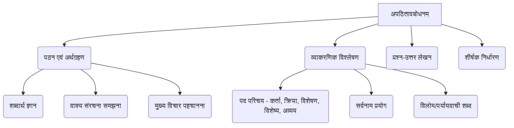
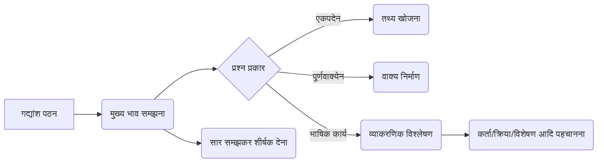

# Class 9 Sanskrit - Abhyasvan Chapter 101
**Language:** हिंदी

```markdown
# [कक्षा 9] अभ्यासवान् - पाठ 101: अपठितावबोधनम्

## 🌟 मुख्य अवधारणाएँ (Core Concepts)
यह पाठ छात्रों में संस्कृत के **अपठित गद्यांशों** को पढ़कर समझने और उस पर आधारित प्रश्नों के उत्तर देने की योग्यता विकसित करने पर केंद्रित है। इसमें निम्नलिखित मुख्य कौशल शामिल हैं:

*   **पठन कौशल (Reading Skill):** अपरिचित संस्कृत गद्यांश को ध्यानपूर्वक पढ़ना और समझना।
*   **अर्थग्रहण कौशल (Comprehension Skill):** गद्यांश के मुख्य भाव, तथ्यों और निहित संदेशों को ग्रहण करना।
*   **विश्लेषण कौशल (Analytical Skill):** गद्यांश में प्रयुक्त व्याकरणिक तत्वों (जैसे - विशेषण, विशेष्य, कर्ता, क्रिया, अव्यय, विलोम, पर्याय) को पहचानना और समझना।
*   **उत्तर लेखन कौशल (Answer Writing Skill):** पूछे गए प्रश्नों (एक शब्द में, पूर्ण वाक्य में, निर्देशानुसार) के सटीक उत्तर संस्कृत में लिखना।
*   **शीर्षक चयन (Title Selection):** गद्यांश के केंद्रीय भाव के आधार पर उपयुक्त शीर्षक देना।

**अवधारणा पदानुक्रम 📊:**



## 📘 प्रमुख शिक्षण बिंदु (Key Learnings)
इस पाठ के अभ्यास से छात्र सीखते हैं:

1.  **गद्यांश कैसे समझें:** अपरिचित शब्दों का अनुमान लगाना, वाक्य संरचना को समझना और पूरे गद्यांश का सार निकालना।
2.  **विभिन्न प्रश्न प्रकार:**
    *   **एकपदेन उत्तरत:** गद्यांश से विशिष्ट तथ्य या जानकारी निकालकर एक शब्द में उत्तर देना।
    *   **पूर्णवाक्येन उत्तरत:** प्रश्न को समझकर गद्यांश की सहायता से पूर्ण संस्कृत वाक्य में उत्तर देना।
    *   **भाषिककार्यम्/यथानिर्देशम् उत्तरत:** व्याकरण पर आधारित प्रश्नों का उत्तर देना, जैसे:
        *   वाक्य में कर्ता (Subject) या क्रिया (Verb) पद पहचानना।
        *   विशेषण (Adjective) और विशेष्य (Noun qualified) पद छाँटना।
        *   सर्वनाम (Pronoun) किसके लिए प्रयुक्त हुआ है, यह बताना।
        *   गद्यांश से किसी शब्द का विलोम (Antonym) या पर्यायवाची (Synonym) शब्द चुनना।
        *   अव्यय (Indeclinable) पद पहचानना।
3.  **शीर्षक देना:** गद्यांश के मूल संदेश या विषय वस्तु को समझकर एक संक्षिप्त और सार्थक शीर्षक प्रस्तावित करना।
4.  **समय प्रबंधन:** परीक्षा में निर्धारित समय के भीतर गद्यांश पढ़कर प्रश्नों को हल करने का अभ्यास।

**समझने की प्रक्रिया 📈:**



## 🧩 सक्रिय अधिगम (Active Learning)

*   **गतिविधि: गद्यांश विश्लेषण 🔍**
    *   पाठ में दिए गए सभी 10 गद्यांशों को ध्यानपूर्वक पढ़ें।
    *   प्रत्येक गद्यांश के लिए दिए गए अभ्यास प्रश्नों को स्वयं हल करने का प्रयास करें।
    *   **विश्लेषण करें:**
        *   आपने उत्तर कैसे खोजा?
        *   किन शब्दों या व्याकरणिक बिंदुओं में कठिनाई हुई?
        *   प्रत्येक गद्यांश का मुख्य संदेश क्या है?
    *   अपने उत्तरों का मिलान करें और त्रुटियों से सीखें।
    *   **अतिरिक्त अभ्यास:** पुस्तकालय या इंटरनेट से अन्य संस्कृत अपठित गद्यांश खोजें और उनका अभ्यास करें।

*   **चर्चा: वास्तविक दुनिया से जुड़ाव 🌍**
    *   कक्षा में गद्यांशों के विषयों पर चर्चा करें:
        *   **गद्यांश I:** लोभ और बड़ों की सलाह का महत्व (हितोपदेश)।
        *   **गद्यांश II:** समय का सदुपयोग क्यों आवश्यक है?
        *   **गद्यांश VII:** रमा की कुंठा - क्या आज भी लड़कियों को समान अवसर मिलते हैं? इस पर अपने विचार व्यक्त करें।
        *   **गद्यांश IX:** पेड़ों का महत्व और वनों की कटाई के दुष्प्रभाव। हम पर्यावरण संरक्षण में कैसे योगदान दे सकते हैं?
        *   **गद्यांश X:** मोबाइल फोन के लाभ और हानियाँ। इसका संतुलित उपयोग कैसे करें?

## 📝 मूल्यांकन तैयारी (Assessment Prep)
यह पाठ परीक्षा के लिए अत्यंत महत्वपूर्ण है। तैयारी के लिए निम्नलिखित पर ध्यान दें:

*   **प्रश्न प्रारूप:** परीक्षा में अपठित गद्यांश पर आधारित प्रश्न इसी प्रारूप (एकपद, पूर्णवाक्य, भाषिक कार्य, शीर्षक) में पूछे जाते हैं।
*   **भाषिक कार्य:** व्याकरणिक पदों (कर्तृपद, क्रियापद, विशेषण, विशेष्य, अव्यय, विलोम, पर्याय, सर्वनाम स्थान) की पहचान का खूब अभ्यास करें।
*   **अभ्यास:** पाठ में दिए गए सभी गद्यांशों (Case studies 📝) और उनके प्रश्नों को हल करना परीक्षा की तैयारी का सबसे अच्छा तरीका है।
*   **समय सीमा:** घर पर अभ्यास करते समय समय सीमा का ध्यान रखें।

**मूल्यांकन संरचना (उदाहरण) 📊:**

*   एकपदेन उत्तरत: (1-2 अंक)
*   पूर्णवाक्येन उत्तरत: (2-4 अंक)
*   भाषिक कार्य/यथानिर्देशम्: (3-4 अंक)
*   शीर्षक लेखन: (1 अंक)

## 🌏 भारतीय संदर्भ (Bharatiya Context)
इन गद्यांशों में कई भारतीय संदर्भ निहित हैं:

1.  **नैतिक मूल्य (Moral Values):** गद्यांश I (हितोपदेश की कहानी), II (समय का महत्व), III (पितृभक्ति), VIII (कुसंगति से बचाव), IX (प्रकृति प्रेम) भारतीय संस्कृति के नैतिक मूल्यों को दर्शाते हैं।
2.  **ऐतिहासिक एवं भौगोलिक स्थल 📊:**
    *   **गद्यांश V:** उज्जैन का वर्णन (महाकालेश्वर, वेधशाला, क्षिप्रा नदी, कर्क रेखा) भारत के प्राचीन गौरवशाली इतिहास, धर्म और विज्ञान की झलक देता है। राजा जयसिंह द्वारा निर्मित वेधशालाएँ भारतीय खगोल विज्ञान की उन्नति का प्रतीक हैं।
    *   **गद्यांश VI:** दिल्ली स्थित लोधी गार्डन का वर्णन भारत की राजधानी के एक प्रमुख हरित क्षेत्र और वहां पाए जाने वाले भारतीय वृक्षों (वट, अश्वत्थ, निम्ब, अशोक, आम, बिल्व आदि) का परिचय देता है।
3.  **प्रेरक व्यक्तित्व एवं संस्थाएं 📊:**
    *   **गद्यांश IV:** नोबेल पुरस्कार विजेता भारतीय अर्थशास्त्री अमर्त्य सेन का परिचय, उनका संस्कृत से जुड़ाव और शांतिनिकेतन (रवीन्द्रनाथ टैगोर द्वारा स्थापित) का संदर्भ भारतीय शिक्षा और बौद्धिक परंपरा को उजागर करता है।
4.  **सामाजिक मुद्दे:**
    *   **गद्यांश VII:** रमा के माध्यम से भारतीय समाज में लैंगिक समानता और महिलाओं के लिए अवसरों पर चिंतन प्रस्तुत किया गया है।
    *   **गद्यांश IX:** वृक्षों का महत्व और पर्यावरण संरक्षण भारत के लिए एक ज्वलंत विषय है।

यह पाठ न केवल संस्कृत भाषा कौशल विकसित करता है, बल्कि भारतीय संस्कृति, इतिहास, विज्ञान और सामाजिक सरोकारों से भी छात्रों का परिचय कराता है।
```