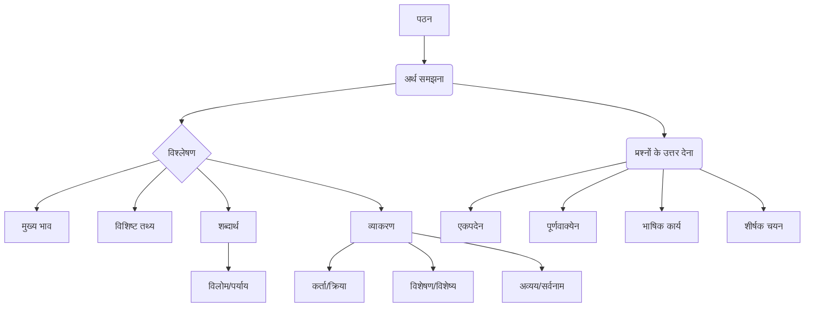

# Class 9 Sanskrit - Abhyasvan Chapter 101
**Language:** हिंदी

```markdown
# [कक्षा 9] अभ्यासवान् भव - पाठ 101: अपठित-अवबोधनम्

## 🌟 मूल अवधारणाएँ (Core Concepts)
अपठित-अवबोधनम् का अर्थ है ऐसे गद्यांश को पढ़कर समझना जो पहले पढ़ा न गया हो। इसमें निम्नलिखित मुख्य अवधारणाएँ शामिल हैं:

1.  **पठन कौशल (Reading Skill):** संस्कृत गद्यांश को शुद्धता और प्रवाह के साथ पढ़ने की क्षमता।
2.  **अर्थग्रहण (Comprehension):**
    *   **मुख्य विचार:** गद्यांश के केंद्रीय भाव या संदेश को समझना।
    *   **विशिष्ट जानकारी:** गद्यांश में दिए गए तथ्यों, घटनाओं, या विवरणों को खोजना।
    *   **निहित अर्थ:** पंक्तियों के बीच के अर्थ या लेखक के उद्देश्य का अनुमान लगाना।
3.  **शब्द-ज्ञान (Vocabulary):**
    *   **संदर्भ में अर्थ:** अपरिचित शब्दों का अर्थ वाक्य के संदर्भ में समझना।
    *   **विलोम/पर्यायवाची:** गद्यांश में प्रयुक्त शब्दों के विलोम (विपरीतार्थक) या समानार्थक (पर्यायवाची) शब्द पहचानना।
4.  **व्याकरणिक विश्लेषण (Grammatical Analysis):** 📊
    *   **पद परिचय:** वाक्य में कर्ता, क्रिया, कर्म, विशेषण, विशेष्य, सर्वनाम और अव्यय पदों को पहचानना।
    *   **कारक और विभक्ति:** शब्दों में प्रयुक्त विभक्तियों और उनके कारकों को समझना।
    *   **क्रिया रूप:** क्रिया के काल (लकार), पुरुष और वचन को पहचानना।

**अवधारणा पदानुक्रम:**


## 📘 मुख्य शिक्षाएँ (Key Learnings)
इस पाठ से विद्यार्थी निम्नलिखित बातें सीखते हैं:

1.  **समझने की रणनीतियाँ (Comprehension Strategies):** 📈
    *   **ध्यानपूर्वक पठन:** गद्यांश को कम से कम दो बार ध्यान से पढ़ना – पहली बार सामान्य समझ के लिए, दूसरी बार विशिष्ट विवरणों के लिए।
    *   **प्रश्नों को समझना:** प्रश्नों को अच्छी तरह समझकर यह जानना कि क्या पूछा गया है (एक शब्द में उत्तर, पूर्ण वाक्य में, या व्याकरण संबंधी)।
    *   **उत्तर खोजना:** प्रश्नों के उत्तर गद्यांश में ही खोजना और रेखांकित करना।
    *   **शब्दार्थ अनुमान:** अपरिचित शब्दों का अर्थ आसपास के शब्दों और वाक्य के भाव से अनुमान लगाना।
2.  **उत्तर लिखने का तरीका:**
    *   **एकपदेन उत्तर:** केवल एक पद (शब्द) में उत्तर देना, जैसा प्रश्न में पूछा गया हो।
    *   **पूर्णवाक्येन उत्तर:** प्रश्न के अनुसार गद्यांश से वाक्य लेकर या अपने शब्दों में पूर्ण वाक्य में उत्तर देना।
    *   **भाषिक कार्य:**
        *   **कर्तृ/क्रिया पद:** वाक्य में काम करने वाले (कर्ता) और क्रिया को पहचानना।
        *   **विशेषण/विशेष्य:** संज्ञा या सर्वनाम की विशेषता बताने वाले शब्द (विशेषण) और जिसकी विशेषता बताई जाए (विशेष्य) को पहचानना।
        *   **सर्वनाम प्रयोग:** 'तत्', 'एतत्', 'यत्', 'किम्' आदि सर्वनाम शब्द किसके लिए प्रयुक्त हुए हैं, यह बताना।
        *   **अव्यय पद:** जिन शब्दों का रूप कभी नहीं बदलता (जैसे - अत्र, तत्र, सदा, च, अपि, एव), उन्हें पहचानना।
        *   **विलोम/पर्याय:** गद्यांश में दिए गए शब्द का विलोम या पर्याय खोजना।
    *   **शीर्षक चयन:** गद्यांश के मुख्य भाव को दर्शाने वाला संक्षिप्त और उपयुक्त शीर्षक देना।
3.  **समय प्रबंधन:** परीक्षा में निर्धारित समय के भीतर गद्यांश पढ़कर प्रश्नों के उत्तर देने का अभ्यास करना।

**उदाहरण:** गद्यांश I में, कपोतराज चित्रग्रीव की सलाह (वृद्धों का वचन मानना) मुख्य शिक्षा है। व्याकरणिक प्रश्न जैसे 'विशालः शाल्मलीतरुः' में विशेषण 'विशालः' है।

## 🧩 सक्रिय शिक्षण (Active Learning)

*   **गतिविधि: शोध-आधारित केस स्टडी विश्लेषण 🔍**
    *   दिए गए गद्यांशों (जैसे IV - अमर्त्य सेन, V - उज्जैन वेधशाला, VI - लोधी गार्डन) में वर्णित व्यक्तियों, स्थानों या विषयों पर लघु शोध करें।
    *   इंटरनेट या पुस्तकालय से जानकारी एकत्र करें और कक्षा में प्रस्तुत करें। इससे गद्यांश की पृष्ठभूमि और संदर्भ समझने में मदद मिलेगी।
    *   **उदाहरण:** अमर्त्य सेन को अर्थशास्त्र में नोबेल पुरस्कार क्यों मिला? उज्जैन की वेधशाला का निर्माण किसने और क्यों करवाया?
*   **चर्चा: वास्तविक दुनिया के प्रभावों का आलोचनात्मक विश्लेषण 🌍**
    *   गद्यांशों में उठाए गए मुद्दों पर कक्षा में चर्चा करें।
    *   **उदाहरण विषय:**
        *   समय का सदुपयोग क्यों महत्वपूर्ण है? (गद्यांश II)
        *   बुरी संगति (कुसंग) के क्या दुष्परिणाम हो सकते हैं? (गद्यांश VIII)
        *   पेड़ों का हमारे जीवन में क्या महत्व है? वनों की कटाई के प्रभाव क्या हैं? (गद्यांश IX)
        *   मोबाइल फोन के लाभ और हानियाँ क्या हैं? (गद्यांश X)
        *   समाज में स्त्री-पुरुष समानता का क्या अर्थ है? (गद्यांश VII)
    *   इन चर्चाओं से छात्रों में मूल्यांकन (Evaluating) और सृजन (Creating - अपने विचार व्यक्त करना) क्षमता का विकास होगा।

## 📝 परीक्षा तैयारी (Assessment Prep)
अपठित-अवबोधनम् परीक्षा का एक महत्वपूर्ण हिस्सा है। इसकी तैयारी के लिए:

1.  **अभ्यास, अभ्यास, अभ्यास:** विभिन्न विषयों पर आधारित अधिक से अधिक अपठित गद्यांशों को हल करने का अभ्यास करें। कार्यपुस्तिका (Workbook) में दिए गए सभी गद्यांशों को स्वयं हल करें।
2.  **प्रश्न प्रकारों पर ध्यान दें:** एकपदेन, पूर्णवाक्येन, और विशेष रूप से भाषिक कार्य के प्रश्नों का अभ्यास करें।
3.  **व्याकरणिक अवधारणाओं को स्पष्ट करें:** कर्ता, क्रिया, विशेषण, विशेष्य, अव्यय, सर्वनाम, विलोम, पर्याय आदि की पहचान का नियमित अभ्यास करें। 📝
    *   **तालिका बनाकर अभ्यास करें:** गद्यांश पढ़ते समय महत्वपूर्ण व्याकरणिक पदों को तालिका में लिखें।
      | वाक्य                 | कर्ता     | क्रिया    | विशेषण   | विशेष्य   | अव्यय   |
      | -------------------- | -------- | -------- | -------- | -------- | ------ |
      | विशालः शाल्मलीतरुः आसीत्। | शाल्मलीतरुः | आसीत्   | विशालः   | शाल्मलीतरुः |        |
      | जनाः समयस्य दुरुपयोगं कुर्वन्ति। | जनाः     | कुर्वन्ति |          |          |        |
4.  **समय सीमा में हल करें:** परीक्षा की तरह समय सीमा निर्धारित करके गद्यांश हल करने का अभ्यास करें।
5.  **शीर्षक लेखन:** गद्यांश के सार को समझने और संक्षिप्त शीर्षक देने का अभ्यास करें।

## 🌏 भारतीय संदर्भ (Bharatiya Context)
अपठित गद्यांश प्रायः भारतीय संस्कृति, इतिहास, साहित्य, नैतिक मूल्यों और समकालीन मुद्दों से संबंधित होते हैं। 📊

1.  **सांस्कृतिक और ऐतिहासिक स्थल:** गद्यांश V (उज्जैन, महाकालेश्वर, वेधशाला) और गद्यांश VI (लोधी गार्डन, दिल्ली) भारत के महत्वपूर्ण ऐतिहासिक और सांस्कृतिक स्थलों का परिचय कराते हैं।
2.  **प्रेरक व्यक्तित्व:** गद्यांश IV (अमर्त्य सेन) एक प्रसिद्ध भारतीय अर्थशास्त्री और नोबेल पुरस्कार विजेता का परिचय देता है, जिनका संस्कृत से भी जुड़ाव रहा। गद्यांश III (जयदेव और धनेश) पितृभक्ति जैसे भारतीय मूल्यों को दर्शाता है।
3.  **नैतिक शिक्षा:** गद्यांश I (हितोपदेश की कहानी - लालच और बड़ों की सलाह), गद्यांश II (समय का महत्व), गद्यांश VIII (कुसंगति से बचाव), गद्यांश IX (पर्यावरण संरक्षण - वृक्षों का महत्व) भारतीय परंपरा में निहित नैतिक शिक्षाओं को उजागर करते हैं।
4.  **सामाजिक मुद्दे:** गद्यांश VII (स्त्री शिक्षा और अवसर) भारतीय समाज में लैंगिक समानता से संबंधित चिंतन को दर्शाता है।
5.  **भाषा:** संस्कृत भाषा स्वयं भारतीय संस्कृति और ज्ञान परंपरा का अभिन्न अंग है। इन गद्यांशों के माध्यम से छात्र संस्कृत भाषा सीखते हुए भारतीय संदर्भों से भी परिचित होते हैं।

यह अभ्यास छात्रों को न केवल संस्कृत भाषा में प्रवीणता हासिल करने में मदद करता है, बल्कि उन्हें अपने देश की संस्कृति, इतिहास और मूल्यों को बेहतर ढंग से समझने में भी सहायक होता है।
```