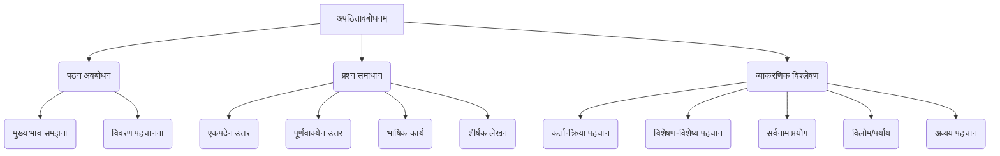

# Class 9 Sanskrit - Abhyasvan Chapter 101
**Language:** हिंदी

```markdown
# [कक्षा 9] अभ्यासवान् - अध्याय 101: अपठितावबोधनम्

**(अपठित गद्यांश - Unseen Passages)**

इस अध्याय का मुख्य उद्देश्य छात्रों में अपठित संस्कृत गद्यांशों को पढ़कर समझने, उनका विश्लेषण करने और उन पर आधारित प्रश्नों के उत्तर देने की क्षमता विकसित करना है।

## 🌟 मुख्य अवधारणाएँ (Core Concepts)

अपठितावबोधनम् के अंतर्गत निम्नलिखित मुख्य कौशल और ज्ञान क्षेत्र शामिल हैं:

1.  **पठन अवबोधन (Reading Comprehension):**
    *   अपठित गद्यांश के मुख्य भाव को समझना।
    *   गद्यांश में दिए गए तथ्यों, विचारों और घटनाओं को पहचानना।
    *   पात्रों, स्थानों और संदर्भों को समझना।

2.  **प्रश्न प्रकार (Types of Questions):**
    *   **एकपदेन उत्तरत:** प्रश्न का उत्तर केवल एक शब्द में देना।
    *   **पूर्णवाक्येन उत्तरत:** प्रश्न का उत्तर पूरे वाक्य में देना, जो प्रायः गद्यांश पर आधारित होता है।
    *   **भाषिककार्यम् / यथानिर्देशम् उत्तरत (Linguistic Tasks):** व्याकरण आधारित प्रश्न:
        *   **कर्तृपद/क्रियापद चयनम्:** वाक्य में कर्ता (करने वाला) या क्रिया (कार्य) पद को पहचानना।
        *   **विशेषण/विशेष्य चयनम्:** संज्ञा या सर्वनाम की विशेषता बताने वाले शब्द (विशेषण) और जिसकी विशेषता बताई जाए (विशेष्य) को पहचानना।
        *   **सर्वनामपद प्रयोग:** गद्यांश में प्रयुक्त सर्वनाम (जैसे - सः, तत्, तस्य, कस्यै) किसके लिए आया है, यह बताना।
        *   **विलोमपद/पर्यायवाचीपद चयनम्:** गद्यांश में किसी दिए गए शब्द का विलोम (उल्टा अर्थ) या पर्यायवाची (समान अर्थ) शब्द ढूँढना।
        *   **अव्ययपद चयनम्:** गद्यांश से अव्यय शब्दों (जिनका रूप नहीं बदलता) को पहचानना।
    *   **शीर्षक-लेखनम्:** गद्यांश के केंद्रीय भाव के आधार पर उपयुक्त शीर्षक देना।

3.  **विश्लेषणात्मक कौशल (Analytical Skills):**
    *   वाक्यों की संरचना और शब्दों के अर्थ को समझना।
    *   गद्यांश के निहित संदेश या शिक्षा का मूल्यांकन करना।

📊 **अवधारणा पदानुक्रम (Concept Hierarchy):**



## 📘 प्रमुख शिक्षण बिंदु (Key Learnings)

अपठित गद्यांशों को सफलतापूर्वक हल करने के लिए निम्नलिखित रणनीतियाँ और ज्ञान आवश्यक हैं:

1.  **गद्यांश पढ़ने की रणनीति:**
    *   **ध्यानपूर्वक पठन:** गद्यांश को कम से कम दो बार ध्यान से पढ़ें। पहली बार सामान्य समझ के लिए, दूसरी बार बारीकियों और विवरणों पर ध्यान केंद्रित करने के लिए।
    *   **मुख्य शब्द रेखांकन:** पढ़ते समय महत्वपूर्ण शब्दों, नामों, स्थानों, और क्रियाओं को रेखांकित करें।
    *   **संदर्भ समझना:** वाक्यों का अर्थ उनके संदर्भ में समझने का प्रयास करें।

2.  **उत्तर देने की तकनीक:**
    *   **एकपदेन:** प्रश्न को समझें और गद्यांश में सटीक एक शब्द वाला उत्तर खोजें।
        *   *उदाहरण (गद्यांश I):* `(क) आपत्काले केषां वचनं ग्राह्यम्?` उत्तर: `वृद्धानाम्`
    *   **पूर्णवाक्येन:** प्रश्न में पूछे गए विषय से संबंधित वाक्य गद्यांश में खोजें और उसे प्रश्न के अनुसार थोड़ा बदलकर या सीधे लिखें।
        *   *उदाहरण (गद्यांश II):* `(क) केषां जन्म निरर्थकं भवति?` उत्तर: `ये जनाः न तु स्वार्थाय न च परार्थाय किञ्चित् कार्यं कुर्वन्ति, न धर्मम् आचरन्ति, न धनम् उपार्जयन्ति, तेषां जन्म निरर्थकं भवति।`
    *   **भाषिक कार्य:** व्याकरण के नियमों का सटीक अनुप्रयोग करें।
        *   **विशेषण/विशेष्य:** विशेषण अक्सर विशेष्य से पहले आता है और उसमें समान लिंग, विभक्ति और वचन होता है। (जैसे गद्यांश I में `विशालः शाल्मलीतरुः` - यहाँ `विशालः` विशेषण है)।
        *   **कर्ता/क्रिया:** वाक्य में 'कौन' प्रश्न का उत्तर कर्ता होता है और 'क्या कर रहा है' का उत्तर क्रिया होती है। (जैसे गद्यांश III में `धनेशः... अध्‍ययनं करोति स्म` - यहाँ `धनेशः` कर्ता और `करोति स्म` क्रिया है)।
        *   **सर्वनाम:** सर्वनाम जिस संज्ञा के स्थान पर आया है, उसे पहचानें। (जैसे गद्यांश IV में `अस्य जन्म... अभवत्` - यहाँ `अस्य` अमर्त्यसेन के लिए प्रयुक्त हुआ है)।
        *   **विलोम/पर्याय:** शब्द के अर्थ को समझकर गद्यांश में उसका विपरीतार्थक या समानार्थक शब्द खोजें। (जैसे गद्यांश II में `सदुप्रयोगः` का विलोम `दुरुपयोगः` है)।
    *   **शीर्षक:** गद्यांश के सार को व्यक्त करने वाला छोटा और सटीक शीर्षक चुनें। (जैसे गद्यांश II का शीर्षक `समयस्य महत्त्वम्` या `समयस्य सदुपयोगः` हो सकता है)।

📈 **अपठित गद्यांश हल करने का प्रवाह चार्ट (Flowchart):**

```mermaid
graph LR
    A[गद्यांश प्राप्त करें] --> B{ध्यानपूर्वक पढ़ें (2 बार)};
    B --> C[मुख्य शब्द/वाक्य रेखांकित करें];
    C --> D{प्रश्न पढ़ें और समझें};
    D -- एकपदेन --> E[गद्यांश में सटीक शब्द खोजें];
    D -- पूर्णवाक्येन --> F[गद्यांश में संबंधित वाक्य खोजें और लिखें];
    D -- भाषिक कार्य --> G[व्याकरण नियम लागू कर पद पहचानें/चुनें];
    D -- शीर्षक --> H[गद्यांश का केंद्रीय भाव समझें];
    E --> I[उत्तर लिखें];
    F --> I;
    G --> I;
    H --> J[संक्षिप्त और उपयुक्त शीर्षक लिखें];
```

## 🧩 सक्रिय अधिगम (Active Learning)

1.  **गतिविधि: शोध-आधारित विश्लेषण 🔍**
    *   दिए गए गद्यांशों (जैसे I, III, IX) में वर्णित कहानियों या नैतिक शिक्षाओं के समान कथाएँ पंचतंत्र, हितोपदेश या अन्य भारतीय कथा संग्रहों में खोजें।
    *   दोनों संस्करणों की तुलना करें - समानताएं, अंतर और संदेशों का विश्लेषण करें।
    *   **मूल्यांकन/रचना:** अपनी खोजों पर एक संक्षिप्त रिपोर्ट लिखें या कक्षा में प्रस्तुत करें।

2.  **चर्चा: वास्तविक दुनिया के प्रभावों का आलोचनात्मक विश्लेषण 🌍**
    *   **समूह चर्चा:** कक्षा को छोटे समूहों में विभाजित करें। प्रत्येक समूह दिए गए गद्यांशों में से एक या दो के विषय पर चर्चा करे और वर्तमान भारतीय समाज में उसकी प्रासंगिकता का विश्लेषण करे।
        *   **गद्यांश II (समय का मूल्य):** आज के डिजिटल युग में समय प्रबंधन की चुनौतियाँ और समाधान।
        *   **गद्यांश V (उज्जैन/वेधशाला):** भारत की वैज्ञानिक और ऐतिहासिक धरोहरों के संरक्षण का महत्व।
        *   **गद्यांश VII (लिंग समानता):** रमा की दुविधा आज कितनी प्रासंगिक है? भारत में लड़कियों की शिक्षा और अवसरों में क्या बदलाव आए हैं?
        *   **गद्यांश VIII (कुसंगति):** युवा पीढ़ी पर साथियों के दबाव (Peer Pressure) के प्रभाव और उससे बचने के उपाय।
        *   **गद्यांश IX (पर्यावरण):** वनों की कटाई के परिणाम और भारत में वृक्षारोपण/चिपको जैसे आंदोलनों का महत्व।
        *   **गद्यांश X (मोबाइल फोन):** प्रौद्योगिकी के लाभ और हानियों का मूल्यांकन, विशेषकर छात्रों के जीवन में।
    *   **मूल्यांकन:** चर्चा के मुख्य बिंदुओं को संक्षेप में प्रस्तुत करें और अपने विचार व्यक्त करें।

## 📝 मूल्यांकन तैयारी (Assessment Prep)

परीक्षा में अपठितावबोधनम् खंड में अच्छा प्रदर्शन करने के लिए:

1.  **निरंतर अभ्यास:** विभिन्न विषयों (कथा, जीवनी, वर्णन, समसामयिक मुद्दे) पर आधारित अधिक से अधिक अपठित गद्यांशों को हल करने का अभ्यास करें। NCERT अभ्यास पुस्तिका और पिछले वर्षों के प्रश्न पत्र सहायक हो सकते हैं।
2.  **व्याकरणिक स्पष्टता:** संस्कृत व्याकरण के नियमों, विशेष रूप से शब्द रूप, धातु रूप, कारक, विभक्ति, संधि, प्रत्यय, विशेषण-विशेष्य, कर्ता-क्रिया संबंध, अव्यय आदि को अच्छी तरह समझें और उनका अभ्यास करें। भाषिक कार्य के प्रश्न इसी ज्ञान पर आधारित होते हैं।
3.  **शब्द भंडार वृद्धि:** नए संस्कृत शब्दों और उनके अर्थों को नियमित रूप से सीखें। गद्यांश को समझने के लिए अच्छा शब्द भंडार आवश्यक है।
4.  **समय प्रबंधन:** परीक्षा के दौरान समय सीमा के भीतर गद्यांश पढ़ने और सभी प्रश्नों के उत्तर देने का अभ्यास करें।
5.  **विश्लेषण का अभ्यास:** गद्यांशों को केवल पढ़ने के बजाय उनका विश्लेषण करने का अभ्यास करें - मुख्य विचार क्या है? लेखक का उद्देश्य क्या हो सकता है? क्या शिक्षा मिलती है?
6.  **उदाहरणों का उपयोग:** ऊपर 'Key Learnings' में दिए गए उदाहरणों और प्रवाह चार्ट (Flowchart) को समझें और अभ्यास में उपयोग करें।

## 🌏 भारतीय संदर्भ (Bharatiya Context)

ये अपठित गद्यांश भारतीय संस्कृति, इतिहास, मूल्यों और समकालीन समाज के विभिन्न पहलुओं को दर्शाते हैं:

1.  **नैतिक और सांस्कृतिक मूल्य:**
    *   **हितोपदेश शैली:** गद्यांश I (कबूतरों की कहानी) जैसे अंश भारतीय कथा परंपरा को दर्शाते हैं, जो लोभ और विवेक के परिणामों पर नैतिक शिक्षा देते हैं।
    *   **पारिवारिक मूल्य:** गद्यांश III (धनेश की पितृभक्ति) और गद्यांश VIII (माँ की चिंता और सलाह) माता-पिता की सेवा और सत्संगति जैसे भारतीय मूल्यों को उजागर करते हैं।
    *   **समय का महत्व:** गद्यांश II समय के सदुपयोग पर जोर देता है, जो भारतीय दर्शन में भी एक महत्वपूर्ण अवधारणा है।
    *   **पर्यावरण चेतना:** गद्यांश IX पेड़ों के महत्व और उनके संरक्षण की आवश्यकता पर प्रकाश डालता है, जो भारतीय संस्कृति में प्रकृति के प्रति सम्मान को दर्शाता है (जैसे - चिपको आंदोलन)।

2.  **ऐतिहासिक और भौगोलिक संदर्भ:**
    *   **महत्वपूर्ण स्थल:** गद्यांश V में **उज्जैन**, महाकालेश्वर मंदिर और **राजा जयसिंह द्वारा निर्मित वेधशाला** का वर्णन भारत के समृद्ध इतिहास और वैज्ञानिक विरासत का परिचय देता है। गद्यांश VI में दिल्ली स्थित **लोधी गार्डन** का वर्णन है।
    *   **शैक्षणिक संस्थान:** गद्यांश IV में **शांतिनिकेतन** का उल्लेख है, जो भारतीय शिक्षा और संस्कृति का एक महत्वपूर्ण केंद्र रहा है।

3.  **प्रेरक व्यक्तित्व:**
    *   **अमर्त्य सेन:** गद्यांश IV नोबेल पुरस्कार विजेता अर्थशास्त्री **अमर्त्य सेन** का परिचय देता है, जिनका नामकरण गुरुदेव रवींद्रनाथ टैगोर ने किया और जिनका संस्कृत से भी जुड़ाव था। यह ज्ञान-विज्ञान के क्षेत्र में भारतीयों के योगदान को रेखांकित करता है।

4.  **सामाजिक विमर्श:**
    *   **लिंग समानता:** गद्यांश VII एक माँ (रमा) के माध्यम से पिछली और वर्तमान पीढ़ी की लड़कियों के लिए अवसरों में अंतर और **लिंग समानता** पर एक संवेदनशील सामाजिक विमर्श प्रस्तुत करता है।

(नोट: विनिर्देश में उल्लिखित "आर्थिक डेटा" सीधे तौर पर इन गद्यांशों में मौजूद नहीं है, लेकिन समय का मूल्य (गद्यांश II), अमर्त्य सेन का उल्लेख (गद्यांश IV) और पेड़ों के लाभ (गद्यांश IX) जैसे विषय अप्रत्यक्ष रूप से आर्थिक विचारों से जुड़े हो सकते हैं। हालांकि, मुख्य ध्यान सांस्कृतिक, नैतिक, ऐतिहासिक और सामाजिक संदर्भों पर है।)
```