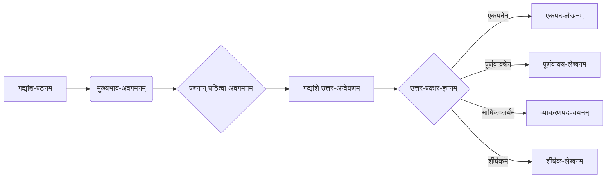

# Class 9 Sanskrit - Abhyasvan Chapter 101
**Language:** संस्कृतम्

```markdown
# [कक्षा ९] अभ्यासवान् - अध्यायः १०१ (अपठितावबोधनम् - अभ्यासः)

## 🌟 कोर-अवधारणाः (Core Concepts)
अस्मिन् अध्याये अपठित-गद्यांशान् पठित्वा तेषाम् अवबोधनस्य अभ्यासः क्रियते। मुख्य-अवधारणाः अधः लिखिताः सन्ति: 📊

1.  **अपठित-अवबोधन-कौशलम् (Unseen Passage Comprehension Skill):**
    *   पाठ्यवस्तुनः अवगमनम् (Understanding the text content)
    *   मुख्यविचारस्य ज्ञानम् (Identifying the main idea)
    *   प्रश्न-उत्तर-लेखनम् (Answering questions based on the passage)
        *   एकपदेन उत्तरम् (One-word answer)
        *   पूर्णवाक्येन उत्तरम् (Full sentence answer)
    *   भाषिककार्यम् (Language/Grammar Work):
        *   विशेषण-विशेष्य-चयनम् (Identifying Adjective-Noun)
        *   कर्तृपद-क्रियापद-चयनम् (Identifying Subject-Verb)
        *   अव्ययपद-चयनम् (Identifying Indeclinables/Adverbs)
        *   विलोमपद-पर्यायपद-चयनम् (Identifying Antonyms-Synonyms)
    *   शीर्षक-लेखनम् (Writing a suitable title)

2.  **विविध-विषयाः (Diverse Themes covered in passages):**
    *   **नीतिः सदाचारश्च (Ethics & Good Conduct):**
        *   लोभस्य दुष्परिणामः (Consequences of Greed - गद्यांशः I)
        *   वृद्धानां वचनस्य महत्त्वम् (Importance of Elders' Advice - गद्यांशः I)
        *   समयस्य सदुपयोगः (Proper Use of Time - गद्यांशः II)
        *   पितृसेवा (Service to Parents - गद्यांशः III)
        *   सङ्गत्याः प्रभावः (Influence of Company - गद्यांशः VIII)
    *   **पर्यावरणम् (Environment):**
        *   वृक्षाणां महत्त्वम् (Importance of Trees - गद्यांशः IX)
        *   प्रकृतेः वर्णनम् (Description of Nature - गद्यांशः I, VI, IX)
    *   **भारतीय-संस्कृतिः इतिहासश्च (Indian Culture & History):**
        *   प्रसिद्ध-व्यक्तिपरिचयः (Introduction to Famous Personalities - अमर्त्यसेनः - गद्यांशः IV)
        *   ऐतिहासिक-स्थलवर्णनम् (Description of Historical Places - उज्जयिनी, वेधशाला - गद्यांशः V; लोधी-उद्यानम् - गद्यांशः VI)
        *   प्राचीन-भारतीय-ज्ञानम् (Ancient Indian Knowledge - ज्योतिषम्, गणितम् - गद्यांशः V)
    *   **सामाजिक-चिन्तनम् (Social Reflection):**
        *   स्त्रीशिक्षायाः अवसरस्य च महत्त्वम् (Importance of Women's Education & Opportunity - गद्यांशः VII)
    *   **विज्ञानं तन्त्रज्ञानञ्च (Science & Technology):**
        *   चलभाषयन्त्रस्य (मोबाइल) उपयोगिता दुष्प्रयोगाश्च (Utility and Misuse of Mobile Phone - गद्यांशः X)

## 📘 मुख्य-शिक्षणीय-बिन्दवः (Key Learnings)
अपठित-गद्यांशान् अवगन्तुं निम्नलिखित-सोपानानि अनुसरणीयानि: 📈

1.  **ध्यानपूर्वकं पठनम्:** प्रथमं गद्यांशं शान्तचित्तेन पठन्तु। मुख्यभावं ज्ञातुं प्रयतध्वम्।
2.  **प्रश्न-अवगमनम्:** प्रश्नान् सम्यक् पठित्वा ते किं पृच्छन्ति इति अवगच्छन्तु।
3.  **उत्तर-अन्वेषणम्:** प्रश्नानाम् उत्तराणि गद्यांशे एव अन्विष्यन्तु। रेखाङ्कनं कर्तुं शक्नुवन्ति।
4.  **यथानिर्देशम् उत्तर-लेखनम्:**
    *   `एकपदेन उत्तरत`: केवलं प्रश्नस्य अपेक्षितम् एकम् एव पदं गद्यांशात् चित्वा लिखन्तु।
    *   `पूर्णवाक्येन उत्तरत`: प्रश्नस्य उत्तरं गद्यांशस्य आधारेण सम्पूर्णे वाक्ये लिखन्तु।
    *   `भाषिककार्यम्/यथानिर्देशम् उत्तरत`: व्याकरणसम्बद्धान् प्रश्नान् (यथा - कर्तृपदं किम्? विशेषणं किम्? विलोमपदं किम्?) निर्देशानुसारं उत्तरन्तु।
    *   `उचितं शीर्षकं लिखत`: गद्यांशस्य मुख्यविचारं वा सारं सूचयत् लघु आकर्षकं च शीर्षकं लिखन्तु।

**गद्यांशेभ्यः प्राप्तं ज्ञानम् (Knowledge gained from passages):**
*   अविचारेण कार्यं न करणीयम्, लोभः अनर्थाय भवति। (गद्यांशः I)
*   समयः अमूल्यः अस्ति, तस्य दुरुपयोगः न करणीयः। (गद्यांशः II)
*   माता-पित्रोः सेवा एव वास्तविकं ज्ञानं गौरवं च ददाति। (गद्यांशः III)
*   भारतीयाः विद्वांसः विश्वस्तरेऽपि सम्मानं प्राप्नुवन्ति (यथा अमर्त्यसेनः)। (गद्यांशः IV)
*   भारतस्य नगराणि (यथा उज्जयिनी) ज्ञान-विज्ञान-कला-संस्कृतेः केन्द्राणि आसन्। अस्माकं पूर्वजाः विज्ञानक्षेत्रेऽपि (यथा ज्योतिष-गणितयोः) निपुणाः आसन्। (गद्यांशः V)
*   वृक्षाः पर्यावरणस्य रक्षणाय, जीवानां च आश्रयाय अतीव उपयोगिनः सन्ति। (गद्यांशः VI, IX)
*   सर्वेभ्यः (विशेषतः स्त्रीभ्यः) शिक्षायाः समानः अवसरः भवेत्। (गद्यांशः VII)
*   दुर्जनैः सह सङ्गतिः हानिकरी भवति, अतः सत्सङ्गतिः करणीया। (गद्यांशः VIII)
*   वैज्ञानिक-आविष्काराणां (यथा चलभाषस्य) सदुपयोगः एव करणीयः, अतिप्रयोगः वर्जनीयः। (गद्यांशः X)

**अवबोधन-प्रक्रिया (Comprehension Process Flowchart):**


## 🧩 सक्रिय-अधिगमः (Active Learning)

*   **गतिविधिः (Activity): शोध-आधारित-विश्लेषणम् (Research-based Case Study Analysis) 🔍**
    *   **विषयः:** पर्यावरण-संरक्षणम् (गद्यांशः IX) अथवा चलभाषस्य सामाजिकः प्रभावः (गद्यांशः X)।
    *   **कार्यम्:** छात्रसमूहाः विभज्य एकं विषयं चिनोतु।
        *   **पर्यावरणम्:** भारतस्य 'चिप्को-आन्दोलनस्य' अथवा 'नर्मदा-बचाओ-आन्दोलनस्य' विषये शोधं कृत्वा तस्य उद्देश्यं, प्रभावं, सफलतां च लिखन्तु। गद्यांशस्य IX विचारैः सह तुलनां कुर्वन्तु।
        *   **चलभाषः:** 'डिजिटल-इण्डिया' कार्यक्रमे चलभाषस्य भूमिकायाः विषये शोधं कुर्वन्तु। तस्य सकारात्मक-नकारात्मक-प्रभावानां विश्लेषणं कृत्वा गद्यांशस्य X सन्दर्भे प्रस्तुतिं सज्जीकुर्वन्तु।
    *   **उद्देश्यम्:** गद्यांशस्य विचारान् वास्तविक-जीवन-उदाहरणैः सह योजयित्वा विश्लेषण-क्षमता-वर्धनम्।

*   **चर्चा (Discussion): वास्तविक-प्रभावस्य आलोचनात्मक-विश्लेषणम् (Critical Analysis of Real-world Impacts) 🌍**
    *   **विषयः:** स्त्रीशिक्षायाः अवसरः (गद्यांशः VII) अथवा दुर्जनसङ्गतिः युवसु च तस्याः प्रभावः (गद्यांशः VIII)।
    *   **प्रश्नः (गद्यांश VII आधारितः):** रमायाः चिन्तनस्य आधारेण चर्चां कुर्वन्तु - अद्यत्वे भारते बालिकानां शिक्षायाः, क्रीडादिषु सहभागितायाः च स्थितिः कीदृशी अस्ति? किं ताः रमायाः काले विद्यमानाः बाधाः अद्यापि अनुभवन्ति? यदि आम्, तर्हि कथम्? निवारणोपायाः के भवितुम् अर्हन्ति?
    *   **प्रश्नः (गद्यांश VIII आधारितः):** नकुलिस्य कथायाः आधारेण चर्चां कुर्वन्तु - युवसु दुर्व्यसनानां (यथा मद्यपानं, धूम्रपानम्) कारणानि कानि सन्ति? 'मित्रता' कथं कदाचित् हानिकरी भवति? मातुः उपदेशस्य ('त्यज दुर्जनसंसर्गम्') अद्यत्वे का प्रासंगिकता अस्ति?
    *   **उद्देश्यम्:** गद्यांशस्य सामाजिक-नैतिक-विचाराणां गहन-अवगमनं, वर्तमान-समाजस्य सन्दर्भे तेषां प्रासंगिकतायाः मूल्यांकनं च।

## 📝 मूल्याङ्कन-सज्जता (Assessment Prep)
परीक्षायां उत्तम-अङ्कप्राप्तये निम्नलिखित-अभ्यासाः सहायाः भविष्यन्ति: 📝

1.  **नवीन-अपठित-गद्यांश-अभ्यासः (Practice with New Unseen Passages):**
    *   पुस्तकालयात्, अन्तर्जालात् वा कक्षा-अनुरूपान् अपठित-गद्यांशान् प्राप्य तेषां प्रश्नानाम् उत्तराणि लिखन्तु। विशेषतः भाषिककार्यस्य (व्याकरणस्य) प्रश्नेषु ध्यानं ददतु।
    *   **उदाहरणम्:** एकं लघु गद्यांशं पठित्वा तस्य सारांशं स्वशब्दैः लिखन्तु तथा च एकम् उचितं शीर्षकं यच्छन्तु। (Creating/Summarizing)

2.  **मनःचित्र-निर्माणम् (Mind Map Creation):**
    *   कस्यचित् पठितस्य गद्यांशस्य (यथा - गद्यांश II समयस्य महत्त्वम्, गद्यांश IX वृक्षाणां महत्त्वम्) मुख्यविचारान्, उदाहरणानि, निष्कर्षान् च योजयित्वा एकं मनःचित्रं (Mind Map) रचयन्तु। अनेन विचाराणां संगठनं सुकरं भविष्यति। (Evaluating/Organizing)
    *   **उदाहरणम् - वृक्षाणां महत्त्वम् (गद्यांशः IX):**
        ```mermaid
        mindmap
          root((वृक्षाणां महत्त्वम्))
            (उपयोगाः)
              ::icon(fa fa-leaf)
              वायूशुद्धिः
              छायाप्रदानम् (पथिकेभ्यः, पशुभ्यः)
              खगेभ्यः निवासः
              औषधयः
              फलानि
              काष्ठम् (सीमितम्)
              ऋतुचक्र-नियमनम्
            (कत्तनेन हानिः)
              ::icon(fa fa-exclamation-triangle)
              प्राणिनः निराश्रयाः
              फलादीनां दौर्लभ्यम्
              ऋतु-असंतुलनम्
              पर्यावरण-प्रदूषणम्
            (कर्तव्यम्)
              ::icon(fa fa-seedling)
              वृक्षारोपणम्
              वृक्षसंरक्षणम्
              कत्तन-निवारणम्
        ```

3.  **मूल्यांकन-आधारित-प्रश्नाः (Evaluation-based Questions):**
    *   गद्यांशेषु दत्तान् उपदेशान् (यथा - 'वृद्धानां वचनं ग्राह्यम्' - गद्यांशः I, 'अति सर्वत्र वर्जयेत्' - गद्यांशः X) वर्तमान-परिस्थितौ मूल्याङ्कयन्तु। स्वमतं सोदाहरणं समर्थयन्तु। (Evaluating)

## 🌏 भारतीय-सन्दर्भः (Bharatiya Context)
एते गद्यांशाः विविधैः प्रकारैः भारतीय-जीवनस्य, संस्कृतेः, इतिहासस्य च प्रतिबिम्बं दर्शयन्ति: 📊

1.  **नीति-कथा-परम्परा (Tradition of Moral Stories):** गद्यांशः I (कपोतकथा) भारतस्य प्राचीन-नीतिकथा-परम्परायाः (यथा - हितोपदेशः, पञ्चतन्त्रम्) स्मरणं कारयति, यत्र पशुपक्षिणां माध्यमेन जीवनस्य महत्त्वपूर्णानि पाठानि शिक्ष्यन्ते।
2.  **विद्वांसः सम्मानश्च (Scholars and Honour):** गद्यांशः IV अमर्त्यसेनस्य उल्लेखं करोति, यः अर्थशास्त्रे नोबेल-पुरस्कारं प्राप्तवान्। भारतसर्वकारेण सः 'भारतरत्नम्' इति सर्वोच्च-नागरिक-सम्मानेन सम्मानितः। एतत् भारतीय-विदुषां वैश्विक-योगदानं सूचयति। शान्तिनिकेतनस्य (यत्र तस्य जन्म अभवत्) भारतीय-शिक्षा-संस्कृति-क्षेत्रे विशिष्टं स्थानम् अस्ति।
3.  **ऐतिहासिक-वैज्ञानिक-गौरवम् (Historical & Scientific Pride):** गद्यांशः V उज्जयिन्याः वर्णनं करोति, या भारतस्य प्राचीन-नगरीषु एका अस्ति तथा च महाकालेश्वर-ज्योतिर्लिङ्गस्य कृते प्रसिद्धा। अत्र जयपुरस्य महाराजः सवाई जयसिंहः (द्वितीयः) ज्योतिषशास्त्रस्य अध्ययनार्थं वेधशालां निर्मापितवान्। एतत् प्राचीन-मध्यकालीने भारते गणितस्य ज्योतिषशास्त्रस्य च उन्नतज्ञानं प्रमाणयति। तेन देहल्यां, जयपुरे, मथुरायां, वाराणस्यां च अपि वेधशालाः निर्मिताः।
4.  **प्राकृतिक-स्थलानि (Natural Sites):** गद्यांशः VI देहल्यां स्थितस्य 'लोधी-उद्यानस्य' वर्णनं करोति, यत् न केवलं ऐतिहासिकं स्थलम् अपितु नगरवासिनां कृते महत्त्वपूर्णं हरितक्षेत्रं, पक्षिणां च आश्रयस्थलम् अस्ति। एतत् भारते नगरेषु अपि प्रकृतेः महत्त्वं दर्शयति।
5.  **सामाजिक-परिवर्तन-चिन्तनम् (Reflection on Social Change):** गद्यांशः VII आधुनिक-भारते स्त्रीणां स्थितिः, शिक्षायाः अवसरः, तेषां आकांक्षाः च इति विषये चिन्तनं प्रेरयति।
6.  **पर्यावरण-संरक्षण-प्रयासाः (Environmental Conservation Efforts):** गद्यांशः IX वृक्षाणां महत्त्वं प्रतिपादितवान्। भारतस्य अनेकेषु भागेषु पर्यावरण-संरक्षणाय जनाः प्रयासं कुर्वन्ति, यथा 'चिप्को-आन्दोलनम्' प्रसिद्धम् अस्ति।
```