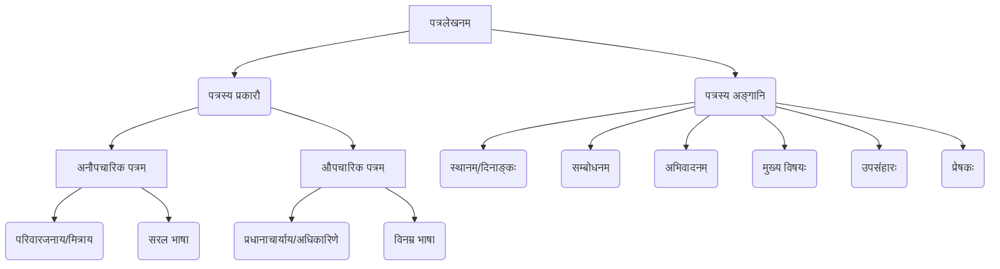

# Class 9 Sanskrit - Abhyasvan Chapter 102
**Language:** हिंदी

```markdown
# [कक्षा 9] अभ्यासवान् - अध्याय 102: पत्रलेखनम्

## 🌟 मुख्य अवधारणाएँ (Core Concepts)

यह अध्याय संस्कृत में पत्र लिखने की कला (पत्रलेखनम्) पर केंद्रित है। इसमें मुख्य रूप से दो प्रकार के पत्रों का वर्णन और अभ्यास कराया गया है:

1.  **अनौपचारिक पत्रम् (Informal Letter):**
    *   **उद्देश्य:** परिवार के सदस्यों, मित्रों आदि को व्यक्तिगत समाचार, शुभकामनाएँ, निमंत्रण या अनुभव साझा करने के लिए लिखे जाते हैं।
    *   **भाषा:** सरल, स्नेहपूर्ण और आत्मीय होती है।
    *   **उदाहरण:** छोटे भाई (अनुज) को योग दिवस कार्यक्रम में सहभागिता के बारे में बताना (पत्र 1), मित्र को पर्वतीय सुषमा का वर्णन करना (पत्र 4), मित्र को परीक्षा परिणाम बताना (पत्र 9), मित्र को अतिवृष्टि से उत्पन्न कठिनाई पर सांत्वना देना (पत्र 10)।

2.  **औपचारिक पत्रम् (Formal Letter):**
    *   **उद्देश्य:** प्रधानाचार्य, अधिकारियों आदि को अवकाश, शुल्क माफी, अनुमति या अन्य कार्यालयी कार्यों हेतु लिखे जाते हैं।
    *   **भाषा:** विनम्र, संयत और विषय-केंद्रित होती है।
    *   **उदाहरण:** प्रधानाचार्य से अवकाश हेतु प्रार्थना पत्र (पत्र 2, पत्र 5), बहन/भाई के विवाह हेतु अवकाश का प्रार्थना पत्र (पत्र 2 अभ्यास, पत्र 3 अभ्यास), शुल्क (दण्ड) माफी हेतु प्रार्थना पत्र (पत्र 5)।

**पत्र के अंग (Parts of a Letter):**
*   स्थानम्, दिनाङ्कः (Place, Date)
*   सम्बोधनम् (Salutation - जैसे प्रिय अनुज, श्रीमन्तः प्राचार्यः)
*   अभिवादनम्/नमस्कारः (Greeting - जैसे सस्नेहं नमो नमः, सादरं प्रणमामि)
*   कुशल-क्षेम (Well-being - प्रायः अनौपचारिक पत्रों में)
*   मुख्य विषयः/सन्देशः (Main Body/Message)
*   उपसंहारः/समापन (Conclusion)
*   भवदीयः/प्रेषकस्य नाम (Yours/Sender's Name & Details)

📊 **अवधारणा पदानुक्रम (Concept Hierarchy):**


## 📘 मुख्य शिक्षाएँ (Key Learnings)

1.  **औपचारिक और अनौपचारिक पत्रों में भेद:**
    *   **औपचारिक पत्र:** किसी पद पर आसीन व्यक्ति (जैसे प्रधानाचार्य) को लिखा जाता है। इसमें विनम्रता (सविनयं निवेदनम्), स्पष्टता और संक्षिप्तता आवश्यक है। सम्बोधन (श्रीमन्तः/महोदयाः) और समापन (भवताम् आज्ञाकारी शिष्यः/छात्रा) विशिष्ट होते हैं।
    *   **अनौपचारिक पत्र:** मित्रों और परिवारजनों को लिखा जाता है। इसमें स्नेह (प्रिय मित्र/अनुज), व्यक्तिगत भाव और विस्तार की गुंजाइश होती है। सम्बोधन (प्रिय...) और समापन (भवतः मित्रम्/अग्रजः) आत्मीय होते हैं।

2.  **पत्र का प्रारूप (Format):**
    *   **औपचारिक:**
        1.  प्रेषक का पता (यदि आवश्यक हो)
        2.  दिनांक
        3.  प्राप्तकर्ता का पद और पता (जैसे सेवायाम्, श्रीमन्तः प्राचार्यः...)
        4.  विषयः (संक्षेप में पत्र का उद्देश्य)
        5.  सम्बोधन (महोदयः/महोदयाः)
        6.  मुख्य विषयवस्तु (सविनयं निवेदनम् यत्...)
        7.  धन्यवाद ज्ञापन (यदि आवश्यक हो)
        8.  समापन (भवताम् आज्ञाकारी शिष्यः/आज्ञाकारिणी शिष्या)
        9.  प्रेषक का नाम, कक्षा, अनुक्रमांक।
    *   **अनौपचारिक:**
        1.  प्रेषक का पता
        2.  दिनांक
        3.  सम्बोधन (प्रिय मित्र/पूज्य पितृचरणाः)
        4.  अभिवादन (सप्रेम नमो नमः/सादरं प्रणमामि)
        5.  कुशल-क्षेम पूछना और बताना (अत्र कुशलं तत्रास्तु)
        6.  मुख्य विषयवस्तु/सन्देश
        7.  परिवार के अन्य सदस्यों हेतु अभिवादन/प्रणाम
        8.  समापन (भवतः मित्रम्/सुपुत्रः)
        9.  प्रेषक का नाम।

3.  **मञ्जूषा (Word Box) का प्रयोग:**
    *   कुछ अभ्यासों (जैसे 3, 7, 8, 9) में पत्र पूरा करने के लिए मंजूषा में शब्द दिए गए हैं।
    *   सही शब्द चुनकर रिक्त स्थान भरने से पत्र पूर्ण और अर्थपूर्ण बनता है। यह शब्दावली और वाक्य रचना के अभ्यास में सहायक है।

📈 **पत्र लेखन प्रक्रिया (Letter Writing Process Flowchart):**
```mermaid
graph LR
    A[उद्देश्य निर्धारण करें (औपचारिक/अनौपचारिक)] --> B(सही प्रारूप चुनें);
    B --> C(उचित सम्बोधन व अभिवादन लिखें);
    C --> D(मुख्य विषय स्पष्ट व क्रमबद्ध लिखें);
    D --> E(उचित समापन करें);
    E --> F(प्रेषक का विवरण लिखें);
    F --> G(भाषा व व्याकरण की जाँच करें);
```

## 🧩 सक्रिय अधिगम (Active Learning)

*   **गतिविधि (Activity): शोध-आधारित पत्र लेखन (Research-based Letter Writing):**
    *   **विषय:** अपने क्षेत्र के नगर निगम अधिकारी को संस्कृत में एक औपचारिक पत्र लिखें, जिसमें आपके मोहल्ले में सफाई व्यवस्था सुधारने का अनुरोध हो। पत्र लिखने से पहले नगर निगम अधिकारी के सही पदनाम (जैसे, स्वास्थ्य अधिकारी) और कार्यालय के पते का पता लगाएँ।
    *   **उद्देश्य:** औपचारिक पत्र के प्रारूप और भाषा का वास्तविक जीवन की स्थिति में प्रयोग करना सीखना। (Bloom's: Creating)

*   **चर्चा (Discussion): वास्तविक जीवन पर प्रभाव का आलोचनात्मक विश्लेषण (Critical Analysis of Real-world Impacts):**
    *   **विषय 1 (पत्र 1 से सम्बंधित):** योग के स्वास्थ्य लाभों (रक्तचाप, हृदयरोग, मधुमेह नियंत्रण) पर चर्चा करें जैसा कि पत्र में वर्णित है। भारत द्वारा योग को वैश्विक मंच पर बढ़ावा देने (अंतर्राष्ट्रीय योग दिवस) के प्रयासों और उसके प्रभाव का मूल्यांकन करें। (Bloom's: Evaluating)
    *   **विषय 2 (पत्र 6 से सम्बंधित):** 'ई-मनी' (डिजिटल भुगतान) के महत्व, लाभ (चोरी का भय नहीं, कहीं भी भेजना सरल) और चुनौतियों पर चर्चा करें। भारत में डिजिटल भुगतान के प्रसार और आम जीवन पर इसके प्रभाव का विश्लेषण करें। (Bloom's: Evaluating)

## 📝 मूल्यांकन तैयारी (Assessment Prep)

*   **अभ्यास:** पाठ में दिए गए सभी उदाहरण पत्रों (औपचारिक और अनौपचारिक) को ध्यानपूर्वक पढ़ें और उनके प्रारूप, भाषा और मुख्य शब्दावली को समझें।
*   **पत्र लेखन:** दिए गए अभ्यास प्रश्नों (जैसे, भगिनी/भ्रातुः विवाहे गमनाय अवकाशार्थं प्रार्थना-पत्रम्, दण्डशुल्कक्षमापनार्थं प्रार्थना-पत्रम्, मित्रं प्रति वर्णनपरकं पत्रम्) को स्वयं लिखने का प्रयास करें। मंजूषा वाले प्रश्नों का विशेष अभ्यास करें।
*   **प्रारूप स्मरण:** औपचारिक और अनौपचारिक पत्रों के सही प्रारूप (पता, दिनांक, सम्बोधन, विषय, समापन आदि) को याद रखें।
*   **शब्दावली:** पत्र लेखन में प्रयुक्त होने वाले सामान्य संस्कृत शब्दों और वाक्यों (जैसे - सविनयं निवेदनम्, कृपया, अतः, यतः, आज्ञाकारी शिष्यः, भवतः मित्रम्, कुशलं कामये) का अभ्यास करें।
*   **स्थितिजन्य प्रश्न:** परीक्षा में किसी नई स्थिति पर आधारित पत्र लिखने को कहा जा सकता है (जैसे - विद्यालय में खेल दिवस आयोजन की सूचना देते हुए मित्र को पत्र)। इसके लिए तैयार रहें।

📝 **नमूना अभ्यास:**
*   कल्पना करें कि आप बीमार हैं और विद्यालय आने में असमर्थ हैं। दो दिनों के अवकाश हेतु अपने प्रधानाचार्य को संस्कृत में प्रार्थना पत्र लिखें। (औपचारिक पत्र अभ्यास)
*   अपने मित्र को अपने विद्यालय के वार्षिकोत्सव का वर्णन करते हुए संस्कृत में पत्र लिखें। (अनौपचारिक पत्र अभ्यास)

## 🌏 भारतीय संदर्भ (Bharatiya Context)

1.  **योग दिवस (Yoga Day):** पत्र 1 में योग दिवस का उल्लेख है। भारत के प्रस्ताव पर संयुक्त राष्ट्र संघ (U.N.O) ने 21 जून को 'अंतर्राष्ट्रीय योग दिवस' घोषित किया है। यह प्राचीन भारतीय ज्ञान 'योग' की वैश्विक स्वीकृति और स्वास्थ्य के लिए इसके महत्व को दर्शाता है। पत्र में वर्णित योग के लाभ (स्वास्थ्य रक्षा, रक्तचाप, हृदयरोग, मधुमेह निवारण) भारतीय पारंपरिक स्वास्थ्य विज्ञान की प्रासंगिकता बताते हैं। 📊
2.  **ई-मनी (E-Money) / डिजिटल भारत (Digital India):** पत्र 6 'ई-मनी' के महत्व पर प्रकाश डालता है। यह भारत सरकार के 'डिजिटल इंडिया' अभियान और कैशलेस अर्थव्यवस्था को बढ़ावा देने के प्रयासों से जुड़ा है। पत्र में बताए गए लाभ (सुरक्षा, सुगमता, सरकारी स्वीकृति) भारत में डिजिटल भुगतान प्रणालियों (जैसे UPI, नेट बैंकिंग, मोबाइल वॉलेट) के बढ़ते उपयोग और लाभों को दर्शाते हैं। 🏧
3.  **पारिवारिक एवं सांस्कृतिक मूल्य (Family & Cultural Values):** पत्र 2 (बहन के विवाह हेतु अवकाश) और पत्र 3 अभ्यास (भाई के विवाह हेतु अवकाश) भारतीय समाज में पारिवारिक उत्सवों और उनमें सदस्यों की अनिवार्य उपस्थिति के महत्व को रेखांकित करते हैं। यह भारतीय संस्कृति में पारिवारिक संबंधों की घनिष्ठता को दर्शाता है। 👨‍👩‍👧‍👦
4.  **पर्यटन स्थल (Tourist Destinations):** पत्र 4 में कश्मीर प्रदेश की सुंदरता का वर्णन है, जिसे 'पृथ्वी का स्वर्ग' कहा गया है। यह भारत के प्रमुख पर्यटन स्थलों और उनकी प्राकृतिक सुषमा (फलदार वृक्ष, हरियाली, डल झील, हिमपात) का एक उदाहरण प्रस्तुत करता है। 🏞️

यह अध्याय न केवल संस्कृत में पत्र लेखन का कौशल सिखाता है, बल्कि भारतीय संस्कृति, स्वास्थ्य परंपराओं और आधुनिक भारत के संदर्भों से भी छात्रों को जोड़ता है।
```