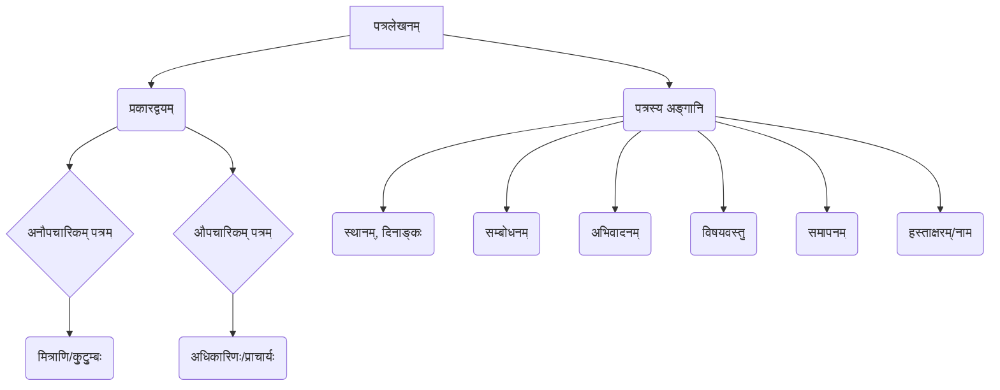

# Class 9 Sanskrit - Abhyasvan Chapter 102
**Language:** संस्कृतम्

```markdown
# [कक्षा ९] अभ्यासवान् - अध्यायः १०२ - पत्रलेखनम्

## 🌟 मूलाधाराः अवधारणाः (Core Concepts)

अस्मिन् पाठे वयं संस्कृतभाषायां पत्रलेखनस्य कलां शिक्षामहे। पत्रलेखनं द्विविधं भवति - औपचारिकम् अनौपचारिकं च।

1.  **पत्रलेखनम् (Letter Writing)**
    *   **प्रकारद्वयम् (Two Types):**
        *   **अनौपचारिकम् पत्रम् (Informal Letter):**
            *   **उद्देश्यम्:** कुटुम्बिजनेभ्यः, मित्रेभ्यः च लिख्यते।
            *   **भाषा:** सरला, स्नेहपूर्णा च भवति।
            *   **उदाहरणम्:** अनुजं प्रति योगदिवसस्य शुभकामनापत्रम्, मित्रं प्रति पर्वतीयसुषमायाः वर्णनपत्रम्।
        *   **औपचारिकम् पत्रम् (Formal Letter):**
            *   **उद्देश्यम्:** कार्यालयेषु, विद्यालयेषु अधिकारिभ्यः लिख्यते (यथा - प्राचार्यं प्रति)।
            *   **भाषा:** विनयान्विता, स्पष्टा, विषयानुसारिणी च भवति।
            *   **उदाहरणम्:** अवकाशार्थं प्रार्थनापत्रम्, शुल्कक्षमापनार्थं प्रार्थनापत्रम्, भगिन्याः विवाहे गमनार्थम् अनुमतिपत्रम्।
    *   **पत्रस्य अङ्गानि (Components of a Letter):**
        *   **प्रेषकस्य स्थानं दिनाङ्कश्च (Sender's Place and Date):** उपरि वामतः दक्षिणतः वा।
        *   **सम्बोधनम् (Salutation):** यथा - प्रिय अनुज, पूज्य पितृचरणाः, श्रीमन्तः प्राचार्यमहोदयाः, प्रिय मित्र।
        *   **अभिवादनम्/नमस्कारः (Greeting):** यथा - सस्नेहं नमो नमः, सादरं प्रणमामि, सप्रेम नमोनमः।
        *   **कुशलवार्ता/विषयप्रस्तुतिः (Well-being/Subject Matter):** पत्रस्य मुख्यभागः यत्र वार्ताः, सूचनाः, निवेदनानि वा लिख्यन्ते।
        *   **समापनवाक्यम् (Concluding Sentence):** पत्रस्य अन्ते आशीर्वचनम्, शुभकामना वा।
        *   **सम्बन्धनिर्देशः/हस्ताक्षरम् (Relationship/Signature):** यथा - भवतः अग्रजः, भवताम् आज्ञाकारी छात्रः/शिष्यः, भवतः मित्रम्, भवतः सुपुत्रः।
        *   **प्रेषकस्य नाम (Sender's Name):** अन्ते स्पष्टतया लिख्यते।

📊 **अवधारणा-पदानुक्रमः (Concept Hierarchy):**



## 📘 मुख्यशिक्षणांशाः (Key Learnings)

1.  **पत्रप्रकारयोः भेदज्ञानम्:** औपचारिक-अनौपचारिकपत्रयोः उद्देश्यं, भाषाशैलीं, प्रारूपं च अवगन्तुं शक्नुमः।
2.  **पत्रस्य संरचनाज्ञानम्:** पत्रस्य विभिन्न-अङ्गानां (स्थानम्, दिनाङ्कः, सम्बोधनम्, अभिवादनम्, विषयवस्तु, समापनम्, हस्ताक्षरम्) क्रमानुसारं लेखनस्य अभ्यासं कुर्मः।
3.  **विभिन्नविषयेषु लेखनकौशलम्:** अवकाशः, शुल्कक्षमापनम्, अनुमतिः, वर्णनम्, शुभकामनाः, चिन्ताप्रकटनम् इत्यादिषु विषयेषु पत्रं लेखितुं समर्थाः भवामः।
4.  **समुचितशब्दावलीप्रयोगः:** औपचारिक-अनौपचारिकसन्दर्भेषु समुचित-शब्दानां, वाक्यानां च प्रयोगं शिक्षामहे।
5.  **विनयशीलतायाः महत्त्वम्:** विशेषतः औपचारिकपत्रेषु विनयपूर्णभाषायाः प्रयोगस्य महत्त्वं जानीमः।

📈 **पत्रस्य प्रारूपम् (Letter Format Diagram):**

**अनौपचारिकम् पत्रम् (Informal Letter)**

| भागः             | उदाहरणम्                                |
| :--------------- | :-------------------------------------- |
| स्थानम्, दिनाङ्कः | जयपुरम्, १७.११.२०१७                      |
| सम्बोधनम्        | प्रिय अनुज, / प्रिय मित्र,                |
| अभिवादनम्        | सस्नेहं नमो नमः। / सप्रेम नमोनमः।        |
| कुशलप्रश्नः       | अत्र कुशलं, तत्र अस्तु।                  |
| विषयवस्तु        | (मुख्य सन्देशः)                         |
| समापनम्          | शेषं सर्वं कुशलम्।                       |
| सम्बन्धनिर्देशः   | भवतः अग्रजः / भवतः मित्रम्             |
| नाम              | रामकरणः / सुमेशः                         |

**औपचारिकम् पत्रम् (Formal Letter)**

| भागः             | उदाहरणम्                                    |
| :--------------- | :------------------------------------------ |
| सेवायाम्         | सेवायाम्                                    |
| अधिकारिणः पदम्  | श्रीमन्तः प्राचार्यमहोदयाः,                 |
| संस्थायाः नाम, पता | केन्द्रीयविद्यालयः, जयपुरम् (राजस्थानम्) |
| विषयः           | विषयः- दिनद्वयस्य अवकाशार्थं प्रार्थना-पत्रम्। |
| सम्बोधनम्        | महोदयाः,                                   |
| निवेदनम्         | सविनयं निवेदयामि यत्... (मुख्य कारणम्/निवेदनम्) |
| समापन-निवेदनम्   | अतः कृपया... मां अनुगृह्णन्तु भवन्तः।        |
| धन्यवादः (वैकल्पिकः) | धन्यवादः।                                  |
| भवदीयः          | भवताम् आज्ञाकारी छात्रः/शिष्यः              |
| नाम              | राजीवः                                      |
| कक्षा, अनुक्रमाङ्कः | नवमी 'ब', अनुक्रमाङ्कः-३५                 |
| दिनाङ्कः         | दिनाङ्कः- २८.११.२०१७                       |

## 🧩 सक्रिय-अधिगमः (Active Learning)

*   **गतिविधिः (Activity):** 🔍 **प्रकरण-विश्लेषणम् (Case Study Analysis):**
    *   पाठ्यपुस्तके दत्तानि पत्राणि (यथा - योगदिवसपत्रम्, ई-मनीपत्रम्, अतिवृष्टिपत्रम्) सम्यक् पठन्तु।
    *   प्रत्येकस्य पत्रस्य उद्देश्यं, प्रेषकः, प्रापकः, भाषाशैली, मुख्यसन्देशः च विश्लेषयन्तु।
    *   **मूल्याङ्कनम्:** किं पत्रं स्वस्य उद्देश्यं साधयति? किं भाषा प्रभाविनी अस्ति? यदि परिवर्तनम् आवश्यकं, तत् किं स्यात्?
    *   **सृजनम्:** एकं नूतनं प्रकरणं (situation) स्वीकृत्य (यथा - विद्यालये वृक्षारोपणकार्यक्रमस्य आयोजनार्थं प्राचार्यं प्रति पत्रम्) तदनुसारम् एकम् औपचारिकं पत्रं रचयन्तु।
*   **चर्चा (Discussion):** 🌍 **वास्तविकजीवने प्रभावस्य विश्लेषणम् (Analysis of Real-world Impacts):**
    *   **योगस्य महत्त्वम्:** योगदिवसस्य पत्रे वर्णिताः योगस्य लाभाः (स्वास्थ्यरक्षणम्, रोगनिवारणम्) कथं वास्तविकजीवने महत्त्वपूर्णः सन्ति? भारतस्य अस्मिन् विषये किं योगदानम् अस्ति? (Bloom's: Evaluating)
    *   **ई-धनस्य (E-Money) प्रभावः:** ई-धनस्य पत्रे उल्लिखिताः लाभाः (सुरक्षा, सरलता, सर्वकारस्य स्वीकृतिः) कथं भारतस्य अर्थव्यवस्थां, जनानां जीवनं च परिवर्तयन्ति? कानिचन सम्भाव्यानि कष्टानि अपि सन्ति वा? (Bloom's: Evaluating)
    *   **प्राकृतिक-आपदाः:** अतिवृष्ट्याः पत्रे वर्णितं विषमं जीवनं (चेन्नईनगरे) कथं सामाजिक-आर्थिक-स्तरेषु प्रभावं जनयति? एतादृशीषु परिस्थितिषु पत्रमाध्यमेन कथं साहाय्यं, सहानुभूतिः वा प्रकटयितुं शक्यते? (Bloom's: Analyzing)

## 📝 मूल्याङ्कनार्थं सज्जता (Assessment Prep)

*   **प्रकरण-आधारिताः प्रश्नाः (Case Studies):**
    1.  भवान्/भवती अस्वस्थः/अस्वस्था अस्ति। दिनत्रयस्य अवकाशार्थं स्वप्राचार्यं प्रति एकं प्रार्थनापत्रं लिखतु। (Creating)
    2.  भवतः मित्रं परीक्षायां सफलं जातम्। तस्मै वर्धापनपत्रं लिखतु। (Creating)
    3.  विद्यालयस्य पुस्तकालये नवीनानि क्रीडा-सम्बन्धीनि पुस्तकानि क्रेतुम् प्राचार्यं प्रति निवेदनपत्रं लिखतु। (Creating)
*   **प्रारूप-विश्लेषणम् (Diagram Analysis):**
    *   औपचारिक-अनौपचारिकपत्रयोः प्रारूपस्य तुलनां कुर्वन्तु। तयोः मुख्यभेदान् लिखन्तु। (Analyzing)
    *   दत्ते पत्रे तस्य विभिन्नानि अङ्गानि (सम्बोधनम्, विषयः, समापनम् इत्यादीनि) अभिज्ञापयन्तु। (Applying)
*   **मञ्जूषा-सहायतया पत्रपूरणम्:** पाठ्यपुस्तके यथा दत्ताः अभ्यासाः, तथा मञ्जूषातः उचितपदानि चित्वा रिक्तस्थानानि पूरयित्वा पत्रं सम्पूर्णं कुर्वन्तु। (Applying)

## 🌏 भारतीयसन्दर्भः (Bharatiya Context)

अस्मिन् पाठे दत्तानि पत्राणि विभिन्नान् भारतीयसन्दर्भान् प्रकाशयन्ति:

1.  **योगः:** 🧘 योगः भारतस्य प्राचीनः ज्ञानकोषः अस्ति। पत्रे योगदिवसस्य (जून २१, संयुक्तराष्ट्रसङ्घेन घोषितः) उल्लेखः, स्वास्थ्ये तस्य महत्त्वं (रक्तचाप-हृदयरोग-मधुमेहनिवारणम्) च वर्णितम्। एतत् भारतस्य वैश्विकं सांस्कृतिकं योगदानं दर्शयति।
2.  **ई-धनम् (E-Money):** 💳 भारतसर्वकारेण प्रवर्तितस्य 'ई-मनी' इत्यस्य महत्त्वं वर्णितम्। एतत् 'डिजिटल-इण्डिया' (Digital India) इति कार्यक्रमस्य, नूतन-अर्थव्यवस्थायाः च प्रतीकम् अस्ति, यत्र ATM, कूटसङ्केतः (QR Code?) इत्यादीनां प्रयोगः भवति।
3.  **प्राकृतिक-आपदाः:** 🌧️ चेन्नईनगरे अतिवृष्ट्याः कारणेन उत्पन्नस्य विषमजीवनस्य वर्णनं भारतस्य विभिन्नेषु भागेषु आगच्छन्तीनां प्राकृतिक-आपदानां (यथा - वृष्टिः, जलप्लावनम्) प्रभावं सूचयति। एतादृशेषु अवसरेषु परस्परं सहानुभूतिः साहाय्यं च भारतीयसमाजस्य अङ्गम् अस्ति।
4.  **सांस्कृतिक-सामाजिक-परम्पराः:** 💍 भगिन्याः/भ्रातुः विवाहः, पितरं प्रति अनुमति-याचना, गुरुजनान् प्रति आदरः (आज्ञाकारी शिष्यः), मित्रेण सह स्नेहपूर्णः व्यवहारः – एते सर्वे भारतीय-सामाजिक-सांस्कृतिक-मूल्यानां प्रतिबिम्बाः सन्ति ये पत्रेषु दृश्यन्ते। जयपुरम्, दिल्ली, कश्मीरः, चेन्नै इत्यादीनां नगराणाम् उल्लेखः भारतस्य भौगोलिकविविधतां स्मारयति।

*(**टिप्पणी:** पाठ्यपुस्तके आर्थिक-सामाजिक-आङ्किकाः (Economic/Social Data) साक्षात् न दत्ताः, परन्तु पत्राणां विषयाः (योगः, ई-धनम्, आपदाः) एतैः सह सम्बद्धाः सन्ति।)*
```