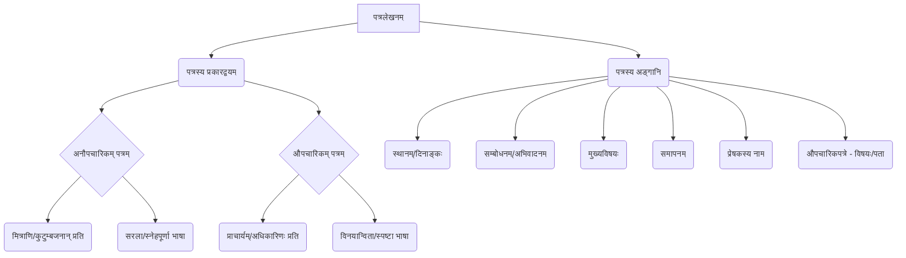

# Class 9 Sanskrit - Abhyasvan Chapter 102
**Language:** संस्कृतम्

```markdown
# [कक्षा ९] अभ्यासवान् भव - अध्यायः १०२ - पत्रलेखनम् (Patralekhanam - Letter Writing)

## 🌟 मुख्य-अवधारणाः (Core Concepts)

पत्रलेखनम् (Letter Writing) इति स्वविचारान्, भावनाः, सूचनाः वा अन्येभ्यः लिखितरूपेण प्रेषणस्य कला अस्ति। अस्मिन् अध्याये मुख्यतया द्वयोः प्रकारयोः पत्राणां विषये चर्चा कृता अस्ति:

1.  **अनौपचारिकम् पत्रम् (Anaupacharikam Patram - Informal Letter):**
    *   **प्रयोजनम्:** मित्राणि, कुटुम्बसदस्यान्, परिचितजनान् प्रति लिख्यते।
    *   **भाषा:** सरला, स्नेहपूर्णा, भावात्मिका च भवति।
    *   **उदाहरणम् (Example):** अनुजं प्रति योगदिवसे सहभागितां वर्णयितुं पत्रम् (पृ. १३), मित्रं प्रति पर्वतीयसुषमायाः वर्णनम् (पृ. १८), मित्रं प्रति परीक्षापरिणामविषये पत्रम् (पृ. २२), मित्रं प्रति अतिवृष्ट्याः कष्टं वर्णयितुं पत्रम् (पृ. २२-२३)।

2.  **औपचारिकम् पत्रम् (Aupacharikam Patram - Formal Letter):**
    *   **प्रयोजनम्:** प्राचार्यम्, अधिकारिणः, संस्थाप्रमुखान् प्रति लिख्यते।
    *   **भाषा:** विनयान्विता, स्पष्टा, विषयानुसारिणी च भवति।
    *   **उदाहरणम् (Example):** अवकाशार्थं प्रार्थनापत्रम् (रुग्णताहेतोः - पृ. १५, भगिन्याः/भ्रातुः विवाहहेतोः - पृ. १६-१७), दण्डशुल्कक्षमापनार्थं प्रार्थनापत्रम् (पृ. १८-१९), शैक्षणिकभ्रमणार्थम् अनुमति-धन-याचनार्थं पितरं प्रति पत्रम् (पृ. १७-१८), 'ई-मनी' इत्यस्य महत्वं वर्णयितुं पितरं/मातरं प्रति पत्रम् (पृ. १९-२०)।

3.  **पत्रस्य अङ्गानि (Parts of a Letter):**
    *   स्थानम्, दिनाङ्कः (Place, Date)
    *   सम्बोधनम् (Salutation - e.g., प्रिय अनुज, श्रीमन्तः प्राचार्यः)
    *   अभिवादनम्/नमस्कारः (Greeting - e.g., सस्नेहं नमो नमः, सादरं प्रणमामि)
    *   मुख्यः विषयः/सन्देशः (Main Body/Message)
    *   समापन-वाक्यम् (Concluding Sentence)
    *   भवदीयः/भवदीया (Yours - followed by relation/designation)
    *   प्रेषकस्य नाम (Sender's Name)
    *   (औपचारिकपत्रेषु) विषयः, प्रेषकस्य पता/कक्षा/अनुक्रमाङ्कः अपि आवश्यकाः।

📊 **अवधारणा-सोपानम् (Concept Hierarchy):**


## 📘 मुख्य-शिक्षणबिन्दवः (Key Learnings)

1.  **पत्रप्रकारयोः भेदः (Difference between Letter Types):** छात्राः औपचारिक-अनौपचारिकपत्रयोः उद्देश्यं, भाषाशैलीं, प्रारूपं च अवगन्तुं शक्नुवन्ति। अनौपचारिकपत्रेषु भावानां प्राधान्यं भवति, यदा तु औपचारिकपत्रेषु सूचनायाः, निवेदनस्य वा स्पष्टतायाः।

2.  **पत्रप्रारूपस्य ज्ञानम् (Knowledge of Letter Format):** प्रत्येकप्रकारस्य पत्रस्य निश्चितं प्रारूपम् (format) अनुसरणीयम्।
    *   **अनौपचारिक-प्रारूपम् (Informal Format):**
        ```
        [स्थानम्]
        [दिनाङ्कः]

        प्रिय [सम्बन्धः/मित्रस्य नाम],
        [अभिवादनम् - सस्नेहं नमः/आशीर्वादाः],

        अत्र कुशलं तत्रास्तु। ... [कुशलप्रश्नः/सूचना] ...
        [मुख्यः विषयः/वर्णनम्] ...
        [अन्यवार्ताः/समापनम्] ...
        मातृपितृभ्यां/गुरुजनेभ्यः मे प्रणामाः।

        भवतः/भवत्याः [सम्बन्धः/मित्रम्],
        [भवतः/भवत्याः नाम]
        ```
    *   **औपचारिक-प्रारूपम् (Formal Format):**
        ```
        सेवायाम्,
        श्रीमन्तः [पदनाम - उदा. प्राचार्यमहोदयाः],
        [संस्थायाः नाम],
        [स्थानम्]।

        विषयः - [पत्रस्य प्रयोजनं संक्षेपेण]।

        महोदय/महोदयाः,

        सविनयं निवेदनम् अस्ति यत् अहं भवतः विद्यालये [कक्षायाः नाम] कक्षायाः छात्रः/छात्रा अस्मि। ... [मुख्यं कारणम्/निवेदनम्] ...
        अतः कृपया [याचना - उदा. अवकाशं प्रदाय] माम् अनुगृह्णन्तु भवन्तः।

        सधन्यवादम्।

        भवताम् आज्ञाकारी शिष्यः/शिष्या,
        [भवतः/भवत्याः नाम]
        [कक्षा, अनुक्रमाङ्कः]
        [दिनाङ्कः]
        ```
📈 *छात्राः एतयोः प्रारूपयोः अभ्यासं कृत्वा पत्रलेखने निपुणाः भवितुम् अर्हन्ति।*

3.  **विशिष्ट-शब्दावली-प्रयोगः (Use of Specific Vocabulary):** विभिन्नेषु सन्दर्भेषु (यथा - अवकाशः, वर्णनम्, याचना) उपयुक्तानां शब्दानां वाक्यानां च प्रयोगः महत्त्वपूर्णः। उदा. - `कुशली, कुशलं कामये`, `अतीव प्रसन्नताम् अनुभवामि`, `सविनयं निवेदयामि`, `कृपया माम् अनुगृह्णन्तु`, `भवतः आज्ञाकारी शिष्यः`।

4.  **विविध-विषयेषु लेखन-क्षमता (Ability to Write on Various Topics):** पाठ्यपुस्तके प्रदत्तानि उदाहरणानि अभ्यासाः च छात्रान् योगदिवसः, रुग्णता, विवाहः, भ्रमणम्, आर्थिकविषयाः (ई-मनी), परीक्षापरिणामः, प्राकृतिक-आपदाः (अतिवृष्टिः) इत्यादिषु विषयेषु पत्रं लेखितुं सज्जीकुर्वन्ति।

## 🧩 सक्रिय-अधिगमः (Active Learning)

*   **गतिविधिः (Activity): परिस्थिति-आधारितं पत्ररचनम् ✍️ (Scenario-based Letter Composition):**
    *   छात्राः समूहेषु विभज्यन्ताम्। प्रत्येकसमूहः एकां नूतनां परिस्थितिम् (यथा - स्वग्रामे स्वच्छता-अभियानस्य आयोजनार्थं ग्रामप्रमुखाय पत्रम्, स्वविद्यालयस्य वार्षिकोत्सवे मित्रं निमन्त्रयितुं पत्रम्, पुस्तकालयाध्यक्षाय विशिष्टपुस्तकस्य याचनार्थं पत्रम्) प्राप्य तदनुसारम् औपचारिकम् अथवा अनौपचारिकं पत्रं रचयतु। एतेन तेषां सृजनात्मकता (Creativity) वर्धिष्यते। (Bloom's: Creating)

*   **चर्चा (Discussion): पत्राणां प्रभावशीलतायाः विश्लेषणम् 🌍 (Analysis of Letter Effectiveness):**
    *   पाठ्यपुस्तके प्रदत्तानाम् औपचारिकपत्राणाम् (यथा - अवकाशार्थं, शुल्कक्षमापनार्थं पत्राणि) विश्लेषणं कुर्वन्तु। किं निवेदनानि स्पष्टानि, युक्तियुक्तानि च सन्ति? कथं भाषायाः प्रयोगः (विनयः, स्पष्टता) पत्रस्य प्रभावं वर्धयति? अनौपचारिकपत्रेषु कथं भावनाः प्रकटिताः? एषा चर्चा छात्रेषु मूल्याङ्कनक्षमतां (Evaluating Skills) विकासयिष्यति। (Bloom's: Evaluating/Analyzing)

## 📝 मूल्याङ्कन-सिद्धता (Assessment Prep)

*   **अभ्यास-प्रश्नाः (Practice Questions):**
    1.  **मञ्जूषा-सहायतया रिक्तस्थानपूर्तिः:** पाठ्यपुस्तके प्रदत्ताः अभ्यासाः (पृ. १७-१८, २१, २२) इव प्रश्नाः यत्र छात्राः उचितैः पदैः पत्रं पूरयन्ति।
    2.  **पूर्णपत्रलेखनम्:** नूतनाः परिस्थितयः दत्त्वा औपचारिकम् (यथा - क्रीडासामग्रीणाम् अभावविषये प्राचार्याय पत्रम्) अथवा अनौपचारिकं (यथा - स्वजन्मदिवसे मित्राय निमन्त्रणपत्रम्) पत्रं लेखितुं निर्देशः। 📝
    3.  **प्रारूप-ज्ञान-परीक्षणम्:** प्रदत्तपत्रस्य प्रकारं (औपचारिकम्/अनौपचारिकम्) लिखन्तु, तस्य विभिन्नानि अङ्गानि (सम्बोधनम्, विषयः, समापनम्) च अभिज्ञापयन्तु।
*   **ध्यानबिन्दवः (Focus Points):**
    *   शुद्धं प्रारूपम् (Correct Format)
    *   विषयानुकूला भाषा (Appropriate Language)
    *   व्याकरणशुद्धता (शुद्धपाठः) (Grammatical Accuracy)
    *   स्पष्टता (Clarity)

## 🌏 भारतीय-सन्दर्भः (Bharatiya Context)

अस्मिन् अध्याये अनेके भारतीय-सन्दर्भाः उल्लिखिताः सन्ति, ये पत्रलेखनस्य प्रासङ्गिकतां दर्शयन्ति:

1.  **योगदिवसः (Yoga Day):** (पृ. १३) भारतस्य प्रस्तावेन संयुक्तराष्ट्रसंघेन जूनमासस्य एकविंशतितारिका 'अन्ताराष्ट्रिययोगदिवसः' इति घोषिता। एतत् भारतस्य विश्वे सांस्कृतिकयोगदानस्य प्रतीकम् अस्ति। 🧘‍♀️
2.  **कश्मीरप्रदेशस्य वर्णनम् (Description of Kashmir):** (पृ. १८) पत्रे कश्मीरस्य प्राकृतिकसौन्दर्यस्य (फलवृक्षाः, हरितिमा, डल-सरोवरः, हिमपातः) वर्णनं भारतस्य भौगोलिकविविधतां दर्शयति। 🏞️
3.  **चेन्नईनगरे अतिवृष्टिः (Floods in Chennai):** (पृ. २२-२३) एषः उल्लेखः भारते घटितानां प्राकृतिक-आपदानां वास्तविक-उदाहरणम् अस्ति, यः सामाजिक-सहानुभूतेः महत्वं ज्ञापयति। 🌧️🌊
4.  **ई-मनी (E-Money):** (पृ. १९-२०) 'ई-मनी' तथा ATM कार्ड् इत्यस्य उल्लेखः आधुनिकभारतस्य 'डिजिटल-इण्डिया' (Digital India) अभियानं तथा वर्धमानम् आर्थिक-डिजिटलीकरणं (Economic Digitalization) सङ्केतयति। 💳💻
5.  **पारिवारिक-उत्सवाः (Family Events):** भगिन्याः/भ्रातुः विवाहस्य उल्लेखः (पृ. १६-१७) भारतीय-समाजे पारिवारिक-सम्बन्धानां महत्त्वं रेखाङ्कितं करोति। 👨‍👩‍👧‍👦

एते सन्दर्भाः छात्रान् स्वदेशस्य संस्कृतिं, समाजं, वर्तमानघटनाः च प्रति सजगान् कुर्वन्ति, पत्रलेखनम् अधिकं सार्थकं च अनुभवाय कल्पन्ते। 🇮🇳
```