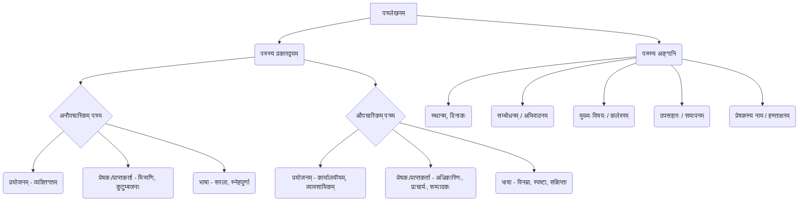

# Class 9 Sanskrit - Abhyasvan Chapter 102
**Language:** संस्कृतम्

```markdown
# [कक्षा ९] अभ्यासवान् भव - अध्यायः १०२ (पत्रलेखनम्)

## 🌟 मुख्याः अवधारणाः (Core Concepts)

**पत्रलेखनम्** - विचाराणाम्, सूचनानां, भावनानां वा लिखितरूपेण आदानप्रदानस्य माध्यमम्।

**अवधारणा-पदानुक्रमः (Concept Hierarchy) 📊**



*   **अनौपचारिकम् पत्रम् (Informal Letter):** मित्राणि, परिवारजनान् च प्रति लिख्यते। अस्मिन् स्नेहः, आत्मीयता च प्रकटीक्रियते। यथा - योगदिवसे अनुजस्य सहभागितां वर्णयत् पत्रम्।
*   **औपचारिकम् पत्रम् (Formal Letter):** प्राचार्यं, कार्यालयाधिकारिणं वा प्रति लिख्यते। अस्मिन् विनयेन स्पष्टतया च विषयः प्रस्तूयते। यथा - अवकाशार्थं प्रार्थनापत्रम्, शुल्कक्षमापनार्थं प्रार्थनापत्रम्।

## 📘 प्रमुखाः शिक्षणबिन्दवः (Key Learnings)

1.  **अनौपचारिकपत्रस्य संरचना (Informal Letter Structure):**
    *   **आरम्भः:** पत्रलेखनस्थानम् (उपरि दक्षिणपार्श्वे), दिनांकः (तदधः)। वामपार्श्वे प्रिय मित्र/अनुज/अग्रज इत्यादि सम्बोधनम्, सस्नेहं नमोनमः/सप्रेम नमः इत्यादि अभिवादनम्।
    *   **मध्यभागः:** कुशलक्षेमप्रश्नः (अत्र कुशलं तत्रास्तु), पत्रलेखनस्य कारणं/विषयस्य विस्तरेण वर्णनम्। यथा - योगदिवसस्य महत्त्वं, पर्वतीयप्रदेशस्य सौन्दर्यवर्णनम्, अतिवृष्ट्याः कष्टवर्णनम्।
    *   **समापनम्:** गृहे सर्वेभ्यः प्रणामः/स्नेहः, पत्रोत्तरस्य प्रतीक्षा इत्यादयः। अधः भवतः मित्रम्/अग्रजः/अनुजः इति उल्लेखः, तदधः स्वनाम।
    *   **उदाहरणम्:** योगदिवसस्य पत्रे योगस्य लाभाः (रक्तचाप-हृदयरोग-मधुमेह-निवारणम्) वर्णिताः।

2.  **औपचारिकपत्रस्य संरचना (Formal Letter Structure):**
    *   **आरम्भः:** 'सेवायां' (वामपार्श्वे), तदधः प्राप्तकर्तुः पदनाम, संस्थायाः नाम, पता च। तदधः 'विषयः' इति लिखित्वा पत्रस्य प्रयोजनं संक्षेपेण। तदधः 'महोदयः/महोदया' इति सम्बोधनम्।
    *   **मध्यभागः:** सविनयं निवेदनम् अस्ति यत्... इति आरभ्य स्वपरिचयः (नाम, कक्षा) दत्त्वा विषयस्य स्पष्टं विस्तृतं च वर्णनम्। यथा - अवकाशस्य कारणम् (ज्वरः, भगिन्याः/भ्रातुः विवाहः), दण्डशुल्कस्य कारणं, क्षमायाचना च।
    *   **समापनम्:** अतः प्रार्थना अस्ति यत्... इति लिख्वा किं प्रार्थ्यते इति स्पष्टीकरणम्। धन्यवादः। दक्षिणपार्श्वे 'भवतः आज्ञाकारी शिष्यः/छात्रः', तदधः स्वनाम, कक्षा, अनुक्रमांकः, दिनांकः च।
    *   **उदाहरणम्:** अवकाशार्थं प्रार्थनापत्रे रुग्णतायाः अथवा विवाहस्य उल्लेखः। शुल्कक्षमापनार्थं पत्रे आर्थिकस्थितेः उल्लेखः।

3.  **भाषाशैली:** अनौपचारिकपत्रे सरला, भावात्मिका च भाषा। औपचारिकपत्रे शिष्टा, विनम्रा, स्पष्टा च भाषा प्रयोक्तव्या।

4.  **विशिष्टशब्दावली:**
    *   **अनौपचारिकम्:** प्रिय, सस्नेहम्, कुशलं कामये, अतीव प्रसन्नताम् अनुभवामि, भवतः मित्रम्/अग्रजः।
    *   **औपचारिकम्:** सेवायाम्, श्रीमन्तः, महोदयाः, सविनयं निवेदयामि, विषयः, आज्ञाकारी शिष्यः, धन्यवादः।

**संरचना-भेदः (Structural Difference Diagram) 📈**

```mermaid
graph TD
    subgraph अनौपचारिकम् पत्रम्
        A1(स्थानम्, दिनांकः) --> A2(सम्बोधनम्, अभिवादनम्) --> A3(कुशलक्षेमः) --> A4(मुख्यविषयः) --> A5(उपसंहारः) --> A6(भवतः/भवत्याः...) --> A7(नाम)
    end
    subgraph औपचारिकम् पत्रम्
        B1(सेवाम्) --> B2(प्राप्तकर्तुः विवरणम्) --> B3(विषयः) --> B4(सम्बोधनम्) --> B5(निवेदनम्, मुख्यविषयः) --> B6(प्रार्थना) --> B7(धन्यवादः) --> B8(भवतः/भवत्याः आज्ञाकारी...) --> B9(नाम, कक्षा, दिनांकः)
    end
```

5.  **समकालीनविषयाः:** पत्रेषु योगदिवसः, 'ई-मनी' (E-Money) इत्यादयः आधुनिकाः विषयाः अपि चर्चिताः, येषां महत्त्वं छात्रैः अवगन्तव्यम्।

## 🧩 सक्रिय-अधिगमः (Active Learning)

*   **गतिविधिः (Activity): शोध-आधारित-प्रकरण-विश्लेषणम् (Research-based Case Study Analysis) 🔍 (निर्माणम्/मूल्याङ्कनम् - Creating/Evaluating)**
    *   **प्रकरणम्:** कश्चन छात्रः स्वक्षेत्रे 'स्वच्छभारत-अभियानस्य' प्रभावं दृष्टवान्। सः स्वमित्राय अस्य अभियानस्य सफलतां वर्णयितुम् एकम् अनौपचारिकं पत्रं लिखतु। तथैव, स्वक्षेत्रस्य नगरपालिका-अधिकारिणं प्रति स्वच्छता-व्यवस्थां सुदृढां कर्तुं कानिचन सूचनानि (suggestions) यच्छन् एकम् औपचारिकं पत्रं लिखतु।
    *   **विश्लेषणम्:** छात्रैः उभयोः पत्रयोः भाषाशैली, संरचना, उद्देश्यं च विश्लेषणीयम्। किं औपचारिकपत्रे दत्तानि सूचनानि तर्कसङ्गतानि सन्ति? किं अनौपचारिकपत्रे भावनाः सम्यक् प्रकटिताः?

*   **चर्चा (Discussion): वास्तविक-जगति प्रभावस्य आलोचनात्मकं विश्लेषणम् (Critical Analysis of Real-World Impacts) 🌍 (मूल्याङ्कनम् - Evaluating)**
    *   औपचारिकपत्राणां (यथा - अवकाशार्थं, शुल्कक्षमापनार्थं) वास्तविकजीवने कियती प्रभाविता अस्ति? काः सीमाः सन्ति?
    *   अद्यतने डिजिटल-युगे (WhatsApp, Email इत्यादि) अनौपचारिक-पत्रलेखनस्य किं महत्त्वम् अवशिष्टम्? औपचारिक-पत्रलेखनकौशलस्य आवश्यकता कुत्र कुत्र भवति?
    *   'ई-मनी' पत्रस्य सन्दर्भे, डिजिटल-भुगतानस्य (Digital Payment) लाभाः हानयः च (यथा पत्रे उल्लिखितम् - चोरभयाभावः, सर्वत्र स्वीकार्यता, परन्तु तान्त्रिकसमस्याः, सुरक्षाचिन्ताः) विषये चर्चा करणीया।

## 📝 मूल्याङ्कन-सिद्धता (Assessment Prep)

*   **प्रकरण-अभ्यासः (Case Studies):**
    1.  भवान्/भवती अस्वस्थताकारणात् दिनद्वयस्य अवकाशम् इच्छति। प्राचार्यं प्रति एकं प्रार्थनापत्रं लिखतु।
    2.  भवतः/भवत्याः मित्रं वार्षिकोत्सवे नृत्यप्रतियोगितायां प्रथमस्थानं प्राप्तवान्/प्राप्तवती। तस्मै/तस्यै वर्धापनपत्रं लिखतु।
    3.  विद्यालयस्य पुस्तकालये नवीनानि क्रीडा-सम्बद्धानि पुस्तकानि आनेतुं प्राचार्यं प्रति एकम् आवेदनपत्रं लिखतु।
*   **मञ्जूषा-सहायतया पत्रपूरणम्:** पाठ्यपुस्तके दत्तानाम् अभ्यासानां सदृशाः अभ्यासाः (यथा - पत्रम् ३, ७, ८, ९)।
*   **संरचना-ज्ञानम्:** औपचारिक-अनौपचारिकपत्रयोः प्रारूपं (format) सम्यक् स्मरणीयम्। (उपर्युक्तं रेखाचित्रं सहायकम् 📈)।
*   **समुचित-शब्दावली-प्रयोगः:** प्रसङ्गानुसारं योग्यानां शब्दानां, वाक्यानां च प्रयोगः महत्त्वपूर्णः।

## 🌏 भारतीय-सन्दर्भः (Bharatiya Context)

1.  **योगदिवसः (Yoga Day):** प्रथमपत्रे अस्य उल्लेखः अस्ति। योगः भारतस्य विश्वस्मै स्वास्थ्यसम्बन्धिनी महती देनम् अस्ति। संयुक्तराष्ट्रसंघेन (UNO) जूनमासस्य एकविंशतितारिका 'अन्तर्राष्ट्रिययोगदिवसः' इति घोषिता (यथा पत्रे उल्लिखितम्)। इदं भारतस्य सांस्कृतिक-गौरवस्य प्रतीकम् अस्ति। 🧘‍♀️🇮🇳
2.  **ई-मनी (E-Money):** षष्ठपत्रे 'ई-मनी' इत्यस्य महत्त्वं वर्णितम्। इदं भारतसर्वकारस्य 'डिजिटल-इण्डिया' (Digital India) अभियानस्य अङ्गम् अस्ति। पत्रे उल्लिखिताः लाभाः - चोरस्य भयं न भवति, कुत्रापि प्रेषणं सरलम्, सर्वकारेण स्वीकृतम्। ए.टी.एम्.-कार्ड् (ATM Card) द्वारा धनप्राप्तिः अपि वर्णिता। 💳💻
3.  **शैक्षणिक-भ्रमणम् (Educational Tour):** तृतीयपत्रे शैक्षणिकभ्रमणस्य उल्लेखः भारतस्य विद्यालयेषु प्रचलन्त्याः शैक्षणिकेतर-गतिविधेः उदाहरणम् अस्ति।
4.  **सामाजिक-सांस्कृतिक-अवसराः:** भगिन्याः/भ्रातुः विवाहः (पत्रम् २, अभ्यासः) अवकाशस्य सामान्यं कारणं भवति, यत् भारतीय-पारिवारिक-व्यवस्थायां सामाजिक-सम्बन्धानां महत्त्वं दर्शयति। 💒
5.  **प्राकृतिक-आपदाः:** चेन्नईनगरे अतिवृष्ट्याः वर्णनं (पत्रम् १०) भारते प्राकृतिकापदानां (यथा - पूरः) जनजीवने प्रभावं दर्शयति। 🌧️🌊
6.  **विशिष्ट-स्थलानि:** पत्रेषु जयपुरम्, दिल्ली, वसन्तकुञ्जः, रोहिणी, चमोली, कश्मीरः, चेन्नईनगरादीनाम् उल्लेखः भारतीय-भौगोलिक-विविधतां सूचयति। 🗺️

*(This summary is based on the provided text content from the Abhyasvan Bhav workbook, focusing on letter writing skills as per the NCERT curriculum guidelines for Class 9 Sanskrit.)*
```