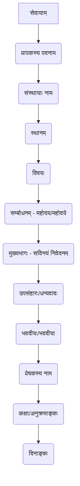

# Class 9 Sanskrit - Abhyasvan Chapter 102
**Language:** संस्कृतम्

```markdown
# [कक्षा ९] अभ्यासवान् - अध्यायः १०२ - पत्रलेखनम्

## 🌟 मूलाधाराः (Core Concepts)

अस्मिन् अध्याये **पत्रलेखनस्य** कला अभ्यस्यते। पत्रलेखनम् मुख्यतया द्विविधम् भवति:

1.  **अनौपचारिकम् पत्रम् (Informal Letter):**
    *   **प्रयोजनम्:** कुटुम्बिजनेभ्यः, मित्रेभ्यः, प्रियजनेभ्यः च लिख्यते।
    *   **भाषा:** सरला, स्नेहपूर्णा, भावाभिव्यक्तिप्रधाना च भवति।
    *   **विषयाः (उदाहरणानि):**
        *   योगदिवसे सहभागिता (पत्रम् १)
        *   शैक्षणिकभ्रमणाय अनुमतिः धनयाचना च (पितरं प्रति) (पत्रम् ३)
        *   पर्वतीयस्थलस्य सौन्दर्यवर्णनम् (मित्रं प्रति) (पत्रम् ४)
        *   'ई-मनी' इत्यस्य महत्वम् (पितरं प्रति) (पत्रम् ६)
        *   अतिविश्वासस्य दुष्परिणामः (मित्रं प्रति) (पत्रम् ७)
        *   योगस्य महत्वम् (मित्रं प्रति) (पत्रम् ८)
        *   परीक्षायां सफलतायाः सूचना (मित्रं प्रति) (पत्रम् ९)
        *   अतिवृष्ट्याः कष्टवर्णनम् (मित्रं प्रति) (पत्रम् १०)
    *   **मुख्य-अङ्गानि:**
        *   प्रेषकस्य स्थानम्, दिनाङ्कः
        *   सम्बोधनम् (उदा. प्रिय अनुज, प्रिय मित्र)
        *   अभिवादनम्/नमस्कारः (उदा. सस्नेहं नमो नमः)
        *   कुशलप्रश्नः, स्वकुशलकथनम्
        *   मुख्यविषयस्य विस्तारः
        *   उपसंहारः, शुभकामनाः
        *   प्रेषकस्य सम्बन्धः नाम च (उदा. तव अग्रजः, भवतः मित्रम्)

2.  **औपचारिकम् पत्रम् (Formal Letter):**
    *   **प्रयोजनम्:** विद्यालयेषु, कार्यालयेषु, अधिकारिभ्यः च लिख्यते।
    *   **भाषा:** विनयान्विता, स्पष्टा, संक्षिप्त च भवति।
    *   **विषयाः (उदाहरणानि):**
        *   अवकाशार्थं प्रार्थना (रुग्णता, विवाहः इत्यादि कारणतः) (पत्रम् १(ख), २, अभ्यासः)
        *   दण्डशुल्कक्षमापनार्थं प्रार्थना (पत्रम् ५)
    *   **मुख्य-अङ्गानि:**
        *   'सेवायाम्' इति पदम्
        *   प्रापकस्य पदनाम, संस्थायाः नाम, स्थानम्
        *   विषयः (संक्षेपेण)
        *   सम्बोधनम् (उदा. श्रीमन्तः प्राचार्याः, महोदयाः)
        *   सविनयं निवेदनम् (मुख्यभागः)
        *   धन्यवादज्ञापनम्
        *   भवदीयः/भवदीया (उदा. भवताम् आज्ञाकारी छात्रः/शिष्यः)
        *   प्रेषकस्य नाम, कक्षा, अनुक्रमाङ्कः, दिनाङ्कः

📊 **पत्रप्रकारयोः तुलना (Comparison of Letter Types):**

| वैशिष्ट्यम्        | अनौपचारिकम् पत्रम्                 | औपचारिकम् पत्रम्                     |
| :--------------- | :-------------------------------- | :----------------------------------- |
| **प्रेष्यः**      | मित्राणि, कुटुम्बिनः              | अधिकारिणः, प्राचार्याः              |
| **भाषा/शैली**    | सरला, भावात्मिका, विस्तृताऽपि   | विनयान्विता, स्पष्टा, संक्षिप्ता      |
| **उद्देश्यम्**     | कुशलक्षेमः, सूचनादानम्, वर्णनम् | निवेदनम्, प्रार्थना, आवेदनम्          |
| **सम्बोधनम्**     | प्रिय, पूज्य                       | श्रीमन्तः, महोदय/महोदये             |
| **समापनम्**       | तव/भवतः मित्रम्/पुत्रः/अग्रजः    | भवदीयः/भवदीया आज्ञाकारी छात्रः/शिष्यः |

## 📘 मुख्य-अधिगमबिन्दवः (Key Learnings)

1.  **पत्रस्य प्रारूपज्ञानम्:** औपचारिक-अनौपचारिकपत्रयोः भिन्नं प्रारूपं सम्यक् अवगन्तव्यम्। कुत्र किं लेखनीयम् (स्थानम्, दिनाङ्कः, सम्बोधनम्, विषयः, समापनम् इत्यादि) इति ज्ञातव्यम्।
2.  **समुचित-शब्दावली-चयनम्:** पत्रस्य प्रकारानुसारं (औपचारिकम्/अनौपचारिकम्) तथा च प्रापकानुसारं (मित्रम्/पिता/प्राचार्यः) समुचितशब्दानां, सम्बोधनानां, समापनवाक्यानां च प्रयोगः करणीयः।
3.  **भाषायाः स्पष्टता शुद्धता च:** पत्रस्य भाषा सरला, स्पष्टा, व्याकरणदृष्ट्या शुद्धा च भवेत्। वाक्यरचना सुगमा स्यात्।
4.  **विषयस्य प्रस्तुतिः:** मुख्यविषयः क्रमेण, स्पष्टतया च प्रस्तुतव्यः। औपचारिके पत्रे संक्षिप्तता आवश्यकी, अनौपचारिके पत्रे विस्तरः अपि भवितुम् अर्हति।
5.  **विभिन्नविषयेषु पत्रलेखन-अभ्यासः:** पाठ्यपुस्तके दत्तानि उदाहरणानि अभ्यस्य, छात्राः अवकाशः, शुल्कक्षमापनम्, योगदिवसः, 'ई-मनी', भ्रमणवर्णनम्, परीक्षापरिणामः इत्यादिषु विविधविषयेषु पत्रं लेखितुं समर्थाः भवेयुः।

📈 **औपचारिकपत्रस्य संरचना (Structure of a Formal Letter):**



## 🧩 सक्रिय-अधिगमः (Active Learning)

*   **गतिविधिः (Activity): शोध-आधारित-प्रकरण-विश्लेषणम् 🔍**
    *   **प्रकरणम्:** कल्पनां करोतु यत् भवतः क्षेत्रे जलप्रदूषणस्य समस्या अस्ति। अस्याः समस्यायाः निवारणार्थं नगरनिगमस्य स्वास्थ्य-अधिकारिणे एकम् औपचारिकं पत्रं लिखन्तु। (आवश्यकशब्दान्, समस्यायाः विवरणं च अन्तर्जालात्/पुस्तकालयात् संशोधयन्तु)।
    *   **उद्देश्यम्:** वास्तविकसमस्याम् आधारीकृत्य औपचारिकपत्रलेखनकौशलस्य विकासः, शोधप्रवृत्तेः प्रोत्साहनम् च। (Bloom's: Creating)
*   **चर्चा (Discussion): वास्तविक-प्रभावस्य आलोचनात्मक-विश्लेषणम् 🌍**
    *   **विषयः:** अद्यतने डिजिटल-युगे (यथा - ईमेल, व्हाट्सएप) अपि हस्तलिखितस्य/पारम्परिकस्य पत्रलेखनस्य (विशेषतः औपचारिकस्य) किं महत्त्वम् अवशिष्टम् अस्ति? 'ई-मनी' इत्यस्य उल्लेखः पत्रे (पत्रम् ६) कथं आधुनिकसन्दर्भं दर्शयति? अस्य लाभाः हानयः च के? चर्चां कुर्वन्तु। (Bloom's: Evaluating)

## 📝 मूल्याङ्कन-सिद्धता (Assessment Prep)

*   **प्रकरण-अध्ययनम् (Case Studies):**
    *   दत्तानि उदाहरणानि (यथा - योगदिवसपत्रम्, अवकाशपत्रम्, ई-मनीपत्रम्) पठित्वा तेषां प्रारूपं, भाषां, विषयप्रस्तुतिं च अवगच्छन्तु।
    *   अभ्यासार्थं दत्तानि पत्राणि (यथा - भगिन्याः/भ्रातुः विवाहार्थम् अवकाशपत्रम्, दण्डशुल्कक्षमापनपत्रम्) सम्यक् पूरयन्तु।
*   **मञ्जूषा-सहायतया पत्रपूरणम्:** परीक्षायां प्रायः मञ्जूषायां दत्तैः पदैः रिक्तस्थानानि पूरयित्वा पत्रं पूर्णं कर्तुं प्रश्नः भवति (यथा - पत्रम् ३, ७, ८, ९)। एतादृशानां प्रश्नानाम् अभ्यासः करणीयः।
*   **स्वतन्त्र-पत्रलेखनम्:** कञ्चित् विषयं स्वीकृत्य (यथा - मित्राय जन्मदिनस्य शुभकामनाः, पुस्तकप्रेषणाय प्रकाशकाय पत्रम्) स्वतन्त्ररूपेण औपचारिकम् अनौपचारिकं वा पत्रं लेखितुं सज्जाः भवन्तु।
*   **प्रारूपस्य महत्त्वम्:** पत्रस्य उचितं प्रारूपं (Format) स्मरन्तु। अङ्कानां विभाजने प्रारूपस्य अपि महत्त्वं भवति।

## 🌏 भारतीय-सन्दर्भः (Bharatiya Context)

1.  **योगदिवसः (Yoga Day):** पत्रम् १ योगदिवसस्य विषये अस्ति। संयुक्तराष्ट्रसंघेन (UNO) भारतस्य प्रस्तावेन जूनमासस्य एकविंशतितारिका 'अन्तर्राष्ट्रिययोगदिवसः' इति घोषिता। एतत् भारतस्य विश्वस्मै स्वास्थ्य-सांस्कृतिक-योगदानं दर्शयति। योगः स्वास्थ्यरक्षणस्य भारतीयः प्राचीनः उपायः अस्ति।
2.  **'ई-मनी' (E-Money):** पत्रम् ६ 'ई-मनी' इत्यस्य महत्त्वं वर्णयति। अद्यत्वे भारते डिजिटल-अर्थव्यवस्थायाः (Digital Economy) प्रचारः वर्धमानः अस्ति। 'ई-मनी', ATM कार्ड, ऑनलाइन-भुगतानम् (Online Payment), कूटसङ्केतः (QR Code - यद्यपि पत्रे 'कूटसंकेतम्' इति ATM PIN संदर्भे प्रयुक्तं स्यात्) इत्यादीनां प्रयोगः सर्वत्र दृश्यते। एतत् भारतसर्वकारस्य 'डिजिटल-इण्डिया' अभियानस्य अङ्गम् अस्ति।
3.  **कौटुम्बिक-सामाजिक-अवसराः:** भगिन्याः/भ्रातुः विवाहे सम्मिलितुम् अवकाशयाचना (पत्रम् २, अभ्यासः) भारतीयसमाजस्य महत्त्वपूर्णं पक्षं सूचयति, यत्र कौटुम्बिक-उत्सवेषु सहभागिता आवश्यकी मन्यते।
4.  **प्राकृतिक-आपदाः:** पत्रम् १० चेन्नईनगरे अतिवृष्ट्याः कारणात् उत्पन्नं कष्टं वर्णयति। भारते विभिन्नेषु प्रदेशेषु अतिवृष्टिः, अनावृष्टिः, भूकम्पः इत्यादयः प्राकृतिक-आपदाः जनजीवनं प्रभावितं कुर्वन्ति, येषां विषये जागरूकता आवश्यकी।
5.  **शैक्षणिक-भ्रमणम्:** पत्रम् ३ शैक्षणिक-भ्रमणस्य उल्लेखं करोति, यत् भारतीय-शिक्षा-व्यवस्थायाः अभिन्नम् अङ्गम् अस्ति, येन छात्राः प्रत्यक्षानुभवेन ज्ञानं प्राप्नुवन्ति।

```