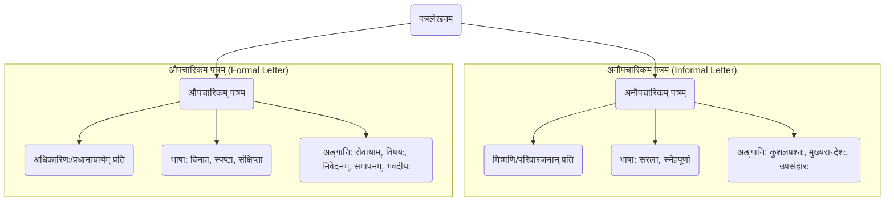

# Class 9 Sanskrit - Abhyasvan Chapter 102
**Language:** संस्कृतम्

```markdown
# [नवमी कक्षा] अभ्यासवान् - अध्यायः १०२ - पत्रलेखनम्

## 🌟 मूलाधाराः (Core Concepts)

पत्रलेखनम् ആശയവിനിമയस्य (communication) महत्त्वपूर्णं माध्यमम् अस्ति। अस्मिन् अध्याये वयं पत्रलेखनस्य प्रकारद्वयं पठामः - अनौपचारिकं पत्रम् औपचारिकं च पत्रम्।

**पत्रलेखनस्य वर्गीकरणम् 📊**



1.  **अनौपचारिकं पत्रम् (Informal Letter):**
    *   **उद्देश्यम्:** मित्राणि, परिवारजनान्, सम्बन्धिनः च प्रति लिख्यते।
    *   **भाषा:** सरला, भावात्मिका, स्नेहपूर्णा च भवति।
    *   **प्रमुखानि अङ्गानि:**
        *   प्रेषकस्य स्थानम्, दिनाङ्कः (Place, Date)
        *   सम्बोधनम् (प्रिय मित्र/अनुज/अग्रज etc.)
        *   अभिवादनम् (सस्नेहं नमोनमः/प्रणामाः etc.)
        *   कुशलप्रश्नः वार्ता च (अत्र कुशलं तत्रास्तु...)
        *   मुख्यः विषयः/सन्देशः (योगदिवसे सहभागिता, यात्रावर्णनम्, परीक्षापरिणामः etc.)
        *   उपसंहारः (शुभकामनाः, शेषं कुशलम्...)
        *   सम्बन्धनिर्देशः (भवतः मित्रम्/सुपुत्रः/अग्रजः etc.)
        *   प्रेषकस्य नाम

2.  **औपचारिकं पत्रम् (Formal Letter):**
    *   **उद्देश्यम्:** प्रधानाचार्यं, कार्यालयाधिकारिणः, सम्पादकं वा प्रति लिख्यते।
    *   **भाषा:** विनम्रा, स्पष्टा, विषयानुसारिणी, संक्षिप्ता च भवति।
    *   **प्रमुखानि अङ्गानि:**
        *   प्रेषकस्य सङ्केतः (आवश्यकतानुसारम्)
        *   दिनाङ्कः
        *   'सेवायाम्' इति पदम्
        *   प्रापकस्य पदनाम, सङ्केतः (Recipient's Designation, Address)
        *   'विषयः' (Subject) - स्पष्टः, संक्षिप्तः च
        *   सम्बोधनम् (महोदयः/महोदये/मान्यवराः etc.)
        *   मुख्यं निवेदनम् (कारणसहितम् - अवकाशार्थम्, शुल्कक्षमापनार्थम् etc.)
        *   प्रार्थना/समापनवाक्यानि
        *   'धन्यवादः'
        *   समापनसूचकम् (भवदीयः आज्ञाकारी छात्रः/शिष्यः, भवदीयः etc.)
        *   प्रेषकस्य नाम, कक्षा, अनुक्रमाङ्कः (आवश्यकतानुसारम्)

## 📘 मुख्याधिगमाः (Key Learnings)

अस्मिन् पाठे वयं विभिन्नप्रकारकाणां पत्राणां संरचनां लेखनशैलिं च जानीमः।

*   **अनौपचारिकपत्रस्य संरचना (Structure of Informal Letter) 📈:**
    *   **प्रारम्भः:** स्थानम्, दिनाङ्कः, प्रिय-(सम्बोधनम्), सस्नेहं नमः।
    *   **मध्यभागः:** कुशलप्रश्नः, पत्रलेखनस्य कारणं विस्तरेण (यथा - योगदिवसस्य वर्णनम्, कश्मीरयात्रायाः अनुभवः, 'ई-धनस्य' महत्त्वम्, अतिवृष्ट्याः चिन्ता)।
    *   **अन्तः:** परिवारजनेभ्यः प्रणामाः/स्नेहः, शुभकामनाः, पत्रोत्तरस्य प्रतीक्षा, भवदीयः/भवतः स्नेही (नाम)।
    *   *उदाहरणम्:* योगदिवसे अनुजस्य सहभागितां वर्णयत् अग्रजस्य पत्रम् (पृ. १३)।

*   **औपचारिकपत्रस्य संरचना (Structure of Formal Letter) 📈:**
    *   **प्रारम्भः:** 'सेवायाम्', प्रापकस्य पदनाम/सङ्केतः, विषयः, 'महोदयः/महोदये'।
    *   **मध्यभागः:** सविनयं निवेदनम्, पत्रलेखनस्य कारणं स्पष्टतया (यथा - रुग्णताकारणात् अवकाशः, भगिन्याः/भ्रातुः विवाहे गमनाय अवकाशः, दण्डशुल्कक्षमापनम्)।
    *   **अन्तः:** प्रार्थना (अवकाशं प्रदाय अनुगृह्णन्तु/शुल्कं क्षमयित्वा अनुगृह्णन्तु), 'धन्यवादः', भवदीयः आज्ञाकारी छात्रः/शिष्यः, नाम, कक्षा, दिनाङ्कः।
    *   *उदाहरणम्:* अस्वस्थताकारणात् अवकाशार्थं प्रधानाचार्यं प्रति प्रार्थनापत्रम् (पृ. १५)।

*   **भाषाप्रयोगः:** अनौपचारिकपत्रेषु भावाः प्रमुखाः, औपचारिकपत्रेषु तु विनम्रता नियमपालनं च।

*   **मञ्जूषायाः प्रयोगः:** दत्तानां शब्दानां सहायतया रिक्तस्थानानि पूरयित्वा पत्रं सम्पूर्णं कर्तुं सामर्थ्यम् (यथा - पृ. १७, २१, २२)।

## 🧩 सक्रिय-अधिगमः (Active Learning)

*   **क्रियाकलापः (Activity): शोध-आधारित-विश्लेषणम् 🔍**
    *   **विषयः:** 'ई-धनम्' (Digital Money) अथवा 'अङ्कीय-भुक्तिः' (Digital Payment) भारतदेशे।
    *   **कार्यम्:** भारतसर्वकारस्य 'Digital India' इति अभियानस्य अन्तर्गतं 'ई-धनस्य' (यथा - UPI, Net Banking, Mobile Wallets) प्रयोगस्य लाभान्, समाजोपरि तस्य प्रभावान् च अधिकृत्य शोधं कुर्वन्तु। ततः स्वपितरं/मातरं प्रति 'ई-धनस्य' उपयोगितां महत्त्वं च वर्णयन्तः एकम् अनौपचारिकं पत्रं लिखन्तु (यथा - पृ. १९-२० आदर्शपत्रम्)। अस्मिन् पत्रे सुरक्षा (safety), सुलभता (convenience), पारदर्शिता (transparency) इत्यादीन् पक्षान् समावेशयन्तु।

*   **चर्चा (Discussion): वास्तविक-प्रभावस्य आलोचनात्मक-विश्लेषणम् 🌍**
    *   **विषयः:** प्राकृतिक-आपदाः (Natural Disasters) जनजीवनप्रभावश्च।
    *   **कार्यम्:** पाठे उल्लिखितस्य चेन्नईनगरे अतिवृष्ट्याः (पृ. २२-२३) उदाहरणम् आधारीकृत्य, चर्चां कुर्वन्तु यत् एतादृश्यः प्राकृतिक-आपदाः (यथा - जलप्लावनम्, भूकम्पः, चक्रवातः) कथं सामान्यं जनजीवनं (स्वास्थ्यम्, यातायातम्, अर्थव्यवस्था) प्रभावयन्ति। भारतस्य के अन्ये प्रदेशाः एताभिः आपदाभिः प्रभाविताः सन्ति? एतादृश्यां स्थितौ वयं कथं साहाय्यं कर्तुं शक्नुमः? सर्वकारस्य किं दायित्वम्?

## 📝 मूल्याङ्कनसिद्धता (Assessment Prep)

*   **प्रकरण-अध्ययनम् (Case Studies) 📝:**
    1.  **स्थितिः:** भवान्/भवती विद्यालयस्य क्रीडा-प्रतियोगितायां भागं ग्रहीतुं नगरान्तरं गच्छति। एतदर्थम् अनुमतिं, यात्राव्ययार्थं धनं च याचमानः स्वपितरं प्रति पत्रं लिखतु।
    2.  **स्थितिः:** भवतः/भवत्याः क्षेत्रे जलस्य अभावः अस्ति, येन जनाः कष्टम् अनुभवन्ति। अस्याः समस्यायाः निवारणार्थं नगरनिगमस्य आयुक्तं प्रति एकम् औपचारिकं पत्रं लिखतु।
    3.  **स्थितिः:** भवतः/भवत्याः मित्रं परीक्षायां सफलं जातम्। तस्मै/तस्यै वर्धापनं (congratulations) यच्छन्/यच्छन्ती एकम् अनौपचारिकं पत्रं लिखतु।

*   **आरेखाः (Diagrams) 📝:**
    *   औपचारिकपत्रस्य प्रारूपम् आरेखयन्तु (Draw the format) तथा च तस्य मुख्यभागान् (यथा - सेवायाम्, विषयः, सम्बोधनम्, मुख्यभागः, समापनम्, भवदीयः) नामाङ्कयन्तु (label)।
    *   अनौपचारिकपत्रस्य सामान्यप्रवाहम् (flow) एकस्मिन् प्रवाहचित्रे (flowchart) दर्शयन्तु।

## 🌏 भारतीय-सन्दर्भः (Bharatiya Context)

अस्मिन् पाठे उल्लिखिताः विषयाः भारतीय-सामाजिक-आर्थिक-सांस्कृतिक-परिवेशेन सह सम्बद्धाः सन्ति।

1.  **अन्ताराष्ट्रियः योगदिवसः (International Yoga Day):** (पृ. १३) भारतस्य प्रस्तावेन संयुक्तराष्ट्रसङ्घेन प्रतिवर्षं जूनमासस्य २१ दिनाङ्कः 'अन्ताराष्ट्रिययोगदिवसः' इति घोषितः। एतत् भारतस्य विश्वस्मै स्वास्थ्य-आध्यात्मिक-योगदानस्य प्रतीकम् अस्ति। देशे सर्वत्र, विशेषतः विद्यालयेषु, योगस्य अभ्यासाय प्रोत्साहनं दीयते।
2.  **'ई-धनम्' तथा अङ्कीय-भारतम् (E-Money and Digital India):** (पृ. १९-२०) भारतसर्वकारः 'अङ्कीय-अर्थव्यवस्थां' (Digital Economy) प्रोत्साहयति। 'ई-धनस्य' माध्यमेन (यथा - UPI, भीम-एप, नेट-बैङ्किङ्ग्) विना रोकडेन (cashless) व्यवहारः सरलः सुरक्षितः च भवति। एतेन भ्रष्टाचारस्य न्यूनता, पारदर्शितायाः वृद्धिः च अपेक्ष्यते। ATM-कार्डस्य प्रयोगः, कूटसङ्केतः (PIN/Code) च अङ्कीय-व्यवहारस्य भागाः सन्ति।
3.  **प्राकृतिक-आपदाः प्रबन्धनं च (Natural Disasters and Management):** (पृ. २२-२३) भारतस्य अनेके भागाः अतिवृष्टिः, जलप्लावनम् (यथा - चेन्नै, केरलम्, असम), भूकम्पः, चक्रवातः इत्यादिभिः प्राकृतिक-आपदाभिः ग्रस्ताः भवन्ति। एताः घटनाः जनजीवनं यातायातं च बाधन्ते। राष्ट्रिय-आपदा-प्रबन्धन-प्राधिकरणम् (NDMA) एतासां निवारणाय तत्परम् अस्ति। पत्रलेखनेन एतादृशीषु स्थितिषु साहाय्ययाचना अथवा संवेदना प्रकटयितुं शक्यते।
4.  **शैक्षणिक-भ्रमणम् (Educational Tours):** (पृ. १७-१८) भारतीय-विद्यालयेषु छात्राणां ज्ञानाय अनुभवाय च शैक्षणिक-भ्रमणस्य आयोजनं सामान्यम् अस्ति। एतेन छात्राः देशस्य इतिहासम्, संस्कृतिं, भूगोलं च प्रत्यक्षतया अवगच्छन्ति। एतदर्थम् अभिभावकानाम् अनुमतिः आर्थिक-व्यवस्था च आवश्यकी भवति, यदर्थं पत्रलेखनम् उपयोगी।

*(समाप्तम्)*
```