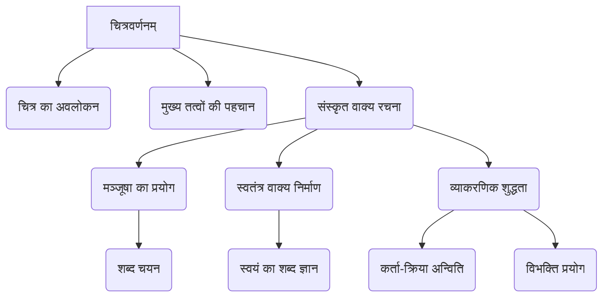
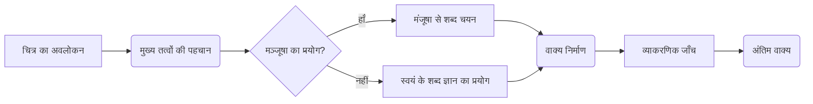

# Class 9 Sanskrit - Abhyasvan Chapter 103
**Language:** हिंदी

```markdown
# [कक्षा 9] अभ्यासवान् भव - अध्याय (चित्रवर्णनम्)

*(नोट: प्रदान की गई सामग्री अभ्यास पुस्तिका "अभ्यासवान् भव" के पृष्ठ 24-33 से है, जिसमें चित्र-वर्णन के अभ्यास दिए गए हैं। इसे अध्याय 103 के रूप में संदर्भित किया गया है, हालांकि यह पुस्तक में एक विशिष्ट क्रमांकित अध्याय न होकर एक कौशल-आधारित खंड है।)*

## 🌟 मुख्य अवधारणाएँ (Core Concepts)

1.  **चित्रवर्णनम् (Picture Description):**
    *   किसी दिए गए चित्र को देखकर उसे समझना।
    *   चित्र में दिख रही वस्तुओं, व्यक्तियों, क्रियाओं और भावों को पहचानना।
    *   पहचाने गए तत्वों के आधार पर सरल संस्कृत वाक्यों की रचना करना।
2.  **मञ्जूषा (Helper Box):**
    *   चित्र वर्णन में सहायता के लिए प्रदान किए गए शब्दों का समूह।
    *   मंजूषा से उपयुक्त शब्दों (संज्ञा, सर्वनाम, क्रिया, विशेषण, अव्यय) का चयन करना।
    *   शब्दों को सही विभक्ति और वचन में प्रयोग करना।
3.  **वाक्य-संरचना (Sentence Construction):**
    *   सरल संस्कृत वाक्यों का निर्माण (कर्ता, कर्म, क्रिया)।
    *   कर्ता और क्रिया के बीच पुरुष और वचन का सही मेल (अन्विति)।
    *   उचित विभक्तियों का प्रयोग।
    *   विशेषण-विशेष्य का प्रयोग।
    *   अव्यय पदों का प्रयोग।
4.  **स्वेच्छया वाक्य-निर्माण:**
    *   मंजूषा के शब्दों पर निर्भर न रहकर, अपने शब्द-ज्ञान का प्रयोग करके भी वाक्य बनाने की स्वतंत्रता और क्षमता।

📊 **अवधारणा पदानुक्रम:**


## 📘 प्रमुख सीख (Key Learnings)

इस खंड में छात्र सीखते हैं:

1.  **अवलोकन कौशल:** चित्र को ध्यान से देखकर उसमें निहित जानकारी (व्यक्ति, वस्तु, स्थान, क्रिया, भाव) को क्रमबद्ध तरीके से समझना।
2.  **शब्दावली चयन:**
    *   चित्र के संदर्भ में उपयुक्त संस्कृत शब्दों को याद करना या मंजूषा से चुनना।
    *   संज्ञा, क्रिया, विशेषण आदि शब्दों की पहचान करना।
    *   **उदाहरण:** उद्यान के चित्र (अभ्यास 1) के लिए 'उद्यानम्', 'बालक:', 'क्रीडति', 'वृक्षा:', 'पुष्पाणि' जैसे शब्द।
3.  **सरल वाक्य निर्माण:**
    *   छोटे और स्पष्ट संस्कृत वाक्य बनाना।
    *   **प्रक्रिया:**
        1.  चित्र देखो (Observe) 🖼️
        2.  मुख्य बातें पहचानो (Identify) 🤔
        3.  शब्द चुनो (Select Words - मंजूषा/स्वयं) 📝
        4.  व्याकरण अनुसार वाक्य बनाओ (Form Sentences) ✅
    *   **उदाहरण (अभ्यास 1):**
        *   `कर्ता` (बालकः) + `क्रिया` (खेलति) = `बालकः खेलति।` (लड़का खेलता है।)
        *   `अत्र` (यहाँ) + `अनेके` (अनेक) + `वृक्षाः` (पेड़) + `सन्ति` (हैं) = `अत्र अनेके वृक्षाः सन्ति।` (यहाँ अनेक पेड़ हैं।)
4.  **व्याकरणिक सटीकता:**
    *   कर्ता के पुरुष और वचन के अनुसार क्रिया का सही रूप प्रयोग करना। (जैसे - `बालकः पठति`, `बालकाः पठन्ति`)
    *   शब्दों में उचित विभक्ति और वचन लगाना। (जैसे - `वृक्षे फलानि सन्ति` - पेड़ *पर* फल हैं)
5.  **लचीलापन:** यह समझना कि मंजूषा केवल सहायता के लिए है, उसका प्रयोग अनिवार्य नहीं है। छात्र अपनी क्षमतानुसार स्वतंत्र वाक्य भी बना सकते हैं।

📈 **चित्र वर्णन प्रक्रिया:**


## 🧩 सक्रिय अधिगम (Active Learning)

1.  **गतिविधि (Activity):**
    *   **अभ्यास आधारित:** दिए गए 10 चित्रों का वर्णन मंजूषा की सहायता से और फिर बिना मंजूषा के करने का प्रयास करें।
    *   **विस्तारित गतिविधि:** अपने आस-पास के वातावरण (जैसे कक्षा, खेल का मैदान, घर) या हाल ही में देखे गए किसी स्थान/उत्सव का चित्र बनाकर या चुनकर उसका संस्कृत में पांच वाक्यों में वर्णन करें।
2.  **चर्चा (Discussion):**
    *   **विश्लेषण:** विभिन्न चित्रों (जैसे - ईद, क्रिसमस, गणतंत्र दिवस, महाभारत) में दर्शाए गए भारतीय समाज और संस्कृति के पहलुओं पर चर्चा करें। इन चित्रों से हमें भारत की विविधता के बारे में क्या पता चलता है?
    *   **महत्व:** संस्कृत में वर्णनात्मक लेखन कौशल (जैसे चित्र वर्णन) का क्या महत्व है? यह भाषा सीखने में कैसे मदद करता है?

## 📝 मूल्यांकन तैयारी (Assessment Prep)

1.  **प्रश्न प्रारूप:** परीक्षा में सामान्यतः एक चित्र दिया जाता है, जिसके साथ एक मंजूषा (सहायक शब्द सूची) होती है। छात्रों को उस चित्र के आधार पर मंजूषा की सहायता से या स्वतंत्र रूप से 5 सार्थक और व्याकरण की दृष्टि से शुद्ध संस्कृत वाक्य लिखने होते हैं।
2.  **अभ्यास का महत्व:** पाठ्यपुस्तक में दिए गए सभी 10 अभ्यास इस प्रकार के प्रश्नों की तैयारी के लिए अत्यंत महत्वपूर्ण हैं। प्रत्येक चित्र विभिन्न प्रकार की शब्दावली और वाक्य संरचनाओं का अभ्यास करने का अवसर प्रदान करता है।
3.  **मूल्यांकन बिंदु:**
    *   वाक्यों की प्रासंगिकता (चित्र से संबंधित)।
    *   व्याकरणिक शुद्धता (कर्ता-क्रिया मेल, विभक्ति, वचन, लिंग)।
    *   शब्दों का उचित चयन और प्रयोग।
    *   वाक्य संरचना की स्पष्टता।

📝 **उदाहरण वाक्य (अभ्यास 5 - बाजार):**
1.  इदं शाकविपणेः चित्रम् अस्ति। (यह सब्जी मंडी का चित्र है।)
2.  अत्र एकः शाकविक्रेता अस्ति। (यहाँ एक सब्जी बेचने वाला है।)
3.  जनाः शाकानि क्रेतुम् आगच्छन्ति। (लोग सब्जियाँ खरीदने आते हैं।)
4.  विपणे कदली, आलुकम्, पलाण्डु इत्यादीनि शाकानि सन्ति। (मंडी में केला, आलू, प्याज आदि सब्जियाँ हैं।)
5.  अत्र बहु कोलाहलः भवति। (यहाँ बहुत शोर होता है।)

## 🌏 भारतीय संदर्भ (Bharatiya Context)

इस खंड के अभ्यास भारतीय जीवन और संस्कृति के विविध पहलुओं को दर्शाते हैं:

1.  **सामाजिक जीवन:** उद्यान (अभ्यास 1), खेल का मैदान (अभ्यास 2), बाजार (अभ्यास 5), सिनेमा हॉल (अभ्यास 9) जैसे चित्र सामान्य भारतीय सामाजिक जीवन और गतिविधियों को दिखाते हैं।
2.  **सांस्कृतिक और धार्मिक विविधता:**
    *   **महाभारत (अभ्यास 6):** भारतीय पौराणिक कथाओं और दर्शन (गीता उपदेश) का संदर्भ।
    *   **ईद (अभ्यास 7):** भारत में मुस्लिम समुदाय के प्रमुख त्योहार का चित्रण।
    *   **क्रिसमस (अभ्यास 8):** भारत में ईसाई समुदाय द्वारा मनाए जाने वाले त्योहार का चित्रण। यह भारत की धार्मिक सहिष्णुता और विविधता को दर्शाता है।
3.  **राष्ट्रीय पर्व:** गणतंत्र दिवस परेड (अभ्यास 10) का चित्र राष्ट्रीय गौरव और सैन्य शक्ति के प्रदर्शन से संबंधित है, जो एक महत्वपूर्ण राष्ट्रीय पर्व है।
4.  **कला और प्रदर्शन:** अभ्यास 3 का चित्र संभवतः किसी सांस्कृतिक नृत्य या प्रदर्शन को दर्शाता है, जो भारत की समृद्ध कला परंपरा का हिस्सा है।

📊 ये अभ्यास छात्रों को न केवल संस्कृत भाषा कौशल विकसित करने में मदद करते हैं, बल्कि उन्हें अपने परिवेश, समाज, संस्कृति और राष्ट्रीय महत्व के विषयों को संस्कृत में अभिव्यक्त करने के लिए भी तैयार करते हैं।
```