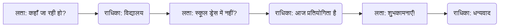

# Class 9 Sanskrit - Abhyasvan Chapter 104
**Language:** हिंदी

```markdown
# [कक्षा 9] अभ्यासवान् भव - अध्याय 104

## 🌟 मुख्य अवधारणाएँ (Core Concepts)

यह अध्याय संस्कृत भाषा में अभ्यास के माध्यम से दक्षता प्राप्त करने पर केंद्रित है। मुख्य अवधारणाएँ हैं:

1.  **संवाद-लेखनम् (Dialogue Writing/Completion):**
    *   दिए गए संदर्भ को समझना।
    *   `मञ्जूषा` (सहायता बॉक्स) से उपयुक्त वाक्यों का चयन करना।
    *   रिक्त स्थानों की पूर्ति कर सार्थक संवाद बनाना।
    *   दैनिक जीवन से जुड़े विषयों पर संस्कृत में वार्तालाप कौशल विकसित करना।

2.  **अनुच्छेद-बोधनम् एवं लेखनम् (Paragraph Comprehension & Writing):**
    *   संस्कृत गद्यांश (अनुच्छेद) को पढ़कर समझना।
    *   मुख्य विचारों को पहचानना।
    *   दिए गए विषय पर सरल संस्कृत वाक्यों में अपने विचार लिखना।
    *   श्रवण एवं भाषण कौशल का विकास (`श्रवण-भाषण-कौशल-विकासाथर्यम्`)।

3.  **व्याकरणिक प्रयोग (Grammatical Application):**
    *   वाक्य निर्माण में `शब्दरूप` (noun forms) और `धातुरूप` (verb forms) का सही प्रयोग (अप्रत्यक्ष रूप से अभ्यास)।
    *   लिंग, वचन, पुरुष और काल के अनुसार शब्दों का चयन।

4.  **विषय-वस्तु (Themes):**
    *   व्यक्तिगत परिचय (`मम परिचयः`)
    *   सामाजिक मुद्दे: पर्यावरण प्रदूषण (`पर्यावरण-प्रदूषणम्`), स्वच्छता (`स्वच्छता`), अनुशासन (`अनुशासनम्`)
    *   आर्थिक/सरकारी नीतियाँ: विमुद्रीकरण (`विमुद्रीकरणम्`)
    *   शैक्षणिक जीवन: परीक्षा (`परीक्षा`), भविष्य की योजनाएँ (career goals), प्रतियोगिताएँ (competitions)
    *   दैनिक जीवन: भोजन (`अल्पाहारः`), स्वास्थ्य (`स्वास्थ्यम्`)

📊 **अवधारणा पदानुक्रम:**
*   भाषा कौशल विकास (Language Skill Development)
    *   संवाद कौशल (Conversational Skills)
        *   संदर्भ समझना (Understanding Context)
        *   वाक्य चयन (Sentence Selection - `मञ्जूषा`)
        *   संवाद पूर्ति (Dialogue Completion)
    *   लेखन एवं बोधन कौशल (Writing & Comprehension Skills)
        *   अनुच्छेद बोधन (Paragraph Comprehension)
        *   अनुच्छेद लेखन (Paragraph Writing)
        *   विचार अभिव्यक्ति (Expressing Thoughts)
    *   व्याकरणिक सटीकता (Grammatical Accuracy)
        *   शब्दरूप/धातुरूप प्रयोग (Noun/Verb Form Usage)

## 📘 मुख्य शिक्षाएँ (Key Learnings)

इस अध्याय से छात्र सीखते हैं:

1.  **संवाद कैसे पूरा करें:**
    *   संवाद के प्रवाह और पात्रों के बीच के संबंध को समझें।
    *   `मञ्जूषा` में दिए गए वाक्यों का अर्थ समझें।
    *   प्रश्न और उत्तर, या कथन और प्रतिक्रिया के बीच तार्किक संबंध स्थापित करें।
    *   **उदाहरण:** लता पूछती है, "...कुत्र गन्तुं सन्नद्धा?" (कहाँ जाने को तैयार हो?) राधिका का उत्तर (मञ्जूषा से) होना चाहिए जो किसी स्थान पर जाने का संकेत दे, जैसे "अहं विद्यालयं गच्छामि।" (मैं विद्यालय जा रही हूँ।)

2.  **अनुच्छेद कैसे समझें और लिखें:**
    *   अनुच्छेद का मुख्य विषय पहचानें (जैसे, प्रदूषण, अनुशासन)।
    *   मुख्य बिंदुओं और सहायक विवरणों को रेखांकित करें।
    *   सरल संस्कृत वाक्यों का प्रयोग करके अपने विचार व्यक्त करें।
    *   दिए गए निर्देशों (`निर्देश:`) का पालन करें - जैसे चर्चा करना, लिखना।

3.  **विभिन्न विषयों पर संस्कृत शब्दावली:**
    *   प्रदूषण: `प्रदूषणम्`, `वातावरणम्`, `विषाक्तानि तत्त्वानि`, `धूमः`, `स्वास्थ्योपरि दुष्प्रभावः`
    *   शिक्षा/करियर: `परीक्षा`, `श्लोकोच्चारण-प्रतियोगिता`, `चिकित्साविज्ञानम्`, `अभियन्त्रविज्ञानम्`, `जीवनलक्ष्यम्`
    *   सामाजिक व्यवहार: `अनुशासनम्`, `स्वच्छता`, `अवकरः` (कचरा), `सहयोगः`
    *   आर्थिक घटना: `विमुद्रीकरणम्`, `कृष्णधनम्`, `वित्तकोशः` (बैंक)

📈 **संवाद प्रवाह चित्र (उदाहरण):**


## 🧩 सक्रिय अधिगम (Active Learning)

*   **गतिविधि (Activity):**
    1.  **संवाद अभ्यास:** छात्रों को जोड़ी में बैठाकर दिए गए संवादों का अभिनय करने को कहें।
    2.  **अनुच्छेद लेखन:** छात्र `मम परिचयः` के नमूने के आधार पर अपना परिचय संस्कृत में लिखें।
    3.  **शोध-आधारित केस स्टडी विश्लेषण (Research-based case study analysis):** छात्र 'पर्यावरण-प्रदूषणम्' अनुच्छेद को आधार बनाकर अपने शहर/क्षेत्र में प्रदूषण की स्थिति (केस स्टडी) पर जानकारी एकत्र करें और संस्कृत में समाधानों पर चर्चा (विश्लेषण) करें। 🔍
    4.  **रचनात्मक लेखन:** छात्र अपनी परीक्षा की भावनाओं या अपने जीवन लक्ष्य पर एक छोटा संस्कृत अनुच्छेद लिखें।

*   **चर्चा (Discussion):**
    1.  **अनुशासन का महत्व:** 'अनुशासनम्' अनुच्छेद पढ़ने के बाद कक्षा में अनुशासन के लाभ और दैनिक जीवन में इसके पालन पर चर्चा करें।
    2.  **विमुद्रीकरण का प्रभाव:** 'विमुद्रीकरणम्' अनुच्छेद के आधार पर इसके सकारात्मक और नकारात्मक प्रभावों का आलोचनात्मक विश्लेषण करें। पक्ष और विपक्ष में तर्क दें। 🌍
    3.  **स्वच्छता अभियान:** 'स्वच्छता' पर आधारित संवाद (संवाद 10) के संदर्भ में, अपने विद्यालय और आसपास के क्षेत्र को स्वच्छ रखने के लिए छात्र क्या कर सकते हैं, इस पर विचार-विमर्श करें।
    4.  **स्वस्थ भोजन बनाम जंक फ़ूड:** संवाद 7 के आधार पर संतुलित आहार के महत्व और जंक फ़ूड के दुष्प्रभावों पर चर्चा करें।

## 📝 मूल्यांकन तैयारी (Assessment Prep)

*   **अभ्यास प्रश्न:**
    *   `मञ्जूषा` की सहायता से संवादों को पूरा करने वाले प्रश्न।
    *   दिए गए अनुच्छेदों पर आधारित बोध प्रश्न (प्रश्न निर्माण, उत्तर लेखन)।
    *   दिए गए विषयों (जैसे 'मम विद्यालयः', 'अनुशासनस्य महत्त्वम्', 'पर्यावरणम्') पर 5-7 वाक्यों में अनुच्छेद लेखन।
*   **केस स्टडीज और डायग्राम (Case studies & diagrams):**
    *   **केस स्टडी:** 'पर्यावरण-प्रदूषणम्' (दिल्ली प्रदूषण) या 'विमुद्रीकरणम्' को केस स्टडी के रूप में प्रयोग कर विश्लेषण और चर्चा आधारित प्रश्न पूछे जा सकते हैं। 📝
    *   **डायग्राम/माइंड मैप:** छात्र प्रदूषण के कारण और प्रभाव, या अनुशासन के लाभों पर माइंड मैप बना सकते हैं।
*   **महत्वपूर्ण शब्दावली:** अध्याय में प्रयुक्त नए और महत्वपूर्ण संस्कृत शब्दों का अर्थ और प्रयोग याद रखें।

## 🌏 भारतीय संदर्भ (Bharatiya Context)

यह अध्याय कई समकालीन भारतीय संदर्भों को छूता है:

1.  **पर्यावरण प्रदूषण:** विशेष रूप से दिल्ली (`देहल्याः वातावरणम्`) में वायु प्रदूषण की गंभीर समस्या का उल्लेख, जो भारत के कई शहरों की वास्तविकता है। पराली जलाना (`पलालस्य ज्वालनम्`) भी एक प्रासंगिक मुद्दा है। 📊
2.  **विमुद्रीकरण (Demonetisation):** 2016 में भारत सरकार द्वारा लागू की गई एक प्रमुख आर्थिक नीति (`विमुद्रीकरणम्`) का परिचय और उसके कथित उद्देश्यों (जैसे `कृष्णधनम्` पर रोक) और प्रभावों पर चर्चा। यह एक महत्वपूर्ण राष्ट्रीय आर्थिक घटना है।
3.  **स्वच्छ भारत अभियान:** संवाद 10 और अनुच्छेद 2 (प्रदूषण) अप्रत्यक्ष रूप से भारत सरकार के 'स्वच्छ भारत अभियान' जैसे प्रयासों और नागरिक जिम्मेदारी के महत्व को दर्शाते हैं।
4.  **शिक्षा और करियर:** भारतीय छात्रों के बीच लोकप्रिय करियर विकल्प जैसे चिकित्सा (`चिकित्साविज्ञानम्`) और इंजीनियरिंग (`अभियन्त्रविज्ञानम्`) का उल्लेख। विदेश जाने की इच्छा बनाम स्वदेश सेवा (`स्वदेशं प्रति स्वकर्तव्यस्य उपेक्षा न करणीया`) पर चर्चा भी प्रासंगिक है।
5.  **कला और संस्कृति:** मधुबनी चित्रकला (`मधुबनीचित्रकला`) जैसे पारंपरिक भारतीय कला रूपों का उल्लेख, कुटीर उद्योग (`कुटीरोद्योगम्`) से जोड़कर।
6.  **कृषि:** कृषि विज्ञान (`कृषिविज्ञानम्`) को करियर विकल्प के रूप में देखना और सरकारी पहल जैसे भूमि स्वास्थ्य पत्र (`भूमिस्वास्थ्यपत्रम्` - Soil Health Card) का उल्लेख आधुनिक भारतीय कृषि संदर्भों को दर्शाता है। 📊

यह अध्याय संस्कृत भाषा के अभ्यास को समकालीन भारतीय सामाजिक, आर्थिक और पर्यावरणीय वास्तविकताओं से जोड़ता है।
```