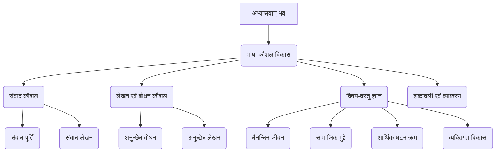
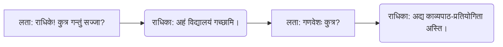
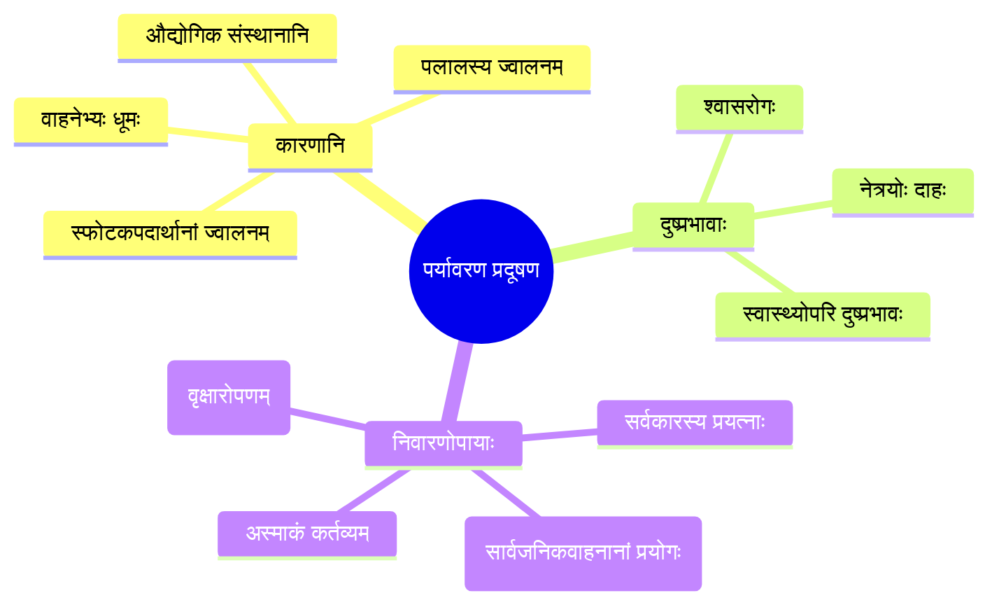

# Class 9 Sanskrit - Abhyasvan Chapter 104
**Language:** हिंदी

```markdown
# [कक्षा 9] अभ्यासवान् भव - अध्याय 104

## 🌟 मुख्य अवधारणाएँ (Core Concepts)

यह अध्याय छात्रों को संस्कृत में संवाद करने और अनुच्छेद समझने तथा लिखने के कौशल विकसित करने पर केंद्रित है। इसमें निम्नलिखित मुख्य अवधारणाएँ शामिल हैं:

1.  **संवाद-लेखन एवं पूर्ति (Dialogue Writing & Completion):**
    *   दिए गए वाक्यों (मञ्जूषा से) का प्रयोग कर अधूरे संवादों को पूरा करना।
    *   विभिन्न परिस्थितियों (जैसे - विद्यालय जाना, प्रदूषण पर चर्चा, भविष्य की योजनाएँ) में संस्कृत में बातचीत करना।
    *   स्वयं के संवादों की रचना करना (अभ्यास 11)।
2.  **अनुच्छेद-बोधन एवं लेखन (Paragraph Comprehension & Writing):**
    *   दिए गए संस्कृत अनुच्छेदों को पढ़कर समझना।
    *   मुख्य विचारों और सहायक विवरणों की पहचान करना।
    *   विभिन्न विषयों पर अपने विचार संस्कृत में लिखना (जैसे - स्व-परिचय, प्रदूषण, अनुशासन, विमुद्रीकरण, परीक्षा)।
3.  **विषय-वस्तु (Themes):**
    *   **दैनन्दिन जीवन (Daily Life):** विद्यालय, प्रतियोगिताएँ, भोजन, स्वास्थ्य।
    *   **सामाजिक मुद्दे (Social Issues):** पर्यावरण प्रदूषण (`पर्यावरण-प्रदूषणम्`), स्वच्छता (`स्वच्छता`), अनुशासन (`अनुशासनम्`)।
    *   **आर्थिक घटनाक्रम (Economic Event):** विमुद्रीकरण (`विमुद्रीकरणम्`)।
    *   **व्यक्तिगत विकास (Personal Development):** करियर विकल्प, आत्म-अभिव्यक्ति, परीक्षा का तनाव।
4.  **भाषा कौशल (Language Skills):**
    *   संस्कृत शब्दावली का विस्तार।
    *   वाक्य संरचना (`वाक्य-संरचना`) और शब्दरूप/धातुरूप का सही प्रयोग।

📊 **अवधारणा पदानुक्रम (Concept Hierarchy):**



## 📘 मुख्य सीख (Key Learnings)

इस अध्याय से छात्र निम्नलिखित बातें सीखते हैं:

1.  **संवाद कैसे पूरा करें:** छात्र सीखते हैं कि बातचीत के संदर्भ को समझकर `मञ्जूषा` (सहायता बॉक्स) में दिए गए वाक्यों का सही क्रम में प्रयोग करके संवाद को तार्किक रूप से कैसे पूरा किया जाए।
    *   *उदाहरण:* संवाद 4 में, प्रदूषण की गंभीर स्थिति (`गभीरा सञ्जाता`) के संदर्भ में विद्यालय में अवकाश (`अवकाशः घोषितः`) की बात को जोड़ना।
2.  **अनुच्छेद कैसे समझें और लिखें:** छात्र छोटे संस्कृत अनुच्छेदों को पढ़कर उनका मुख्य भाव समझना सीखते हैं। वे दिए गए निर्देशों के अनुसार अपने विचार भी संस्कृत में लिखना सीखते हैं।
    *   *उदाहरण:* `पर्यावरण-प्रदूषणम्` अनुच्छेद (2) पढ़कर दिल्ली में प्रदूषण के कारण (वाहनों का धुआँ, पराली जलाना) और प्रभाव (श्वास रोग, आँखों में जलन) समझना।
3.  **महत्वपूर्ण सामाजिक और आर्थिक मुद्दों पर चर्चा:** अध्याय छात्रों को समसामयिक विषयों जैसे पर्यावरण प्रदूषण और विमुद्रीकरण पर संस्कृत में सोचने और चर्चा करने के लिए प्रेरित करता है।
    *   *प्रदूषण:* कारण, प्रभाव और समाधान पर विचार करना (संवाद 4, अनुच्छेद 2)।
    *   *विमुद्रीकरण:* इसके उद्देश्य (काला धन - `कृष्णधनम्`) और प्रभाव पर विचार-विमर्श करना (अनुच्छेद 4)।
4.  **अनुशासन का महत्व:** छात्र सीखते हैं कि जीवन में अनुशासन (`अनुशासनम्`) व्यक्तित्व विकास, समय पालन और लक्ष्य प्राप्ति के लिए क्यों आवश्यक है (अनुच्छेद 3)।
5.  **आत्म-अभिव्यक्ति:** छात्र संस्कृत में अपना परिचय (`मम परिचयः` - अनुच्छेद 1) देना और विभिन्न विषयों पर अपनी राय व्यक्त करना सीखते हैं।

📈 **संवाद प्रवाह चित्र (उदाहरण):**



## 🧩 सक्रिय अधिगम (Active Learning)

*   **Activity: शोध-आधारित केस स्टडी विश्लेषण (Research-based Case Study Analysis) 🔍**
    *   **विषय:** `पर्यावरण-प्रदूषणम्` (अनुच्छेद 2) और संवाद 4 पर आधारित।
    *   **कार्य:** छात्र अपने शहर या दिल्ली में वायु प्रदूषण की स्थिति पर शोध करें। इसके मुख्य कारण, सरकार द्वारा उठाए गए कदम (जैसे - संवाद 4 में उल्लिखित `समविषमनियम` या वाहनों पर नियंत्रण) और व्यक्तिगत स्तर पर किए जा सकने वाले उपायों की सूची बनाएँ। अपने निष्कर्षों को संस्कृत में छोटे अनुच्छेदों में लिखें।
    *   **उद्देश्य:** समस्या का मूल्यांकन करना और समाधान प्रस्तावित करना (Bloom's: Evaluating/Creating)।

*   **Discussion: वास्तविक दुनिया के प्रभावों का आलोचनात्मक विश्लेषण (Critical Analysis of Real-world Impacts) 🌍**
    *   **विषय 1:** `विमुद्रीकरणम्` (अनुच्छेद 4)।
    *   **चर्चा:** कक्षा में छात्र विमुद्रीकरण के पक्ष (`पक्षे`) और विपक्ष (`विपक्षे`) में अपने मत प्रस्तुत करें। इसके घोषित लक्ष्यों और वास्तविक प्रभावों पर चर्चा करें।
    *   **विषय 2:** करियर विकल्प (संवाद 8, 9)।
    *   **चर्चा:** विभिन्न करियर पथों (चिकित्सा, इंजीनियरिंग, कला, कृषि आदि) के फायदे और चुनौतियों पर चर्चा करें। पारंपरिक और गैर-पारंपरिक विकल्पों पर विचार करें।
    *   **उद्देश्य:** विभिन्न दृष्टिकोणों का मूल्यांकन करना और सूचित राय बनाना (Bloom's: Evaluating)।

*   **रचनात्मक लेखन (Creative Writing):**
    *   अभ्यास 11 के अनुसार, छात्र अपने भाई/बहन या मित्र के साथ किसी विषय पर 5 वाक्यों का मौलिक संस्कृत संवाद लिखें।
    *   अनुच्छेद 1, 2, 3, 4, 5 के अंत में दिए गए निर्देशों के अनुसार अपने विचार संस्कृत में लिखें।
    *   **उद्देश्य:** सीखी गई भाषा और संरचनाओं का प्रयोग करके मौलिक रचना करना (Bloom's: Creating)।

## 📝 मूल्यांकन तैयारी (Assessment Prep)

*   **संवाद पूर्ति:** परीक्षा में इस प्रकार के प्रश्न आम हैं। छात्रों को संवाद के प्रवाह और `मञ्जूषा` के वाक्यों के अर्थ को समझने का अभ्यास करना चाहिए।
*   **अनुच्छेद बोधन:** दिए गए अनुच्छेद को पढ़कर उस पर आधारित प्रश्नों के उत्तर संस्कृत में देने का अभ्यास करें।
*   **लघु लेखन कार्य:** किसी दिए गए विषय पर (जैसे - मम दिनचर्या, प्रदूषण, मम प्रियं मित्रम्) संस्कृत में 5-7 वाक्य लिखने का अभ्यास करें।
*   **केस स्टडी और डायग्राम:**
    *   दिल्ली प्रदूषण (संवाद 4, अनुच्छेद 2) या विमुद्रीकरण (अनुच्छेद 4) जैसे विषयों को केस स्टडी के रूप में समझें। इससे जुड़े प्रश्न पूछे जा सकते हैं।
    *   संवाद प्रवाह चित्र (Flowcharts) या अनुच्छेद के मुख्य बिंदुओं के माइंड मैप (Mind Maps) बनाने से अवधारणाओं को समझने और याद रखने में मदद मिलती है।

📝 **उदाहरण माइंड मैप (पर्यावरण प्रदूषण):**



## 🌏 भारतीय संदर्भ (Bharatiya Context)

इस अध्याय में कई भारत-विशिष्ट संदर्भ शामिल हैं जो छात्रों को अपने परिवेश से जुड़ने में मदद करते हैं:

1.  **पर्यावरण प्रदूषण (Environmental Pollution):** दिल्ली (`देहल्याः`) की वायु प्रदूषण समस्या (अनुच्छेद 2, संवाद 4) एक प्रमुख राष्ट्रीय चिंता का विषय है। सरकार के `समविषमनियम` (Odd-Even Rule) जैसे उपायों का उल्लेख (संवाद 4) समसामयिक भारतीय संदर्भ प्रदान करता है। स्वच्छता (`स्वच्छता`) पर जोर (संवाद 10) स्वच्छ भारत अभियान जैसे राष्ट्रीय प्रयासों से जुड़ता है।
2.  **विमुद्रीकरण (Demonetisation):** 2016 में भारत सरकार द्वारा 500 और 1000 रुपये के नोटों का विमुद्रीकरण (अनुच्छेद 4) एक महत्वपूर्ण राष्ट्रीय आर्थिक घटना थी। इसका उद्देश्य काले धन (`कृष्णधनम्`) पर अंकुश लगाना बताया गया था।
3.  **कृषि और ग्रामीण विकास (Agriculture & Rural Development):** संवाद 9 में कृषि (`कृषिकार्यम्`) को एक करियर विकल्प के रूप में प्रस्तुत किया गया है। इसमें आधुनिक वैज्ञानिक तरीकों (`वैज्ञानिकरीत्या`) और सरकार की पहल जैसे भूमि स्वास्थ्य पत्र (`भूमिस्वास्थ्यपत्रम्` - Soil Health Card) का उल्लेख भारत में कृषि के बदलते परिदृश्य को दर्शाता है।
4.  **कला और संस्कृति (Art & Culture):** संवाद 9 में "मधुबनी चित्रकला" (`मधुबनीचित्रकला`) का उल्लेख भारत की समृद्ध लोक कला परंपराओं का प्रतिनिधित्व करता है और इसे करियर विकल्प के रूप में भी देखा जा सकता है।
5.  **शिक्षा प्रणाली और करियर (Education System & Careers):** संवादों में चिकित्सा (`चिकित्साविज्ञानम्`), इंजीनियरिंग (`अभियन्त्रविज्ञानम्`), फैशन डिजाइनिंग (`वस्त्रालंकरणविज्ञानम्`) जैसे करियर विकल्पों की चर्चा भारतीय छात्रों के बीच आम आकांक्षाओं को दर्शाती है।
```