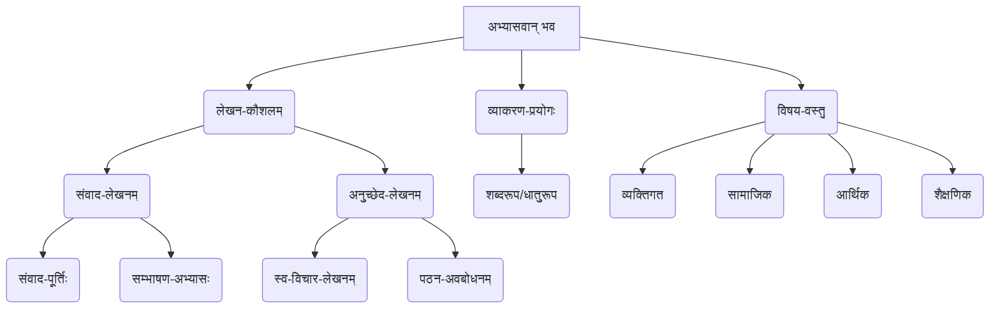
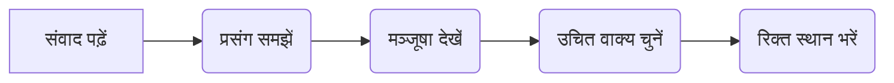

# Class 9 Sanskrit - Abhyasvan Chapter 104
**Language:** हिंदी

```markdown
# [कक्षा 9] अभ्यासवान् भव - अध्याय 104

## 🌟 मुख्य अवधारणाएँ (Core Concepts)

यह अध्याय संस्कृत में संवाद (बातचीत) और अनुच्छेद (पैराग्राफ) लेखन कौशल पर केंद्रित है। मुख्य अवधारणाओं का पदानुक्रम इस प्रकार है:

1.  **संवाद-लेखनम् (Dialogue Writing)** 🗣️
    *   मञ्जूषा-सहायतया संवाद-पूर्तिः (संकेत-पेटी की मदद से संवाद पूरा करना)
    *   दैनन्दिन-व्यवहारे संस्कृत-सम्भाषणम् (रोजमर्रा की बातचीत में संस्कृत बोलना)
    *   पात्रानुकूलं वाक्य-चयनम् (पात्र के अनुसार वाक्य चुनना)
2.  **अनुच्छेद-लेखनम् (Paragraph Writing)** ✍️
    *   प्रदत्त-विषये स्व-विचार-प्रकटनम् (दिए गए विषय पर अपने विचार लिखना)
    *   सरल-संस्कृत-वाक्य-निर्माणम् (सरल संस्कृत वाक्य बनाना)
    *   पठित्वा अवबोधनम् (पढ़कर समझना)
3.  **व्याकरणिक-तत्त्वानि (Grammatical Elements)** 🧱
    *   शब्दरूपाणि (Noun forms)
    *   धातुरूपाणि (Verb forms)
    *   उचित-विभक्ति-लकार-प्रयोगः (सही विभक्ति और लकार का प्रयोग)
4.  **विषय-वस्तु (Content Themes)** 🌍
    *   व्यक्तिगत-परिचयः (Self-introduction)
    *   सामाजिक-समस्याः (Social Issues - प्रदूषण, स्वच्छता)
    *   व्यक्तिगत-विकासः (Personal Development - अनुशासन, लक्ष्य-निर्धारण)
    *   आर्थिक-विषयाः (Economic Topics - विमुद्रीकरण, करियर विकल्प)
    *   शैक्षणिक-अनुभवाः (Educational Experiences - परीक्षा, प्रतियोगिता)

📊 **अवधारणा पदानुक्रम:**


## 📘 मुख्य शिक्षाएँ (Key Learnings)

इस अध्याय से छात्र सीखते हैं:

1.  **संवाद पूरा करना:**
    *   दिए गए संवाद के रिक्त स्थानों को मञ्जूषा (सहायता बॉक्स) में दिए गए वाक्यों से भरना।
    *   संवाद के प्रसंग (context) को समझना और पात्रों के बीच बातचीत के प्रवाह को बनाए रखना।
    *   उदाहरण: लता और राधिका के बीच विद्यालय जाने या प्रतियोगिता में भाग लेने की बातचीत को पूरा करना।

2.  **अनुच्छेद समझना और लिखना:**
    *   दिए गए संस्कृत अनुच्छेदों (जैसे 'मम परिचयः', 'पर्यावरण-प्रदूषणम्', 'अनुशासनम्', 'विमुद्रीकरणम्', 'परीक्षा') को पढ़कर उनका अर्थ समझना।
    *   इन विषयों पर अपने विचार सरल संस्कृत वाक्यों में लिखना।
    *   उदाहरण: 'मम परिचयः' पढ़कर छात्र अपना परिचय संस्कृत में लिखना सीखते हैं। 'पर्यावरण-प्रदूषणम्' पढ़कर प्रदूषण के कारणों और प्रभावों को समझते हैं और समाधान पर विचार करते हैं।

3.  **व्यावहारिक संस्कृत का प्रयोग:**
    *   रोजमर्रा की स्थितियों (जैसे स्कूल जाना, दोस्तों से मिलना, भोजन पर चर्चा, भविष्य की योजना) में संस्कृत का प्रयोग करना।
    *   सही शब्दरूप (जैसे, अहं, मम, मया) और धातुरूप (जैसे, गच्छामि, पठिष्यामि, अस्ति) का प्रयोग करके वाक्य बनाना।

📈 **सीखने का प्रवाह:**
    पठित्वा (Reading) -> अवबोधनम् (Understanding) -> चिन्तनम् (Thinking) -> लेखनम्/भाषणम् (Writing/Speaking)

## 🧩 सक्रिय अधिगम (Active Learning)

*   **गतिविधि: शोध-आधारित केस स्टडी विश्लेषण 🔍**
    *   **विषय:** 'पर्यावरण-प्रदूषणम्' (अनुच्छेद 2) या 'विमुद्रीकरणम्' (अनुच्छेद 4)।
    *   **कार्य:** छात्र दिल्ली या अपने शहर में प्रदूषण के स्तर (AQI डेटा) पर शोध करें या 2016 के विमुद्रीकरण के स्थानीय प्रभावों (छोटे व्यवसायों पर असर) के बारे में जानकारी एकत्र करें। निष्कर्षों को संस्कृत में या हिंदी में प्रस्तुत करें। (Bloom's: Evaluating/Creating)

*   **चर्चा: वास्तविक दुनिया के प्रभावों का आलोचनात्मक विश्लेषण 🌍**
    *   **विषय 1:** 'विमुद्रीकरणम्' (अनुच्छेद 4) - इसके फायदे और नुकसान क्या थे? क्या यह अपने उद्देश्य में सफल रहा? कक्षा में चर्चा करें।
    *   **विषय 2:** 'पर्यावरण-प्रदूषणम्' (अनुच्छेद 2) - प्रदूषण कम करने के सरकारी प्रयासों (जैसे सम-विषम योजना) और व्यक्तिगत जिम्मेदारियों पर चर्चा करें।
    *   **विषय 3:** 'अनुशासनम्' (अनुच्छेद 3) - छात्र जीवन में अनुशासन का क्या महत्व है? इसके लाभ और इसे कैसे विकसित किया जाए, इस पर विचार-विमर्श करें।
    *   **विषय 4:** संवाद 7 (भोजन) - संतुलित आहार बनाम जंक फूड ('विप्स', 'शीतलपेयम्') के स्वास्थ्य पर पड़ने वाले प्रभावों पर चर्चा करें। (Bloom's: Evaluating)

*   **लेखन अभ्यास:**
    *   पाठ में दिए गए निर्देशों के अनुसार अपना परिचय (`स्वपरिचयः`) लिखें।
    *   प्रदूषण, अनुशासन, विमुद्रीकरण या परीक्षा पर अपने विचार संस्कृत में लिखें।
    *   अभ्यास 11 के अनुसार अपने भाई/बहन या मित्र के साथ किसी विषय पर 5 वाक्यों का संस्कृत संवाद लिखें। (Bloom's: Creating)

## 📝 मूल्यांकन तैयारी (Assessment Prep)

*   **संवाद-पूर्तिः:** मञ्जूषा की सहायता से संवादों को पूरा करने का अभ्यास करें। संवाद के विषय और पात्रों के मूड को समझने पर ध्यान दें।
*   **अनुच्छेद-लेखनम्:** दिए गए विषयों (जैसे मम विद्यालयः, मम प्रियः विषयः, अनुशासनस्य महत्वम्, प्रदूषण-समस्या) पर 5-7 सरल संस्कृत वाक्यों में अनुच्छेद लिखने का अभ्यास करें।
*   **केस स्टडीज और डायग्राम:**
    *   **केस स्टडी:** संवादों में प्रस्तुत स्थितियों का विश्लेषण करें (जैसे, संवाद 4 में दिल्ली का प्रदूषण, संवाद 5 में मध्य-सत्र प्रवेश की समस्या, संवाद 9 में करियर विकल्प)।
    *   **डायग्राम (उदाहरण):** किसी विषय (जैसे प्रदूषण के कारण और प्रभाव) पर माइंड-मैप बनाएं या संवाद के प्रवाह को दर्शाने वाला सरल फ्लोचार्ट बनाएं।


*यह संवाद-पूर्ति प्रक्रिया का एक सरल प्रवाह है।*

## 🌏 भारतीय संदर्भ (Bharatiya Context)

इस अध्याय में कई भारतीय संदर्भ शामिल हैं:

1.  **पर्यावरण प्रदूषण:** विशेष रूप से दिल्ली (`देहल्याः वातावरणम्`) में वायु प्रदूषण का उल्लेख, जिसके कारण `श्वासरोगः` और `नेत्रयोः दाहः` जैसी समस्याएं होती हैं। पराली जलाना (`पलालस्य ज्वालनम्`) भी एक कारण के रूप में इंगित किया गया है। यह भारत के कई शहरों की एक प्रमुख चिंता है। 🇮🇳🌫️
2.  **विमुद्रीकरण (`विमुद्रीकरणम्`):** 8 नवंबर 2016 को भारत सरकार द्वारा 500 और 1000 रुपये के नोटों (`पञ्चशत-रूप्यकाणां सहस्रात्मकानां च रूप्यकाणां निषेधः`) को बंद करने की घोषणा का स्पष्ट उल्लेख है। इसका उद्देश्य काला धन (`कृष्णधनम्`) बाहर लाना बताया गया है। यह एक महत्वपूर्ण राष्ट्रीय आर्थिक घटना थी। 🇮🇳💸
3.  **करियर विकल्प:** संवाद 9 में भारत में प्रचलित विभिन्न करियर विकल्पों का उल्लेख है:
    *   अभियन्त्रविज्ञानम् (Engineering)
    *   चिकित्साविज्ञानम् (Medicine)
    *   मधुबनीचित्रकला (Madhubani Painting - बिहार की प्रसिद्ध लोक कला)
    *   वस्त्रालंकरणविज्ञानम् (Fashion Designing)
    *   कृषिविज्ञानम्/कृषिकार्यम् (Agriculture) - इसके साथ `भूमिस्वास्थ्यपत्रम्` (Soil Health Card) योजना का उल्लेख है, जो भारत सरकार की एक पहल है। 🇮🇳🧑‍🔬🧑‍⚕️🧑‍🎨🧑‍🌾
4.  **स्वच्छता:** संवाद 10 में घर और परिवेश को स्वच्छ रखने (`स्वच्छता`, `परिवेशः स्वच्छः करणीयः`) की बात की गई है, जो भारत के 'स्वच्छ भारत अभियान' जैसे राष्ट्रीय अभियानों से जुड़ता है। 🇮🇳🧹
5.  **संस्कृति:** संवाद 9 में `समावर्तनसंस्कारः` (Farewell Ceremony) का उल्लेख भारतीय सांस्कृतिक परंपराओं का हिस्सा है।

यह अध्याय छात्रों को न केवल संस्कृत भाषा कौशल विकसित करने में मदद करता है, बल्कि उन्हें समकालीन भारतीय सामाजिक, आर्थिक और पर्यावरणीय मुद्दों पर संस्कृत में सोचने और चर्चा करने के लिए भी प्रोत्साहित करता है।
```