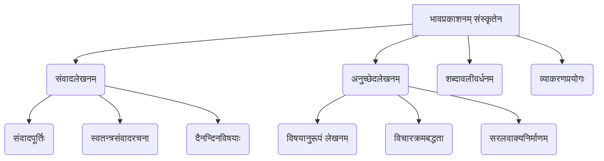

# Class 9 Sanskrit - Abhyasvan Chapter 104
**Language:** संस्कृतम्

```markdown
# [कक्षा ९] अभ्यासवान् भव - पाठः १०४ (संवाद-अनुच्छेदलेखनम्)

(टिप्पणी: अयं पाठः वस्तुतः 'अभ्यासवान् भव' अभ्यासपुस्तकस्य भागः अस्ति, यः संवादलेखनं तथा अनुच्छेदलेखनं अभ्यासं कारयति। पाठ्यपुस्तके अस्य क्रमसंख्या भिन्ना भवितुम् अर्हति।)

## 🌟 मुख्याः अवधारणाः (Core Concepts)
अस्मिन् पाठे छात्राः संस्कृतेन भावप्रकाशनस्य कौशलं वर्धयन्ति। मुख्यतया द्वयोः विषययोः अभ्यासं कुर्वन्ति:

1.  **संवादलेखनम् (Samvada-Lekhanam - Dialogue Writing):**
    *   पात्राणां मध्ये स्वाभाविकं वार्तालापं रचयितुं कौशलम्।
    *   प्रदत्त-मञ्जूषातः समुचितवाक्यानां चयनं कृत्वा संवादपूर्तिः।
    *   स्वशब्दैः लघुसंवादानां निर्माणम्।
    *   दैनन्दिन-जीवनस्य प्रसङ्गेषु (यथा - विद्यालयगमनम्, परीक्षासिद्धता, भविष्ययोजनाः, स्वास्थ्यम्) सम्भाषणम्।

2.  **अनुच्छेदलेखनम् (Anuchchheda-Lekhanam - Paragraph Writing):**
    *   प्रदत्तविषये (यथा - आत्मपरिचयः, पर्यावरणम्, अनुशासनम्, विमुद्रीकरणम्, परीक्षा) सरलसंस्कृतेन लघु-अनुच्छेदानां लेखनम्।
    *   विचाराणां क्रमबद्धं प्रस्तुतीकरणम्।
    *   समुचितशब्दावली-वाक्यविन्यासस्य प्रयोगः।
    *   श्रवण-भाषण-कौशलस्य विकासः (निर्देशानुसारम्)।



## 📘 प्रमुख-अधिगमबिन्दवः (Key Learnings)

*   **संवादपूर्तिः कथं करणीया:** छात्राः प्रसङ्गम् अवगम्य, मञ्जूषातः तर्कसङ्गतं वाक्यं चित्वा रिक्तस्थानानि पूरयितुं शिक्षन्ते। अनेन तेषां तर्कशक्तिः, भाषाबोधः च वर्धते।
*   **सरलसंवादरचना:** छात्राः स्वमित्रैः, भ्रात्रा, भगिन्या वा सह दैनन्दिनविषयेषु पञ्चवाक्येषु सरलसंवादं रचयितुं अभ्यासं कुर्वन्ति।
*   **अनुच्छेदलेखनस्य प्रक्रिया:**
    1.  **विषयस्य अवगमनम्:** प्रदत्तविषयं सम्यक् ज्ञातव्यम्।
    2.  **विचारसङ्कलनम्:** विषयेण सम्बद्धाः मुख्याः बिन्दवः चिन्तनीयाः।
    3.  **वाक्यनिर्माणम्:** सरलैः, शुद्धैः संस्कृतवाक्यैः विचाराः प्रकटनीयाः।
    4.  **क्रमबद्धता:** वाक्यानां तर्कसङ्गतः क्रमः भवेत्।
*   **विविधविषयेषु लेखनक्षमता:** छात्राः आत्मपरिचयः, सामाजिकसमस्याः (पर्यावरणप्रदूषणम्), मूल्यानि (अनुशासनम्), राष्ट्रियघटनाः (विमुद्रीकरणम्), व्यक्तिगत-अनुभवाः (परीक्षा) इत्यादिषु विषयेषु स्वविचारान् संस्कृतेन लेखितुं समर्थाः भवन्ति।
*   **व्यावहारिक-व्याकरणस्य प्रयोगः:** संवादलेखनेन, अनुच्छेदलेखनेन च छात्राः शब्दानां रूपाणि, धातूनां रूपाणि, वाक्येषु तेषां समुचितं प्रयोगं च अभ्यसन्ति।

## 🧩 सक्रिय-अधिगमः (Active Learning)

*   **गतिविधिः (Activity):**
    *   **संवाद-अभिनयः:** छात्राः युगलानि भूत्वा लिखितान् संवादन् अभिनयेन प्रस्तोतुं शक्नुवन्ति।
    *   **लघु-विषय-विश्लेषणम् (Mini Case Study Analysis):** प्रदत्तान् अनुच्छेदान् (यथा - पर्यावरणप्रदूषणम्, विमुद्रीकरणम्) पठित्वा तेषां कारणानि, प्रभावाः, समाधानोपायाः च विषयेषु चर्चां कृत्वा स्वमतानि लेखितुं शक्नुवन्ति। (उदाहरणम्: देहल्यां प्रदूषणस्य कारणानि किम्? विमुद्रीकरणस्य लाभाः हानयः च के?)
*   **चर्चा (Discussion):**
    *   **विमर्शात्मकचिन्तनम् (Critical Analysis):** छात्राः समूहेषु विभज्य प्रदत्तविषयेषु (यथा - 'परीक्षा आवश्यकी वा?', 'आधुनिकजीवने अनुशासनस्य महत्त्वम्', 'पर्यावरणसंरक्षणे अस्माकं भूमिका') स्वविचारान् प्रकटीकुर्वन्ति, अन्येषां मतं शृण्वन्ति, तर्कवितर्कं च कुर्वन्ति।
    *   **वास्तविकप्रभावविश्लेषणम् (Real-world Impact Analysis):** विमुद्रीकरणस्य समाजोपरि प्रभावः, प्रदूषणस्य स्वास्थ्योपरि प्रभावः इत्यादि वास्तविकविषयेषु चर्चा।

## 📝 मूल्याङ्कनसिद्धता (Assessment Prep)

*   अयं पाठः परीक्षायां संवादपूर्तिः (रिक्तस्थानपूर्तिः) तथा अनुच्छेदलेखनम् इति प्रश्नप्रकारयोः कृते छात्रान् सज्जीकरोति।
*   प्रदत्ताः अभ्यासाः (Exercises 1-10 for dialogues, 1-5 for paragraphs) परीक्षायाः प्रारूपम् अवगन्तुं साहाय्यं कुर्वन्ति।
*   छात्राः विभिन्न-विषयेषु (Case studies like pollution, demonetization) स्वविचारान् संस्कृतेन लेखितुं अभ्यासं प्राप्नुवन्ति।
*   विचारान् सङ्ग्रहीतुं, अनुच्छेदं च रचयितुं छात्राः मानसचित्रम् (Mind Map) अथवा प्रवाहचित्रम् (Flowchart) इव साधनानाम् उपयोगं कर्तुं शक्नुवन्ति।

```mermaid
graph LR
    subgraph परीक्षासिद्धता
        A[संवादपूर्तिः अभ्यासः] --> C(परीक्षायां संवादप्रश्नः);
        B[अनुच्छेदलेखन-अभ्यासः] --> D(परीक्षायां अनुच्छेदप्रश्नः);
        A & B --> E(शब्दावली-व्याकरण-दृढीकरणम्);
        F[विषयविश्लेषणम्/चर्चा] --> D;
    end
```

## 🌏 भारतीय-सन्दर्भः (Bharatiya Context)

अस्मिन् पाठे अनेके भारतीयसन्दर्भाः समाविष्टाः सन्ति, ये छात्रेभ्यः स्वदेशस्य सामाजिक-सांस्कृतिक-पर्यावरणीय-आर्थिक-परिस्थितीनां विषये संस्कृतेन चिन्तयितुं लेखितुं च अवसरं यच्छन्ति:

1.  **पर्यावरणप्रदूषणम् (Environmental Pollution):** विशेषतः **देहल्याः (Delhi)** वायुप्रदूषणस्य उल्लेखः कृतः, यः भारतस्य एका प्रमुखा समस्या अस्ति। कारणेषु पलालज्वालनस्य (Stubble burning) उल्लेखः अपि प्रासङ्गिकः।
2.  **विमुद्रीकरणम् (Demonetization):** **नवम्बर २०१६** मध्ये भारतसर्वकारेण कृतस्य विमुद्रीकरणस्य निर्णयस्य, तस्य उद्देश्यानां (कृष्णधनम्), प्रभावानां च विषये अनुच्छेदः अस्ति। एषा एका प्रमुखा राष्ट्रिया आर्थिकघटना आसीत्।
3.  **मधुबनीचित्रकला (Madhubani Painting):** भविष्ययोजनासन्दर्भे एकया छात्रया **बिहारराज्यस्य** प्रसिद्धलोककलायाः 'मधुबनीचित्रकलायाः' प्रशिक्षणं प्राप्य कुटीरोद्योगं चालयितुम् इच्छा प्रकटिता।
4.  **भूमिस्वास्थ्यपत्रम् (Soil Health Card):** कृषि discussão मध्ये भारतसर्वकारस्य **'भूमिस्वास्थ्यपत्रम्'** योजनायाः उल्लेखः कृतः, यया मृत्तिकायाः स्वास्थ्यपरीक्षणं भवति। एषा कृषिक्षेत्रे एका महती योजना अस्ति।
5.  **नगराणि (Cities):** संवादलेखने **चेन्नईनगरे (Chennai)** निवासस्य उल्लेखः अस्ति।
6.  **सामाजिक-सांस्कृतिक-परिवेशाः:** संवादेषु वर्णिताः विद्यालयजीवनम्, पारिवारिकसम्बन्धाः, परीक्षायाः चिन्ता, भविष्यलक्ष्याणि च भारतीयसामाजिकपरिवेशं प्रतिबिम्बयन्ति।

एते सन्दर्भाः पाठ्यविषयं छात्रेभ्यः अधिकं प्रासङ्गिकं रुचिकरं च निर्मान्ति, तथा च तेषां स्वपरिवेशं प्रति जागरूकतां वर्धयन्ति।
```